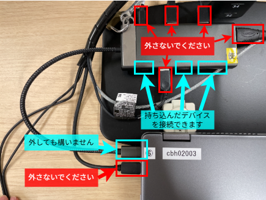
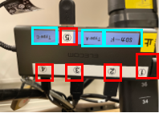
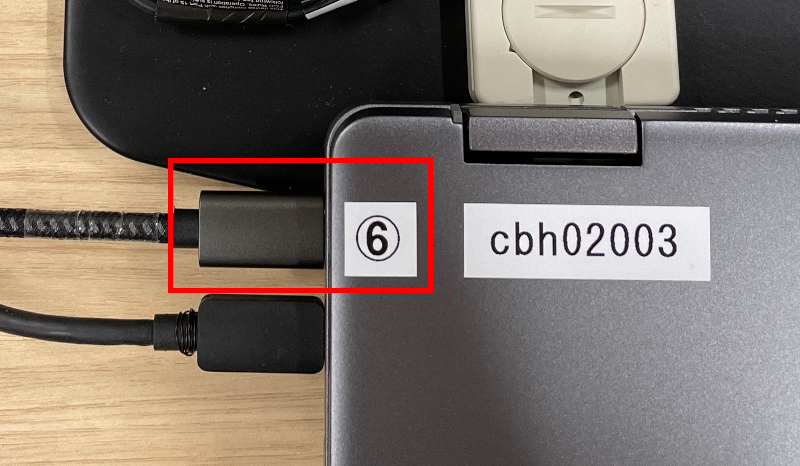
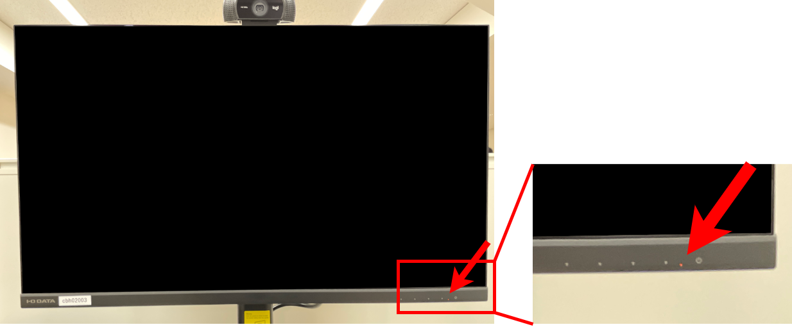
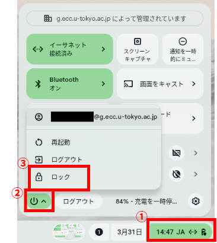
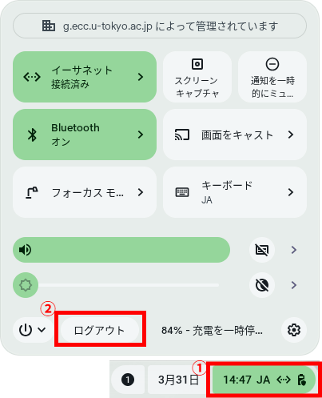

## 概要

ECCSでは，ChromeOSを搭載したデバイス（以下，ChromeOSデバイス）を設置しています．ECCSクラウドメールのアカウントを持っていれば，これらのデバイスを利用して，ブラウザを利用したり，Zoomミーティングに参加したりすることができます．

設置されているデバイスは席によって異なりますが，ChromebookまたはChromeboxのいずれかが設置されています．設置場所については，[ECCSのページ](../eccs/#location_and_business_hours)を参照してください．

なお，設置されたChromeOSデバイスを使用せず，持ち込んだデバイスを接続して，モニターやカメラ等の周辺機器だけ使うことも可能です[^1]．その場合の利用方法は，[持ち込みデバイス利用席](../byod/)を参照してください．

[^1]: 周辺機器のみを使う場合は，ECCSクラウドメールのアカウントは不要です．

### スペック

機器の仕様や使い方の詳細については，[ハードウェアの利用方法・設定方法](./hardware/)を参照してください．

Chromebook，Chromeboxの2種類がありますが，いずれもChromeOSがインストールされています．両者で利用できるソフトウェア等に違いはありません．

- Chromebook
  - Acer Chromebook Plus Spin 514
    - Intel(R) Core(TM) 5 120U, SSD 128GB, memory 16GB
- Chromebox
  - Acer Chromebox CXI3
    - Intel(R) Core(TM) i5-8250U CPU @ 1.60GHz, SSD 64GB, memory 8GB
  - ASUS Chromebox 4
    - Intel(R) Core(TM) i7-10510U CPU @ 1.80GHz, SSD 256GB, memory 16GB
  - ASUS Chromebox 4
    - Intel(R) Core(TM) i5-10210U CPU @ 1.60GHz, SSD 128GB, memory 8GB

なお，ChromebookはBluetooth 5.2に準拠し，利用可能であることを確認しています．詳しくは[ハードウェアの利用方法・設定方法](./hardware/)を参照してください．

また，ストレージが搭載されていますが，再度サインインした際にデータが保存されている保証はありません．**必要なデータは必ずデバイスの外部に保存するようにしてください．**

## 重要な注意事項

ここでは重要なものに限って注意事項を説明します．

- ケーブル類は原則として外さないでください．
  - Chromebook
    <figure class="gallery">
      {:.small}
      {:.small}
    </figure>

    - **以下のケーブル・端子については，抜き差ししても構いません**（画像では水色の枠で示されています）：
      - Chromebookとドックを接続しているUSB Type-Cケーブル：取り外して持ち込みデバイスに接続できます．
      - ドックに接続されているケーブルのうち，裏側に「SDカード」，「Type-A」，「Type-C」と書かれた空き端子：持ち込んだデバイスに接続できます．
    - 以下のケーブル・端子は，抜き差ししないでください（画像では赤い枠で示されています）：
      - ドックに接続されていない方のUSB Type-Cケーブル：Chromebookに固定されています．外したり，その席のChromebook以外に接続したりしないでください．
      - ドックに接続されているケーブルのうち，裏側に数字が書かれているもの：ウェブカメラやキーボード等に繋がっています．外さないでください．
    - ケーブルが外れている場合の対応については，[ケーブルの接続TODO](./hardware/#cables)を参照してください．
  - Chromebox
    - 本体やモニターについているケーブルは外さないでください．
- Wi-Fiには接続しないでください．
  - ChromeOSデバイスは有線でネットワークに接続されているため，Wi-Fiに接続しなくてもインターネット等を利用できます．万一繋いでしまった場合は，[利用開始・終了>サインイン>手順2](#disconnect-wifi)を参照して，接続を解除してください．
- シャットダウン・再起動するとハブを認識しなくなることがあります．直し方は[Chromebookを起動した際，ドックが認識されない問題](../defects/chromebook-dock-recognition/)を参照してください．
- 使用を終えるときや，長時間席を外すときは，**必要なファイルを保存したうえで**，ログアウトするようにしてください．サインインしたまま放置すると，次に使いたい人が困るのでやめましょう．

## 使い方

uteleconでは，ECCSのChromeOSデバイスに特有の事項を中心に説明します．ChromeOSの一般的な使い方については，[Googleのヘルプページ](https://support.google.com)を参照してください．

なお，ECCSのChromeOSデバイスでは，**デバイス上に保存した内容が必ずしも保持されないため，Google DriveやOneDrive等，クラウド上のストレージに保存する必要があります**．詳しくは[ストレージ](./storage/)を参照してください．

本ページでは利用開始・終了を説明します．その他については，以下のリンク先を参照してください．

  - [再起動・ハードリセット](./restart/)
  - [アプリの利用](./apps)
  - [ストレージ](./storage)
  - [言語設定・キーボードレイアウトの設定](./languages)
  - [アクセシビリティ](./accessibility)
  - [Linux環境の利用](./linux)
  - [Windowsリモート環境の利用](./vdi-windows/usage#eccs-chromeos)
  - [ハードウェアの利用方法・設定方法](./hardware)

### 利用開始・終了

#### サインイン
{:#signin}

1. キーボードのCtrlキーを押してください（任意のキーで構いませんが，Enter等は避けた方が無難です）．
   - （Chromebookの場合）本体の電源がついていないときは，Chromebookの画面を一旦開けてください．
      

      
外付けディスプレイが点かないとき

       1. ドックに接続しているUSB Type-Cケーブルが外れていないか確認してください．外れていたら接続しなおしてください．
          
       2. ディスプレイの右下にある電源インジケータが光っているか確認してください．光っていないときは電源が切れていますので，電源ボタンを押して電源を入れてください．
          
       3. それでも点かなければ，既知の起動時にドックが認識されなくなる問題の可能性があります．直し方については，[Chromebookを起動した際，ドックが認識されない問題](../defects/chromebook-dock-recognition/)をご覧ください．
      

   - （Chromeboxの場合）本体の電源がついていないときは，画面の電源をつけ，背面にあるChromeboxの電源ボタンを押してください．
      - それでもディスプレイが点かないときは，ディスプレイの右下にある電源インジケータが光っているか確認してください．光っていないときは電源が切れていますので，電源ボタンを押して電源を入れてください．
2. Wi-Fiに接続するよう求められることがありますが，**この画面は無視し，画面が切り替わるのを待ってください．**

   

   
Wi-Fiに接続してしまった場合

      1. 右下の時刻表示を押し，Ethernetと表示されているボタンを押してください．
      2. 接続してしまったWi-Fiを選択してください．
      3. 「Forget」を押してください．
   

3. Enter your emailの欄に，[ECCSクラウドメール](/google/)のメールアドレス（設定した文字列+`@g.ecc.u-tokyo.ac.jp`）を入力してください．
   - [10桁の共通ID+`@g.ecc.u-tokyo.ac.jp`や，エイリアス](/google/misc/localpart/)は利用できません．
4. UTokyo Accountでのサインインを求められますので，サインインしてください．
   - FIDOセキュリティキーも利用できます．ドックのUSB Type-A，もしくはUSB Type-Cのコネクタにセキュリティキーを接続して，「Sign-in Options」を押し，「Face, fingerprint, PIN or security key」を選択してください．
      - 認識されない場合は一度抜いて刺しなおしてください
   - Stay signed in?と聞かれますが，Yes/Noのどちらを選択しても影響はありません．

   

      
この次の手順で，2-Step Verificationと表示される場合

      表示されている手段のいずれかを用いて二段階認証を完了してください．
   

5. パスワードレスでサインインした場合，パスワードを設定するよう求められます．（Please create a password to protect your local data）
   - 任意のパスワードを決めて，入力してください．
   - このパスワードは，デバイスをロックした後，再びログインしようとするときに必要です．また，次回サインインする際に，暗号化されたデータがデバイスに残っている場合も，設定したパスワードの入力が必要です．
6. 前回サインインした際のデータが残っている場合，前回のサインインで使用または設定したパスワードの入力を求められることがあります（「Your password has changed since the last time you signed in」）．
   - 使用または設定したパスワードが，最後にそのデバイスにサインインしたときと異なる場合に表示されます．
   - 最後にそのデバイスを利用した際に，使用または設定したパスワードを入力してください．
     - 前回サインイン時，パスワードを使用してUTokyo Accountにサインインした場合：UTokyo Accountのパスワードを入力してください（パスワードを変更した場合は，変更前のパスワードを使用してください）．
     - 前回サインイン時，パスワードレスサインインを使用してサインインした場合：前回サインイン時に設定したパスワードを入力してください．
  
   

      
パスワードを忘れた場合

       1. 「Forgot old password」を押してください．「Local data will be deleted」と表示されますので，「Continue anyway」を押してください．
       2. デバイス内に保存されていたデータが削除されます（削除されるのはデバイス内のデータのみで，ECCSクラウドメールのGoogle Drive等には影響はありません）
   

7. 「Control your data」 /「データの管理」と表示されます．お好みでオプションを選択し，↓ボタンを押して下まで確認した後，「Accept and continue」 /「同意して続行」を押してください．
   - 診断データと使用状況データの送信はオフにできません．
   - 右下に「Switch device laguage?」が出ている場合は，「Switch」を押すと，Googleアカウントで設定している言語に変えられます．
8. デバイスが起動します．
   - OneDrive setup failed /「OneDriveを設定できませんでした」という警告が表示される
      - OneDriveに接続したい場合は，「OneDriveに手動で接続」を押すと接続できます．詳しくはstorageを参照してください．
   - 「言語が変更されました」と表示される
      - 英語に戻したい場合は，「「英語(アメリカ合衆国)」に戻します（再起動が必要です）」を押してください．自動的にログアウトしてサインイン画面に移りますので，もう一度サインインしてください．
         - 言語設定が反映されない場合：手順6でForgot old passwordを選択すると反映されません．
      - 英語以外の言語に変えたい場合や，通知が消えてしまった場合はlanguagesを参照してください．
   - 「ChromeOSをアップデート」と表示される
      - ECCSのChromeOSデバイスは，随時OSのアップデートが行われます．特に対応の必要はありません．

#### 画面ロック

一時的に席を離れる場合は必ずデバイスをロックしてください．また，15分以上操作がないと自動的にロックされます．

なおこれは、あくまで一時的なお手洗いなどの想定です．長く離れている場合に，センター側でログアウトしないことは保証しません．また，長時間席を離れる場合には他の利用者の迷惑となるので，ログアウトしてください．

デバイスをロックするには，キーボード上で🔍+L，◉+L（Chromebookの場合），Windows+L（Chromeboxの場合）のいずれかのショートカットキー操作をしてください．もしくは，画面右下の時刻表示を押し，電源のアイコンを押し，「ロック」を押すことでもロックできます．

ロックした状態から再びサインインする際，パスワードの入力を求められます．入力するパスワードは，以下のようにサインイン方法によって異なります：

-  パスワードレスサインインを使っていない場合（最初のサインイン時にパスワードを入力してサインインした場合）：UTokyo Accountのパスワード
-  パスワードレスサインインを使っている場合：サインイン時に入力，または設定したパスワード

#### 利用終了（ログアウト）

使用が終了したら，必ずログアウトをしてください．

ログアウトするには，画面右下の時刻表示を押し，「ログアウト」を押してください．

なお[既知の不具合](../defects/TODO)回避のため，シャットダウンはできない仕様になっています（Chromeboxはこの問題の影響を受けませんが，同様にシャットダウンできません）．

## その他の補足事項

Chromebookは閉じた状態でも，開いた状態でも利用できます．どちらで利用しても構いません．

## 故障・不具合時の対応

### 既知の不具合

ChromeOSデバイスの既知の不具合については，[ChromeOSデバイスの既知の不具合](../defects/#chromeos)を参照してください．

また，ケーブルが外れている場合の対応については，[ケーブルTODO](./hardware/#cable)を参照してください．

### 不具合時の連絡先

ケーブルが外れていて自分での復旧が困難な場合や，バグ・故障等を見つけた場合，[サポート](../support/)にしたがって対応してください．

その際，建物名・階・部屋と，デバイス本体か画面に貼ってある番号（`cbh*****`，`cbx***`等）がわかるとスムーズです．
