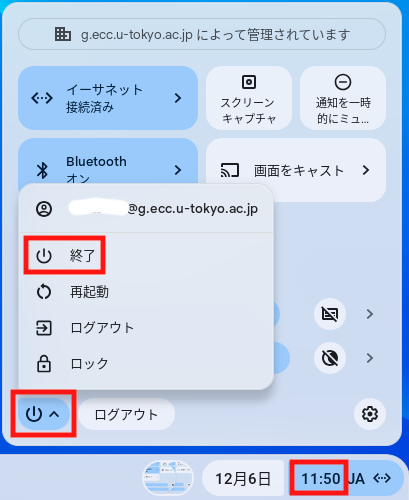

import ECCS2021Eol from "@components/ja/ECCS2021Eol.mdx";

<ECCS2021Eol />

Chromebox端末は，駒場情報教育棟1階自習室，浅野情報基盤センター1階自習室，総合図書館，駒場図書館，柏図書館に設置しております．最新の設置場所および設置台数は，[ECCS端末配置場所の開室・閉室状況](/eccs/overview/facilities/#location_and_business_hours)を参照してください．

## 利用可能なアプリケーション
Chromebox端末では，Google Chromeとそのextensionとして実現されているアプリケーション，個別に許可された一部のAndroidアプリが利用可能です．

* **ファイル**：ECCSクラウドメールのアカウントに対応するGoogleドライブのファイルが利用可能です．Webブラウザで，OneDrive等を使うこともできます．
* **メール**：Gmailが利用可能です．
* **Secure Shell**：SSHクライアントを使って，ECCSのSSHサーバ（ `ssh01.ecc.u-tokyo.ac.jp`、`ssh02.ecc.u-tokyo.ac.jp`、`ssh03.ecc.u-tokyo.ac.jp` ）等に接続することができます．ただし，あらかじめ作成した秘密鍵をGoogleドライブに置くことが必要です．

なお，Google Playストアで提供されている，教育や研究に必要な無料のAndroidアプリに関しては，以下の申請フォーム（ECCSクラウドメールでのログインが必要です）からリクエストしていただくと，許可リストに追加し，Chromebox端末から利用できるようにすることがあります．

<b class="box center">[ChromeOS用のGoogle Play Storeアプリ](https://docs.google.com/forms/d/e/1FAIpQLSdZ7vt6-Tahig8CMhwE0Uipjqk1PeY_FRh4RnVpXox_ycyvGg/viewform?usp=sf_link)</b>

## 利用方法

### 事前作業
ECCSクラウドメールの有効なアカウントが必要です．ECCSクラウドメールの利用開始をしていない方は，ECCSクラウドメールの「[利用開始の手順](/google/#initial-setup)」に従って，準備してください．

### 電源の入れ方
Chromebox端末の利用に当たっては，27インチディスプレイとChromebox本体の両方の電源を入れる必要があります．Chromebox本体は27インチディスプレイの裏にマウントされています．
{:.medium}

電源投入後，しばらくすると，自動的にネットワークに接続され，ログイン画面が表示されます．

### ログインの手順

1. メールアドレスとして，「ECCSクラウドメールのユーザ名」(`@g.ecc.u-tokyo.ac.jp`の前の部分のみ)を入力してください．
2. UTokyo Accountのサインイン画面が表示されるので，サインインしてください．この際，メールアドレス（例：`xxxxx@g.ecc.u-tokyo.ac.jp`）ではなくUTokyo Account（例：`0123456789@utac.u-tokyo.ac.jp`）を入力してください．
   - UTokyo Accountのパスワードを変更すると，「古いパスワード」の入力を促される場合があります．この場合は，UTokyo Accountの変更前のパスワードを入力してください．
   - UTokyo Accountでパスワードレスサインインを設定している場合，ログイン後に「ローカルデータを保護するパスワードを作成してください」という画面が表示されます．ここでは，利用者が任意のパスワードを設定してください．
     - Chromebox端末では，利用者がローカルにデータを保存したりローカルデータにアクセスしたりする必要は原則としてありませんが，ここで**設定したパスワードは端末の画面ロック解除時に必要**になるので，忘れないようにしてください．
   - ECCSクラウドメールのSSO化（2024/2/20）以降でChromebox端末に初めてログインする際，ECCSクラウドメールの「古いパスワード」を入力するよう促される場合があります．この場合は，SSO化以前に利用していたECCSクラウドメールのパスワードを入力してください．

### 終了
画面右下の時刻部分を選択すると表示される電源ボタンを選択すると，メニューボックスが開きます．その中の「終了」を選択してください．

## 注意・補足

* 27インチディスプレイにはHDMIケーブルが取り付けられており，Chromeboxを使う代わりに，自分の持ち込みPCを接続してディスプレイだけを使うこともできます．この場合は，ディスプレイ前面のボタンで入力を切り替えてください．　
* Chromebox端末では，ECCS複合機での[オンデマンドプリント](../features/printing/#ondemand)ができません．Chromebox端末からECCS複合機を利用したい場合は，[Webアップロード印刷](../features/printing/web-upload)または[USB印刷](../features/printing/#usb)を利用してください．
* 設定等は予告なく変更することがあります．
