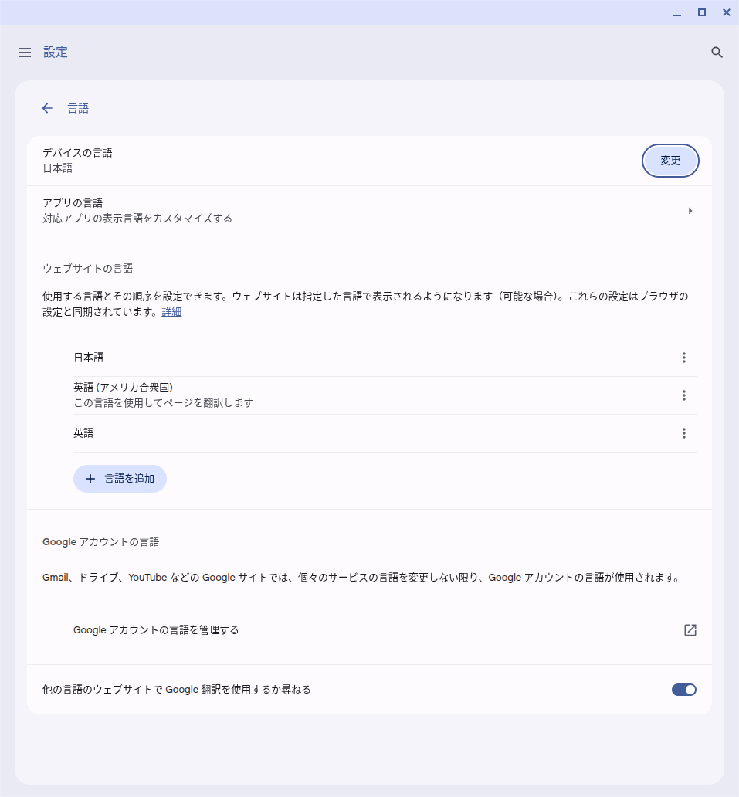
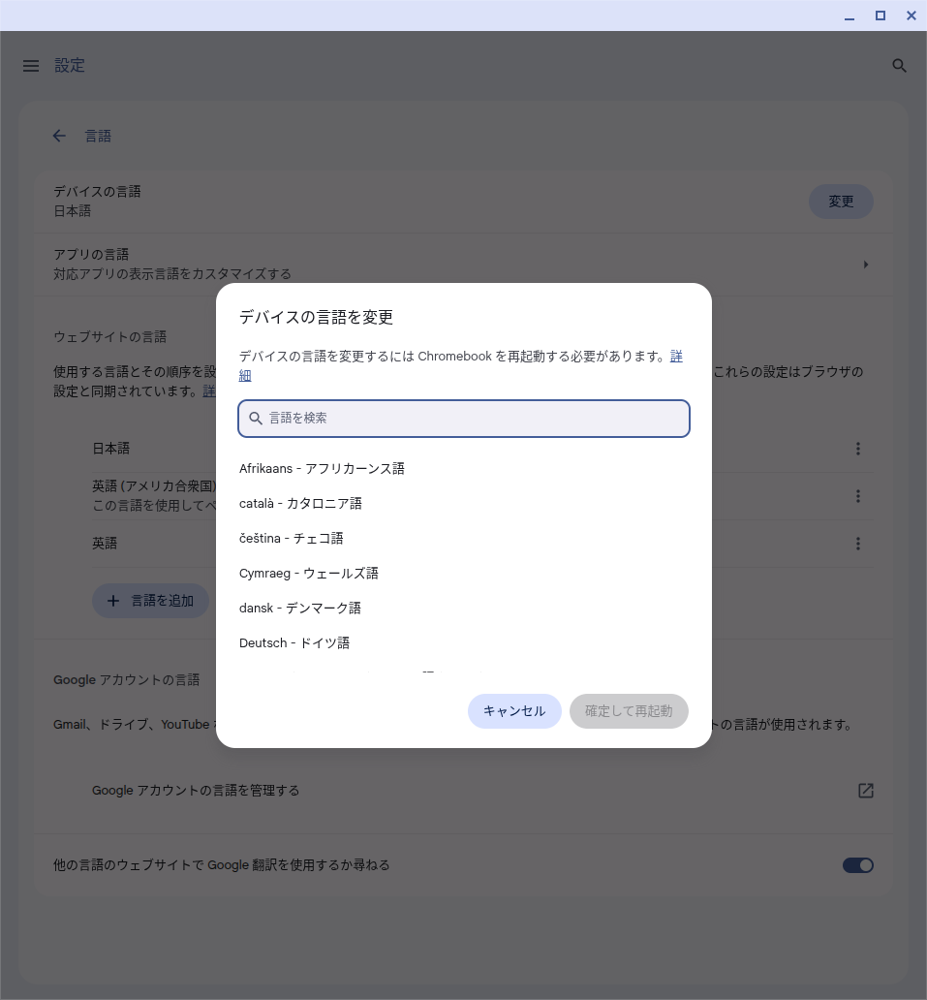
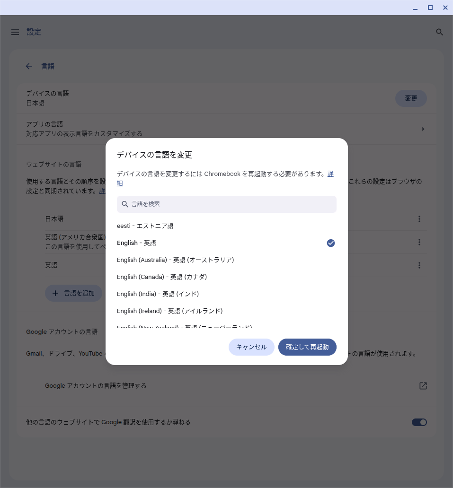
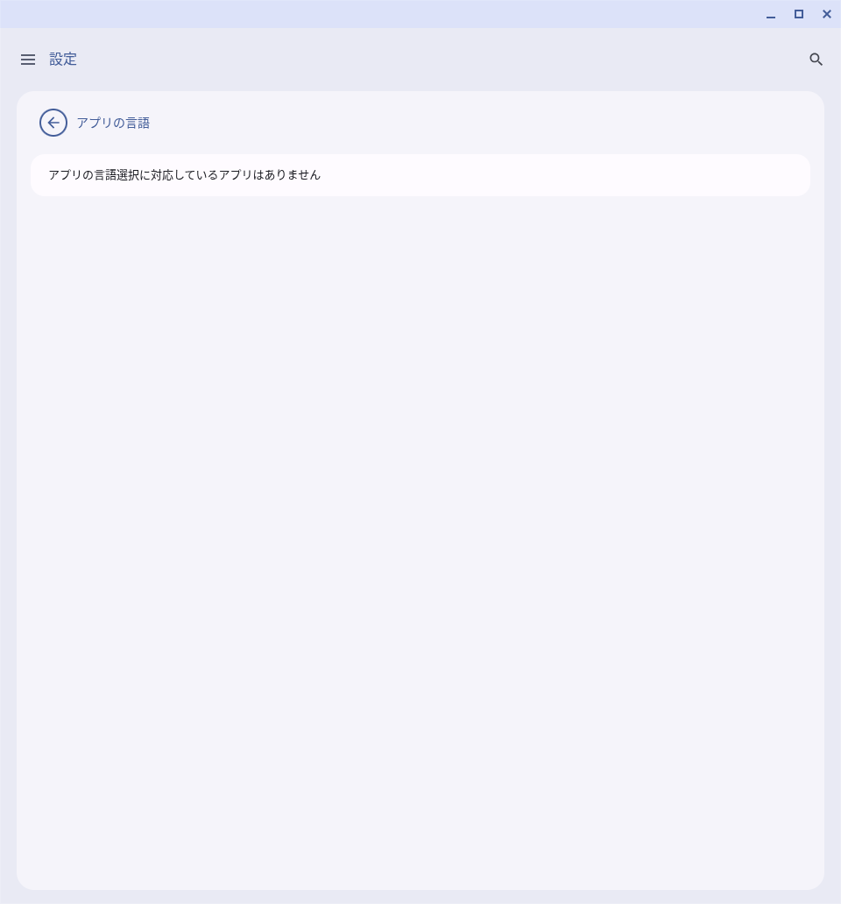
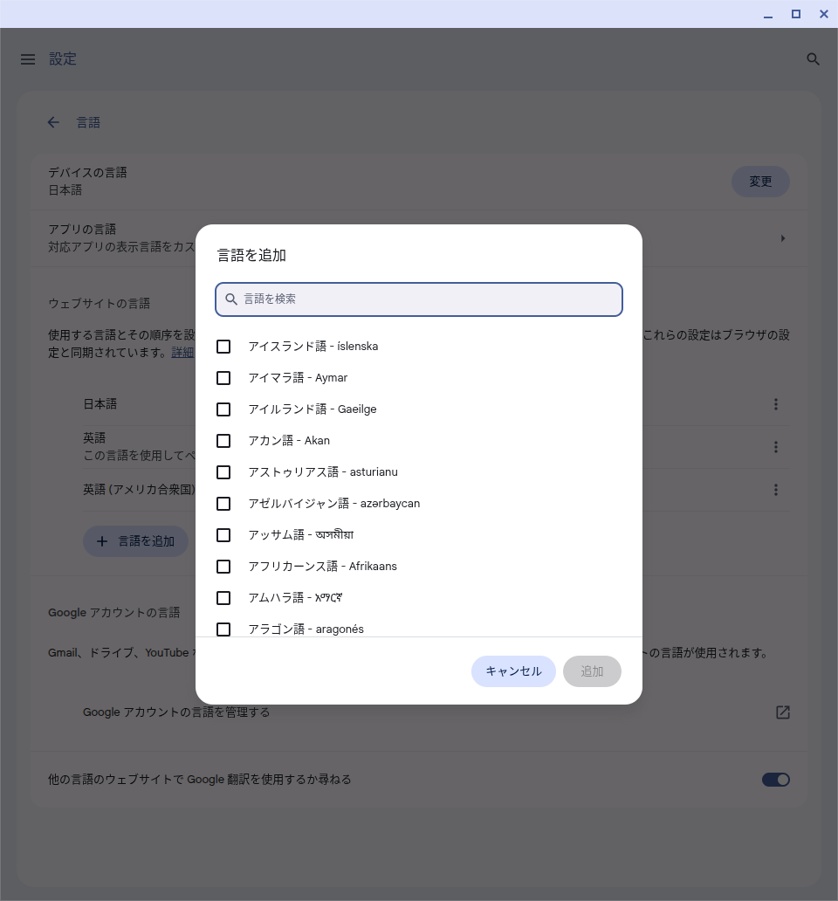
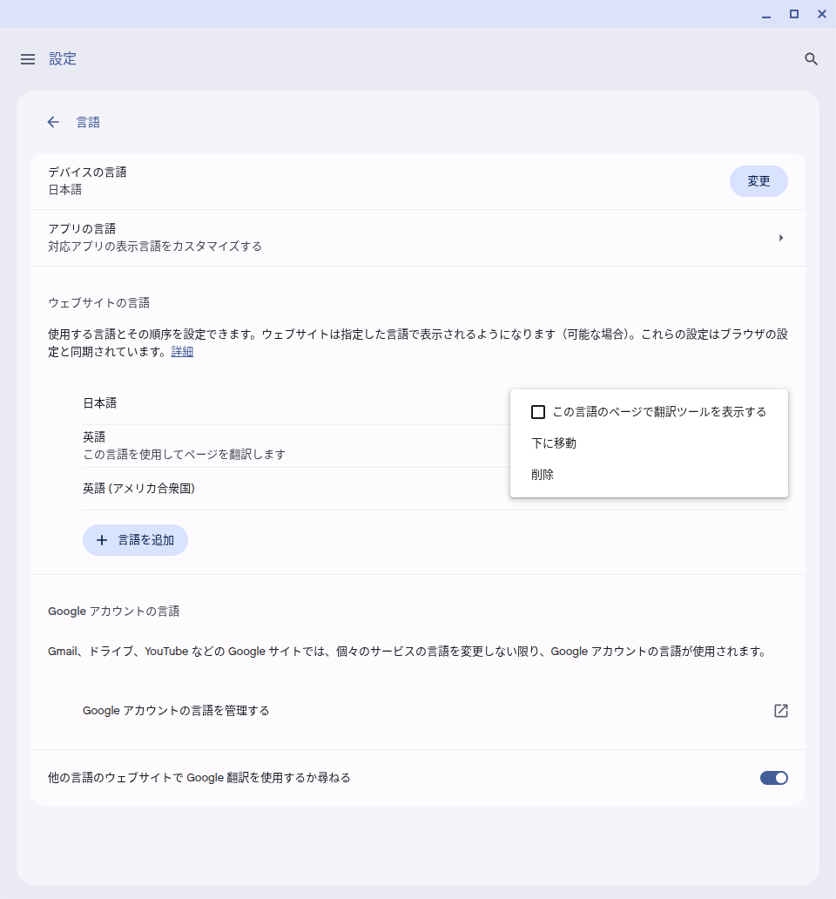

import OpenLanguageSettings from "./_OpenLanguageSettings.mdx";

## 概要

ChromeOSデバイスでは，OSやアプリごと，ブラウザの設定言語を変更できます．また設定言語に関連して，キーボードレイアウトの設定を変更することもできます．

このページでは，それらの仕様や手順を公式ヘルプを交えて紹介します．

## 言語の設定

表示される言語は，デフォルトではECCSクラウドメールのアカウントで設定された言語になります．ただし，言語設定の変更には再起動が必要であるため，同じChromeOSデバイスを利用していた前のユーザーがログアウトした後，再起動を挟まずに使い始めた場合には，前のユーザーが使用していた言語が引き継がれることがあります．この場合はサインイン時に通知が表示されるので，言語を変更したいときはそれに従って再起動してください．詳しくは「[サインインに関する説明](../#signin)」を参照してください．

言語設定は，OS全体・アプリごと・Webサイトのデフォルト表示のそれぞれについて変更できます．ただし，[プリインストールされているアプリ](../apps/#preinstalled-apps)のうち，アプリごとの言語設定の変更に対応しているものはありません．

言語設定の変更方法の詳細については，「[Chromebook の言語を管理する](https://support.google.com/chromebook/answer/1059490?hl=ja)」(公式ヘルプ)もあわせて参照してください．

### OSの言語を変更する

<OpenLanguageSettings />

4. 「デバイスの言語」の横の「変更」を選択してください．
  {:.medium.border}
5. 設定したい言語を検索→選択してください(クリックでチェックマークが入ります)．
  {:.medium.border}
  {:.medium.border}
6. 「確定して再起動」を選ぶとしばらくして起動時のサインイン画面になるので，普通にサインインすると言語が変更されます．
{:start="4"}

### アプリの言語を変更する

<OpenLanguageSettings />

4. 「アプリの言語」を選択してください．
  {:.medium.border}
5. 言語を選択してください．
  {:.medium.border}
{:start="4"}

### ウェブサイトの言語を編集する

ウェブサイトの表示言語は複数設定でき，追加した言語については，Google Chromeでの翻訳機能を利用することができます．

#### 追加

<OpenLanguageSettings />

4. 「言語を追加」ボタンを押してください．
  {:.medium.border}
5. 追加したい言語を選択してください．
  {:.medium.border}
{:start="4"}

#### 編集・削除

<OpenLanguageSettings />

4. 編集したい言語の右にある縦三点リーダーをクリックして，行いたい操作を選択してください．
  {:.medium.border}
  * 選択できる操作は次のとおりです．
    * **この言語のページで翻訳ツールを表示する**：その言語のページで[ウェブ コンテンツの Google 翻訳ポップアップ ボックス](https://support.google.com/chrome/answer/173424)が表示されるようになります．
    * **上/下に移動**：言語の優先度を変更できます(上にあるものほど優先されます)．
    * **削除**：表示言語から削除されます．
{:start="4"}

## キーボードの言語

* キーボードの言語は，デフォルトではTODO: 要確認になっています．
* 右下に表示されるキーボードの言語が「JA」の場合，これは「英語(日本)」を意味するもので，日本語入力(IME)は使えないため，日本語を入力するには設定で「日本語」をオンにする必要がある点に注意してください．
  * 変更方法については，「[キーボード言語と特殊文字を指定する](https://support.google.com/chromebook/answer/1059492)」(公式ヘルプ)を参照してください．

## 参考

* [Chromebook のキーボードを使用する](https://support.google.com/chromebook/answer/1047364?hl=ja)
