## 概要

ChromeOSでは「Linux 開発環境」というLinuxの仮想環境が利用できます．仮想環境の中身はDebianで，それ以外のディストリビューションは利用できません．

{:.medium.border}

なお，2026年4月時点で設定した環境のバージョンは執筆時のものを記載しています．タイミングによりバージョンは変わる可能性があります．root権限があるため，様々なアプリケーションを比較的自由に利用できます．(ただしHW高速化や完全なデスクトップ環境は利用できないなどの制限があります．)

## 注意点

- 構築した環境は各デバイス内に保存されます．デバイス全体のストレージ容量の減少等により消去されることがあるため，バックアップの取得が必要です．
- 授業での利用にあたっては，持ち込み端末を利用する学生がいることも考慮してください．Web上で利用できるGoogle Colab，WindowsのWSL，macOSなどもあわせてご検討ください．
- 通常のLinuxと完全に同一ではなく，以下のような制限事項があります．
    - ハードウェア高速化を利用した動画処理（ハードウェアエンコード・デコードなど）はできません．
    - カメラ映像の取得はできません．
    - USBデバイス（Androidデバイス以外やセキュリティキーなど）はサポートされておらず，利用できないことが多いです．

## 使い方

### 起動

#### 初回設定

1. メニューバーのTerminalアイコンを押してください．
  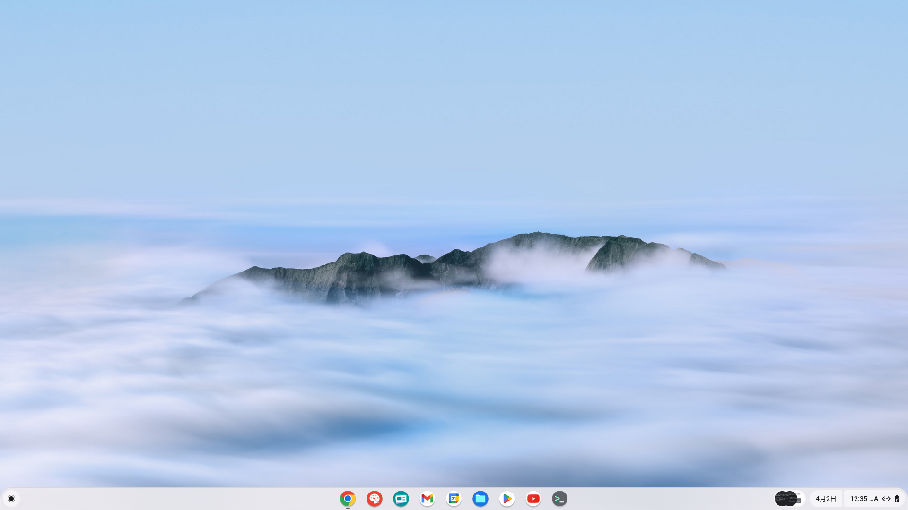{:.medium.border}
2. TerminalのLinuxセクションの「設定」を押してください．
  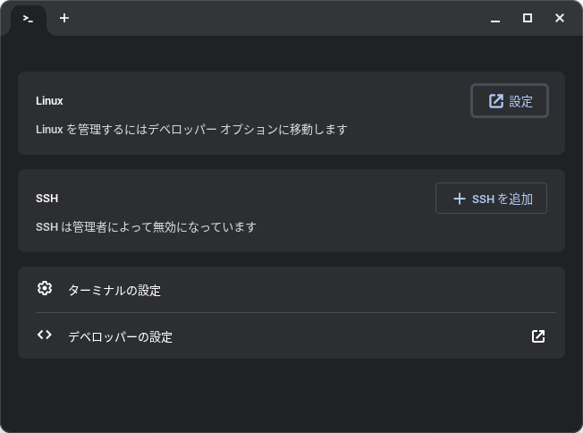{:.medium.border}
3. 開いた設定の「Linux 開発環境」セクションの「設定」を押してください．
  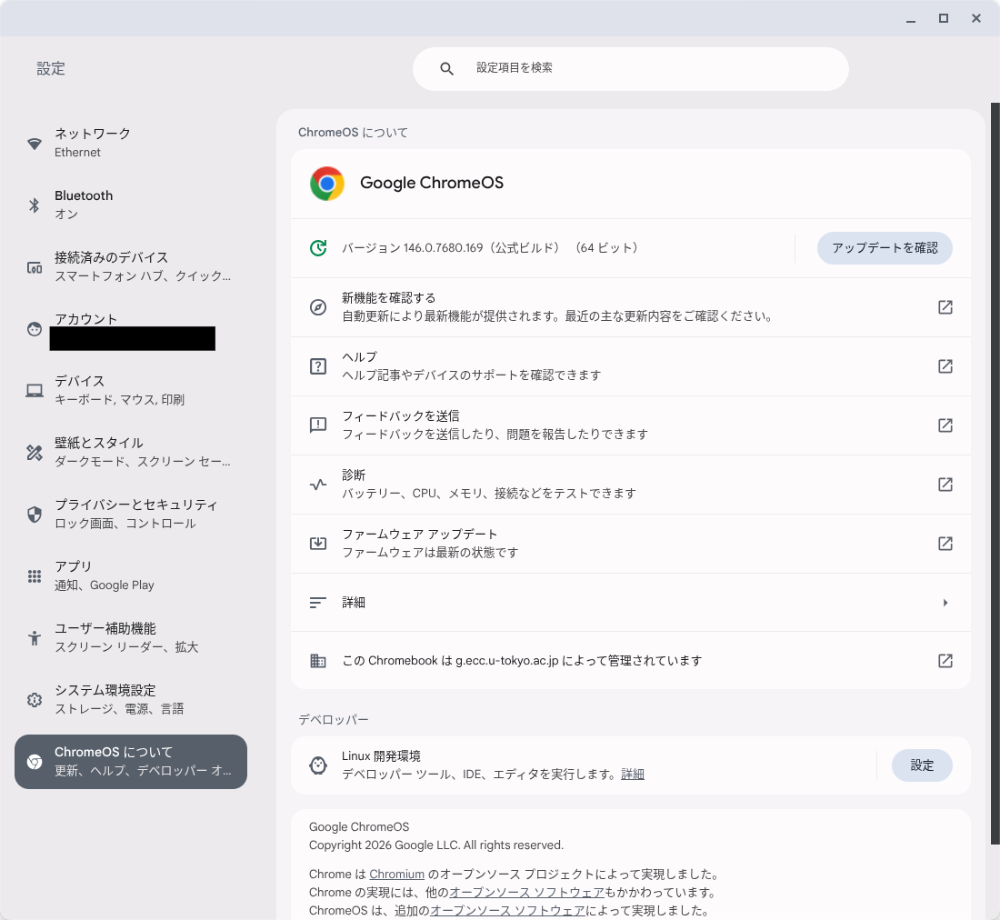{:.medium.border}
4. 「次へ」を押してください．
  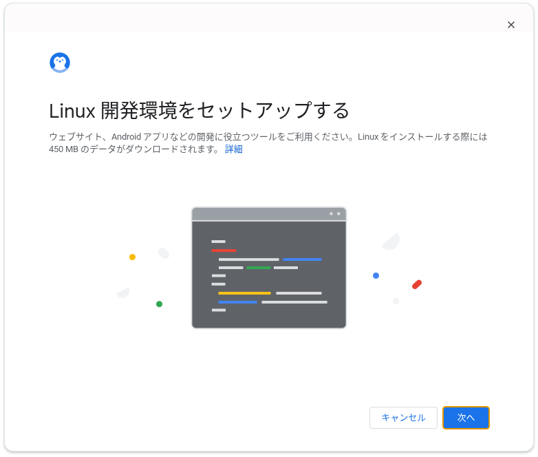{:.medium.border}
5. Linuxのユーザー名とディスクサイズを決めて「次へ」を押してください．
    - ユーザー名はデフォルトでECCSクラウドメールのローカルパートが設定されます．
    - ディスクサイズはデフォルトで10GBが設定されますが，あとから設定で変更可能です．
  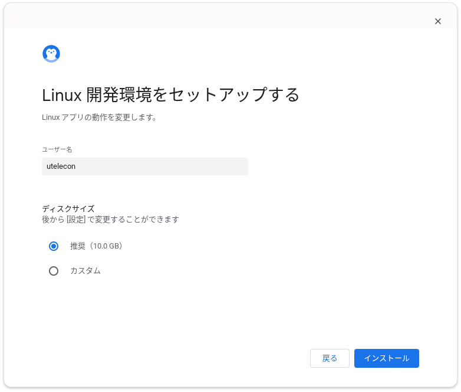{:.medium.border}
6. インストールが終わるまでお待ちください（1分程度かかります）．
  {:.medium.border}
7. インストールが終わると，ターミナルが起動してLinux開発環境が利用できるようになります．
  {:.medium.border}

#### 2回目以降

ChromeOSを起動後，設定を開くかターミナルアイコンのボタンを押してください．
Linux開発環境の準備に少し時間がかかりますが，その後は通常のLinuxと同様に利用できます．

{:.medium.border}

### 再起動・シャットダウン

ChromeOS全体を再起動する必要はありません．Linux環境のみを再起動・シャットダウンすることができます．シェルフのTerminalアイコンを右クリックし，「Linux をシャットダウン」を選択してください．再度ターミナルを開くとLinux環境が起動します．

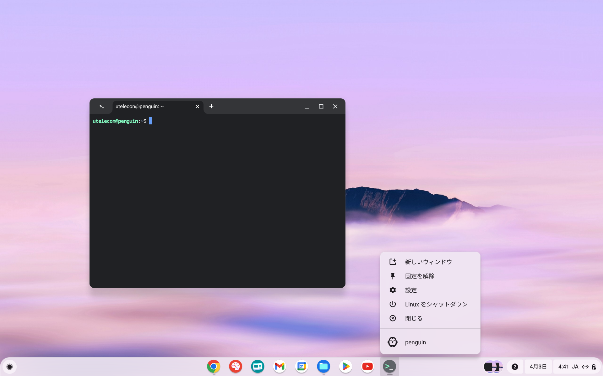{:.medium.border}

### バックアップと復元

Linuxの環境を保存して他のデバイスで復元することが可能です．詳細については以下の公式ドキュメントをご確認ください．
[Linux をセットアップする - ChromeOS.dev](https://developers.google.com/chromeos/app-development/develop/setup?hl=ja#backing-up-and-restoring)

#### バックアップ

1. 設定の「Linux 開発環境」を開き，「バックアップと復元」を押してください．
  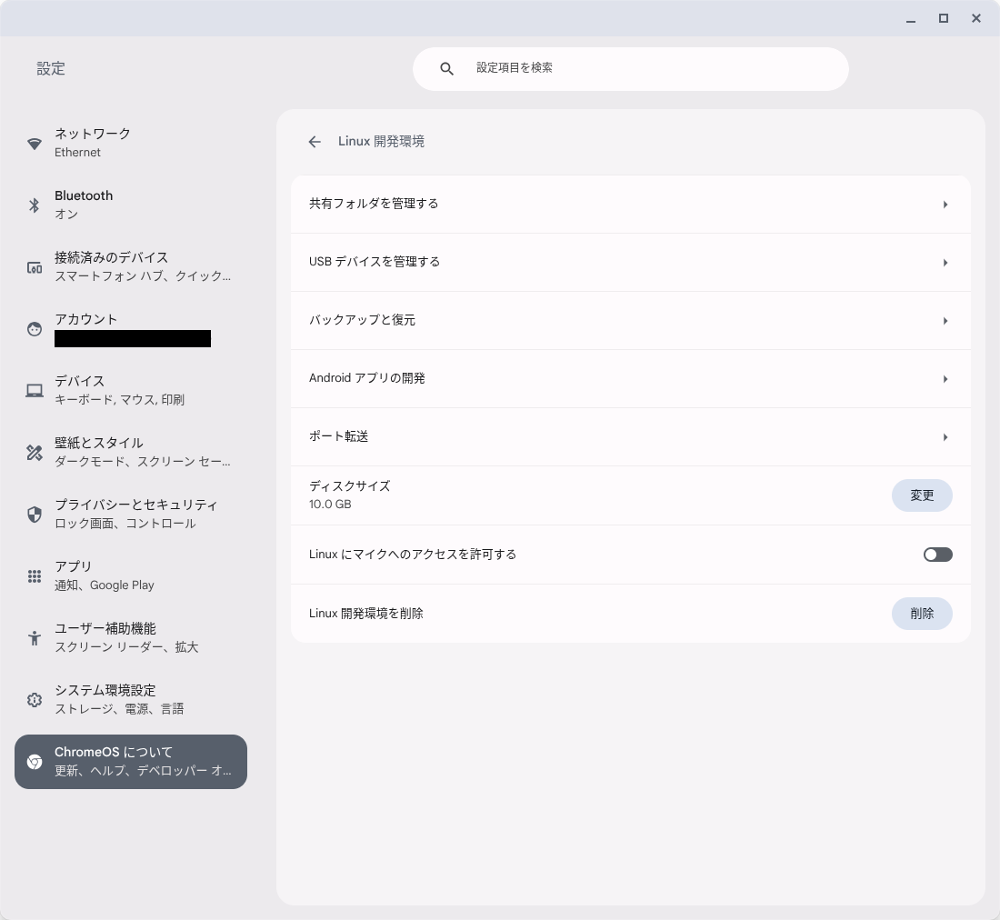{:.medium.border}
2. 「Linux のアプリとファイルをバックアップします」の右側の「バックアップ」を押してください．
  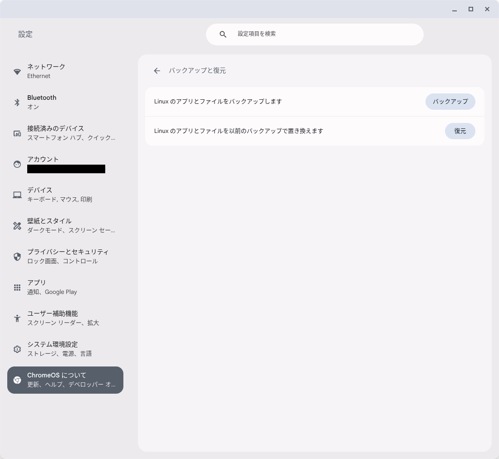{:.medium.border}
3. 保存先とファイル名を指定して「保存」を押してください．Googleドライブを保存先に指定すれば，他のデバイスからも復元できます．
  {:.medium.border}
  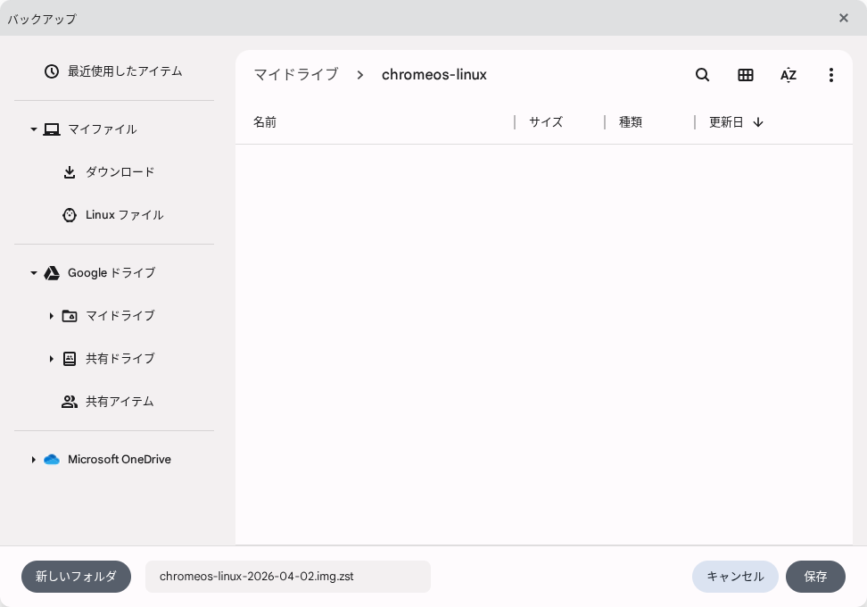{:.medium.border}
4. しばらく待つと，指定した場所にバックアップファイル（`.img.zst`）が保存されます．
  {:.medium.border}

#### 復元

1. 「バックアップと復元」画面で「復元」を押し，バックアップファイルを選択して「開く」を押してください．
  {:.medium.border}
2. 確認ダイアログで「復元」を押すと，復元が始まります．既存のLinux環境は置き換えられるのでご注意ください．
  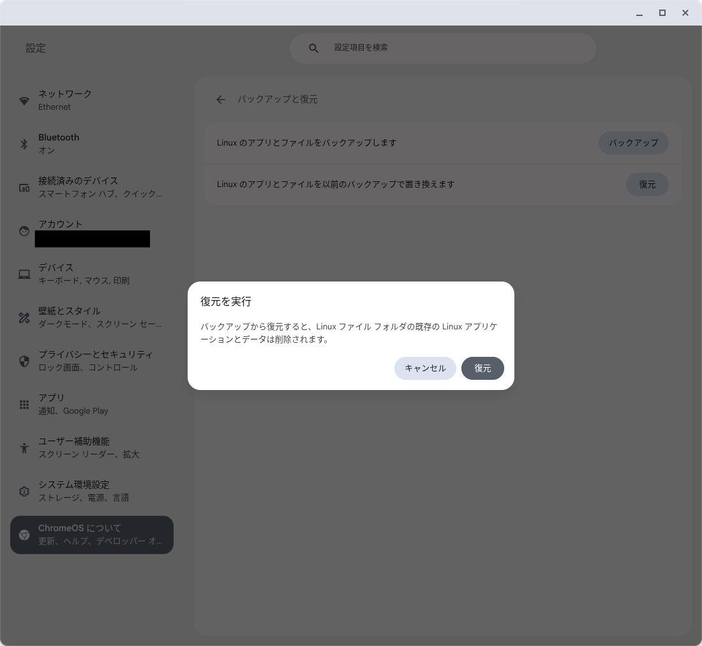{:.medium.border}

なお，授業等で利用する環境を構築する際は，環境構築スクリプトを作成して共有する方法も有効です．コンテナをファイルとして持ち運ぶ方法とあわせてご活用ください．

### LinuxとChromeOSでのファイル共有

#### ChromeOSからLinuxのファイルにアクセスする

ChromeOSのファイルアプリを開き，左側の「Linux ファイル」を選択すると，Linux環境のホームディレクトリにアクセスできます．

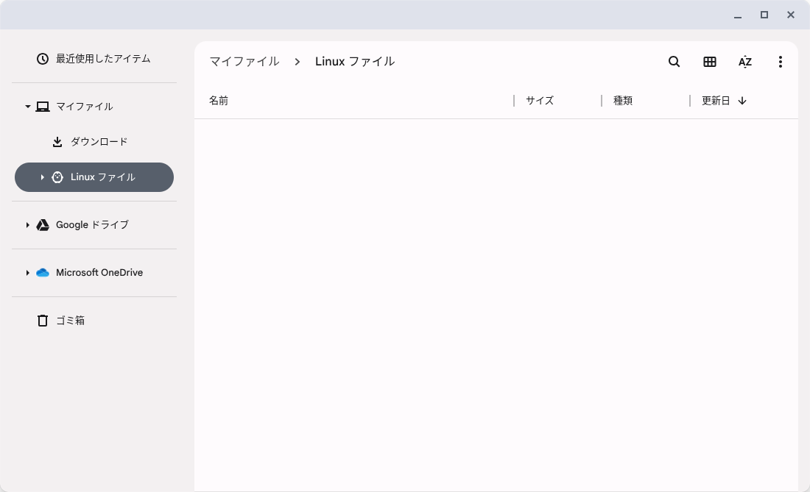{:.medium.border}

ドット（`.`）で始まる設定ファイルなどを表示したい場合は，右上のメニューから「非表示のファイルを表示」を有効にしてください．

{:.medium.border}

#### LinuxからChromeOSのファイルにアクセスする

ChromeOSやGoogleドライブのフォルダをLinuxと共有すると，Linuxからは`/mnt/chromeos`以下でアクセスできるようになります．

1. ファイルアプリで共有したいフォルダを右クリックし，「Linux と共有」を選択してください．
  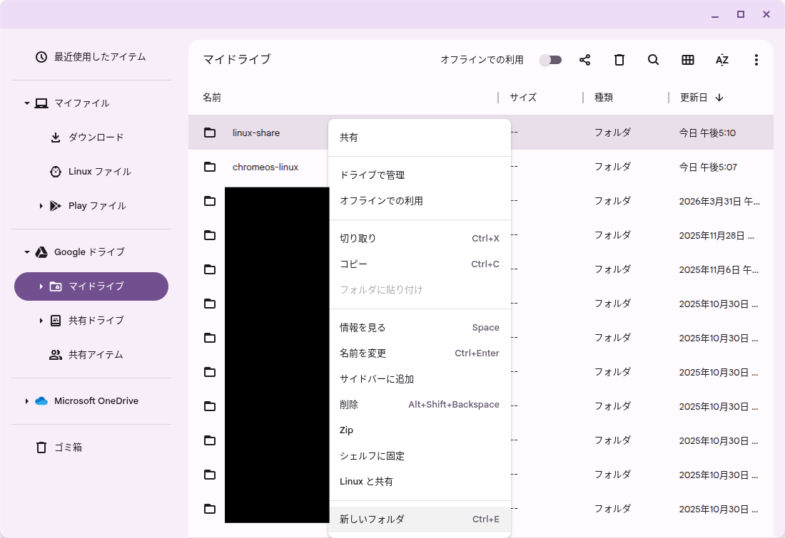{:.medium.border}
2. 共有済みのフォルダは，右クリックメニューの「Linux との共有を管理」から管理できます．
  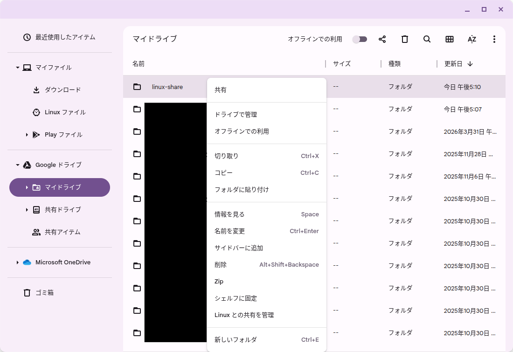{:.medium.border}
3. 設定の「Linux 開発環境」→「共有フォルダを管理する」からも，共有中のフォルダを一覧・解除できます．共有フォルダはLinuxでは`/mnt/chromeos`以下に置かれます．
  {:.medium.border}

### アプリケーションのインストール

`.deb`ファイルのパッケージをはじめ，基本的には通常のLinux環境と同様の手順でインストールが可能です．インストールしたGUIアプリはChromeOSのランチャーの「Linux アプリ」内に追加されます．

{:.medium.border}

公式の案内では，GNOMEアプリストア（GNOME Software）をインストールすることが紹介されています．GUIからアプリを探してインストールできます．

{:.medium.border}

{:.medium.border}

### アンインストール

Linux環境が不要になった場合は，設定から削除できます．削除するとLinux環境内のアプリやファイルはすべて消去されるため，必要なデータは事前にバックアップしてください．

1. 設定の「Linux 開発環境」を開き，「Linux 開発環境を削除」の右側の「削除」を押してください．
  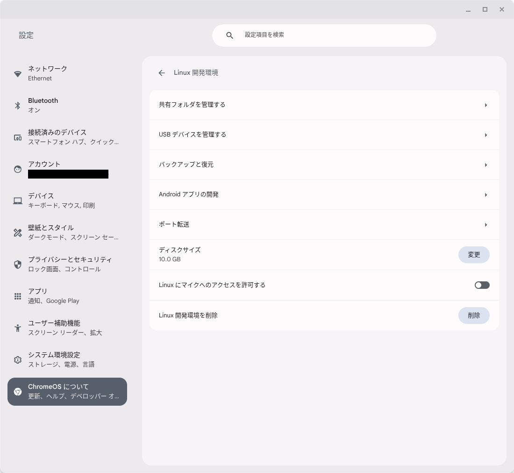{:.medium.border}
2. 確認ダイアログで「削除」を押すと，Linux環境が削除されます．
  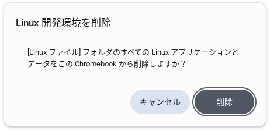{:.medium.border}
