## 概要

ChromeOSでは「Linux 開発環境」というLinuxの仮想環境が利用できます．仮想環境の中身はDebianで，それ以外のディストリビューションは利用できません．root権限があるため，様々なアプリケーションを比較的自由に利用できます．

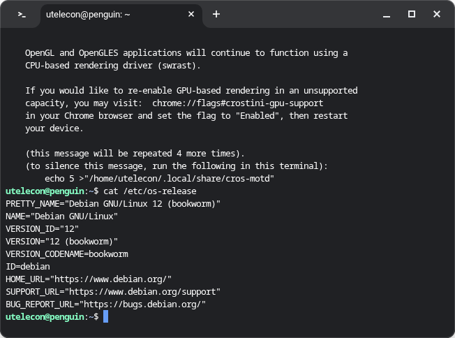{:.medium}

なお，設定した環境のバージョンは執筆時（2026年4月時点）のものを記載しています．タイミングによりバージョンは変わる可能性があります．

## 注意点

- 構築した環境は各デバイス内に保存されます．デバイス全体のストレージ容量の減少等により消去されることがあるため，バックアップの取得が必要です．
- 授業での利用にあたっては，持ち込み端末を利用する学生がいることも考慮してください．Web上で利用できるGoogle Colab，WindowsのWSL，macOSなどもあわせてご検討ください．
- 通常のLinuxと完全に同一ではなく，以下のような制限事項があります．
    - ハードウェア高速化を利用した動画処理（ハードウェアエンコード・デコードなど）はできません．
    - カメラ映像の取得はできません．
    - USBデバイス（Androidデバイス以外やセキュリティキーなど）はサポートされておらず，利用できないことが多いです．

## 使い方

### 起動

#### 初回設定
{:#first-setup}

1. メニューバーのTerminalアイコンを押してください．
  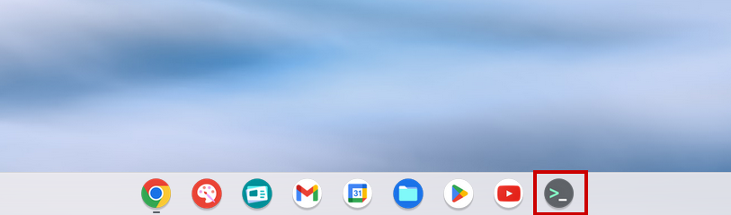{:.medium}
2. TerminalのLinuxセクションの「設定」を押してください．
  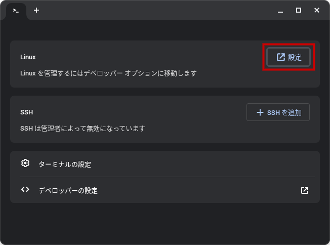{:.medium}
3. 開いた設定の「Linux 開発環境」セクションの「設定」を押してください．
  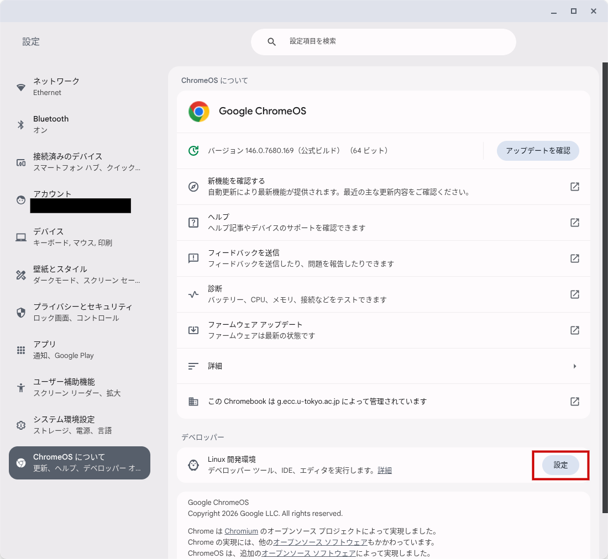{:.medium}
4. 「次へ」を押してください．
  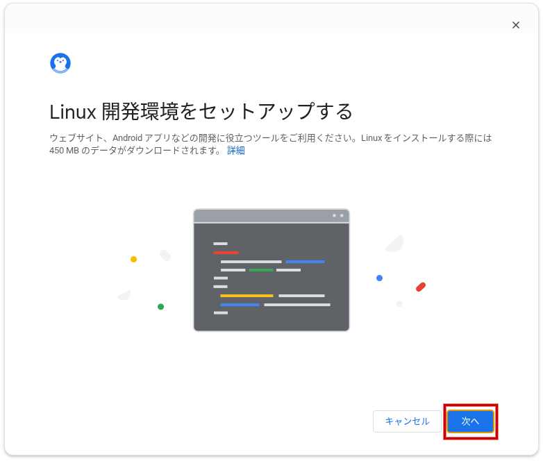{:.medium}
5. Linuxのユーザー名とディスクサイズを決めて「インストール」を押してください．
    - ユーザー名はデフォルトでECCSクラウドメールのローカルパートが設定されます．
    - ディスクサイズはデフォルトで10GBが設定されますが，あとから設定で変更可能です．
  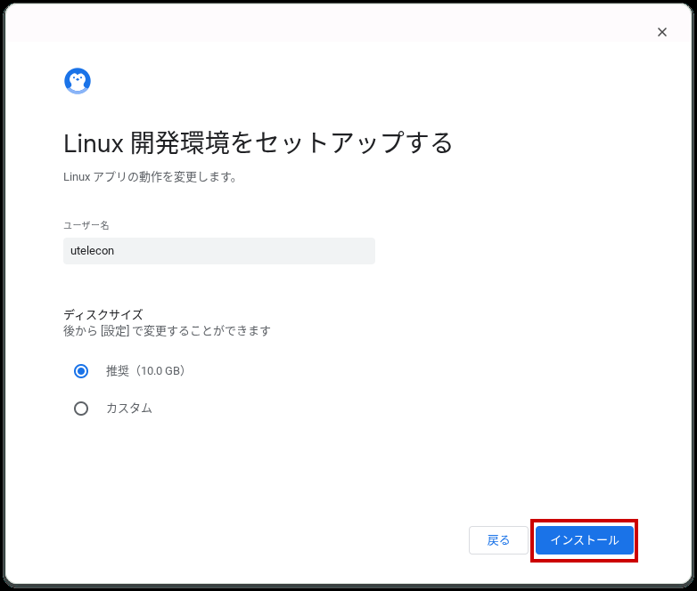{:.medium}
6. インストールが終わるまでお待ちください（1分程度かかります）．
  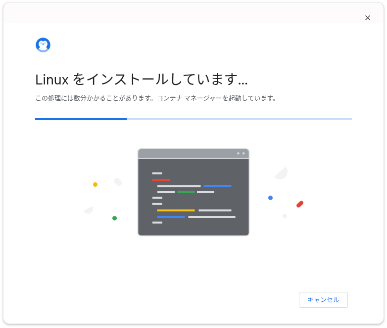{:.medium}
7. インストールが終わると，ターミナルが起動してLinux 開発環境が利用できるようになります．
  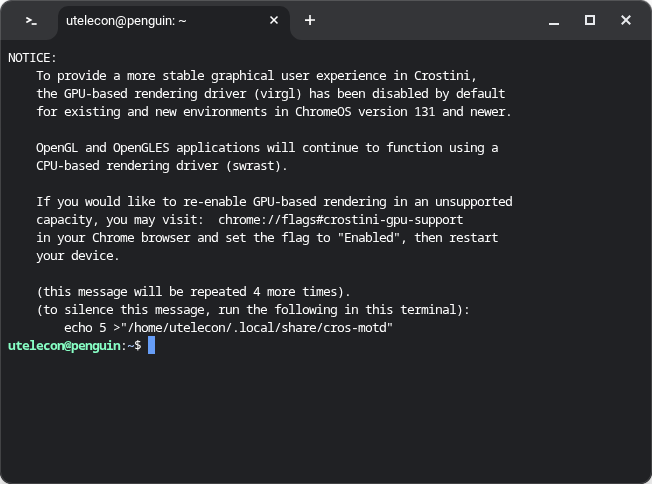{:.medium}

#### 2回目以降

1. メニューバーのTerminalアイコンを押してTerminalを開いてください．
2. 「penguin」を押すと，設定済みのLinux 開発環境が起動します．
  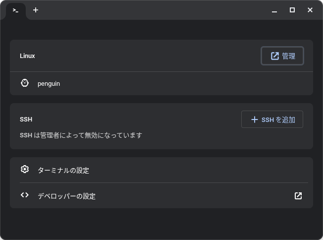{:.medium}

同一のデバイスであれば，一度設定したLinux 開発環境を，設定なしですぐに再度利用できます．一方，別のデバイスを利用する場合や，同一のデバイスであっても開発環境を削除した場合は，再度設定が必要です．ただし，設定後に後述の[バックアップと復元](#backup-and-restore)の手順でいったん保存しておけば，環境を復元できます．

### 終了
{:#shutdown}

メニューバーのTerminalアイコンを右クリックして「Linux をシャットダウン」を押してください．

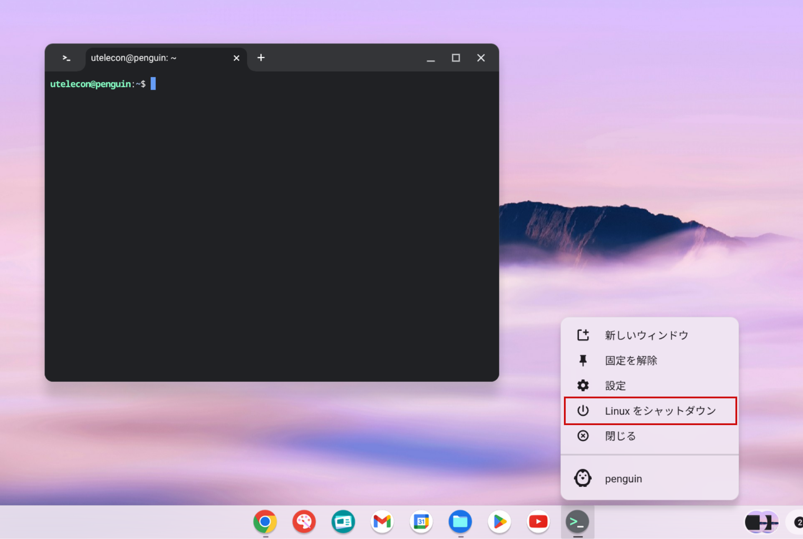{:.medium}

終了しただけで開発環境が消去されることはありませんが，他の利用者の利用によってデバイスのストレージ容量が少なくなると，開発環境が消去されることがあります．なお，ターミナル上で`sudo shutdown -h now`を実行しても，Linux 開発環境は正しく終了されないため，上記の手順を推奨します．

### 再起動

終了したあとに起動し直してください．ターミナル上で`sudo reboot`を実行しても，Linux 開発環境は正しく再起動されないため，上記の手順を推奨します．

### 削除

Linux 開発環境は，デバイスのストレージ容量が不足するなどの理由で自動的に削除されることがあります．不要になった場合などは，次の手順で手動で削除することもできます．

1. メニューバーのTerminalアイコンを押してください．
2. Linuxセクションの「管理」を押してください．
  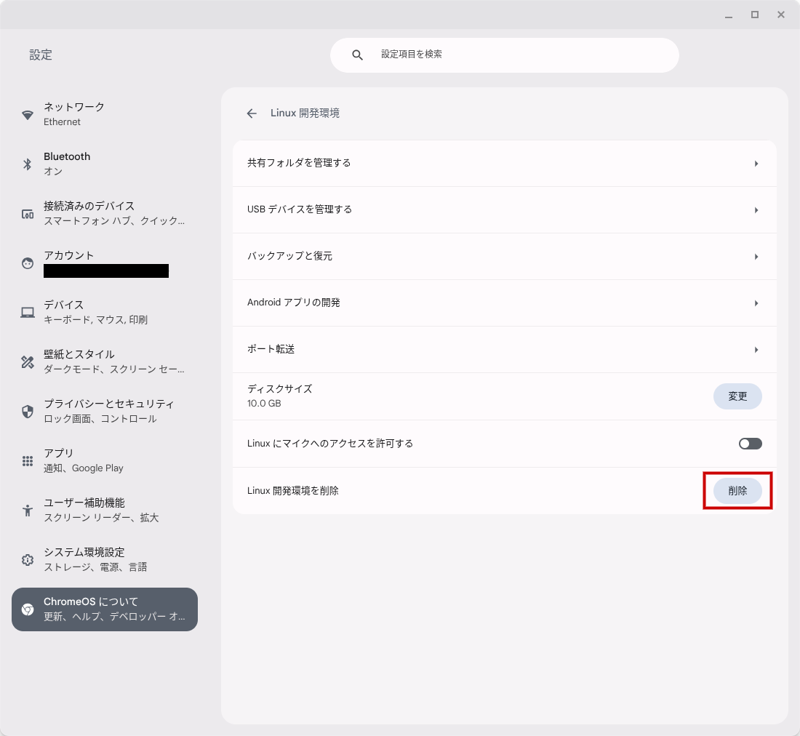{:.medium}
3. 設定の一番下にある「Linux 開発環境を削除」の「削除」を押してください．
4. 確認画面でもう一度「削除」を押してください．
  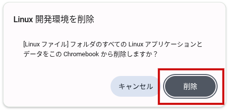{:.medium}

### バックアップと復元
{:#backup-and-restore}

Linux 開発環境は，それぞれGoogle ドライブなどにバックアップしておくことで，他のデバイスで復元したり，他の利用者に同一の環境を配布したりすることができます．

#### バックアップ

環境のバックアップを取得できます．バックアップはGoogle ドライブ・OneDrive・ローカルに保存できます．初回設定直後の開発環境であってもバックアップは800MB程度あるので，保存先の容量に注意してください．

1. メニューバーのTerminalアイコンを押してください．
2. Linuxセクションの「管理」を押してください．
  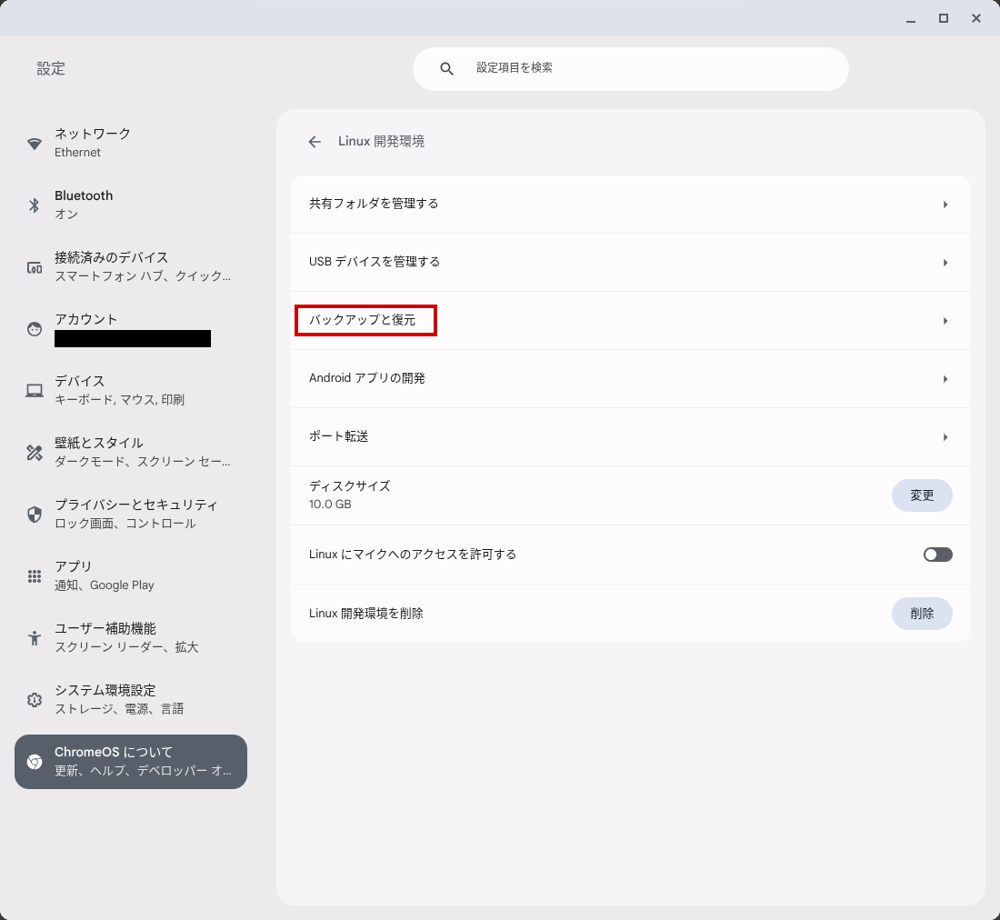{:.medium}
3. 「バックアップと復元」を押してください．
  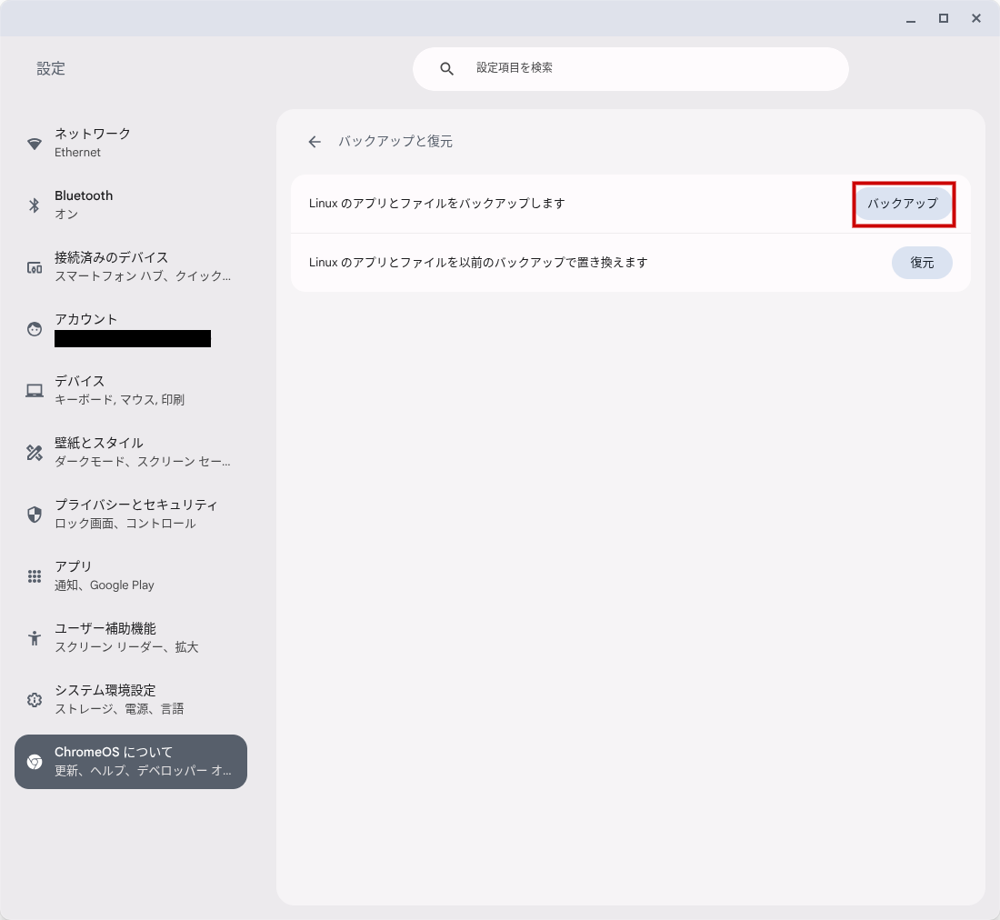{:.medium}
4. 「バックアップ」を押してください．
5. 保存先を指定するウィンドウが開くので，保存先を選んで「保存」を押してください．
  <figure class="gallery">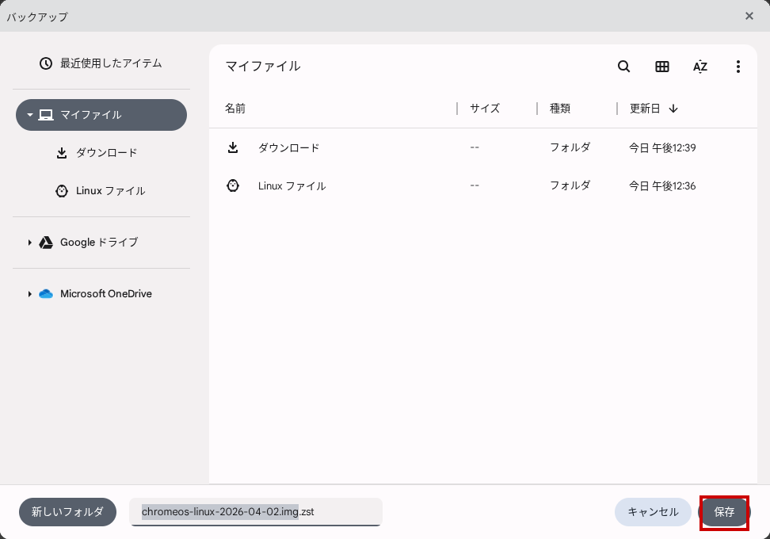{:.medium}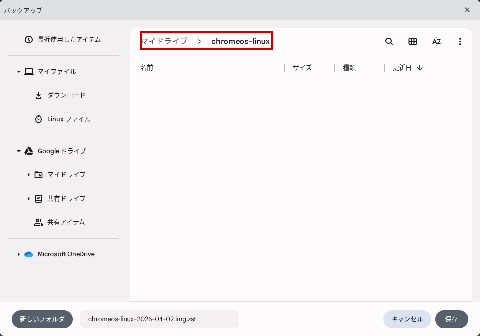{:.medium}</figure>
6. バックアップが完了するまでお待ちください．バックアップファイルの横にマークが出て，進捗状況がわかります．
  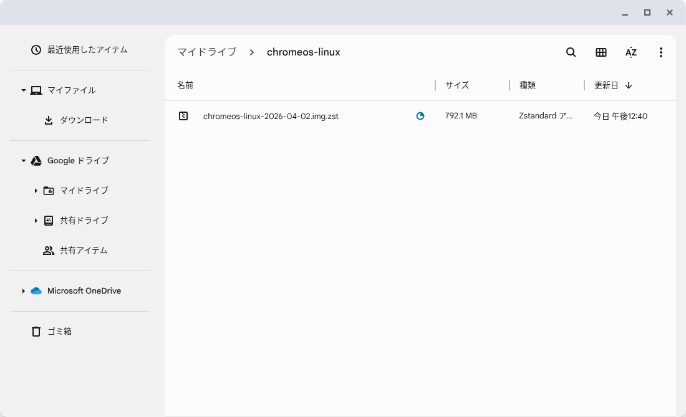{:.medium}

#### 復元

取得したバックアップから環境を復元できます．今ある環境は削除されてしまうことに注意してください．Linux 開発環境が設定されていないデバイスでは，先に[初回設定](#first-setup)が必要です．

1. メニューバーのTerminalアイコンを押してください．
2. Linuxセクションの「管理」を押してください．
3. 「バックアップと復元」を押してください．
4. 「復元」を押してください．
5. バックアップファイルを指定するウィンドウが開くので，ファイルを選んで「開く」を押してください．
  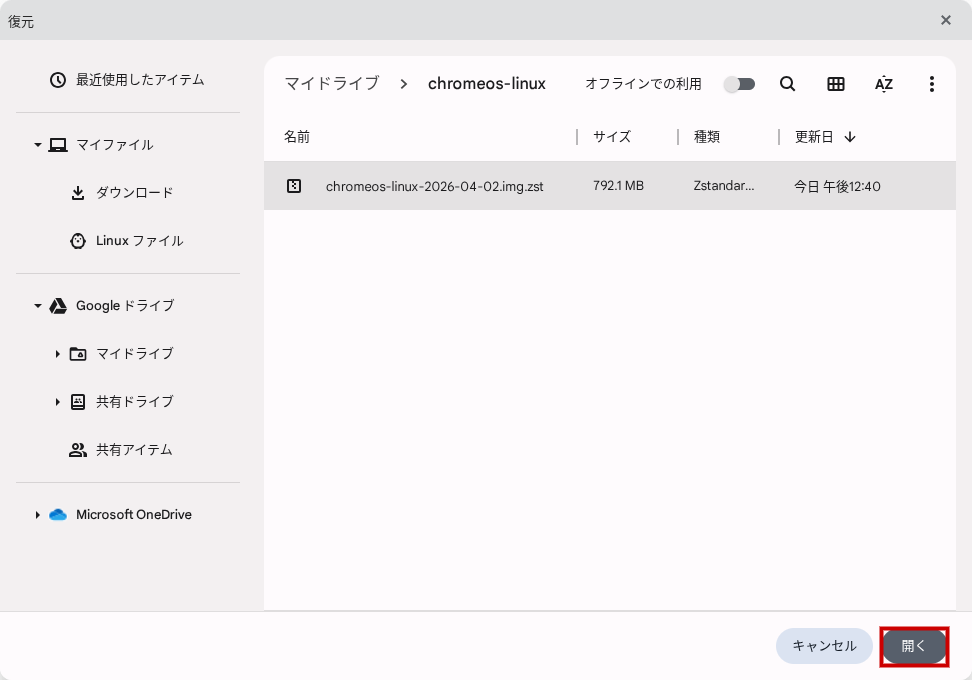{:.medium}
6. 確認画面でもう一度「復元」を押してください．
  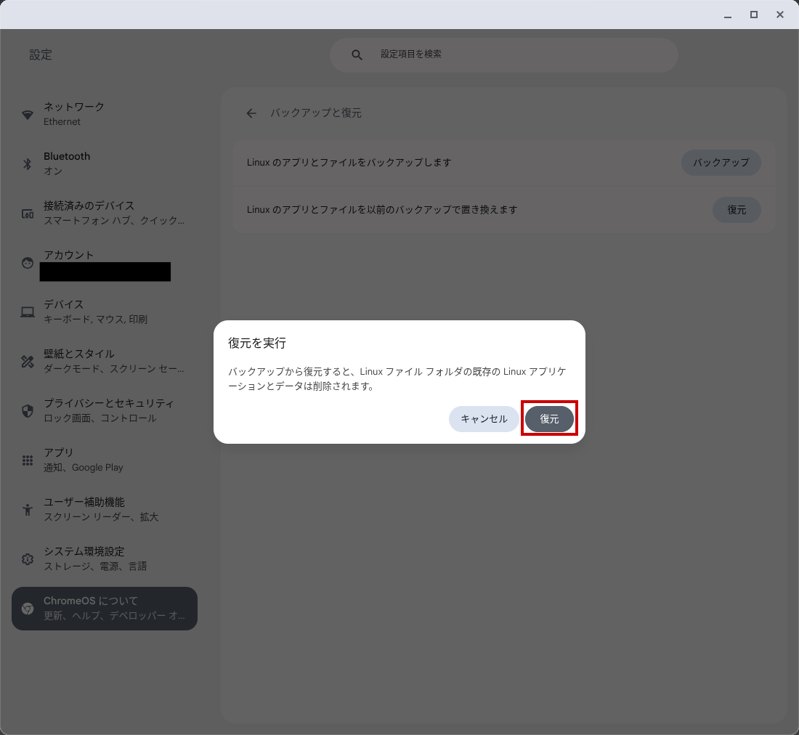{:.medium}
7. 復元が完了するまでお待ちください．画面右下に通知が表示され，復元状況がわかります．なお，復元中に既存のLinux 開発環境を触ると，復元に失敗することがあります．

### フォルダの共有

ChromeOSとLinux 開発環境では，相互にフォルダを共有してデータをやりとりすることができます．

#### ChromeOSからLinuxのフォルダにアクセスする

ChromeOSのファイルアプリから，Linux 開発環境のホームディレクトリ（`/home/ユーザー名`）にアクセスできます．特に設定は不要ですが，Linux 開発環境を起動していない状態ではアクセスできません．

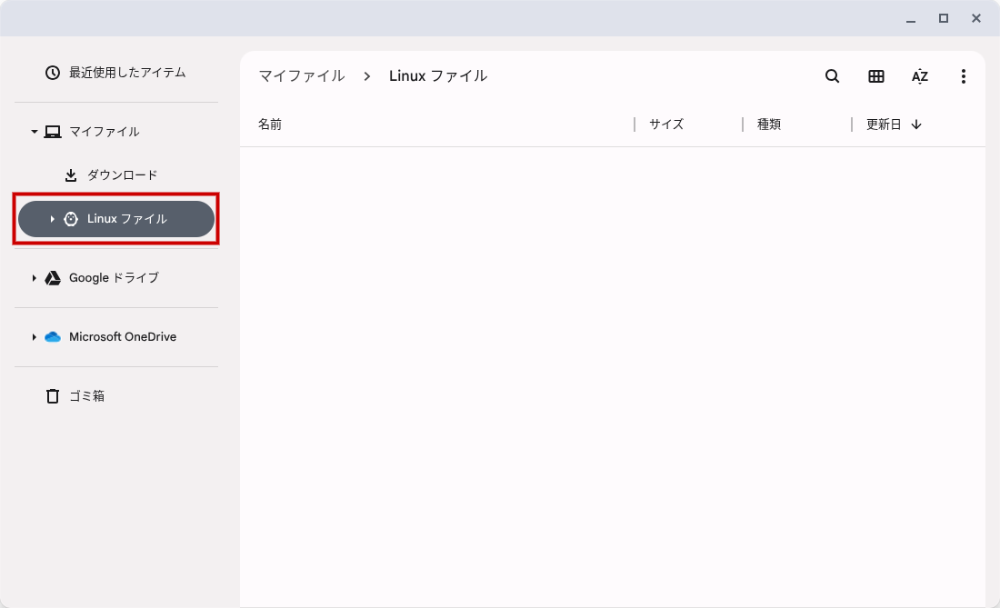{:.medium}

`.`から始まる隠しファイルなどを表示したい場合は，右上の「⋮」を押して「非表示のファイルを表示」を有効にしてください．

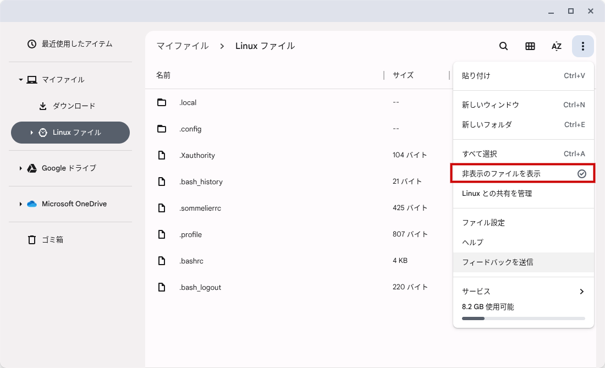{:.medium}

#### LinuxからChromeOSのフォルダにアクセスする

ファイルアプリでLinuxと共有する設定を行うと，Linux側からChromeOSのフォルダにアクセスできるようになります．共有できるのはローカルのフォルダに限らず，Google DriveやOneDriveのフォルダでもかまいません．手順は次のとおりです．

1. ファイルアプリで，Linuxに共有したいフォルダを右クリックして「Linux と共有」を選んでください．
  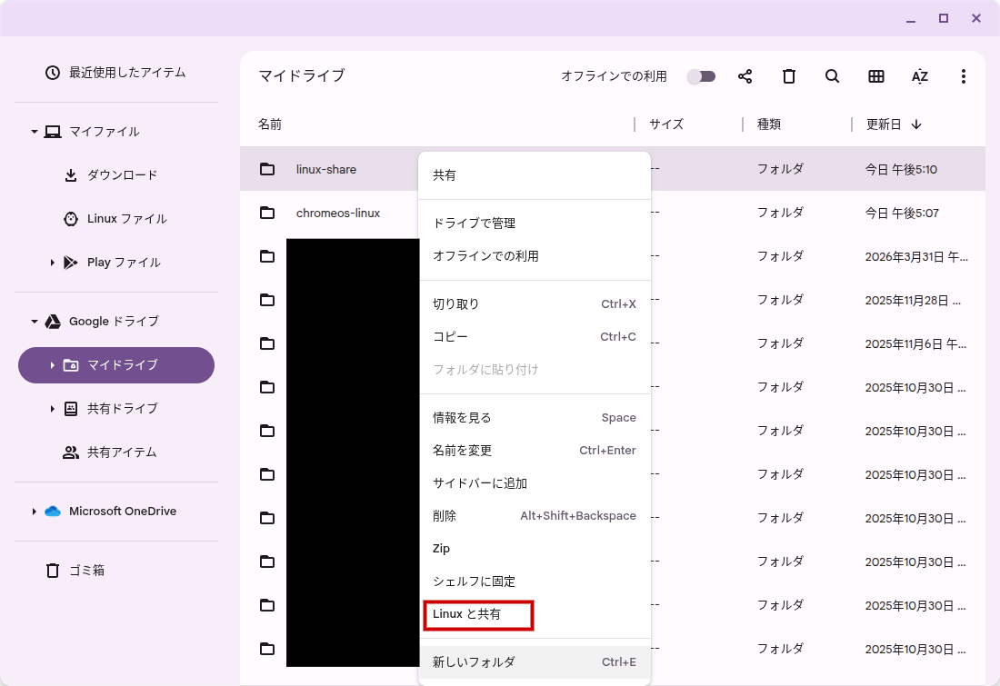{:.medium}
2. Linux上の`/mnt/chromeos`以下に該当フォルダがマウントされ，利用可能になります．
  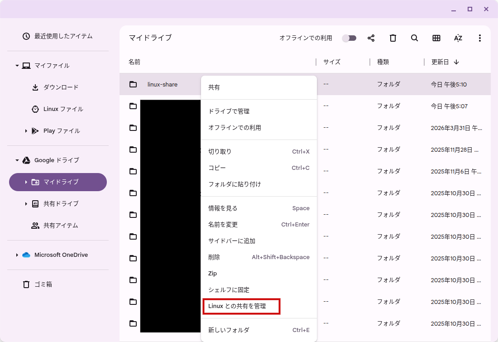{:.medium}
3. 共有を停止するには，「設定」アプリの「Linux 開発環境」→「共有フォルダを管理する」から，該当フォルダの「×」ボタンを押してください．
  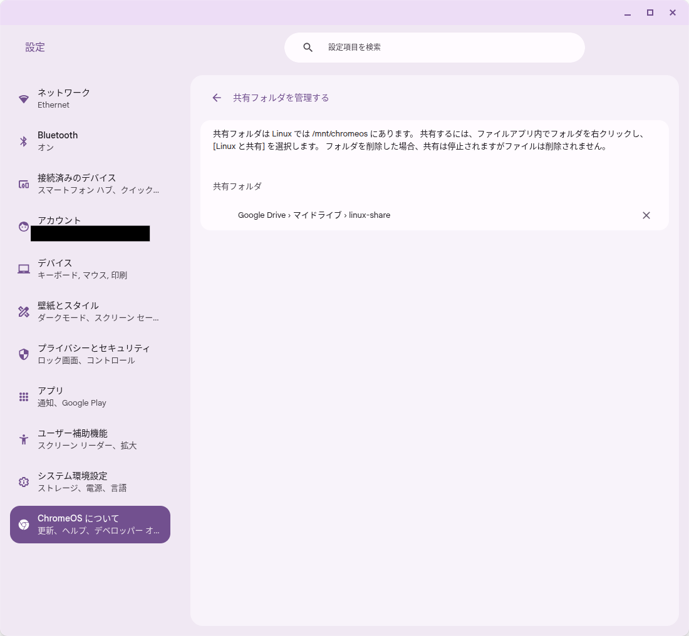{:.medium}

### GUIの利用

GUIも利用できます．WaylandとXによる画面描画がサポートされていますが，一部のアプリケーションは正しく動かない可能性があります．

### アプリケーションのインストール

#### コマンドラインを使う方法

`sudo apt install`コマンドを利用すると，`.deb`ファイルをはじめ，Debianで配布されているパッケージをインストールできます．

たとえばVisual Studio Codeは，公式サイトから`.deb`ファイルをダウンロードしたうえで，次のようにインストールできます．

```sh
sudo apt install ./code_1.114.0-1775036290_amd64.deb
```

これに限らず，Linux向けのバイナリなどを直接ダウンロードしてLinux上に配置すれば，動かすこともできます．ただし，実行時に必要なライブラリを追加でインストールする必要があったり，アーキテクチャの違いによっては動作しなかったりすることがあります．

#### GUIを使う方法

GNOMEのソフトウェアアプリおよびPackageKitをインストールしておけば，GUIを使って他のアプリをインストールできます．

1. 最初に一度，次のコマンドを実行して，ソフトウェアアプリとPackageKitを入れてください．

    ```sh
    sudo apt install -y gnome-software gnome-packagekit && sudo apt update
    ```
2. 上記のインストールが完了すると，「Linux アプリ」に「ソフトウェア」および「パッケージ」「パッケージアップデーター」が追加されます．
  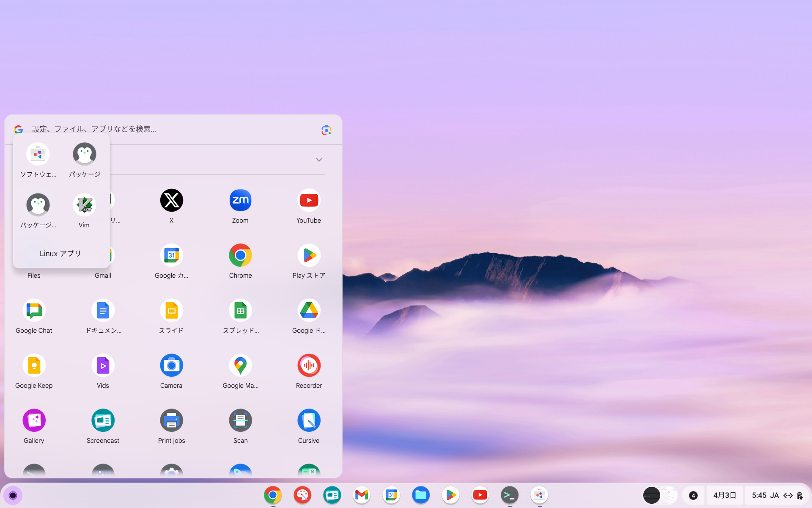{:.medium}
3. 「ソフトウェア」アプリを起動すると，次のような画面になります．
  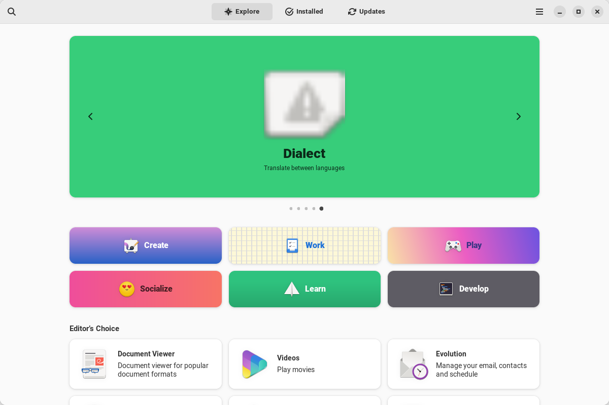{:.medium}
4. カテゴリごとに，様々なアプリをインストールすることができます．
  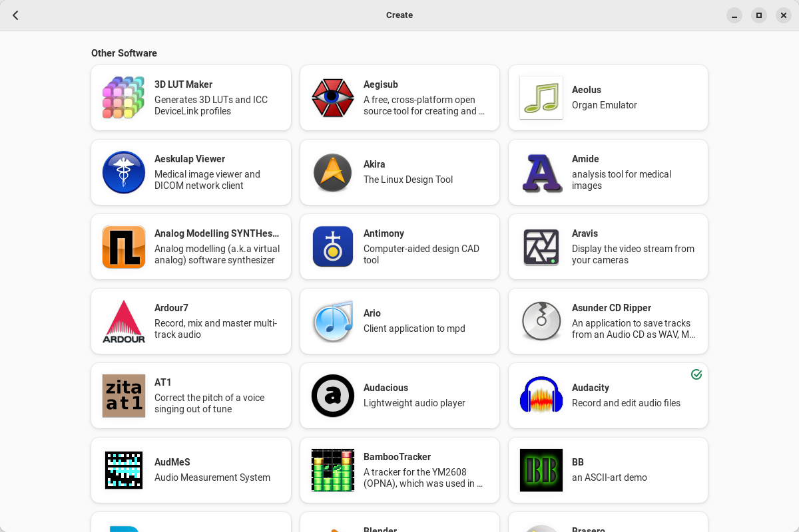{:.medium}

### ネットワーク接続

Linuxからは，ChromeOSを通じてインターネットに接続できます．また，Linux上で立ち上げた開発用のWebサーバには，ChromeOS側から`http://localhost:8000/`などとしてアクセスできます．

## Linux 開発環境の起動に失敗するとき

復元中にLinux 開発環境を起動しようとしたり，正常にシャットダウンできなかったりしたときに，次の起動がうまくいかなくなることがあります．そのときは，[終了](#shutdown)の手順に従ってシャットダウンしてからもう一度起動すると，治ることがあります．

## 参考資料

仕組みや詳細な仕様などは公式ドキュメントをご覧ください．

- [ChromeOS での Linux | Google for Developers](https://developers.google.com/chromeos/app-development/develop?hl=ja)
- [アプリや拡張機能を追加する - Chromebook ヘルプ](https://support.google.com/chromebook/topic/3415446?hl=ja)
