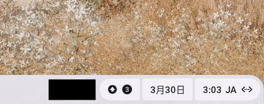
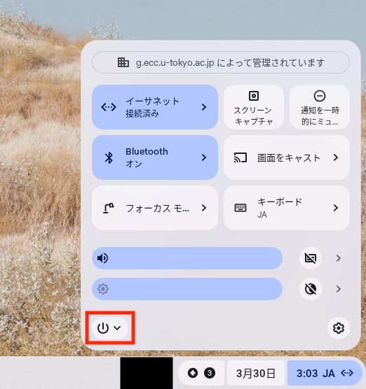
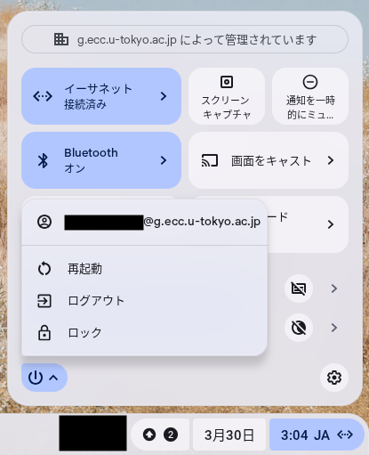

## 概要

ChromeOSデバイスにおける再起動の方法として，通常の「[再起動](#restart)」と，デバイスの問題復旧などに用いられる「[ハードリセット](#hard-reset)」の2種類の方法があります．

## 再起動
{:#restart}

1. 右下の「MM:DD JA[^1]」を押してください．
  {:.medium.center.border}
1. 電源アイコン(⏻)を押してください．
  {:.medium.center.border}
1. 「再起動」を選択してください．
  {:.medium.center.border}
1. しばらく待つとサインインの画面になるので，[サインイン](../#signin)してください．

[^1]: 実際には，現在時刻とキーボードの入力設定が表示されています．

### 起動中の場合（ログイン前など）

1. 左下の「Restart」ボタンを押してください．再起動が開始されます．

## ハードリセット
{:#hard-reset}

* 手順については「[Chromebook のハードウェアをリセットする](https://support.google.com/chromebook/answer/3227606?hl=ja)」(公式ヘルプ)を参照してください．
* Chromeboxの場合，ハードリセットに電源ケーブルを抜く操作が必要になるため，利用者によるハードリセットが困難な場合があります．この場合は，無理に行うのではなく，[サポート窓口](../../support/)にご相談ください．

## 補足

* ECCSでは，[ChromeOSデバイスを初期状態にリセットする操作](https://support.google.com/chromebook/answer/183084?hl=ja)（いわゆるPowerwash）は実行できません．
* 再起動により画面が映らないなどの不具合が起きる場合があります。遭遇した場合は「[Chromebookを起動した際，ドックが認識されない問題（外付けディスプレイが映らない・キーボード等が認識されない）](../../defects/chromebook-dock-recognition/)」を参照してください
