## 概要

ECCS2026のChromeOSデバイスでは，[Googleドライブ](#google-drive)や[OneDrive](#onedrive)，[USBなどで接続できる外部ストレージ](#external-storage)にデータを保存できます．

なお，ChromeOSデバイスのローカルに保存されたデータは，ローカルのストレージが不足すると古いものから順に削除されます．たとえ次回同じデバイスを使う予定だとしても，ローカルストレージに保存されたデータが残っていることは保証されません．上記のいずれかに**必要なデータは保存**するようにしてください．

また，ChromeOSデバイスの「ファイル」アプリから使えるのは，ECCSクラウドメールのアカウントのGoogleドライブ，UTokyo Microsoft LicenseのOneDrive，外部ストレージのみです．これら以外のクラウドストレージ（個人アカウントでの利用を含む）を利用したい場合は，ブラウザからのみ使用できます．

## Googleドライブを使う
{:#google-drive}

### ECCSクラウドメールのアカウントから利用する

ECCSクラウドメールのアカウント（東大のGoogleアカウント）のGoogleドライブであれば，デバイスへのサインインによって自動的にドライブにもサインインされるので，簡単に使うことができます．[「ファイル」アプリ](#google-drive-eccs-files-app)からでも[ブラウザから](#google-drive-eccs-browser)でも利用できます．

#### 「ファイル」アプリから使う手順
{:#google-drive-eccs-files-app}

1. メニューから「ファイル」アプリを開いてください．
1. 左側のサイドバーで「Google ドライブ」を選択してください．
   

   
Googleドライブに保存されたデータが「ファイル」アプリ上に正常に表示されない場合

   * サインイン直後は，読み取り専用になっていることがあります．この場合は，しばらく待ってから再度開いてみてください．
   * 「デバイスに十分な空き容量がないため〜」と表示される場合は，ローカルデバイスにGoogleドライブのデータをダウンロード（同期）できない状態です．この場合は，[ブラウザから使用する](#google-drive-eccs-browser)のがおすすめです．
     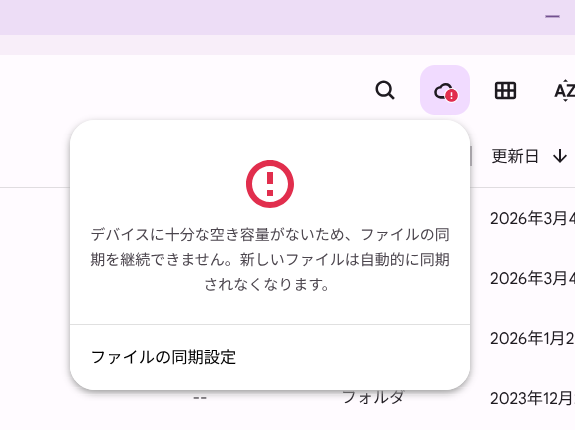{:.small.border}
   

#### ブラウザで使う手順
{:#google-drive-eccs-browser}

すでにECCSクラウドメールのアカウントでログインしているので，メニューから「Google ドライブ」を選択するか，ブラウザでGoogleドライブを開いてください．

### ECCSクラウドメール以外のアカウントから利用する

ECCSクラウドメールのアカウント（東大のGoogleアカウント）以外のGoogleアカウントも利用できます．ただし，ブラウザからのみの利用となります．

1. メニュー > 設定アプリ > アカウントから「Google アカウントを追加」を選択するか，ブラウザから「別のアカウントを追加」を選択してください．
  <figure class="gallery">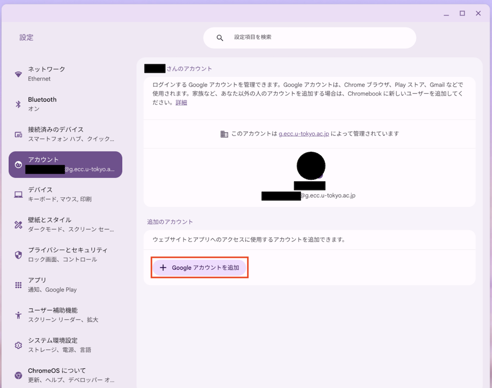{:.medium.border}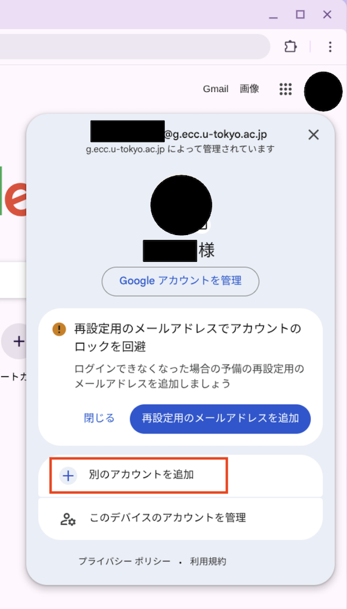{:.medium.border}</figure>
1. 「OK」を選択してください．
  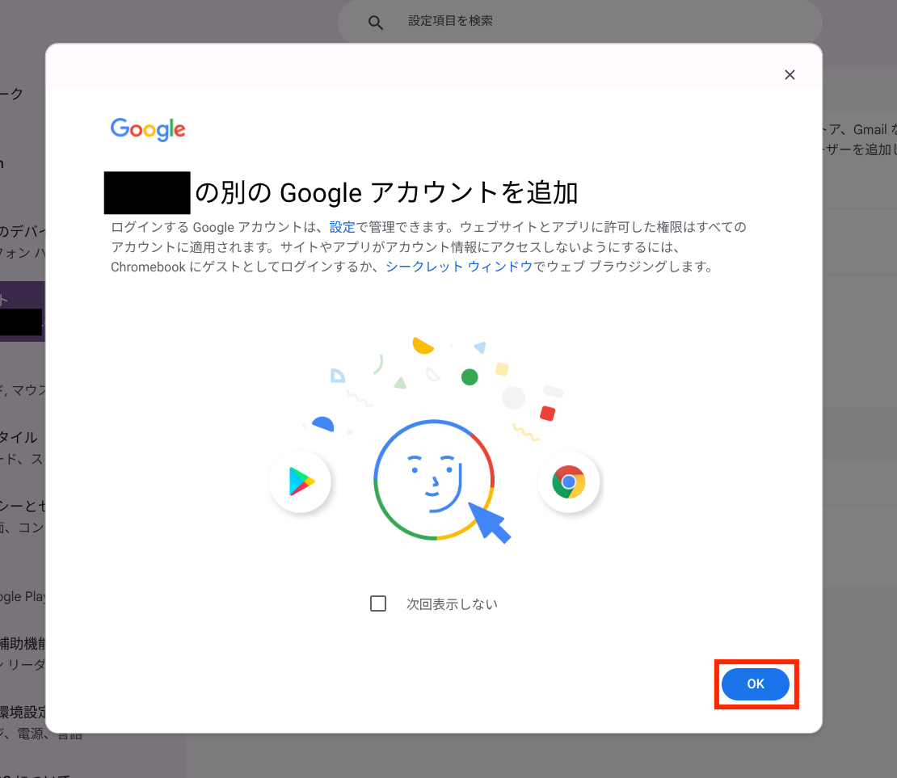{:.small.border}
1. Googleドライブを利用したいGoogleアカウントでログインしてください．
  <figure class="gallery">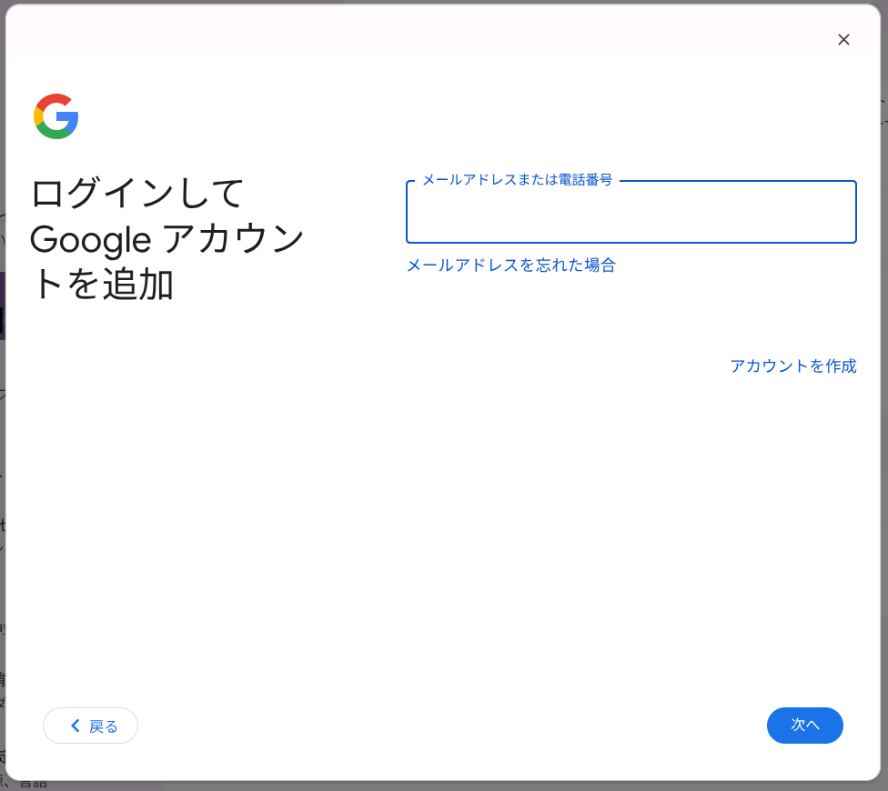{:.medium.border}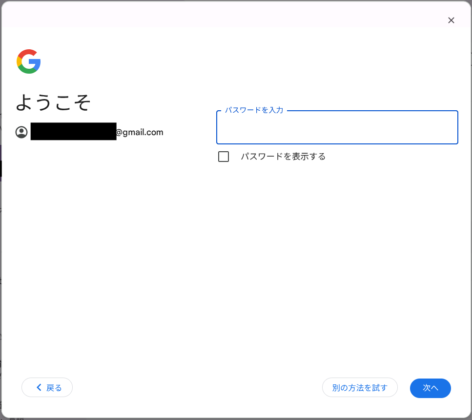{:.medium.border}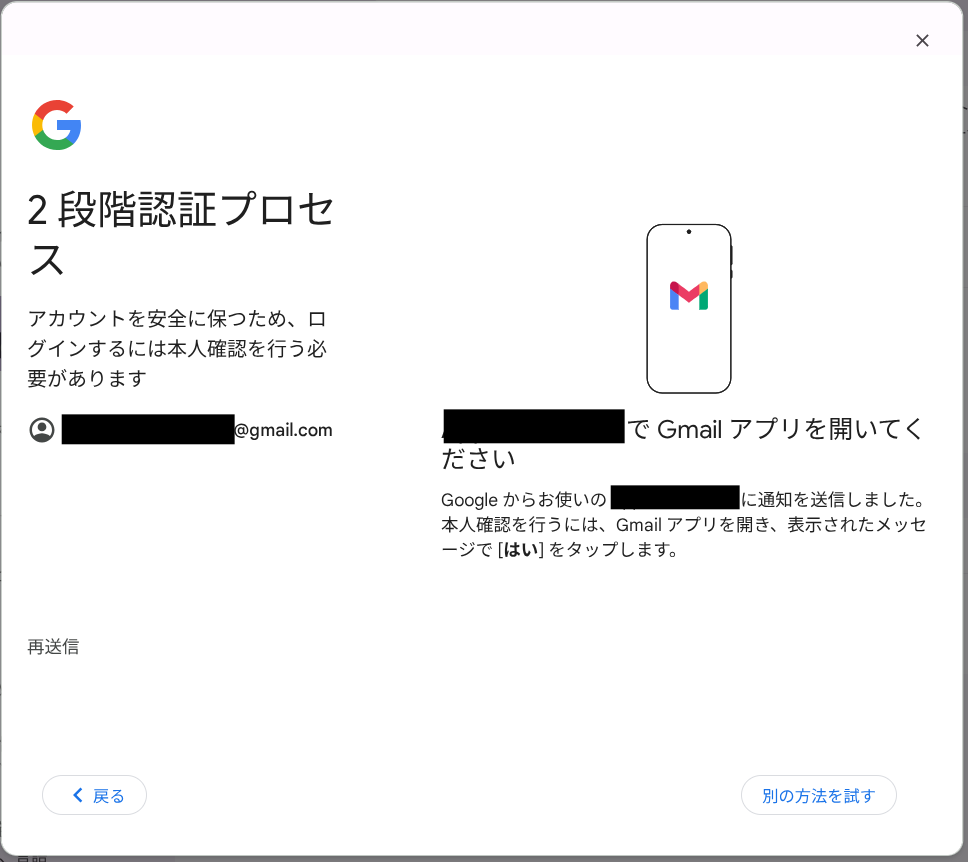{:.medium.border}</figure>
1. 内容を確認の上，「同意する」を選択してください．
  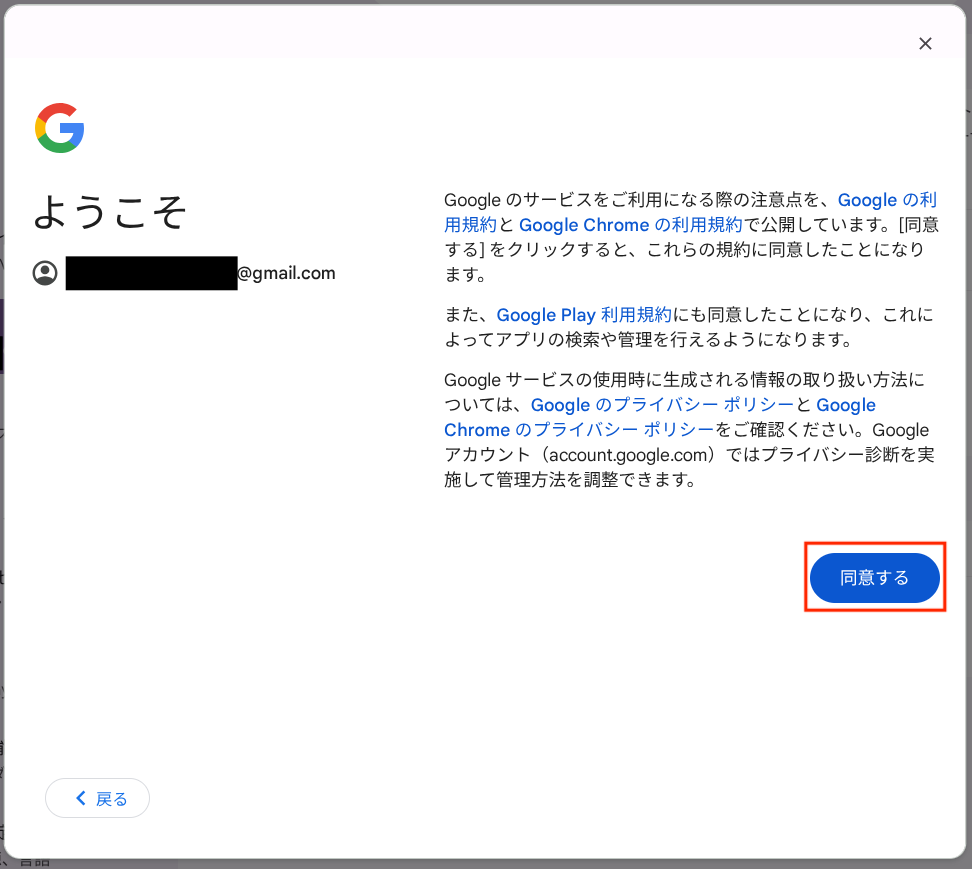{:.small.border}
1. ブラウザから[Googleドライブを利用](/google/drive/basic/)してください．

## OneDriveを使う
{:#onedrive}

「ファイル」アプリから，UTokyo Microsoft Licenseの[OneDrive](/microsoft/onedrive/)を容易に利用することができます．もちろん，他のOSと同様に[ブラウザからも利用できます](/microsoft/onedrive/#signin)．（UTokyo Microsoft License以外のアカウントから利用したい場合は，ブラウザからのみ利用可能です．）

### UTokyo Microsoft LicenseのOneDriveを利用する

1. メニューから「ファイル」アプリを開いてください．
1. 左側のサイドバーで「Microsoft OneDrive」を選択してください．

#### 「OneDrive setup failed」／「OneDriveを設定できませんでした」と通知された場合

起動時に，以下の画像のように「OneDrive setup failed」「OneDriveを設定できませんでした」といった通知が来ることがあります．

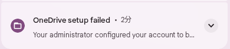{:.medium.border}

このような通知が来た場合で，UTokyo Microsoft LicenseのOneDriveに接続したいときは，次の手順で接続してください．

1. 通知の「OneDriveに手動で接続」を押してください．
1. 「ファイル」アプリで「Microsoft OneDrive」を選択し，「ログイン」を押してください．
  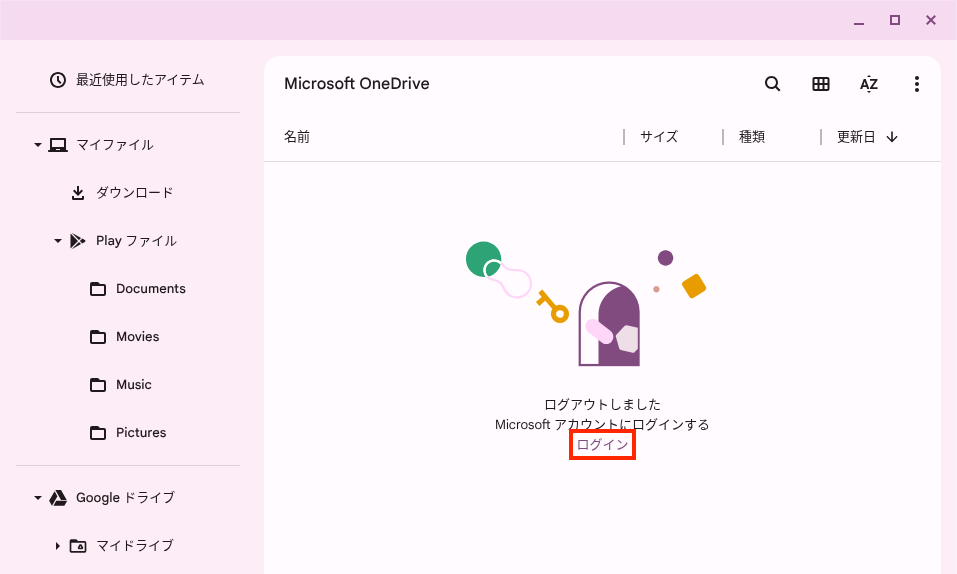{:.medium.border}
1. 画面に従ってサインインするか，アカウントを選択してください．
  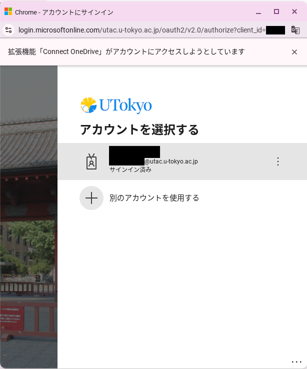{:.small.border}
1. 要求されているアクセス許可を確認の上，「承諾」を押してください．
  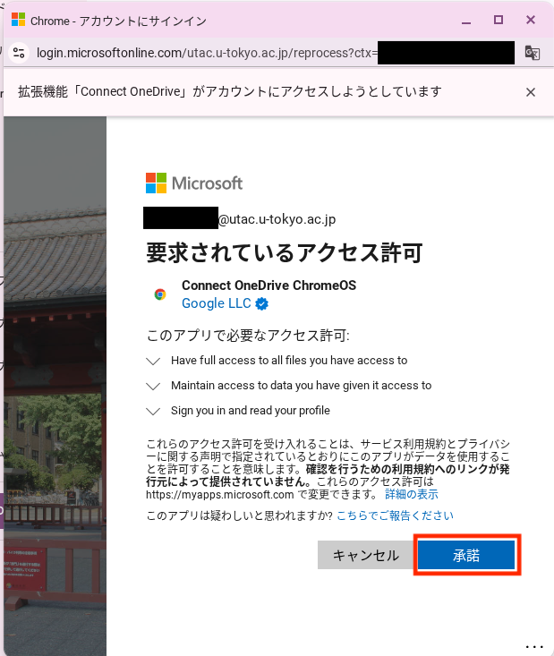{:.small.border}
1. 接続が完了すると，「ファイル」アプリからOneDriveのファイルを利用できるようになります．
  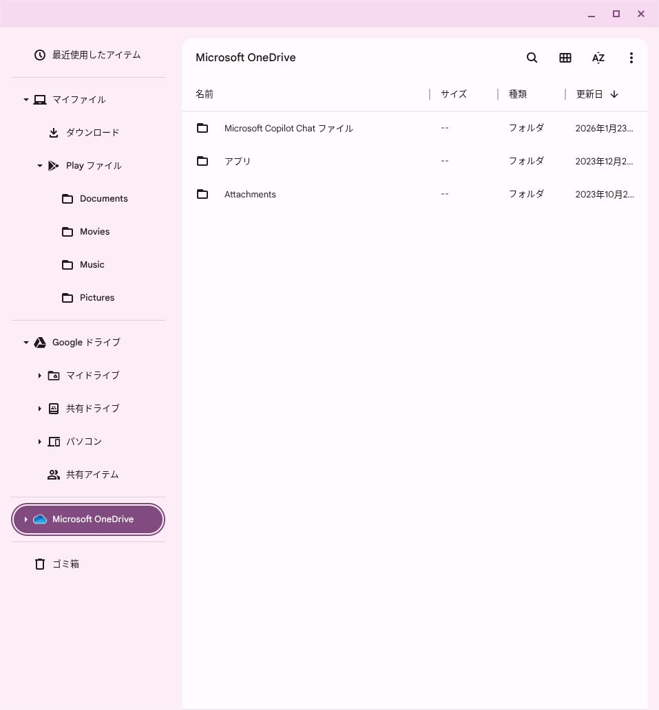{:.small.border}

## USBフラッシュメモリやSDカードなどを使う
{:#external-storage}

USBフラッシュメモリやSDカードなどの外付けストレージを利用できます．

利用終了時には，必ず「[取り出しの手順](#eject)」を実施してください．実施しないと，データが消えてしまったり，外付けストレージが壊れてしまったりする可能性があります．

### 利用手順

1. USBフラッシュメモリなどを差し込んでください．
   * Chromebookの場合は，ハブまたは本体右側のUSB-A端子に接続してください．詳しくは「[ハードウェア](../hardware/)」を参照してください．
1. メニューから「ファイル」アプリを開いてください．
   * 表示されるポップアップから開くこともできます．
     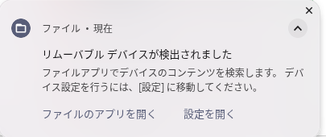{:.medium.border}

### 取り出しの手順
{:#eject}

1. 「ファイル」アプリを開いてください．
1. 左側のサイドバーの，外付けメディアの名称の右側にある取り出しアイコン（⏏）を選択してください．
  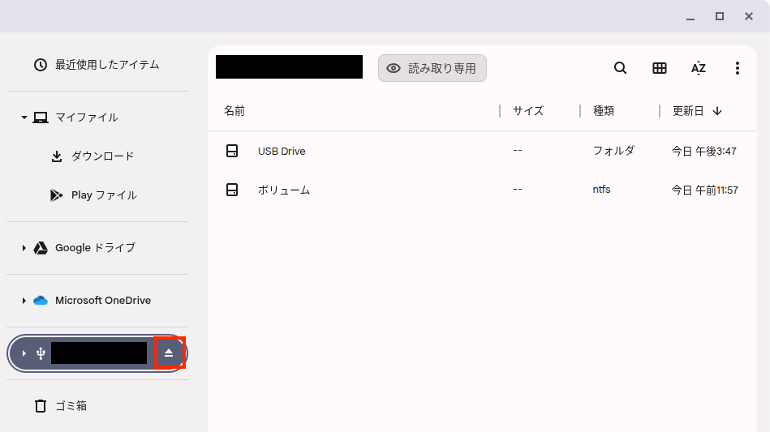{:.medium.border}
1. サイドバーから外付けメディアの名称が消えるまで待って，取り外してください．

## その他

* 「設定 > システム環境設定 > ファイル」から，GoogleドライブやOneDriveの設定を確認できます．
* 外部のsshサーバへの接続には，「[Linux開発環境](../linux/)」を利用できます．
  * ネットワークファイル共有（設定 > システム環境設定 > ファイル）は利用できません．
* Google PlayのアプリからのUSBフラッシュメモリやSDカードなどの外付けストレージの読み込み・書き出しには，「設定 > … > 外部ストレージの設定」を以下のように設定する必要があります．
  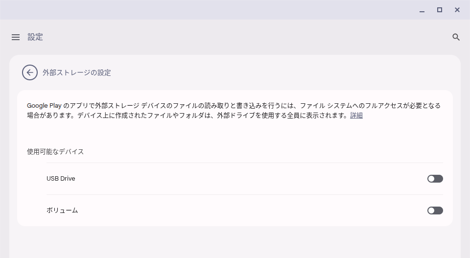{:.medium.border}
* [ニアバイシェアによるファイル共有](https://support.google.com/chromebook/answer/10751738?hl=ja)や，[Androidスマートフォンとの接続による写真の同期など](https://support.google.com/chromebook/answer/9094445?hl=ja)は，管理者側の設定により利用できません．

## 参考情報

* [Chromebook でファイルを開く、保存する、削除する](https://support.google.com/chromebook/answer/1700055?hl=ja)（公式ヘルプ）
* [付近のデバイスとファイルを共有する](https://support.google.com/chromebook/answer/10751738?hl=ja)（公式ヘルプ）
