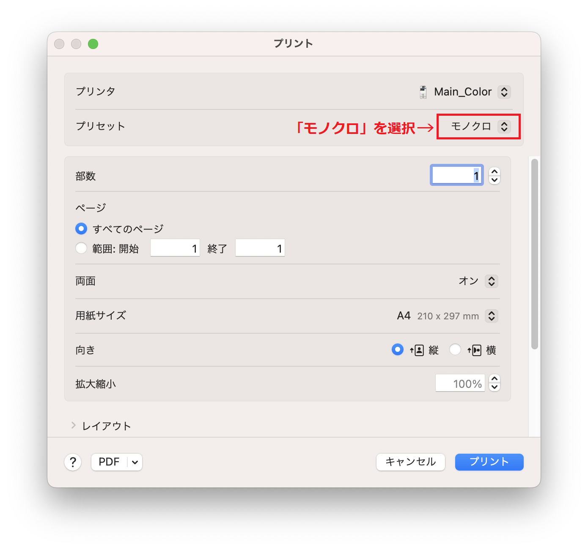
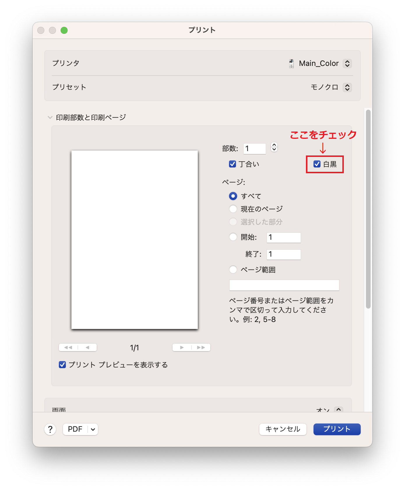

import ECCS2021Eol from "@components/ja/ECCS2021Eol.mdx";

<ECCS2021Eol />

## `Main_Mono`を利用できない問題
ECCS端末で専用の仮想プリンタに直接印刷ジョブを送信する「[オンデマンドプリント](/eccs/features/printing/#ondemand)」では，白黒かカラーかに応じて仮想プリンタ（白黒印刷の場合は`Main_Mono`，カラー印刷の場合は`Main_Color`）を選択することになっています．しかし2023年3月より，Mac環境において，この方法では白黒印刷ができない状態が続いています．

現在，Mac環境では`Main_Mono`を選択できないため，Main_Colorを選択したうえで，下の画像のように，**プリセット設定で「モノクロ」を選択してください**．「モノクロ」以外を選択すると，黒文字だけの文書であってもカラー印刷として扱われ，カラー印刷料金が課金されてしまいます．

また，特にMicrosoft Wordでモノクロ印刷をしたいときは，下の画像のように，「印刷部数と印刷ページ」の設定にある**「白黒」のチェックボックスにチェックを入れてください**．ここにチェックを入れないと，黒文字だけの文書であってもカラー印刷として扱われ，カラー印刷料金が課金されてしまいます． 

## Adobe Acrobat Readerからの印刷における料金表示の問題
Mac環境のAdobe Acrobat Readerで「グレースケール（白黒）で印刷」にチェックを入れて印刷を行うと，複合機操作端末上での推定金額がカラー印刷の料金で計算されるという不具合があります．原因は，Adobe Acrobat Readerの仕様です．実際には白黒印刷の金額が課金されます．

## 複合機操作端末での部数変更の問題
オンデマンドプリントでは，印刷ジョブを送信した後に複合機操作端末で実際の部数を変更できますが，Mac環境から印刷した場合はこれが動作しません．
