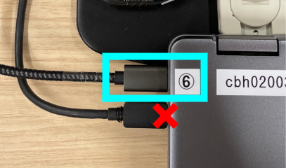
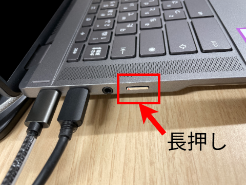
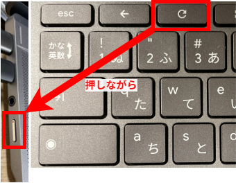

ECCSのChromebookを起動した際に，ドックが認識されず，画面が映らない等の不具合が発生することがあります．

一度起動した後は，ログアウトしても発生することはありません．

## 症状

Chromebookをシャットダウン，または再起動した後に，ドックが認識されなくなることがあります．

これにより，席に備え付けの外付けディスプレイが映らなくなります．また，キーボード・マウス・ウェブカメラ等，ドックに接続された機器も動作しなくなります．

## 直し方

1. ドックから延びているUSB Type-Cケーブル（画像内で青枠で囲われているケーブル）を，Chromebookから外してください（間違ってデバイスに固定されている方のケーブルを外さないよう，ご注意ください）．
    {:.small}
1. 電源ボタン（本体左側）を長押しして，強制シャットダウンしてください．
    
1. **本体キーボード最上段の更新キー（🔄）を押しながら**電源ボタンを押して起動してください．Chromebookのロゴ（「Chromebook Plus」の文言）が表示されたら離しても大丈夫です．
    
1. 手順1で外したケーブルをもとに戻してください．
