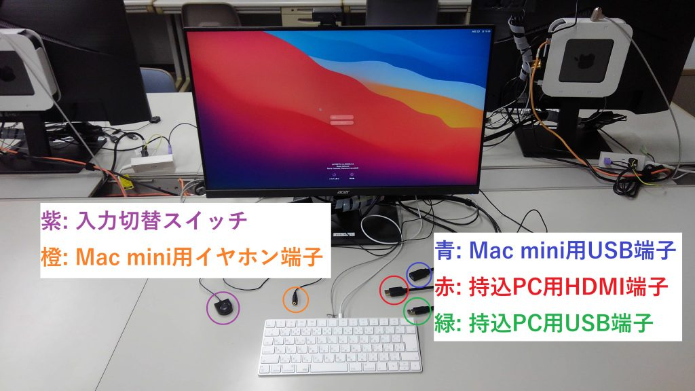
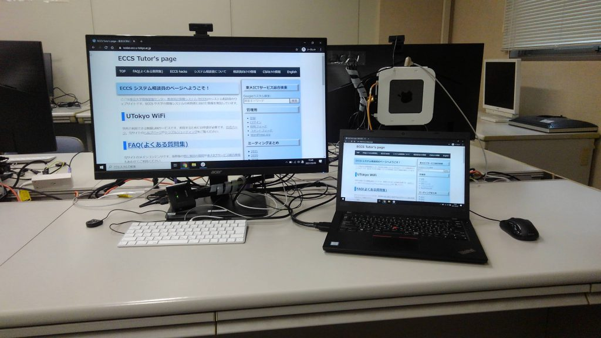

import ECCS2021Eol from "@components/ja/ECCS2021Eol.mdx";
import WwweccEol from "@components/ja/WwweccEol.astro";

<ECCS2021Eol />
<WwweccEol systemName="ECCS端末"/>

ECCSのMac mini端末に接続されているディスプレイとマウスは，利用者が持ち込んだノートPC等（持ち込みPC）に接続して利用できます（なお，このページで紹介する方法で利用できるのはディスプレイとマウスのみで，キーボードは利用できません）．

例えば，次のような場面で活用できます．
- 大学に持参しているPCの画面が小さくて作業が不便なときに，外付けディスプレイとして使用する（画面の拡張もしくは画面の複製）．  
- トラックパッドでは操作しにくい作業で，マウスを使用する．

## 使用方法

1. 卓上のHDMIケーブルとUSBケーブル（オス）を持ち込みPCに接続してください．いずれか一方のみを接続すると，ディスプレイのみもしくはマウスのみが利用できます．
2. KVMスイッチの切り替えボタンを押してください．ディスプレイの表示がMac miniから持ち込みPCの画面へ切り替わります．

{:.medium}

画面複製モードで利用する場合，この写真のようになります．

{:.medium}