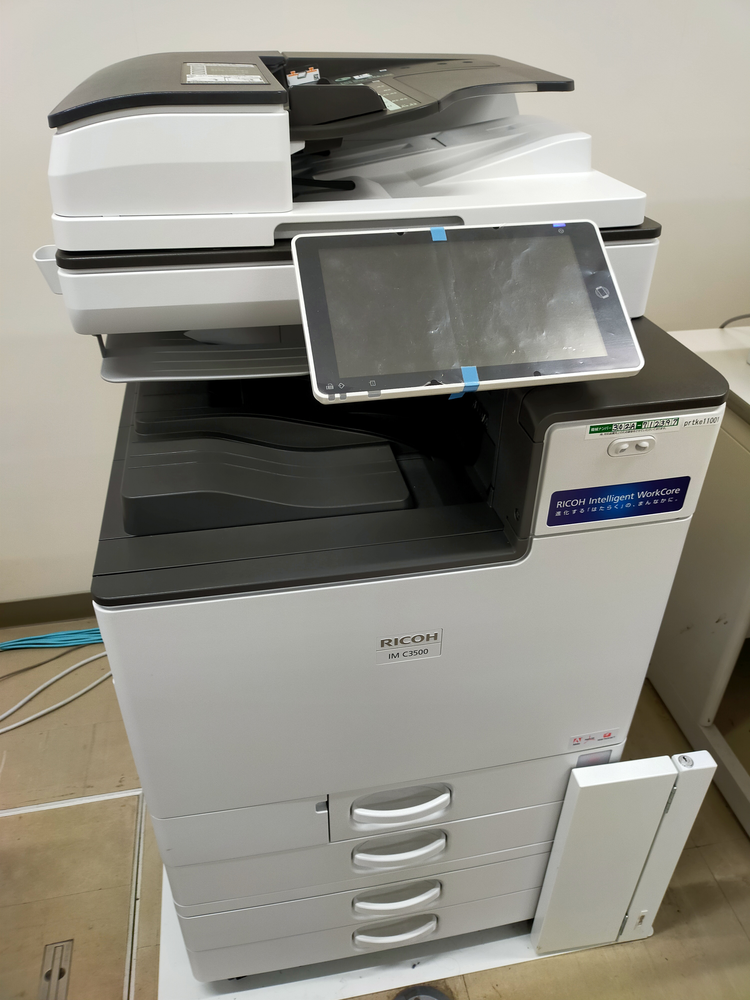
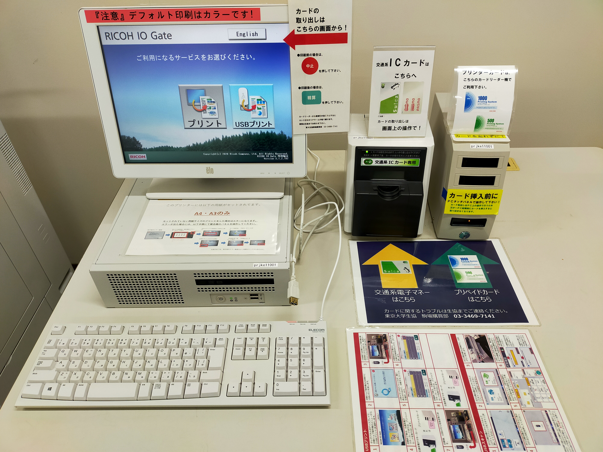

import WwweccEol from "@components/ja/WwweccEol.astro";

<WwweccEol systemName="ECCS端末"/>

このページでは，ECCSでの印刷方法や複合機の使い方について説明します．詳しくは「[利用の手引き](https://www-old.ecc.u-tokyo.ac.jp/guide/tebiki/index.html)」の該当箇所も参照してください．

## 印刷の利用
ECCS2021では印刷機器としてRICOH社製の複合機（RICOH MP IMC3500/IMC3000）を提供しており，これをECCS複合機と呼びます．ECCS複合機には，料金の支払いが必要な一部の操作を実行するための，複合機操作端末と課金装置が付属しています．これらの設備を利用して，オンデマンドプリント，IPP印刷，Webアップロード印刷，USB印刷の4通りの方法で印刷を行うことができます．印刷には所定の料金が必要で，プリペイドカードまたは交通系ICカードで支払います．

<figure class="gallery"></figure>

### オンデマンドプリント
{:#ondemand}
ECCS端末で，OSの印刷機能を用いて，専用の仮想プリンタに直接印刷ジョブを送信する方法です．送信された印刷ジョブは，ECCSのどの複合機操作端末からでも閲覧でき，これを操作することで印刷を実行します．

1. ECCS端末上のアプリケーションで印刷のメニューを表示し，仮想プリンタを選択してください．次のものから用途に応じて選んでください．
    - 白黒印刷の場合：`Main_Mono`
    - カラー印刷の場合：`Main_Color`
2. アプリケーションで印刷の実行ボタンを押してください．印刷ジョブが送信されます．この段階ではまだ用紙は排出されません．
3. 複合機操作端末のタッチパネルで「プリント」を選択し，ECCSアカウント（共通ID（UTokyo Accountの先頭10桁の数字のみの部分)とUTokyo Accountのパスワード）でログインしてください．複合機操作端末は，タッチパネル式のモニタまたはキーボードで操作します．
4. 登録されている印刷ジョブの一覧が表示されるので，この中から実行したい印刷ジョブを選択してください．
5. 複合機操作端末の隣に設置されている課金装置に，プリペイドカードまたは交通系ICカードを挿入してください．
6. 複合機操作端末で「はい」ボタンを押すと，実際の印刷が始まり，用紙が排出されます．

詳細については[利用の手引き](https://www-old.ecc.u-tokyo.ac.jp/guide/tebiki/index.html)も確認してください．

なお，Mac環境からオンデマンドプリントを行う際には注意点があります．「[Mac環境からオンデマンドプリントを行う際の注意点](/eccs/defects/20230322-mac-ondemand-print/)」のページも確認してください．

### IPP印刷
{:#ipp}
ECCS端末以外のPC（学内ネットワークに接続されたWindowsのPCでのみ利用可能）から，ネットワークを経由して，専用のIPP印刷サーバに印刷ジョブを送信する方法です．送信された印刷ジョブは，ECCSのどの複合機操作端末からでも閲覧でき，これを操作することで印刷を実行します．詳しい利用方法については， 「[IPP印刷の設定方法（Windows）](/eccs/features/printing/ipp-windows/) 」を参照してください．

### Webアップロード印刷
{:#web-upload}
インターネットに接続されたPCやスマートフォン等から，印刷したいファイルを専用のウェブアップロード印刷サイトにアップロードすることで，印刷ジョブを作成する方法です．作成された印刷ジョブは，ECCSのどの複合機操作端末からでも閲覧でき，これを操作することで印刷を実行します．詳しい利用方法については， 「[Webアップロード印刷の方法](/eccs/features/printing/web-upload/)」を参照してください．

### USB印刷
{:#usb}
USBフラッシュメモリに保存されたファイルを複合機操作端末に直接読み込ませることで，印刷ジョブを作成する方法です．複合機操作端末を直接操作することで印刷を実行します．詳しい利用方法については，利用の手引きの「[15.3 USBメモリからの印刷](https://docs.google.com/document/d/e/2PACX-1vSb1vy25LzCSHpHa24TrekV_-p-NLnX-228h-uKwj9yvNMXSMDeNgMHOkKFeSxmxVworR2JeawElXGM/pub)」や「[15.8.3 USBメモリプリントに関する注意制限](https://docs.google.com/document/d/e/2PACX-1vQLOrr8RXzmLtF5mpdgl4pcZtOW_RzixE09_sBuaG2l6hZp14o6sHRkyx0v_T207XIqCpomPj1aQBtm/pub)」を参照してください．

## 印刷機能以外の利用
{:#other_functions}
ECCS複合機では，印刷以外にも，コピー機能，スキャン機能が利用可能です．コピーには所定の料金が必要で，プリペイドカードまたは交通系ICカードで支払います．詳しい利用方法については，複合機のそばに設置されているマニュアルを参照してください．

ただし，一部の複合機ではコピー機能やスキャン機能が無効化されています．詳しくは次の表をご覧ください．

<b class="box center">[複合機の機能と用紙の一覧](https://docs.google.com/spreadsheets/d/e/2PACX-1vTnxRnqGnFFNBuHo9lKIVwjERhd2_rFzbISj0niq9RrfX2uPN4Su7R4Cc-Lqin6w37In9-jnjJ6iKGG/pubhtml?gid=1410453096&single=true)</b>

<iframe src="https://docs.google.com/spreadsheets/d/e/2PACX-1vTnxRnqGnFFNBuHo9lKIVwjERhd2_rFzbISj0niq9RrfX2uPN4Su7R4Cc-Lqin6w37In9-jnjJ6iKGG/pubhtml?gid=1410453096&amp;single=true&amp;widget=true&amp;headers=false"></iframe>

## 料金について
{:#charge}
ECCS複合機での印刷とコピーには，所定の料金が必要です．料金は，白黒の場合1ページ10円，カラーの場合1ページ50円で，用紙サイズによらず同一金額です．

支払いには，ECCS専用のプリペイドカードまたは交通系ICカードが利用できます．プリペイドカードはリコージャパン製のもので，図書館や情報教育棟に設置されている自動販売機や，東大生協の購買部で購入できます．交通系ICカードは，Suica，PASMO，Kitaca，TOICA，ICOCA，SUGOCA，nimoca，はやかけんが利用できます（2020年4月1日現在）．モバイルSuica・モバイルPASMOやPiTaPaは利用できません．また，プリペイドカードや交通系ICカードは，複数枚同時に利用できません．

また，まれに，課金装置に異常がないのに，交通系ICカードを利用しようとすると「このカードは利用できません。」と表示されうまく利用できない場合があります．これには，カードが失効している場合，カードに異常がある場合，カードを一定期間利用していなかった場合などが考えられます．また，Suicaに関して，発売初期のものでは駅の改札では使えるが電子マネーとしては使えないものもあります．

## トラブルや異常がある場合は
{:#trouble}
ECCS複合機の保守管理は，情報基盤センターではなく東大生協が担当しています．紙切れやエラーなどのトラブルやなんらかの異常がある場合は，原則として東大生協の店舗に連絡してください．
- 本郷：第一購買部 03-3816-0711（内線 27986）
- 駒場：駒場購買部 03-3469-7141（内線 46183）

## 注意事項
- 印刷ジョブ送信時に指定したサイズの用紙が複合機に入っていない場合，エラーとなって印刷が一時停止します．複合機操作端末のそばに示されている案内に沿って操作してください．
- 複合機操作端末でパスワードを入力するには，タッチパネルとキーボードのどちらかを利用しますが，このうちキーボードから入力する場合で，大文字や一部の記号などシフトキーを必要とする場合に，入力が正しく認識されないことがあるようです．これらの文字を入力する際には，各文字に対応するキーから指を離した後に，シフトキーを離すように心掛けると，正常に認識されやすいそうです．もしそれでも何度正しく入力しても認識されない場合は，タッチパネルをお使いください（他人にパスワードを盗み見られることのないように十分注意してください）．
- UTokyo Accountでは，パスワードとして設定できる文字数は最大64文字です．しかし，ECCSの複合機操作端末では，パスワードの文字数が最大32文字までしか使用できないため，33文字以上のパスワードを設定している場合はECCSでの印刷を利用できません（参考「[UTokyo Account における多要素認証の推奨とパスワード設定の変更について](/notice/2023/03-utokyo_account-password/)」）．
