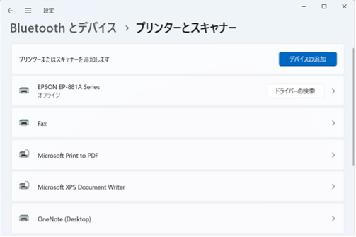
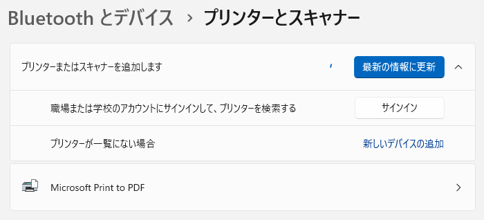
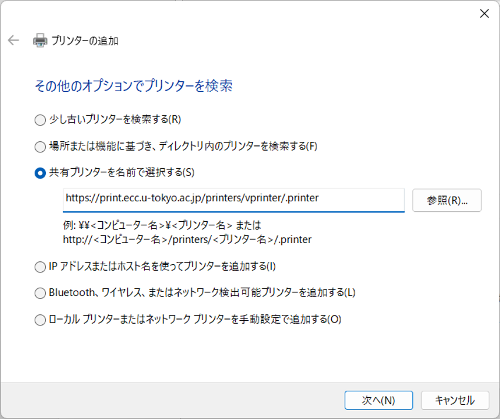
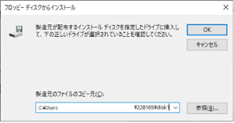
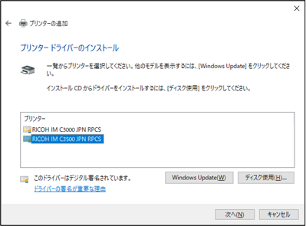
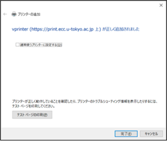

import If from "@components/utils/If.astro"

{/**
  * @typedef {object} Props
  * @property {"win10" | "win11"} variant
  */}

1.  <If cond={props.variant === "win10"}>
    スタートメニュー等から「設定」を開き，「デバイス > プリンターとスキャナー」を開いてください．
    </If>
    <If cond={props.variant === "win11"}>
    スタートメニュー等から「設定」を開き，「Bluetoothとデバイス > プリンターとスキャナー」を開いてください．
    </If>
1.  <If cond={props.variant === "win10"}>
    「プリンターとスキャナーを追加します」を押してください．
    </If>
    <If cond={props.variant === "win11"}>
    「プリンターとスキャナーを追加します」内の「デバイスの追加」ボタンを押してください．
    
    </If>
1.  <If cond={props.variant === "win10"}>
    しばらくすると「プリンターが一覧にない場合」というリンクが表示されるので，押してください．
    
    </If>
    <If cond={props.variant === "win11"}>
    しばらくすると「プリンターが一覧にない場合」の項目が表示されるので，「手動で追加」ボタンを押して下さい．
    
    </If>
1. 「その他のオプションでプリンターを検索」画面が開きます．「共有プリンターを名前で選択する(S)」をチェックし，直下のフォームに`https://print.ecc.u-tokyo.ac.jp/printers/vprinter/.printer`を入力して，「次へ」ボタンを押してください．
    - ECCS2016では白黒とカラーでプリンタが分かれていましたが，ECCS2021では共通です．白黒・カラーは，印刷時の設定で指定してください．
    <If cond={props.variant === "win10"}>
    
    </If>
    <If cond={props.variant === "win11"}>
    
    </If>
1. ユーザ名欄には「`AD\`+ユーザ名」を，パスワード欄にはそのパスワードを入力し，「OK」ボタンを押下してください．(ECCS2021 では多くの方のユーザ名は共通ID（"数字10桁"）です)

    ユーザ名の例：`AD\1234567890`

    なお，日本語キーボードでは，`\`（バックスラッシュ）は`¥`キーを押すと入力できます．

    <If cond={props.variant === "win10"}>
    
    </If>
    <If cond={props.variant === "win11"}>
    
    </If>

1. 「プリンターの追加ウィザード」画面が開いたら「ディスク使用(H)...」を押してください．
1. 「フロッピー ディスクからインストール」画面が開いたら「参照(B)...」を押し，「手順1：プリンタドライバのダウンロード」で解凍した，プリンタドライバのフォルダの中にあるフォルダ「disk1」を選択してください．当該フォルダ内の`oemsetup.inf`が自動的に選択された状態になります．
    
    
1. 「フロッピー ディスクからインストール」画面に戻ったら「製造元のファイルのコピー元(C):」が，「手順1：プリンタドライバのダウンロード」で解凍したプリンタドライバのフォルダを指しているか確認し，「OK」ボタンを押下してください．
    
1. 「プリンターの追加ウィザード」画面に，RICOHのプリンターの機種一覧が表示されます．その中から「RICOH IM C3500 JPN RPCS」を選択して「OK」ボタンを押してください．
    
1. インストールが完了すると，「プリンターの追加」画面に戻ります．「`vprinter (https://print.ecc.u-tokyo.ac.jp 上)`」と表示されていることを確認し，「次へ」ボタンを押してください．
    
1. 「完了」ボタンを押し，終了してください．
    
