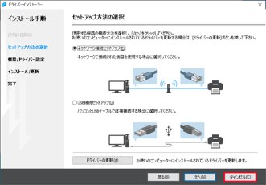
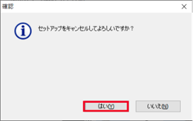
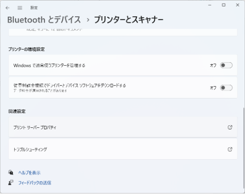

import AddPrinter from "./_add_printer.mdx"

ECCS2021では，学内ネットワークに接続した個人や研究室等のWindows PCから，IPP (Internet Printing Protocol) 印刷用プリントサーバ`print.ecc.u-tokyo.ac.jp`に印刷ジョブを送ることで，**ECCSの複合機 (RICOH IM C3500/C3000)**から印刷することができます．

このページでは，Windows 10とWindows 11での設定方法を説明します．**なお，Windows以外のOSには対応していませんのでご注意ください．**

## 手順1：プリンタドライバをダウンロード・解凍する

最初に，「手順3：プリンタを追加する」で使うプリンタドライバを入手します．

### 手順1-1：ドライバをダウンロードする

まず，RICOH IM C3500/C3000向けのプリンタドライバをダウンロードします．

以下のページから，お使いのOSのバージョンに応じた「RPCSドライバー」（Ver.1.13.0.0以降）をダウンロードし，適当な場所（デスクトップ等）に保存してください．

[**RICOH IM C3500/C3000 ダウンロード**](https://support.ricoh.com/bbv2/html/dr_ut_d/mfp/model/imc3500/imc3500.htm)

その際，OSが32bitか64bitかによってもダウンロードすべきドライバが異なりますので，注意してください．

### 手順1-2：ドライバを解凍する

続いて，ダウンロードしたファイルを解凍します．解凍が終わるとインストールが始まりますが，この段階ではまだインストールはしません．

1. ダウンロードしたファイルを右クリックし「管理者として実行」を押してください．
1. 以下の画面で「Install」を実行してください．
    
1. 使用許諾画面が表示されます．「同意して次へ」を押してください．
    
1. 「セットアップ方法の選択」画面が表示されますので，「キャンセル」を押してください．
    
1. 確認画面が表示されます．「はい」を押してください．
    
1. 「終了」を押してください．
    
1. ダウンロードしたファイルと同じ場所（デスクトップ等）に，フォルダが作成されていることを確認してください．
    

## 手順2：既存のプリンタを削除する（2021年3月以前に利用したことがある場合のみ）

2021年3月以前にIPP印刷を利用していた場合，既存のIPPプリンタ（ECCS2016で使われていた`Main_Mono`・`Main_Color`等）を削除する必要があります．

既存のプリンタがない場合は，「手順3：プリンタを追加する」へ進んでください．

### Windows 10の場合

1. コントロールパネル等から「デバイスとプリンター」を開いてください．
1. 既存のIPP用プリンタを選択すると，画面上部にツールバーが表示されますので，「デバイスの削除」ボタンを押してください．
1. いずれかのプリンタアイコンを選択し，ツールバーの「プリントサーバー プロパティ」を押してください．
1. 「プリントサーバーのプロパティ」画面が開きますので，「ポート」タブを開いてください．
1. ポートの一覧に「RGate IPP Printer」がある場合は，選択し「ポートの削除」ボタンを押してください．「ポートの削除」ウィンドウが開くので，「OK」ボタンを押してください．
    

### Windows 11の場合

1. スタートメニュー等から「設定」を開き，「Bluetoothとデバイス > プリンターとスキャナー」を開いてください．
1. 既存のIPP用プリンタを選択してください．
1. プリンタの詳細画面が開きますので，「削除」ボタンを押してください．
1. 「プリンターとスキャナー」に戻り，「関連設定」内の「プリントサーバープロパティ」を押してください．
    
1. 「プリントサーバーのプロパティ」画面が開きますので，「ポート」タブを開いてください．
1. ポートの一覧に「RGate IPP Printer」がある場合は，選択し「ポートの削除」ボタンを押してください．「ポートの削除」ウィンドウが開くので，「OK」ボタンを押してください．
    

## 手順3：プリンタを追加する

### Windows 10の場合

<AddPrinter variant="win10" />

### Windows 11の場合

<AddPrinter variant="win11" />
