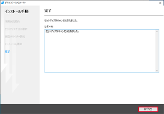
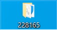
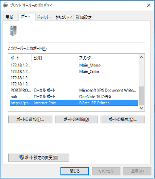

import AddPrinter from "./_add_printer.mdx"

ECCS2021 では，学内ネットワークに接続した個人や研究室等のWindows PCから， IPP (Internet Printing Protocolの略) 印刷用プリントサーバ`print.ecc.u-tokyo.ac.jp`に印刷ジョブを送ることで，**ECCSの複合機 (RICOH IM C3500/C3000)**から印刷することができます．

このページでは，Windows 10 およびWindows11環境での設定方法を説明します．**なお，PCのOSはWindowsに限りますのでご注意ください．**

## 手順1：プリンタドライバをダウンロード・解凍する

1. RICOH の「プリンター・複合機関連ドライバー」のページ (https://www.ricoh.co.jp/download/) で「IM C3500」を検索して，お使いの OS のバージョン（64bitか32bitかも確認してください）に応じたプリンタドライバ（RPCSドライバー Ver.1.13.0.0以降）をダウンロードしてください．
1. ダウンロードファイルを適当な場所（デスクトップ等）に保存してください．以下の例はWindows 10 64bitのRPCSドライバーVer.1.13.0.0です．
    
1. ダウンロードしたファイルを右クリックし「管理者として実行」を押してください．
1. 以下の画面で「Install」を実行してください．
    
1. 使用許諾画面が表示されます．「同意して次へ」を押してください．
    
1. 「セットアップ方法の選択」画面が表示されますので，「キャンセル」を押してください．
    
1. 確認画面が表示されます．「はい」を押してください．
    
1. 「終了」を押してください．
    
1. フォルダがその場所（デスクトップ等）に作成されていることを確認してください．
    

## 手順2：既存のプリンタを削除する（2022年以前に利用したことがある場合のみ）

ECCS2016（2021年2月末まで）のIPPプリンタ（`Main_Mono`および`Main_Color`）は，ECCS2021では使用できないため，以下の手順に従って削除する必要があります．

該当しない場合は，「手順3：プリンタを追加する」に進んでください．

### Windows10の場合

1. コントロールパネル等から「デバイスとプリンター」を開いてください．
1. 既存のIPP用プリンタを選択すると，画面上部にツールバーが表示されますので，「デバイスの削除」ボタンを押してください．
1. いずれかのプリンタアイコンを選択し，ツールバーの「プリントサーバー プロパティ」を押してください．
1. 「プリントサーバーのプロパティ」画面が開きますので，「ポート」タブを開いてください．
1. ポートの一覧に「RGate IPP Printer」がある場合は，選択し「ポートの削除」ボタンを押してください．「ポートの削除」ウィンドウが開くので，「OK」ボタンを押してください．
    

### Windows11の場合

1. スタートメニュー等から「設定」を開き，「Bluetoothとデバイス > プリンターとスキャナー」を開いてください．
1. 既存のIPP用プリンタを選択してください．
1. プリンタの詳細画面が開きますので，「削除」ボタンを押してください．
1. 「プリンターとスキャナー」に戻り，「関連設定」内の「プリントサーバープロパティ」を押してください．
    
1. 「プリントサーバーのプロパティ」画面が開きますので，「ポート」タブを開いてください．
1. ポートの一覧に「RGate IPP Printer」がある場合は，選択し「ポートの削除」ボタンを押してください．「ポートの削除」ウィンドウが開くので，「OK」ボタンを押してください．
    

## 手順3：プリンタを追加する

### Windows10の場合

<AddPrinter variant="win10" />

### Windows11の場合

<AddPrinter variant="win11" />
