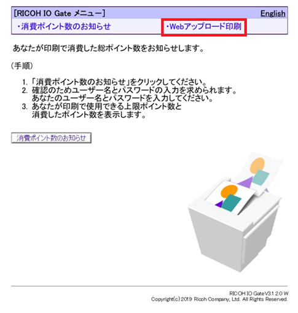
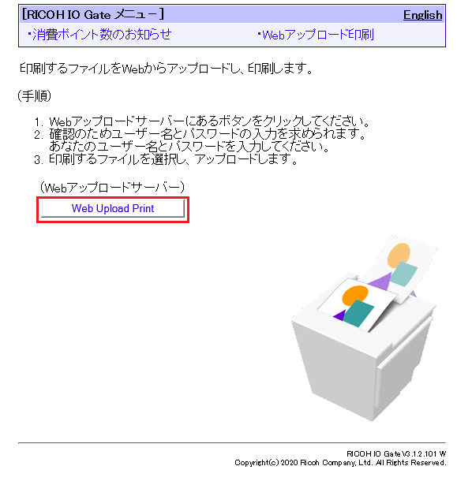
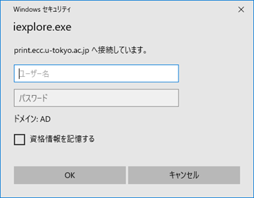
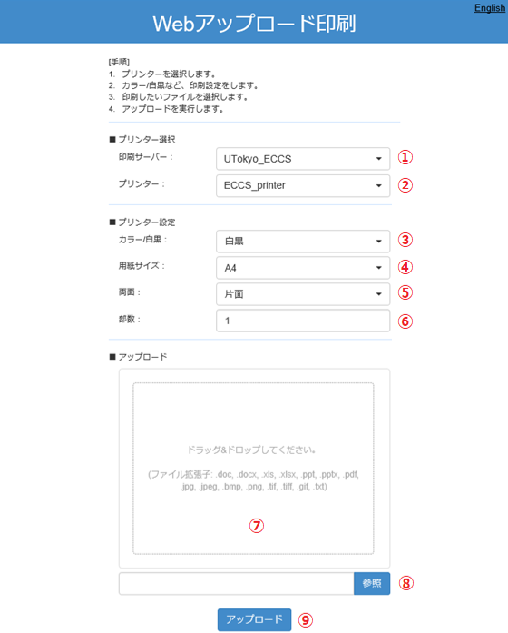
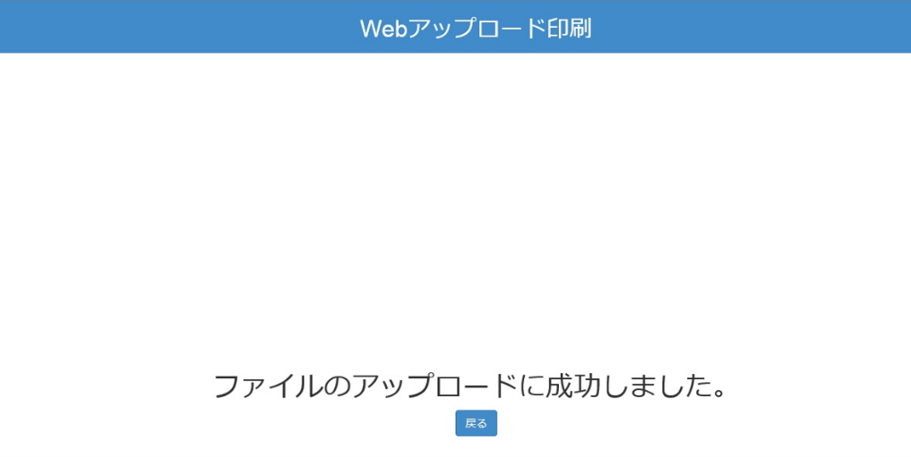
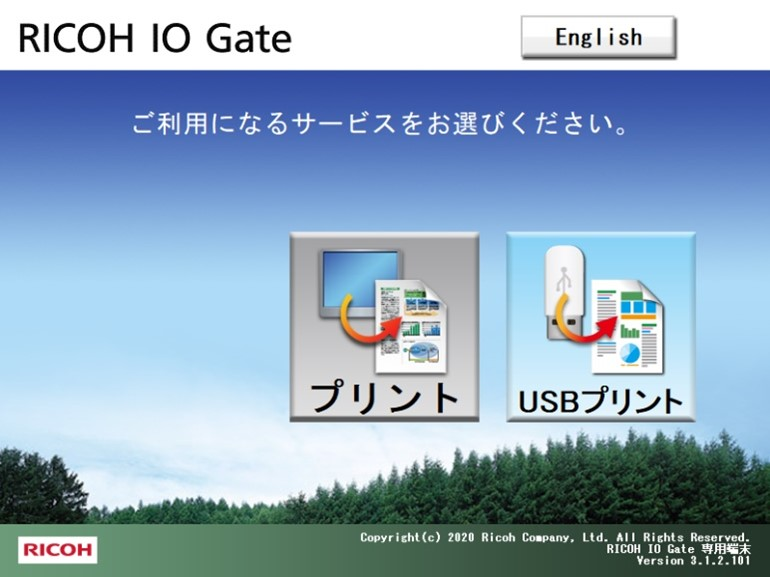

ECCS2021では，インターネットに接続した個人や研究室等のPC等から， Webアップロード印刷サイトに接続して，印刷したいデータをアップロードすることで，印刷をすることができます．

Webアップロード印刷サイトは，[RICOH IO Gateユーザーポータルサイト (print.ecc.u-tokyo.ac.jp)](https://print.ecc.u-tokyo.ac.jp/)です．
PC等へのドライバー導入等の事前設定は不要です．

## 手順1：Webアップロード印刷サイトでの印刷データのアップロード
1. Webブラウザで，[RICOH IO Gateユーザーポータルサイト (print.ecc.u-tokyo.ac.jp)](https://print.ecc.u-tokyo.ac.jp/)に接続してください．
   画面のメニューにある「Webアップロード印刷」をクリックしてください．
   {:.border}
2. 続けて，画面の「Web Upload Print」をクリックしてください．
   {:.border}
3. 認証画面が表示されますので，UTokyo Accountのユーザー名（数字10桁）とパスワードをそれぞれ入力してください．画像は，表示される画面の例（Windows10の場合）です．
   
4. Webアップロード印刷画面が表示されます．
   {:.border}
   - ①の印刷サーバー名および②のプリンター名は固定となり，変更できません．
   - ③，④，⑤，⑥に印刷条件を設定した後に，⑦のエリアに印刷データをドラッグ&ドロップしてください．ドラッグ&ドロップの代わりに⑧の参照ボタンをクリックして，ファイルを指定することもできます．
   - アップロード可能なデータ（拡張子）は，`.doc`，`.docx`，`.xls`，`.xlsx`，`.ppt`，`.pptx`，`.pdf`，`.jpg`，`.jpeg`，`.bmp`，`.png`，`.tif`，`.tiff`，`.gif`，`.txt`になります．
   - 一度にアップロードできるファイルは１ファイルになります．
  
      - アップロード可能なデータ（拡張子）は，`.doc`，`.docx`，`.xls`，`.xlsx`，`.ppt`，`.pptx`，`.pdf`，`.jpg`，`.jpeg`，`.bmp`，`.png`，`.tif`，`.tiff`，`.gif`，`.txt`になります．
## 手順2：印刷データのアップロードの結果確認
正しくアップロードできた場合は，以下の画面が表示されます．画面の「戻る」をクリックすると，再びWebアップロード画面に戻ります．Webアップロードをやめる場合はWebブラウザを閉じてください．
{:.border}

## 手順3：アップロードしたデータの印刷
アップロードしたデータは，印刷ジョブ操作機の「プリント」から印刷してください．
{:.border}