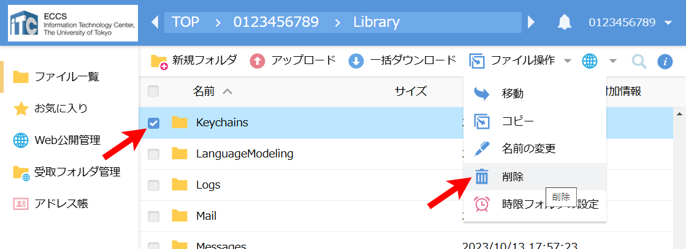

import ECCS2021Eol from "@components/ja/ECCS2021Eol.mdx";

<ECCS2021Eol />

## リモートアクセス環境について

ECCSでは，リモートアクセス環境を利用することにより，外部からECCS端末のMac環境とほぼ同様の環境を利用できます．リモートアクセス環境は，利用を申請すると専用のクライアントアプリから利用できるようになります．

ただし，通常のECCS端末のMac環境とは異なり，以下のような制約があります．

- ライセンス上の問題で，一部のアプリケーション（Microsoft Officeのアプリなど）が利用できません．
- 同時に利用できる人数は15人までです．
- 連続利用可能な時間は4時間です．4時間経過すると自動で切断されます．

## 準備

リモートアクセス環境を利用するには，以下の手順で申請と専用アプリのインストールが必要です．

### 利用申請

リモートアクセス環境を利用するためには，以下の手順で事前の申請が必要です．申請してから，リモートアクセスユーザとして実際に使えるようになるまでには，最大で1時間程度かかります．

なお，利用状況や申請時期にかかわらず，毎週月曜日の午前4時にリモートアクセスユーザの登録は全て削除されます．継続して利用する場合は，再度申請が必要です．

1. 以下のリンクからECCS利用者メニューを開いてください．

    <strong class="box center">

    [ECCS利用者メニュー](https://idm.ecc.u-tokyo.ac.jp/webmtn/)

    </strong>

1. 既にUTokyo Accountにサインイン済みの場合を除き，UTokyo Accountのサインイン画面が表示されるので，サインインしてください．
    

    
UTokyo Accountへのサインインが成功したにもかかわらず，ECCS利用者メニューに「ユーザーID・パスワードが不正です」と表示される場合

    初期パスワードを変更した直後の場合，その情報が連携されるまで最大で10分かかるため，10分ほど待ってからもう一度アクセスしてください．
    

1. 左側のメニューから，「ECCSリモートアクセス環境　利用申請」を選択してください．
    {:.small}
1. 「利用する」を選択して，「保存」を押してください．確認を求めるダイアログが表示されたら「OK」を押してください．
    {:.small}
1. 自動で申請が受理され，リモートアクセス環境を利用できる「リモートアクセスユーザ」として登録されます．
    - リモートアクセスユーザのライセンス数の上限に達した場合，申請は受理されず，エラーになります．

### クライアントアプリのインストール

リモートアクセス環境は専用アプリ（Splashtop Enterprise）を用いて接続しますので，以下の手順で接続元のOSにあったアプリをダウンロード，インストールしてください．なお，接続元のOSはmacOS，Windows，iOS，Androidに対応しています．

1. 以下のリンクから，Splashtop Enterpriseアプリのダウンロードページを開いてください．

    <strong class="box center">

    [Splashtop Enterprise ダウンロードページ](https://support-splashtoponprem.splashtop.com/hc/ja/sections/203018026-Splashtop-Enterprise-App)

    </strong>
1. 接続元のOSにあったリンクを押してください．
    - OSによっては複数のバージョンがある場合がありますが，最新のものを選択してください．
1. ダウンロードページの指示に従って，専用アプリをダウンロード，インストールしてください．

## 接続

リモートアクセス環境へは，専用アプリ（Splashtop Enterprise）から接続します．ここでは、Windowsのアプリを例に説明します．

1. Splashtop Enterpriseを起動してください．
1. 以下の情報を入力し，「ログイン」を押してください．
    - Splashtop Center：`ras2.ecc.u-tokyo.ac.jp`
    - メールアドレス：UTokyo Account（例：`0123456789@utac.u-tokyo.ac.jp`）
    - パスワード：UTokyo Accountのパスワード

    {:.small}
1. ログインに成功すると，接続先を選択する画面が表示されます．「ECCS2021」を選択してください．
    - サーバが混雑している場合，数分かかることがあります．

    {:.small}
1. Mac環境のログイン画面が表示されます．通常のECCS端末と同様に，共通ID（UTokyo Accountの先頭10桁の数字のみの部分）とUTokyo Accountのパスワードでログインして利用してください．
    - 接続元のデバイスで利用しているキーボードが正しく判別されず，パスワード中の記号が正しく入力できない場合があります．入力される記号を「名前」欄で確認したうえで，「パスワードを入力」欄に入力してください．

    {:.small}

### キーチェーン（Keychain）に関するメッセージが表示された場合

Mac環境にログインする画面で，キーチェーンに関するメッセージが表示されることがあります．この場合，以下の方法に従って，キーチェーンの関連ファイルを削除することで，メッセージが表示されなくなります．

1. WebDAV環境のMac環境にログインしてください（詳しくは「[WebDAV環境を利用する](/eccs/features/webdav/)」を参照してください）．
1. WebDAV環境上で，ディレクトリ`<共通ID（UTokyo Accountの先頭10桁の数字のみの部分）>/Library/Keychains`を選択し，削除してください．
    {:.medium}
