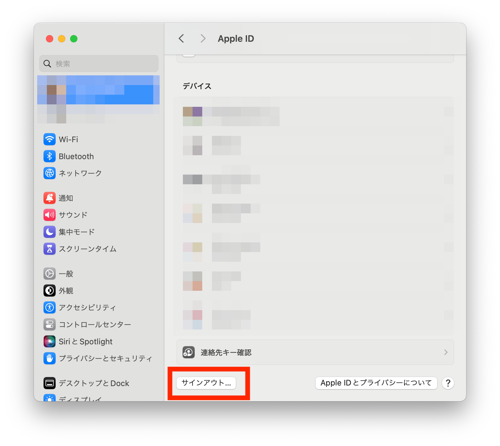

ECCS端末のMac環境には，Apple IDでのサインインが必要なソフトウェア（App Store，ミュージックなど）がインストールされています．ECCS端末にてそれらのソフトウェアを利用する場合，思わぬ不具合が発生する可能性が否定できないため，情報基盤センターでは利用を推奨しておりません．

特段の事情等により上記ソフトウェアを利用する場合は，ECCS端末の利用を終了する前に，必ずApple IDのサインアウトを行ってください．サインアウトを行う際は以下の画像のように，画面左上のAppleメニューから「システム設定」を選択後，「Apple ID」>「概要」>「サインアウト」の順にクリックしてください．

Apple IDのサインアウトを行わなかった場合は，お使いのApple IDに紐づく信頼できるデバイス情報として，ECCS端末の情報が登録されてしまいます．Apple IDのサインアウトを忘れてしまった際は，ご自身のiPhoneやMac，あるいはECCS端末を用いて，Apple IDからECCS端末のデバイス情報の削除を行ってください．削除方法について，詳しくは「[ECCS端末のMac環境でApple IDを使用する場合の注意事項-詳細
](https://docs.google.com/document/d/e/2PACX-1vRi7HLSnl5y_I5UokJC6VhymKOafvZDv6Dmmumntp9ezlN4aHuuYRSeZ2UI6BYgUY0e5brVsMeS5kj7/pub)」を参照してください．