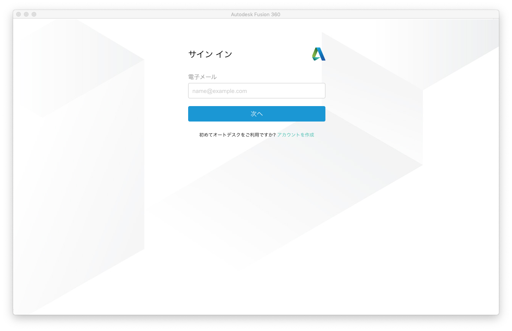
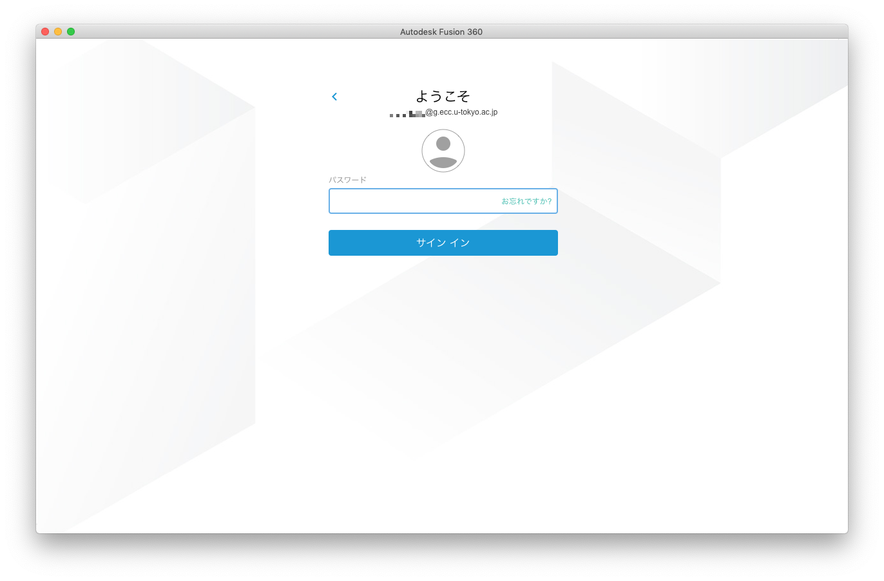
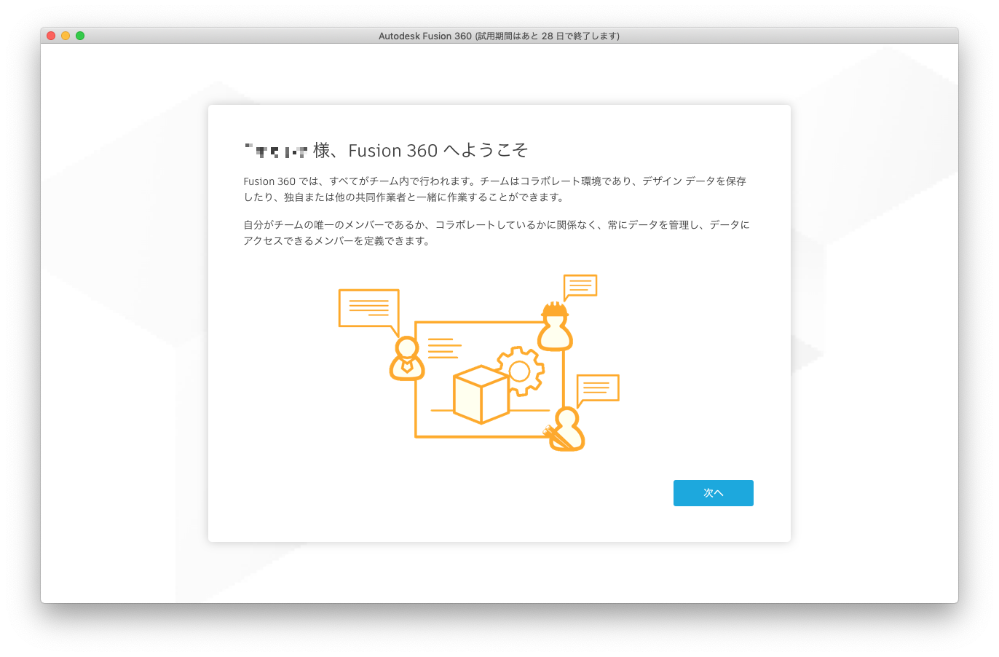
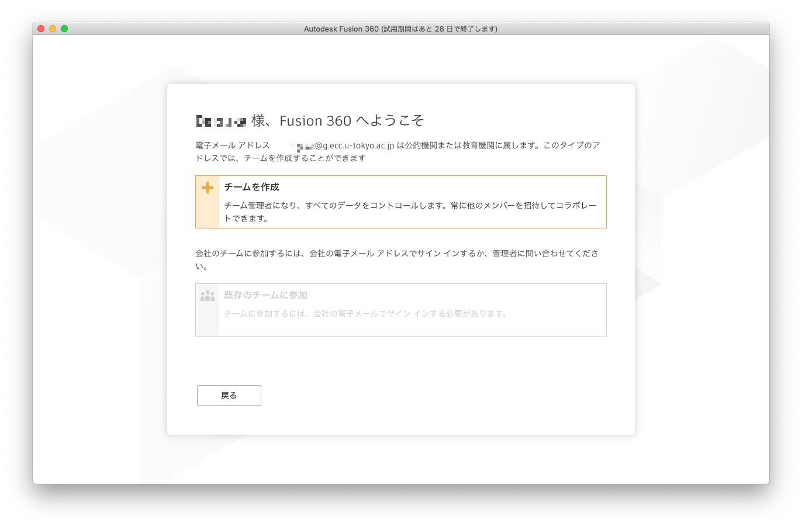
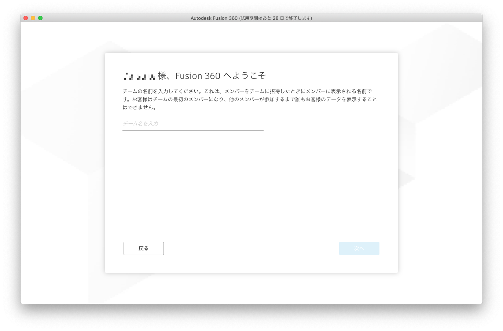
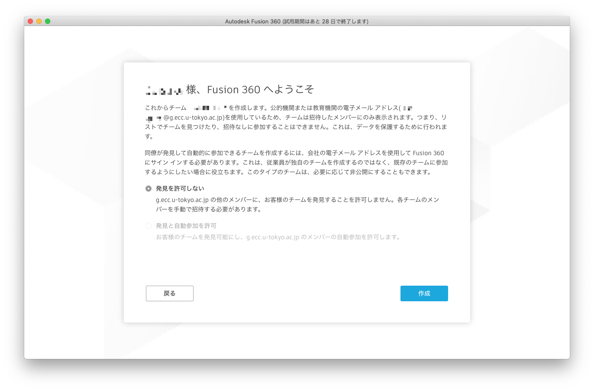
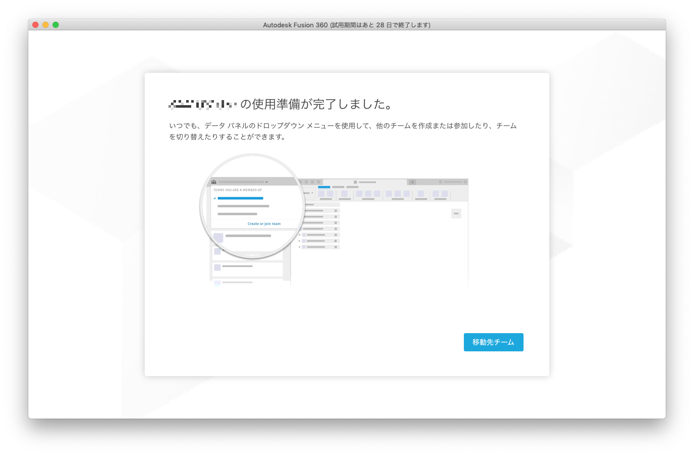
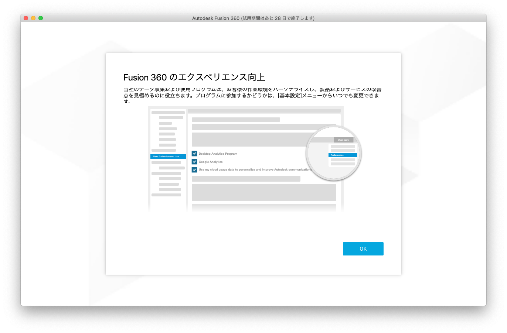

   
更新: 2022年12月09日

   
作成: 2020年10月01日

ECCS端末のMac環境では，3D CAD/CAM/CAE/PCB統合ソフトウェアであるFusion 360(Autodesk Fusion)を利用できます．利用に際しては，事前準備が必要なほか，いくつか注意点があります．

## 事前準備

Fusion 360の起動時に，Autodeskアカウントでの認証が必要になりますので，利用前にAutodeskアカウントを作成する必要があります．
なお，アカウント作成時に登録するメールアドレスは，ECCSクラウドメールのアドレス(`@g.ecc.u-tokyo.ac.jp` で終わるもの)としてください．

Autodeskアカウントの作成の手順は[こちら](https://knowledge.autodesk.com/ja/customer-service/account-management/account-profile/create-autodesk-account)を参照してください．

## 初回利用時の起動手順

1. Fusion360を起動してください．
2. Autodeskアカウント作成時に登録したメールアドレス(ECCSクラウドメールのアドレス)を入力し，「次へ」をクリックしてください．
   
3. Autodeskアカウント作成時に設定したパスワードを入力し，「サイン イン」をクリックしてください．
   
4. 「次へ」をクリックしてください．
   
5. 「チームを作成」をクリックしてください．
   
   - チームとは，データの格納場所のようなイメージです．
6. 任意のチーム名を入力し，「次へ」をクリックしてください．
   
7. 「作成」をクリックしてください．チームが作成されます．
   - チームが作成されるとECCSクラウドメールアドレスにメールが届きますが，特に何もする必要はありません．
   
8. 「移動先チーム」をクリックしてください．
   
9.  「OK」をクリックしてください．
   

## アプリケーション終了時の注意点

Fusion360の終了時に，以下のように「Fusion360 エラーレポート」が表示された場合は，ウィンドウ左上の「閉じる」ボタン（赤い丸ボタン）をクリックしてください．

## ソフトウェアのバージョン違いに関する注意点

ECCS2021のアプリケーションの運用においては，授業での使用状況や更新のタイミングにより，必ずしもバージョンが最新ではなく，最新のバージョンと差があり得ます．ECCSのMac環境にインストールされているFusion 360も，例外ではありません．そのため，個人のPC等にインストールされている最新バージョンのFusion 360で作成したファイルを，ECCS端末にインストールされたFusion 360で読み込もうとした場合，エラーが表示され読み込めないことがあります．

最新バージョンのFusion 360で作成されたファイルを，ECCS2021のMac環境で利用するには，以下の2つの方法があります．

- ウェブブラウザ版を利用する．
- 最新版のFusion 360を自分で[ダウンロードページ](https://manage.autodesk.com/products)からダウンロード・インストールして利用する．
  - ただしこの場合，インストール先が `/tmp` となるため，端末にログインするたびにインストールが必要です．

ご利用中のみなさまにはご不便をおかけしますが，ご理解頂けるようお願い致します.

