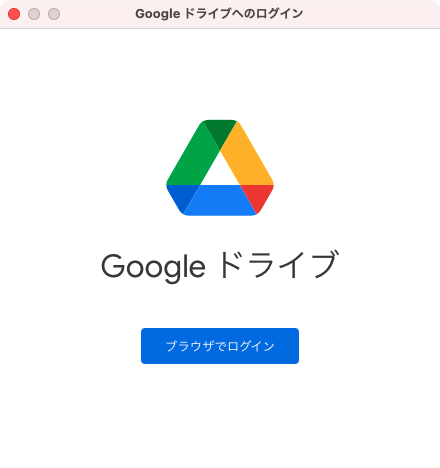
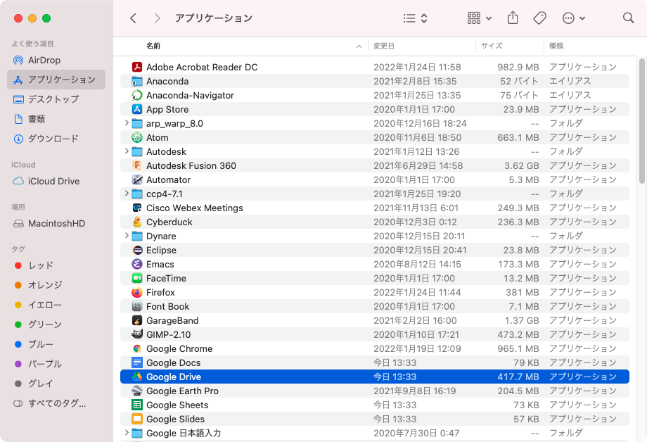
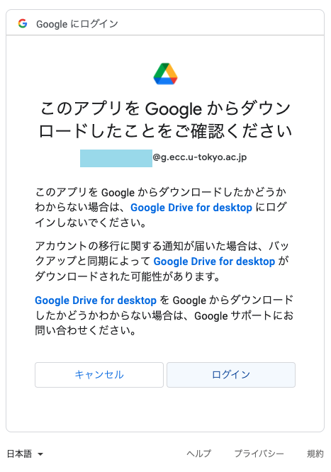
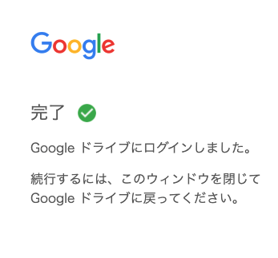
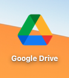
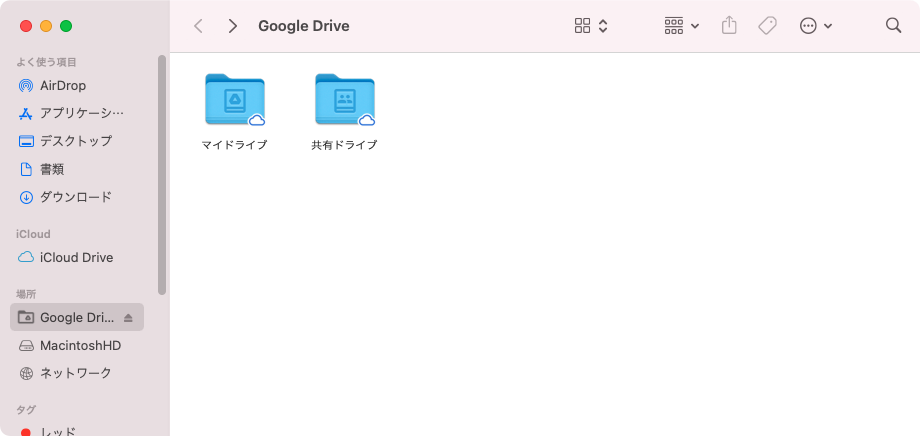
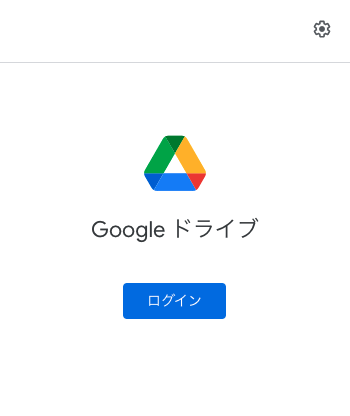
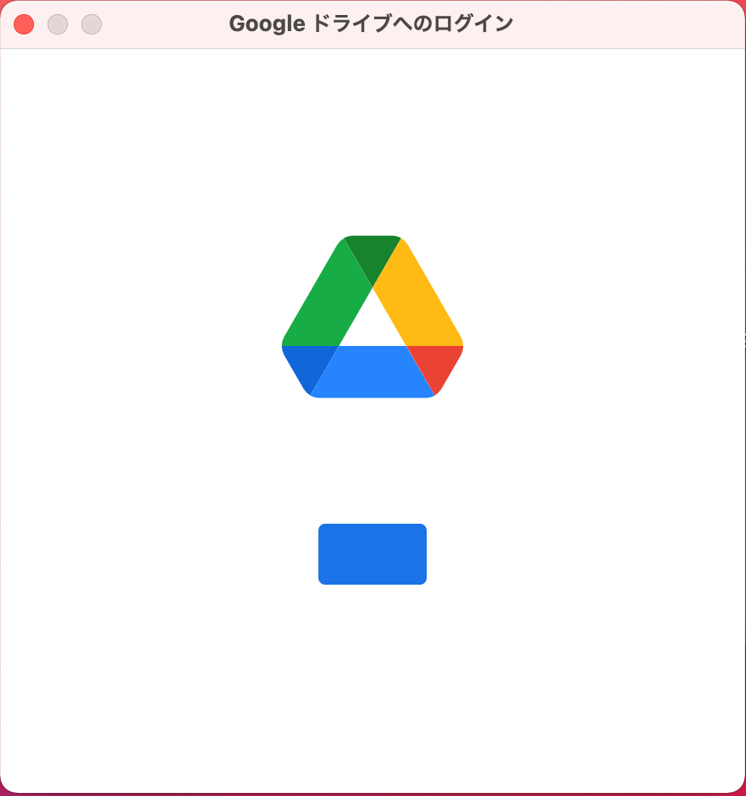
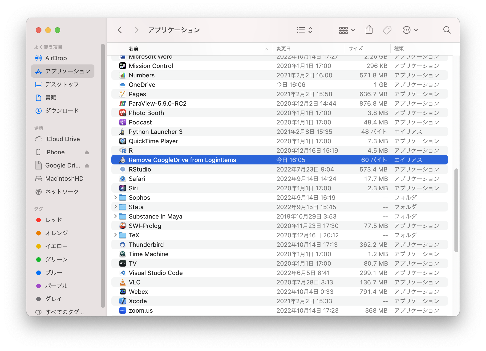
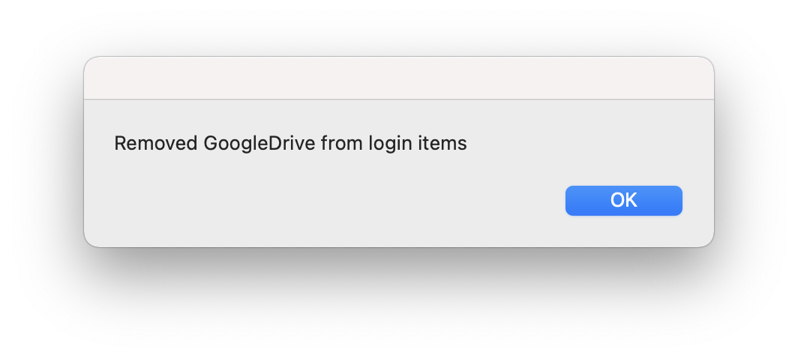

ECCS端末のMac環境では，Finder上でファイルやフォルダを操作するのとほぼ同様の感覚でGoogleドライブ上のファイルやフォルダを操作するためのアプリケーションを利用できます．このページではその使用方法を案内します．Windows環境では利用できません．

## 使用手順

1. 以下のウィンドウが表示されている場合は，ウィンドウ内の「ブラウザでログイン」をクリックしてください．
   {:.border}
   上のウィンドウが表示されない場合は，Finderで「アプリケーション」の中の「Google Drive」をクリックしてください．
   
2. Webブラウザが起動して「Googleにログイン」の画面が開くので，ECCSクラウドメールアドレス（`@g.ecc.u-tokyo.ac.jp`のメールアドレス）でログインしてください．
   以下の画面に切り替わったら「ログイン」をクリックしてください．
   {:.border}
3. 以下の画面が表示されたらログイン成功です．
   {:.border}
4. ログイン中はデスクトップに下記のアイコンが表示されます．
   

   また，Finderの「場所」の中に「Google Drive」が追加されます．
   クリックすると以下のように各自のGoogleドライブの内容が表示され，アクセスが可能になります．PC内のファイルと同様にGoogleドライブのファイル操作ができます．
   

## 補足

- 画面上部のメニューバーの中にあるGoogle Driveのシンボルマークがグレーアウトしているとき，
  
  そのマークをクリックすると以下のウィンドウが表示されます．こちらからGoogleドライブにログインすることもできます．
  {:.border}
- 以下のウィンドウが表示されてGoogleドライブにログインできない場合は，Mac環境への再ログインをお試しください．
  {:.small}
- Google Driveアプリケーションを一度使用すると，次回のログインからGoogle Driveアプリケーションが自動起動し，毎回Googleドライブへのログインを求められます．（上の1.にある「Googleドライブへのログイン」ウィンドウが表示されます．）以下の手順で自動起動を止めることができます．
  1. Finderを起動し，「アプリケーション」の中の「Remove GoogleDrive from LoginItems」をクリックしてください．
    
  2. 以下のウィンドウが表示されたら，「OK」をクリックしてください．（Google Driveアプリケーションが自動起動する状態でない場合は，このウィンドウは表示されません．）
    
