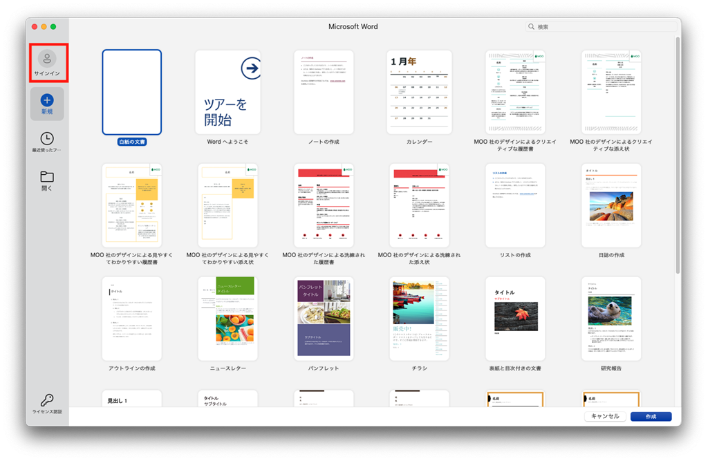
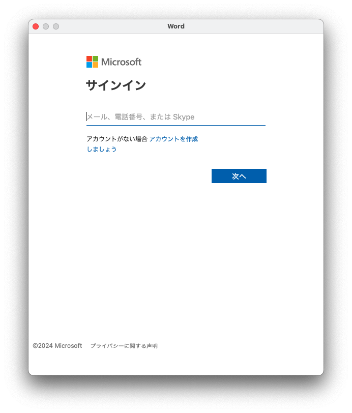
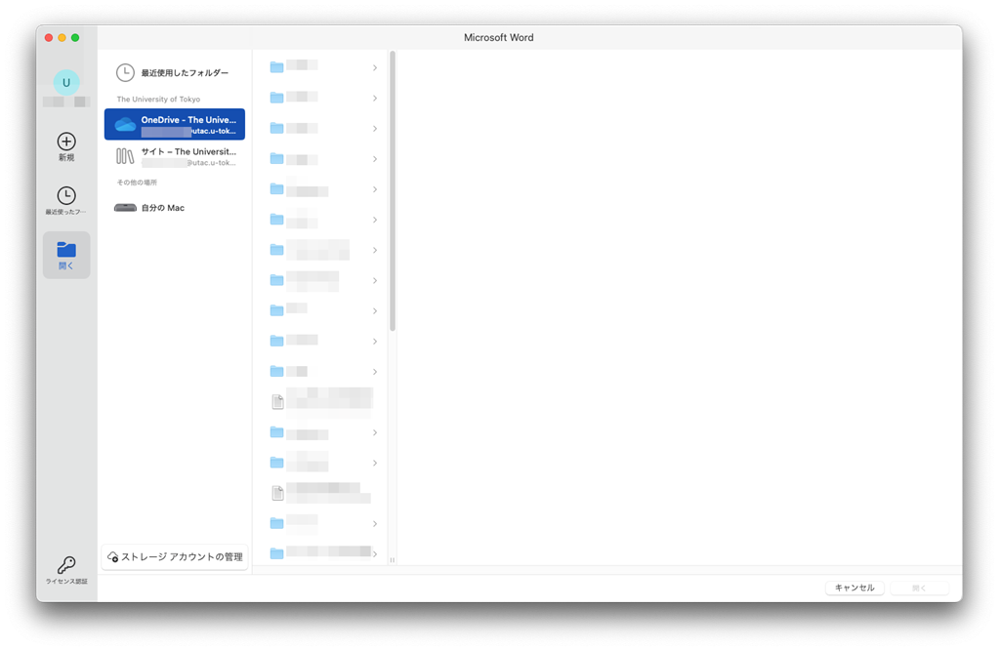
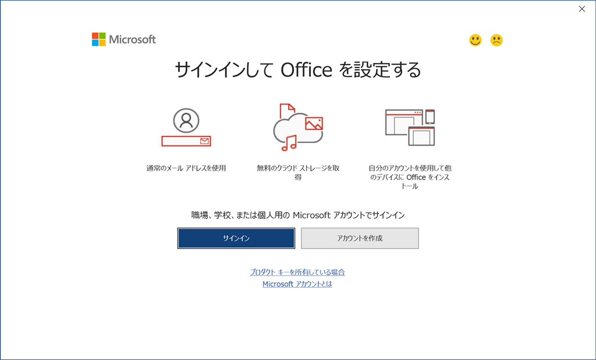
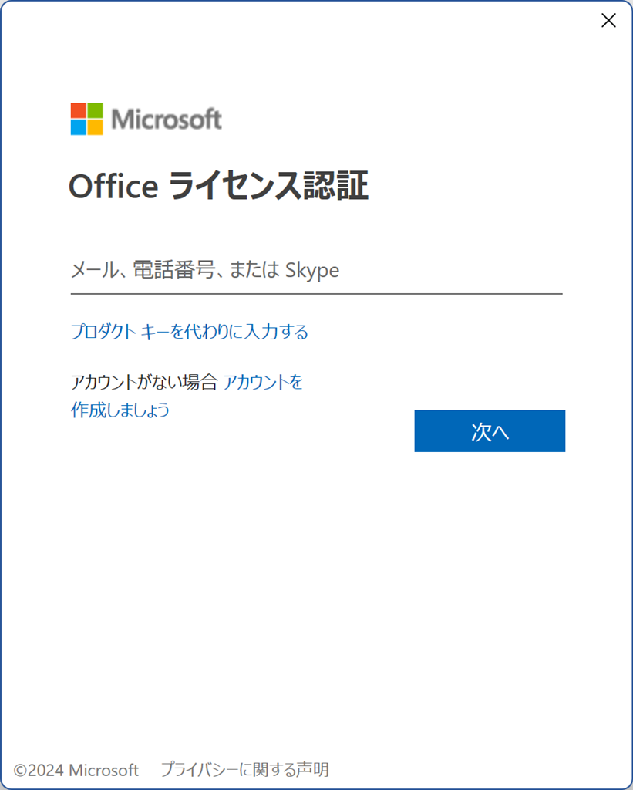
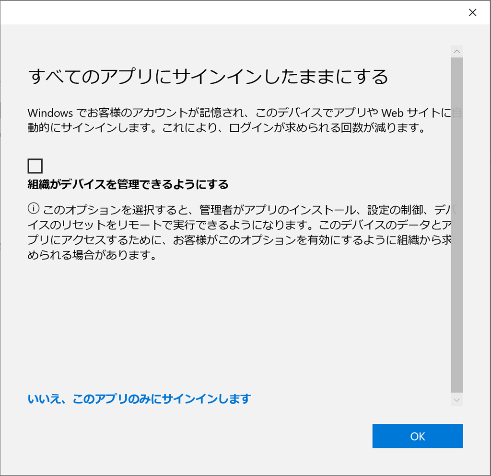
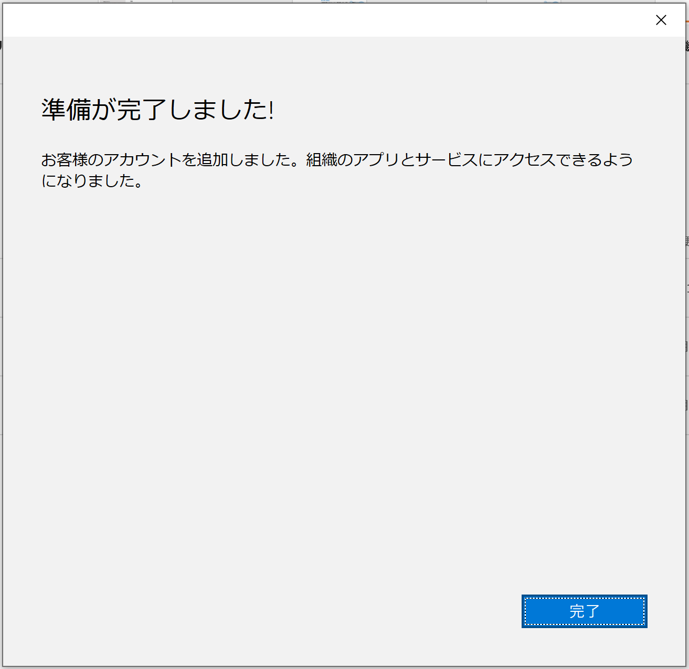
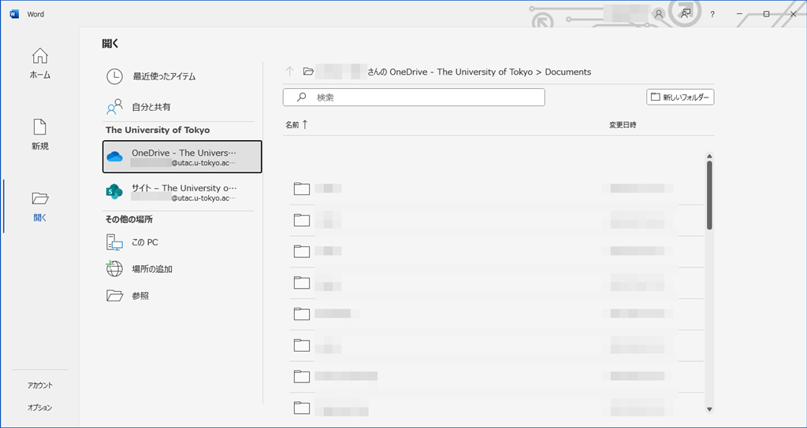
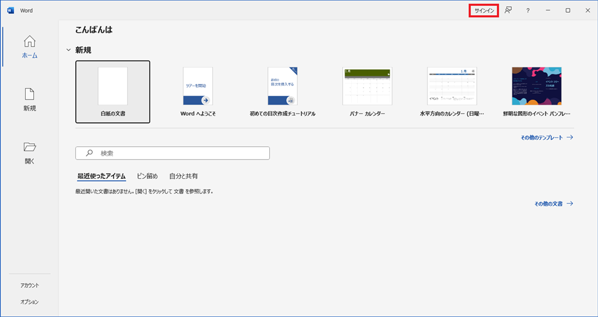

ECCS端末のMac環境・Windows環境には，いずれにもOfficeアプリがインストールされていますが，利用方法には違いがあります．このページでは，それぞれの環境での利用方法について説明します．

なお，ECCS端末でWeb版Officeを利用する方法は，一般的な場合と同じです．詳しくは，UTokyo Micorsoft Licenseのページの「[Web版Office](https://utelecon.adm.u-tokyo.ac.jp/microsoft/#office_web)」を参照してください．

## Mac環境の場合

Mac環境のOfficeアプリでは，利用に際してライセンス認証のための操作は不要です．Officeアプリを起動後そのまま利用できます．

ただし，OneDrive上に保存されたのファイルをOfficeアプリで利用したり，Officeアプリで作成したファイルをOneDrive上に自動的に保存したりするためには，以下の手順に従ってサインインする必要があります．

### サインイン方法

1. ECCS端末のMac環境で，Word，Excel，PowerPoint等いずれかのOfficeアプリを起動してください．
2. スタート画面左上の「サインイン」をクリックしてください．
   
3. サインイン画面が現れるので，UTokyo Accountでサインインしてください．
   - サインイン画面には，`0123456789@utac.u-tokyo.ac.jp`のように，10桁の共通ID（UTokyo Accountのユーザ名）の後に東京大学であることを表す記号`@utac.u-tokyo.ac.jp`を付けたものを入力してください．
   

4. サインインが完了すると，スタート画面右上にあなたの氏名が表示されます．OneDrive上に保存されたファイルを利用したい場合は，スタート画面右側の「開く」からアクセスできます．
   

## Windows環境の場合

Windows環境のOfficeアプリでは，UTokyo Accountでサインインしてライセンス認証を行う必要があります．下の手順に沿ってライセンス認証を行ってください．一度ライセンス認証を行うと，30日間はライセンス認証を求められません．

なお，[UTokyo Microsoft LicenseのもとでPCにインストールして利用するOfficeアプリは，最大5台のPCにしかインストールできません](/microsoft/install)が，ECCS端末はこの台数制限にはカウントされません．

また，UTokyo Accountでライセンス認証を行うことにより，[UTokyo Accountで利用するOneDrive](/microsoft/onedrive/)の機能をOfficeアプリ上で利用できます．下の手順に沿って利用してください．ただし，ECCS端末にログインするたびに改めてUTokyo Accountでサインインする必要があります．

### ライセンス認証の手順

1. ECCS端末のWindows環境で，Word，Excel，PowerPoint等いずれかのOfficeアプリを起動してください．ライセンス認証を求めるウィンドウが表示されたら「サインイン」をクリックしてください．
   
2. 「Officeライセンス認証」の画面が表示されます．UTokyo Accountでサインインしてください．
   - サインイン画面には，`0123456789@utac.u-tokyo.ac.jp`のように，10桁の共通ID（UTokyo Accountのユーザ名）の後に東京大学であることを表す記号`@utac.u-tokyo.ac.jp`を付けたものを入力してください．
   

3. サインインが完了すると，「すべてのアプリにサインインしたままにする」というダイアログが表示されることがあります．ここでの設定内容によっては，Officeアプリの利用中にエラーメッセージが発生しうることが確認されています．これを防ぐため，「組織がデバイスを管理できるようにする」の**チェックを外し**て「OK」をクリックしてください．
   
4. ライセンス認証が完了すると「準備が完了しました」の画面が表示されます．「完了」をクリックしてください．
   

なお，ライセンス認証後，画面右上に「！」マークが出ることがありますが，使用には問題ありません．
{:.border}

### OneDriveの機能をOfficeアプリ上で利用する手順

OneDrive上に保存されたファイルは，ライセンス認証を行った後に，スタート画面右側の「開く」から利用できます．

直前にライセンス認証を行っていない場合は，画面左上の「サインイン」をクリックして，UTokyo Accountへサインインしてください．その後，スタート画面右側の「開く」から利用できます．
