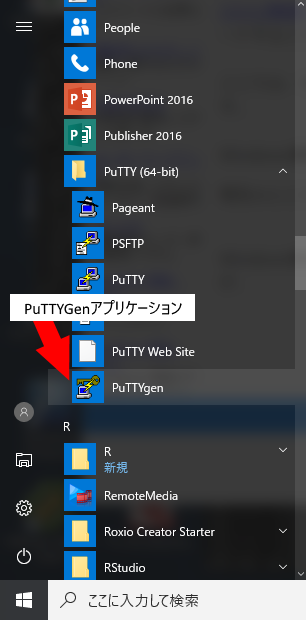
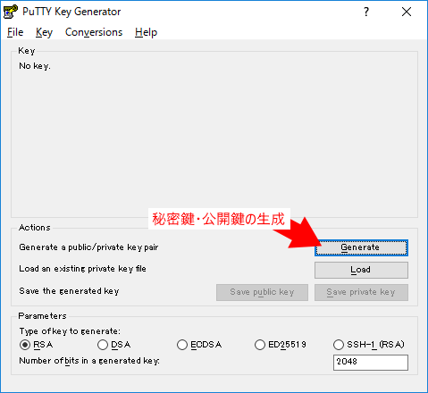
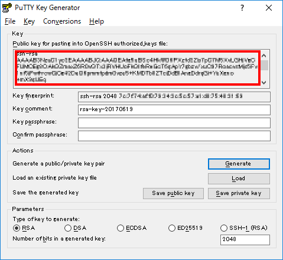
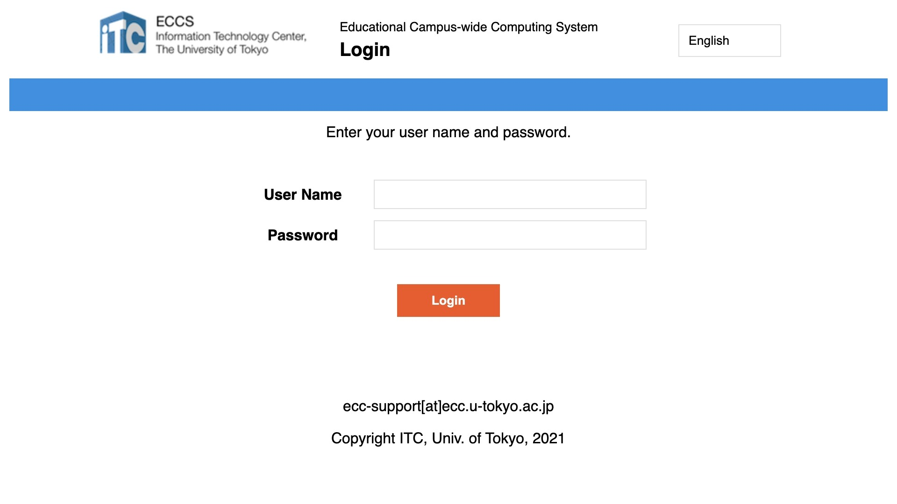
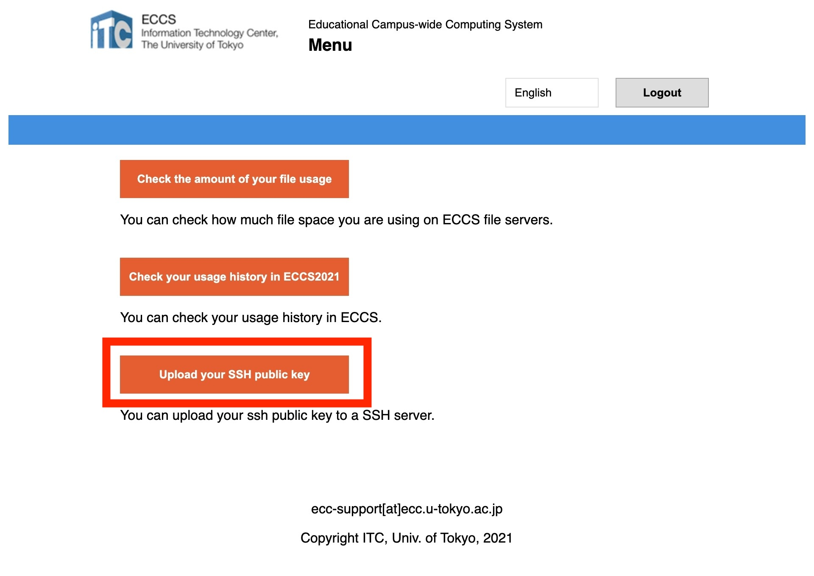
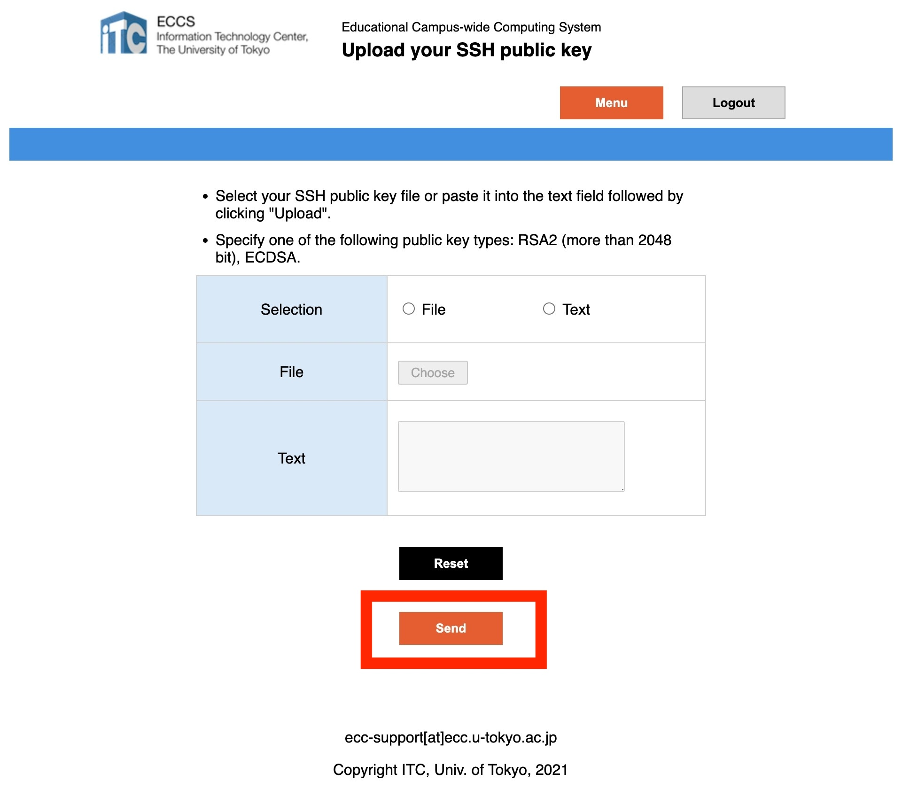

import WwweccEol from "@components/ja/WwweccEol.astro";

<WwweccEol systemName="ECCS端末"/>

## ECCSで提供されているSSHサーバについて

ECCSでは，遠隔からSecure Shell（SSH）でログインしてコマンドラインでMac環境を利用するための，SSHサーバを提供しています．操作できるのはMac環境のみですが，Windows環境に保存されているファイルも利用可能です．

SSHサーバは3台あり，それぞれのホスト名は次のとおりです．なお，これらのSSHサーバは毎日早朝に再起動されます．

- `ssh01.ecc.u-tokyo.ac.jp`
- `ssh02.ecc.u-tokyo.ac.jp`
- `ssh03.ecc.u-tokyo.ac.jp`

SSHサーバを利用するには，このページに記載の方法を参考にしてください．

## 利用方法

ECCSのSSHサーバは公開鍵認証によってのみ接続できます．利用に先立ち，お好きな方法で鍵ペアを作成して，公開鍵をサーバにアップロードしておく必要があります．

### 準備1：適切な形式の鍵ペアを作成する

まず，公開鍵認証のために必要な秘密鍵と公開鍵のペアを作成してください．公開鍵はOpenSSH形式で，かつ，以下のアルゴリズムのいずれかである必要があります．

- RSA2（2048bit以上）
- ECDSA（256bit以上）
- ED25519

鍵ペアを作成する方法は，いくつかあります．ここでは，OpenSSHを使う方法とPuTTYGenを使う方法を紹介します．OpenSSHが利用できる環境では，前者がおすすめです．PuTTYGenを利用する場合，「Save public key」で保存した公開鍵は，RFC4716形式となり，利用できないので注意してください．

なお，鍵ペアを既に持っている場合は，それを利用しても問題ありません．ただし，RFC4716形式で持っている公開鍵を登録したい場合は，以下に述べる方法でOpenSSH形式に変換してください．

#### OpenSSHを使う方法

OpenSSHでED25519の鍵を生成する場合を例に説明します．

1. Macの場合はターミナルを，Windowsの場合はコマンドプロンプトまたはPowerShellをを起動してください．
2. コマンド`ssh-keygen -t ed25519`を実行してください．
3. 鍵ファイルの保存先を指定してください．カッコ内に表示されているのがデフォルトの保存先です．既にデフォルトの保存先に他の鍵が存在したり，他の場所に保存したかったりする場合は，保存先のパスを入力してEnterキーを押してください．何も入力せずにEnterキーを押すとデフォルトの保存先に保存されます．
4. 鍵を保護するためのパスフレーズを聞かれます．パスフレーズを考えて入力したあとEnterキーを押してください．何も入力しなくても構いませんが，鍵は保護されません．
5. パスフレーズを再度入力してEnterキーを押してください．
6. 鍵が生成され，3で指定した保存先に保存されます．

#### PuTTYGenを使う方法

PuTTYGenで鍵ペアを生成する際にその場で表示される公開鍵は，OpenSSH形式なのでそのまま利用できます．しかし，「Save public key」で保存した公開鍵は，RFC4716形式で利用できません．このことに注意して，PuTTYGenを使って鍵ペアを作成する方法を説明します．

1. PuTTYGenを起動してください．
   
2. 「Generate」を選択して，鍵ペアを生成してください．
   
3. 生成が完了すると以下の画面になります．この画面の赤枠がOpenSSH形式の公開鍵です．この内容をファイルに保存するか，コピーしてください．この公開鍵をアップロードはアップロードできます．
   
4. 「Save private key」を選択してください．保存先を選んで，秘密鍵を保存してください．

#### RFC4716形式の鍵をOpenSSH形式に変換す方法

1. Macの場合はターミナルを，Windowsの場合はコマンドプロンプトまたはPowerShellをを起動してください．
2. RFC4716形式の鍵ファイルを指定した以下のコマンドを実行します．ここでは，RFC4716形式の鍵ファイルのパスがrfc4716.pubだとします．実際のパスに書き換えて利用してください．

   `ssh-keygen -i -m RFC4716 -f rfc4716.pub`
3. コマンドの出力がOpenSSH形式の公開鍵です．ファイルに保存するか，コピーしてください．

### 準備2. 公開鍵を登録する

公開鍵は，Mac環境のホームディレクトリ内の`~/.ssh/authorized_keys`に配置する必要があります．ここでは，ECCSポータルの「公開鍵アップロード」を利用する方法を説明します．WebDAV等を利用して，公開鍵を登録することもできます．

1. [ECCSポータル](https://portal.ecc.u-tokyo.ac.jp/)にアクセスしてください．
2. UTokyo Accountのユーザー名（共通ID10桁）とパスワードを入力してください．
   {:.border}{:.medium}
3. 「Upload your SSH public key」もしくは「SSHサーバ公開鍵アップロード」を選択してください．
   {:.border}{:.medium}
4. 公開鍵のファイルをアップロードするか，その内容を貼り付けて，「Send」もしくは「送信」を選択してください．
   {:.border}{:.medium}

### SSHサーバへ接続する

SSHクライアントを利用して，SSHサーバへ接続します．ここでは，OpenSSHクライアントを利用する方法を説明しますが，その他のSSHクライアントも利用できます．SSHサーバは複数の利用者で共有して利用しますので，後述する方法で利用者の少ないサーバを選ぶようにしてください．

1. Macの場合はターミナルを，Windowsの場合はコマンドプロンプトまたはPowerShellをを起動してください．
2. UTokyo Accountのユーザー名と接続するSSHサーバのホスト名を指定した以下のコマンドを実行してください．
   - `ssh01.ecc.u-tokyo.ac.jp`に接続する場合

     `ssh 0123456789@ssh01.ecc.u-tokyo.ac.jp`
   - 秘密鍵がデフォルト（`~/.ssh/id_rsa`，`~/.ssh/id_ecdsa`，`~/.ssh/id_ed25519`）以外の場所にある場合：秘密鍵の場所も指定してください．

     例：`ssh -i ~/privatekey.txt 0123456789@ssh01.ecc.u-tokyo.ac.jp`

3. 初めて接続する際には，接続先のサーバの真正性を確かめる必要があります．サーバの公開鍵の指紋が以下のいずれかと一致することを確認してください．
   - ECDSA（256 bits）
     - MD5：`ba:e1:1a:a1:e8:d6:1c:43:7e:a3:6f:ac:40:a6:85:b6`
     - SHA-256：`4fUNtKacYcAKwPoQ9Npm3+1NNRNMLnajvSQUKiGUJ74`
   - ED25519（256 bits）
     - MD5：`3c:99:d2:36:83:4a:56:68:d3:eb:e2:34:09:7e:b4:d8`
     - SHA-256：`i/xDU9i5ouZj17oAgZ3TkI5ismNbkhY1csRRAlYXcIk`
   - RSA（3072 bits）
     - MD5：`9b:34:89:3c:26:02:0b:ca:2c:c1:3b:58:0e:b7:40:da`
     - SHA-256：`vZVvk2WD4hjbXjp6E3pXMu+DMKs573a85+d72xdXoVQ`
4. 指紋を確認して`yes`と入力すると，サーバの公開鍵の指紋が接続元のパソコンに登録されます．これでSSHサーバに接続され，ECCSのMac環境が使えるようになります．

#### 利用者の少ないSSHサーバを選ぶ方法

利用者の少ないSSHサーバを選ぶために，各SSHサーバで同時に接続している利用者の人数を確かめるには，各SSHサーバに接続したあと，`uptime`コマンドを実行してください．

コマンドの出力に表示される「(数字) users」の数字がそのSSHサーバに同時に接続している利用者の数です．

### Windows環境のホームディレクトリの参照方法

SSHサーバにログインした直後は，Mac環境内のファイルのみが利用できます．Windows環境内のファイルを利用したい場合は，SSHサーバで`Windows_mount.sh`コマンドを実行してください． パスワードの入力を求められるので，UTokyo Accountのパスワードを入力してください．

このコマンドにより，Windows環境のホームディレクトリが`~/mnt`以下に，読み書き可能な形でマウントされます．この仕組みを利用すると，WebDAVを利用せずに，Mac環境とWIndows環境の間でファイルをやり取りすることができます．

SSHサーバが早朝に再起動されるまでWIndows環境のホームディレクトリはマウントされた状態になります．