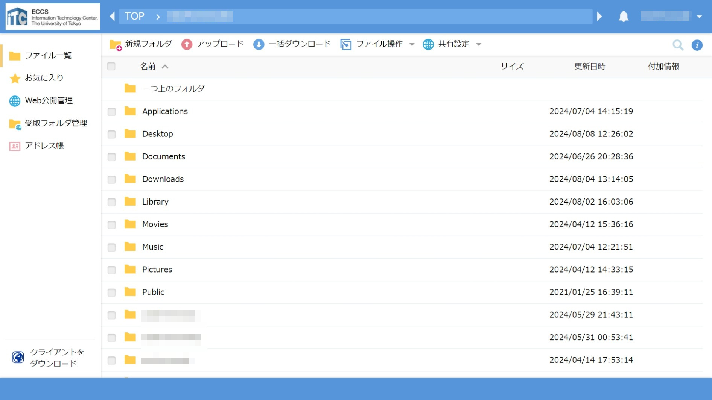
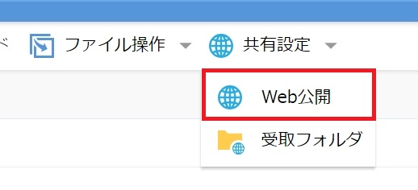
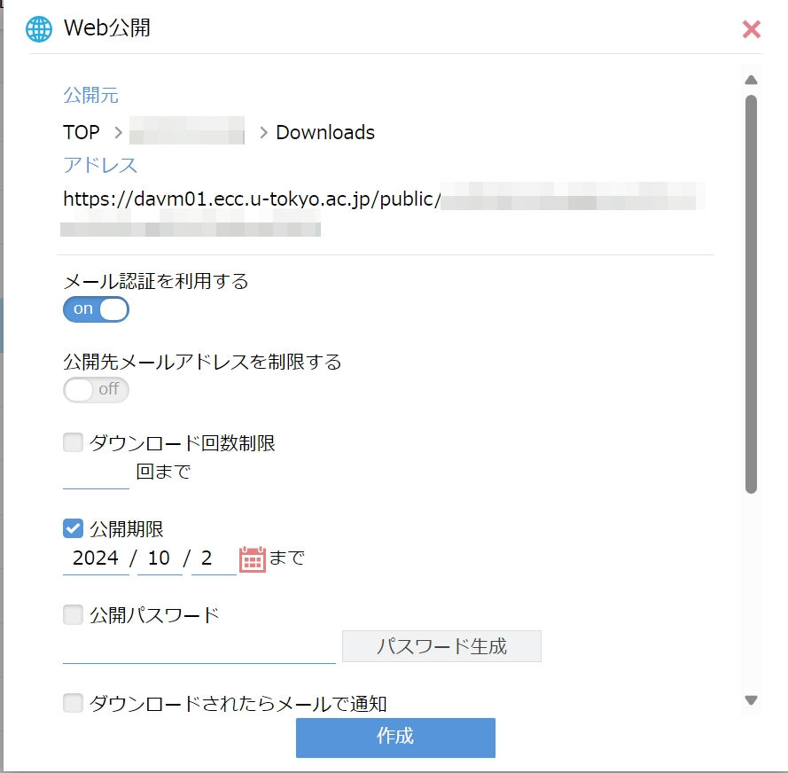
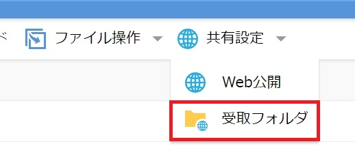
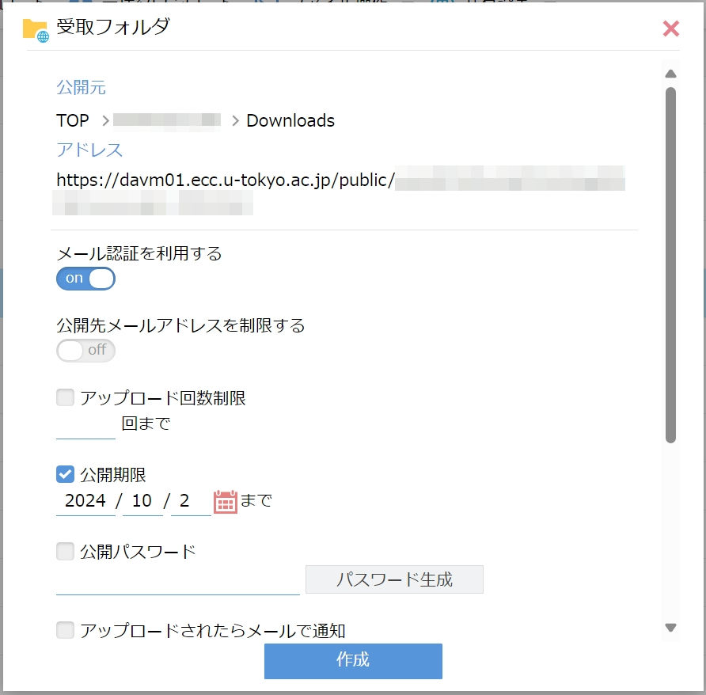
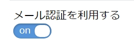
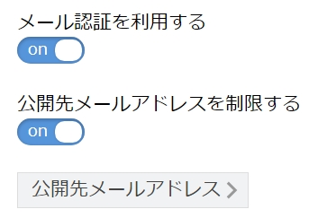
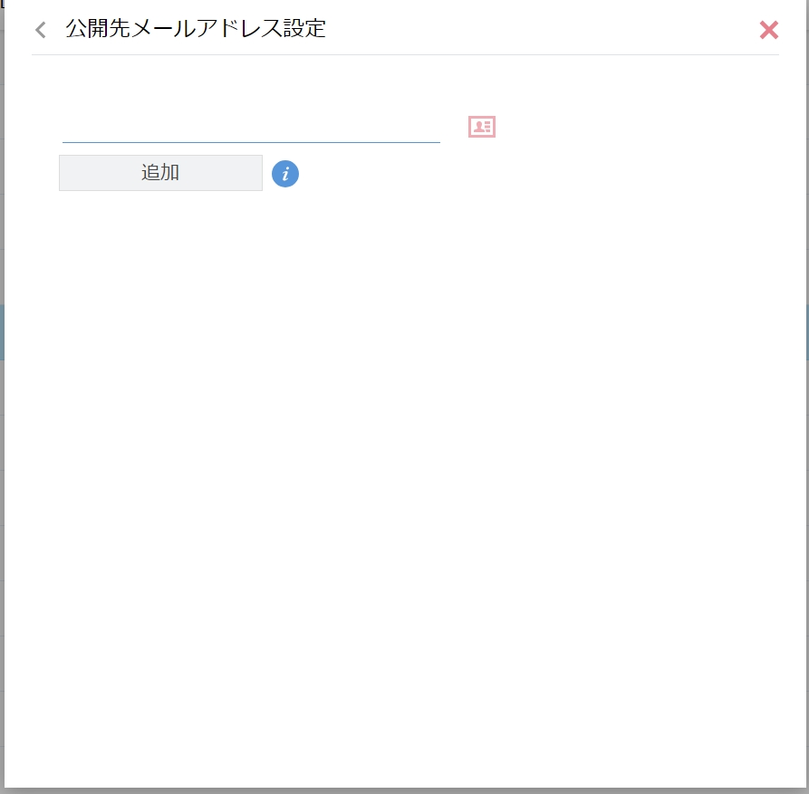

import WwweccEol from "@components/ja/WwweccEol.astro";

<WwweccEol systemName="ECCS端末"/>

外部からECCS端末上のファイルを利用したり，ホームディレクトリが独立であるMac環境とWindows環境の間でファイルをやりとりしたりするための仕組みとして，WebDAV環境が提供されています．WebDAV環境の利用にはECCS利用権が必要です．

このページでは，WebブラウザでWebDAV環境を利用する方法を説明します．

なお，MacのFinderはWebDAVクライアントとしての機能がありますが，「サーバーへ接続」からWebDAV環境に接続すると不具合が起こりますので，WebブラウザやCyberduck等のアプリを利用して接続してください．

## 基本的な利用方法

1. 利用したいファイルのある環境のサーバ（各環境2台ずつのいずれか）にアクセスしてください．なお，Mac環境の2台で利用できるファイルと，Windows環境の2台で利用できるファイルはそれぞれ同一です．
   - Mac環境
     - [https://davm01.ecc.u-tokyo.ac.jp/](https://davm01.ecc.u-tokyo.ac.jp/)
     - [https://davm02.ecc.u-tokyo.ac.jp/](https://davm02.ecc.u-tokyo.ac.jp/)
   - Windows環境
     - [https://davw03.ecc.u-tokyo.ac.jp/](https://davw03.ecc.u-tokyo.ac.jp/)
     - [https://davw04.ecc.u-tokyo.ac.jp/](https://davw04.ecc.u-tokyo.ac.jp/)
2. 既にサインイン済みの場合を除き，UTokyo Accountのサインイン画面が表示されるので，UTokyo Accountでサインインしてください．
3. 選択した環境のファイルが表示されます．表示されているフォルダを選択すると，そのフォルダの内容が表示されます．
4. 操作するフォルダやファイルは，それぞれの左側にあるチェックボックスで選択できます．新しいフォルダを作成したり，ファイルをアップロード・ダウンロードしたりするには，ファイル一覧の上部にあるアイコンを選択してください．
   

## 他者とファイルをやり取りする方法

WebDAV環境には，他者とファイルをやり取りするための機能があります．

- Web公開機能
- 受取フォルダ機能
- Web公開・受取フォルダのメール認証

以下に，各機能の概要と利用方法を説明します．

### Web公開機能

フォルダやファイルごとにランダムなURLを発行して，UTokyo AccountやECCS利用権の有無にかかわらず，そのURLにアクセスしてファイルをダウンロードできるようにする機能です．公開期限やパスワードを設定することも可能です．

1. 公開したいファイルやフォルダを選択してください．
2. 一覧の上部に表示されている「共有設定」を選択して「Web公開」を押してください．画面サイズによってはアイコンのみが表示されます．
   
   - なお，ファイルやフォルダを右クリックして表示される「WebリンクURLを表示」で生成されるURLは，利用者自身しか利用できませんので注意してください．
3. 設定画面が表示されるので，メール認証や公開期限等を設定してください．表示されているリンクをコピーし「作成」を押してください．
   {:.small}
4. コピーしたリンクからファイルやフォルダが利用できるようになります．画面右側の「Web公開管理」から設定の変更，公開の停止ができます．

### 受取フォルダ機能

UTokyo AccountやECCS利用権を所持していない人から，指定したフォルダにファイルを受け取ることができる機能です．公開期限やパスワードを設定することも可能です．

1. 受け取りに利用するフォルダを作成し，選択してください．
2. 一覧の上部に表示されている「共有設定」を選択して「受取フォルダ」を押してください．画面サイズによってはアイコンのみが表示されます．
   
3. 設定画面が表示されるので，メール認証や公開期限等を設定してください．表示されているリンクをコピーし「作成」を押してください．
   {:.small}
4. コピーしたリンクを相手方に共有してください．相手方がリンク先でファイルをアップロードすると，設定したフォルダにファイルが保存されます．画面右側の「受取フォルダ管理」から設定変更・公開停止・受け取ったファイルの一括ダウンロードが行えます．

### Web公開機能・受取フォルダ機能のメール認証

Web公開・受取フォルダ機能では，メールアドレスの入力を求めることができます．入力されたメールアドレスにはワンタイムパスワードが送信されるので，本人のアドレスであることが確認できます．

メール認証を行うには，Web公開・受け取りフォルダ機能の設定画面で「メール認証を利用する」をONにしてください．
{:.border}

メール認証を行うと，メールを受信可能な相手のみ，Web公開・受取フォルダを利用できるようになります．入力されたメールアドレスは，画面右上に表示されている自分の共通ID（UTokyo Accountの先頭10桁の数字のみの部分)を選択し，「ログダウンロード」を押すと表示される「Web公開ログインログ」から取得できます．

さらに，あらかじめ指定したメールアドレスの持ち主のみにアクセスを制限することもできます．「公開先メールアドレスを制限する」をONにしたあと，「公開先メールアドレス」を選択し，利用を許可する相手のメールアドレスを指定してください．

この場合，指定したメールアドレスを持つ人だけが利用できるようになり，セキュリティが向上します．

{:.border}
{:.border}{:.small}