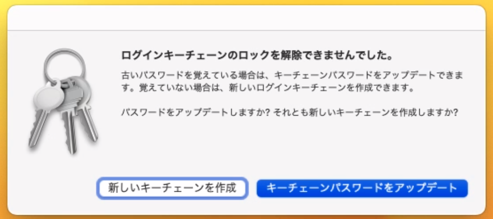
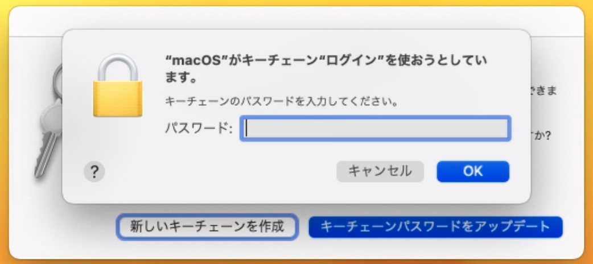

import WwweccEol from "@components/ja/WwweccEol.astro";

<WwweccEol systemName="ECCS端末"/>

UTokyo Accountのパスワードを変更すると，ECCS端末のMac環境にログインした際に，キーチェンのロック解除を求められます．これはキーチェーンが利用するパスワードとログイン時に利用するパスワードが異なるためです．

キーチェンのロック解除を求められた際には，以下のいずれかの方法で対処してください．

- 新しいキーチェーンを作成する
- キーチェンを更新する（古いパスワードを覚えている場合）

## 対処法1：新しいキーチェンを作成する

最もシンプルな対処法は，「新しいキーチェーンを作成」をクリックして新しいキーチェンを作成することです．既存のキーチェンの内容は失われますが，キーチェンに何も保存していないなら問題ありません．

{:.small}

### 「"Messages Agent" がキーチェーン "ローカル項目" を使おうとしています。」というメッセージが表示される場合

ECCS相談員のページ「[キーチェーン "ローカル項目" のロック解除を要求される](https://www.sodan.ecc.u-tokyo.ac.jp/faq/keychain-local/)」を参照してください．

## 対処法2：キーチェンのパスワードを更新する

古いパスワードを覚えている場合は，新しいキーチェンを作成せずに，既存のキーチェンのパスワードを変更することもできます．この方法は古いパスワードを覚えていない場合には利用できません．

「キーチェーンパスワードをアップデート」をクリックすると，「”macOS”がキーチェーン”ログイン”を使おうとしています。」と表示され，パスワードの入力が求められます．古いパスワードを入力して，キーチェンのパスワードを更新してください．

{:.small}

