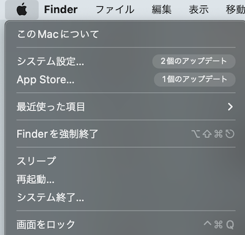
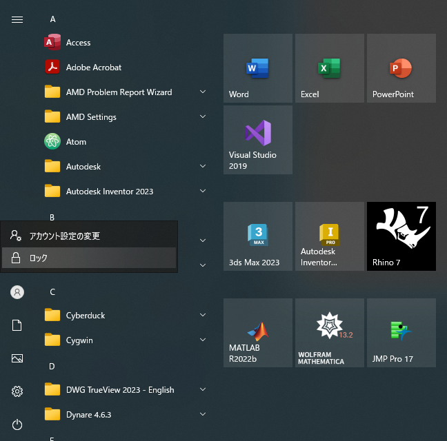

import ECCS2021Eol from "@components/ja/ECCS2021Eol.mdx";

<ECCS2021Eol />

ECCS端末にログインしたまま席を離れたり，帰宅したりすると，他の人に自分のアカウントで端末を利用される可能性があり，大変危険です．そのため，ECCS端末から短時間離れる際は，このページの手順に従って画面ロックしてください．また，ECCS端末から長時間離れる際は，画面ロックではなく，電源を切るようにしてください．

なお，15分間操作がない場合，自動的にECCS端末のスクリーンセーバーが起動し，画面がロックされた状態になります．加えて，情報基盤センターは，利用者が長時間離れているECCS端末を発見した場合，強制的に電源を切る場合があります．

## Mac環境での手順

1. 画面左上のアップルマークをクリックしてください．
2. 「画面をロック」をクリックしてください．
    {:.small}

## Windows環境での手順

1. Windowsマークをクリックし，スタートメニューを開いてください．
2. アカウントマークをクリックし，「ロック」をクリックしてください．
    {:.medium}
