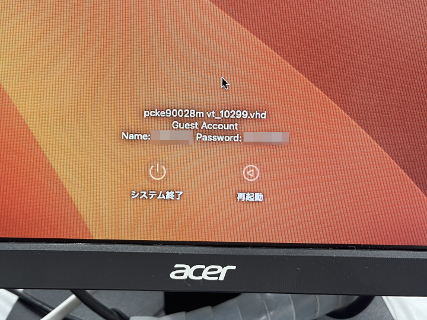
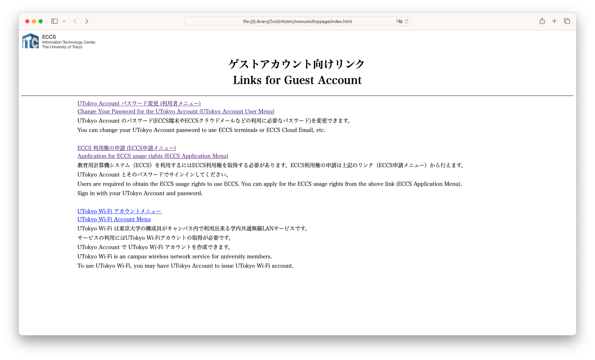

import ECCS2021Eol from "@components/ja/ECCS2021Eol.mdx";
import WwweccEol from "@components/ja/WwweccEol.astro";

<ECCS2021Eol />
<WwweccEol systemName="ECCS端末"/>

ECCS端末はECCS利用権を持つ方のみ利用できます．しかし，例外的に以下の操作を行う目的に限り，ECCS利用権がない方でもゲストアカウントを用いてMac環境のみ利用できます．

- UTokyo Accountのパスワード変更
- ECCS利用権の申請
- UTokyo Wi-Fiの利用申請

このページでは，ゲストアカウントでログインする方法とこれらの操作を行う方法を説明します．

## ゲストアカウントでECCS端末にログインする方法

1. ECCS端末の電源ボタンを押して端末の電源を入れてください．
   - 電源ボタンの位置は，「[端末 教育用計算機システムについて](https://www-old.ecc.u-tokyo.ac.jp/system/terminal.html)」を確認してください．
2. OSの選択画面が表示されたら，Mac環境が選択されているのを確認した上で，Enterキーを押すか，何もせずにしばらく待機してください．
3. Mac環境が起動するとログイン画面が表示されます．ログイン画面に記載されているゲストアカウントのユーザー名とパスワードを入力して，Mac環境にログインしてください．
   {:.small}
4. ログインしてしばらくするとSafariが起動して，「ゲストアカウント向けリンク」が表示されます．
   

## ゲストアカウントで各種操作を行う方法

ゲストアカウントでは以下の操作が可能です．

- UTokyo Accountのパスワード変更
- ECCS利用権の申請
- UTokyo Wi-Fiの利用申請

### UTokyo Accountのパスワードを変更する

ログイン後に表示される「ゲストアカウント向けリンク」で「UTokyo Account パスワード変更(利用者メニュー)」をクリックし，表示されるページの説明に沿って操作してください．

### ECCS利用権を申請する

1. ログイン後に表示される「ゲストアカウント向けリンク」で「ECCS 利用権の申請 (ECCS申請メニュー)」をクリックしてください．
2. UTokyo Accountのサインイン画面が表示されるので，サインインしてください．
3. 以降は「[新規アカウントの発行について](https://www-old.ecc.u-tokyo.ac.jp/doc/announce/newuser.html)」を参照してください．

### UTokyo Wi-Fiの利用を申請する

1. ログイン後に表示される「ゲストアカウント向けリンク」で「UTokyo Wi-Fi アカウントメニュー」をクリックしてください．
2. UTokyo Accountのサインイン画面が表示されるので，サインインしてください．
3. 以降はUTokyo Wi-Fiのページの「[利用開始までの手順](/utokyo_wifi/#initial-setup)」の手順2を参照してください．
