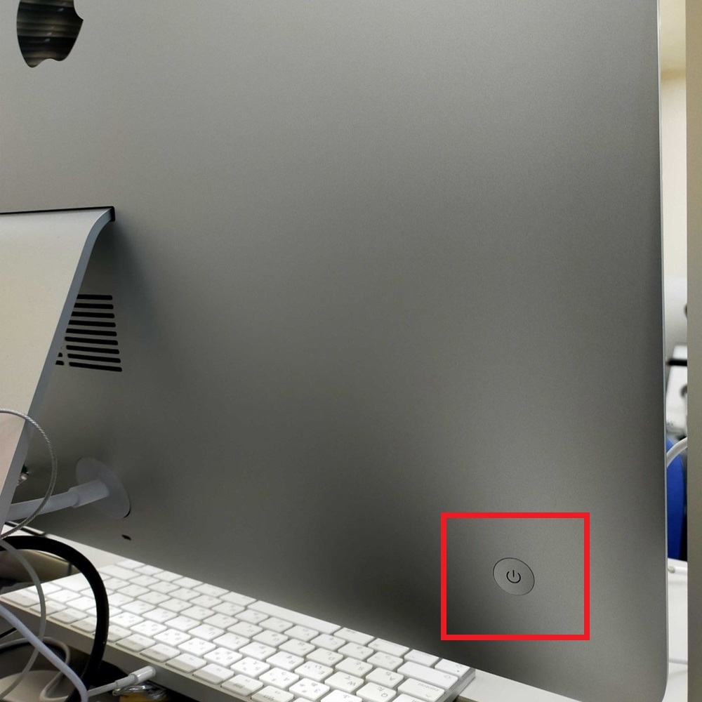

import ECCS2021Eol from "@components/ja/ECCS2021Eol.mdx";
import WwweccEol from "@components/ja/WwweccEol.astro";

<ECCS2021Eol />
<WwweccEol systemName="ECCS端末"/>

## 端末について

iMac端末とMac mini端末の2種類が配置されています．いずれの端末においても，Mac環境とWindows環境の2環境が利用可能で，起動時に選択できます．

これらのほか，一部の場所には，Chromebox端末が配置されています．Chromebox端末についての詳細は「[Chromebox端末について](/eccs/chromeos/)」を参照してください．

### スペック

- 本体：iMac（Retina 4K, 21.5-inch）もしくはMac mini 2018
- ディスプレイ：
  - iMac端末：4096x2304 21.5インチ
  - Mac mini端末：1920x1024 27インチもしくは23.8インチ
- OS：macOS 15 SequoiaとWindows 10の両方が動作
- CPU: 3.6GHz クアッドコア Intel Core i3
- メモリ: 16GB
- ストレージ：512 GB（SSD）
- マウス：縦横スクロール可能な3ボタンレーザー式
- キーボード：Magic Keyboard（テンキー無し JIS）
  {:.small}

### 電源ボタンの位置・電源の入れ方

iMac端末では，本体左側背面にある丸いボタンが電源ボタンです．
{:.small}

Mac mini端末では，端末本体がディスプレイの裏側に設置されています．本体右側背面の中央上部にあるボタンが電源ボタンです．
{:.medium}

端末の電源を入れるには，電源ボタンを押してください．しばらくするとディスプレイにMac環境とWindows環境の選択画面が表示されます．キーボードの左右矢印キーで利用する環境を選択してEnterキーを押すと，選択された環境が立ち上がります．何も操作をしなかった場合，しばらくして自動的にMac環境が起動します．

### 周辺機器の接続

端末にはUSBポートやステレオミニジャックがあり，持ち込んだ機器を接続することができます．実際に接続する際には，本体に接続されている延長ケーブルに機器を接続してください．
{:.medium}

一部の端末では，DVDマルチドライブが接続されています．DVDマルチドライブが利用できる端末の配置場所は，利用の手引きの「[17.1 端末の配置等](https://docs.google.com/document/d/e/2PACX-1vRSlrsLoHHPOvkqCw-r_IligLEhTvVwFAhcgrJ1tN75BYxrd4xtkEoVLHNUvoxeulv0UqTu8kkLTfYG/pub)」を参照してください．

また，iMac端末では，本体背面にSDXCカードスロットがあります．対応するカードや変換アダプタを接続することができます．ただし，変換アダプタは貸し出しておりません．

#### Bluetoothの利用

Mac環境とWindows環境の両方でBluetoothが利用できます．Bluetoothの設定情報は，端末を再起動すると削除されるので，接続のたびに設定を行ってください．

周囲の電波状況によっては，接続が不安定になることがあります．確実な接続が必要な場合は，有線での接続を検討してください．

#### 持ち込みPCの接続

Mac mini端末では，備え付けのディスプレイを，持ち込みPCのディスプレイとして利用することができます．卓上にあるHDMIケーブルを持ち込みPCに接続し，KVMスイッチの切り替えボタンを押してください．ディスプレイの入力がMac mini端末から持ち込みPCへ切り替わり，持ち込みPCの画面が表示されます．

また，卓上にある黒色のUSBケーブルを持ち込みPCに接続すると，備え付けのマウスも持ち込みPCで利用できるようになります．

詳しくはECCS相談員のページ「[持込PCからMac mini端末の画面とマウスを使用する](https://www.sodan.ecc.u-tokyo.ac.jp/hack/using-mac-mini-with-own-pc/)」を参照してください．

## ホームディレクトリの容量制限

ECCS端末では，保存できるファイルの容量に制限があります．Windows環境とMac環境のホームディレクトリの両方をあわせて18GBまでファイルを保存することができます．制限値近くまでファイルを保存すると，利用する上で様々な不具合が起こる可能性があります．

現在どのくらいの容量を使用しているかは，[ECCSポータル](https://portal.ecc.u-tokyo.ac.jp/)の「ディスク使用量確認」から確認できます．
{:.medium}{:.border}

## P2Pアプリケーションの利用制限

ECCS端末やSSHサーバでは，セキュリティ対策として一部のP2P（Peer-to-Peer）アプリケーションの通信を遮断しています．主な遮断対象はファイル共有のアプリケーション（BitTorrent，xunleiなど）です．

教育研究活動のために通信が遮断されているアプリケーションの利用を希望される場合は，情報基盤センター教育用計算機システム担当`ecc-support(at)ecc.u-tokyo.ac.jp`までご相談ください．

## 端末の配置場所

ECCS端末は，駒場地区では情報教育棟，本郷地区では浅野キャンパスの情報基盤センターと本郷キャンパスの福武ホールに集中的に配置されています．そのほか分散配置端末として，駒場図書館・総合図書館・柏図書館や，一部の学部・研究科等が管理する部屋に配置されています．詳しくは，利用の手引きの「[施設について](https://www-old.ecc.u-tokyo.ac.jp/facilities/index.html)」を参照してください．

## 端末以外のシステム環境

ECCSでは端末以外にも，以下のシステムが提供されています．各システムの詳細はリンク先を参照してください．

- [リモートアクセス環境](https://www-old.ecc.u-tokyo.ac.jp/system/outside.html#ras)
- [WebDAV環境](https://www-old.ecc.u-tokyo.ac.jp/system/network_storage.html)
- [印刷環境](https://www-old.ecc.u-tokyo.ac.jp/system/printing.html)
- [SSHサーバ](https://www-old.ecc.u-tokyo.ac.jp/system/outside.html#ssh)
