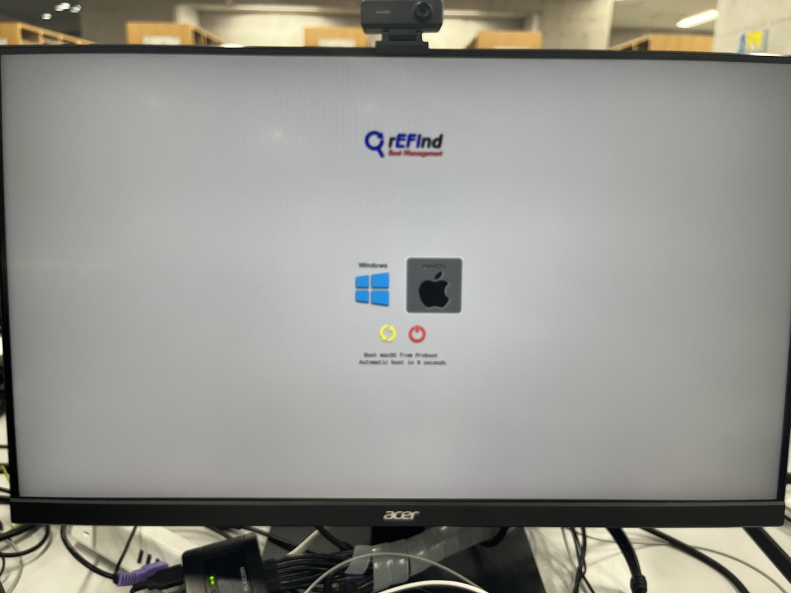
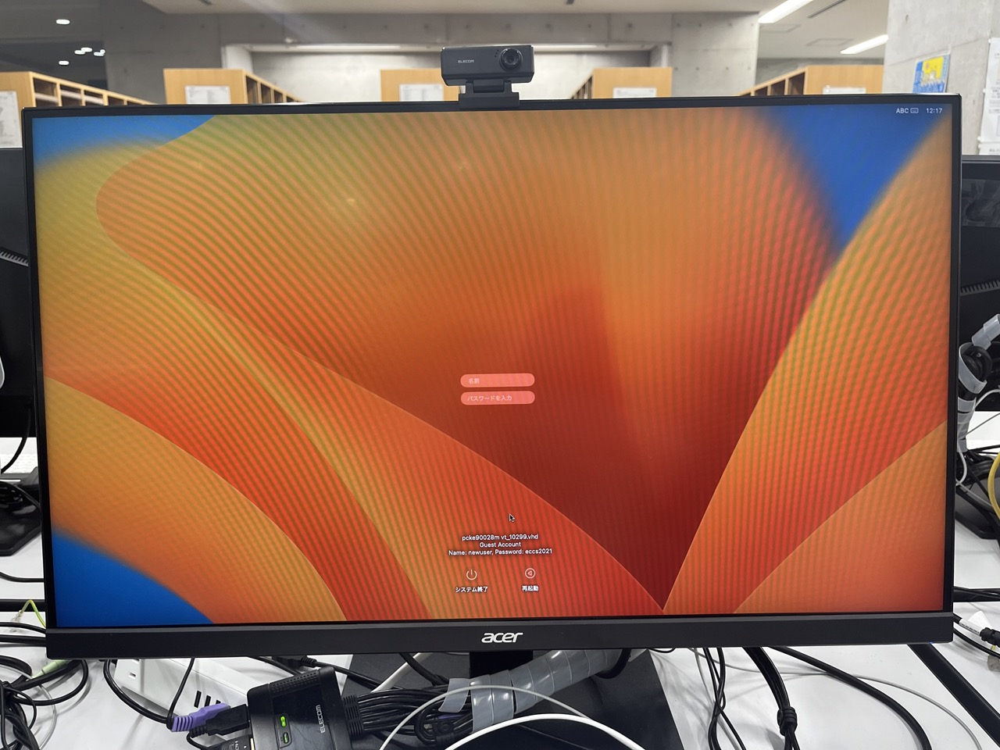
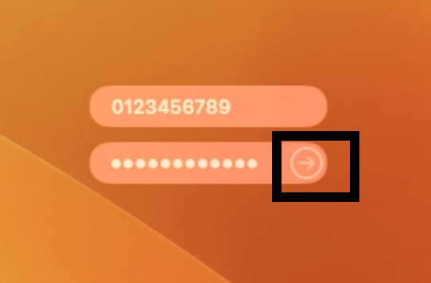
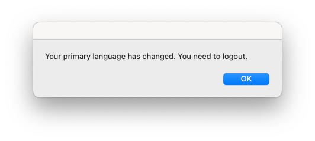
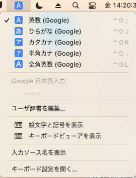
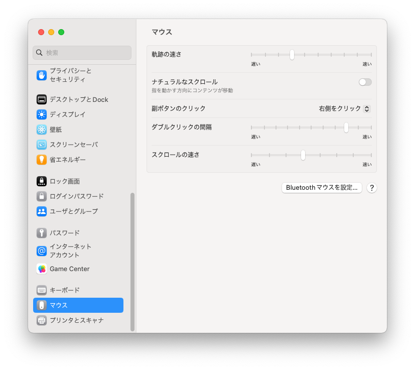

import WwweccEol from "@components/ja/WwweccEol.astro";

<WwweccEol systemName="ECCS端末"/>

このページでは，Mac環境の基本的な利用方法を説明します．

## ログイン

ECCS利用権の申請を行ったあとに，Mac環境にログインする方法を説明します．まだECCS利用権の申請を行っていない場合は，「[利用権の申請](/eccs/overview/right-application)」を参照してください．

1. 端末本体の電源ボタンを押して電源を入れてください．電源ボタンの位置は「[ECCS端末の基本仕様](/eccs/overview/spec)」を参照してください．
2. OSの選択画面が表示されたら，キーボードの矢印キーを用いてMac環境を選択し，Enterキーを押してください．
   {:.medium}
3. Mac環境が起動し，ログイン画面が表示されます．以下の情報を入力してください．
   - 「名前」欄：UTokyo Accountのユーザー名（共通ID10桁）
   - 「パスワードを入力」欄：UTokyo Accountのパスワード
   {:.medium}

4. 入力が完了したらEnterキーを押すか，「パスワードを入力」欄の右に表示される矢印マークをクリックしてください．
   {:.small}
5. 正しいログイン情報を入力した場合，しばらくするとMac環境のデスクトップ画面が表示されます．初回ログイン時には時間がかかることがあります．誤ったログイン情報を入力した場合，入力欄が横に振動するので，入力した内容を確認・修正して再度試してください．

## 表示言語の切り替え

初期状態では，表示言語は日本語に設定されていますが，英語に切り替えることができます．ここでは，表示言語を日本語から英語に切り替える方法を説明します．英語から日本語に切り替える場合は「Change to English」を「日本語化」に読み替えてください．

1. デスクトップ上にある「Change to English」アイコンをクリックしてください．
   
2. 表示言語の設定が変更されます．ダイアログが表示されたら「OK」をクリックしてください．
   
3. 画面左上のアップルマークをクリックし，「再起動」もしくは「システム終了」をクリックしてください．
4. 次にMac環境にログインしたときから，表示言語が切り替わります．
   - ログインし直さなくても一部の表示言語は切り替わりますが，完全に表示言語が切り替わるのは，次のログイン時になります．

## 日本語・英語の入力切り替え

入力する言語の切り替えは，キーボードのスペースキーの左右にある「英数」「かな」キーで行えます．現在の入力言語は，画面右上の青いマークで確認してください．

入力言語の詳細な設定は，画面右上の青いマークをクリックして表示される画面で行えます．

## マウスホイールを回す向きとスクロール方向の調整

初期状態では，マウスホイールを回す向きとスクロール方向が逆になっています．これは，macOSの仕様によるものです．マウスホイールを回す向きとスクロール方法を同じにするには以下の手順に従ってください．

1. 画面下側のDockにある「システム設定」をクリックしてください．
   
2. 左側の設定項目を下の方までスクロールして「マウス」をクリックしてください．
3. 「ナチュラルなスクロール」のスイッチをオフにしてください．
   

## 電源の切断

利用を終了する際や長時間離席する際は，以下の手順に従って端末の電源を切ってください．ログアウト操作はできないため，次の利用者がいる場合でも電源を切る必要があります．短時間離席する場合は，画面左上のアップルマークをクリックして「画面ロック」を押して画面ロックしてください．詳細は「[端末を画面ロックする](/eccs/misc/lock)」を参照してください．

1. 画面右上のアップルマークをクリックしてください．
2. 「システム終了」をクリックしてください．
  (TODO: 画像を追加)

アプリケーションが固まるなどして，上記の手順で電源を切れない場合は，端末本体の電源ボタンを5秒ほど押して強制的に電源を切っても構いません．ただし，次に電源をいれるまで5秒ほど待機してください．

なお，本郷の情報基盤センター，駒場情報教育棟の演習室や一部の分散端末配置室では，閉室時刻にあわせて自動で電源が切れるよう設定されています．
