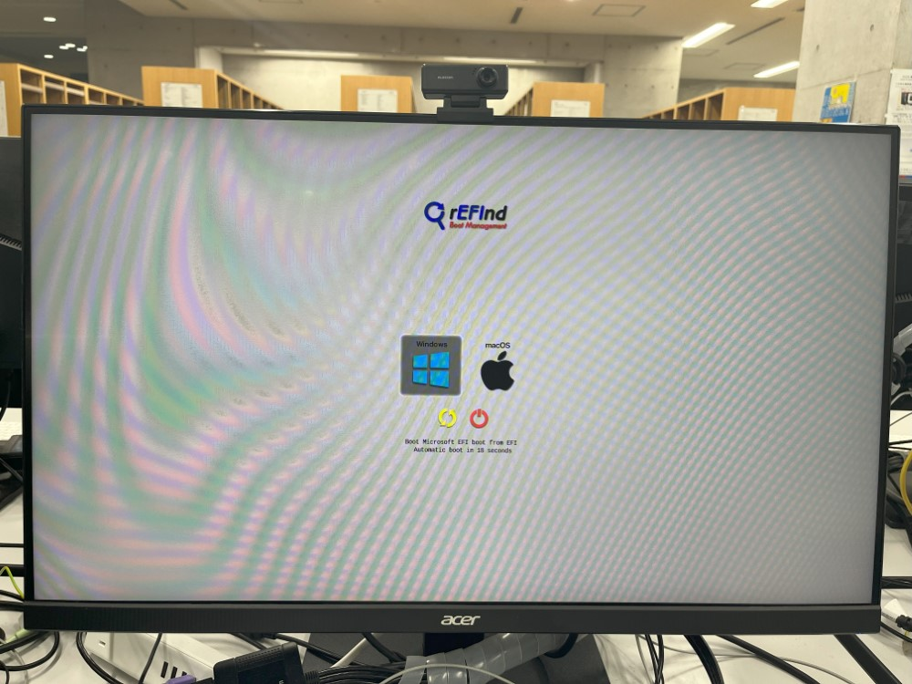
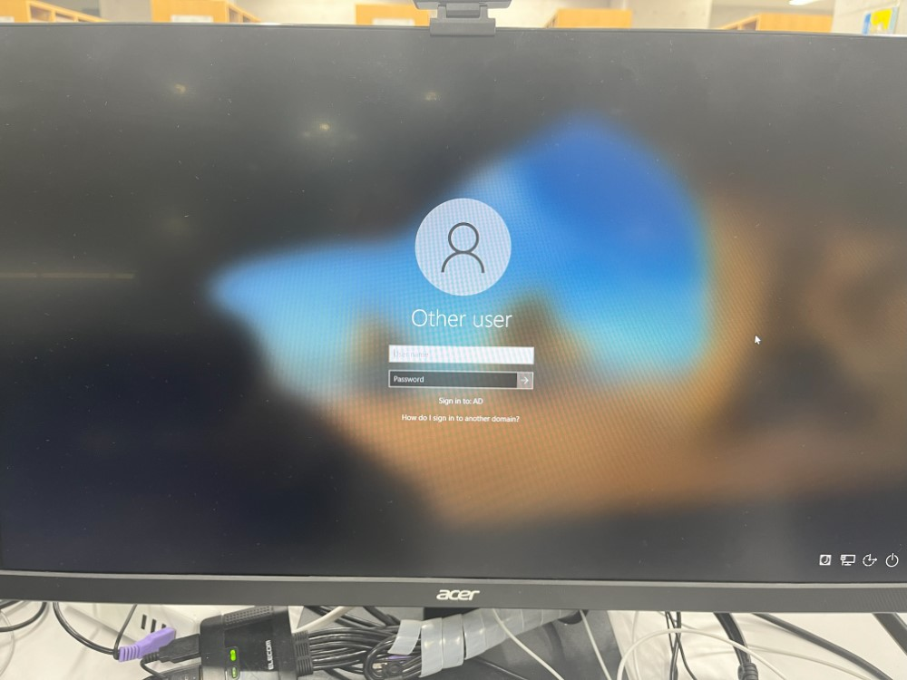
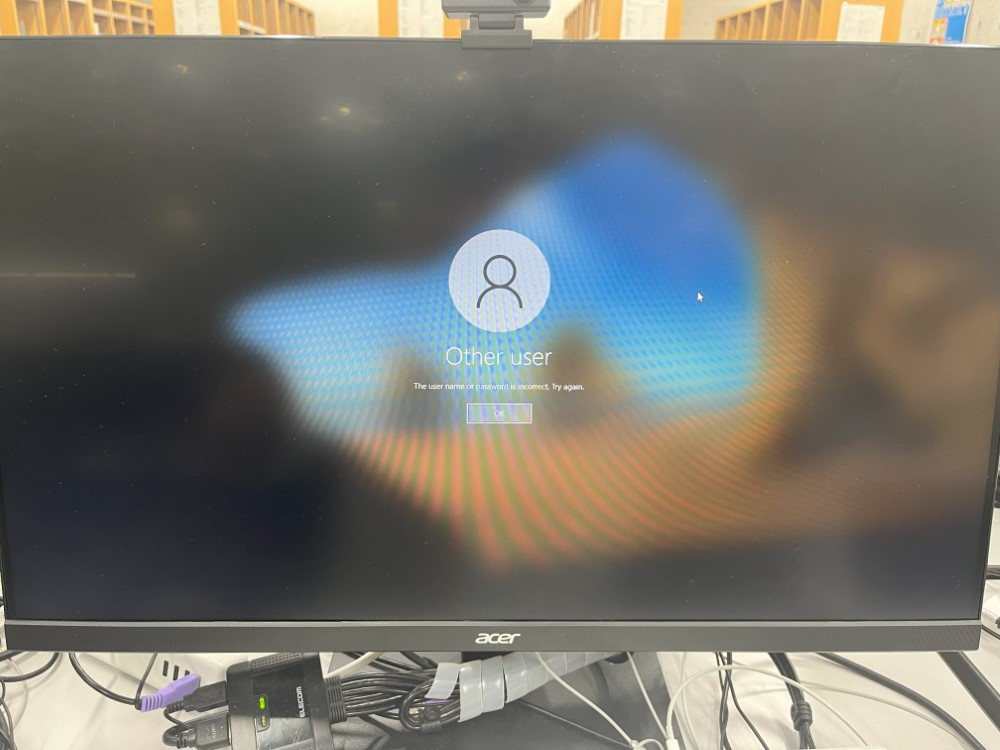
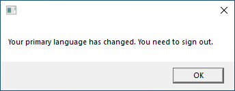
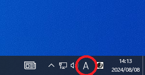
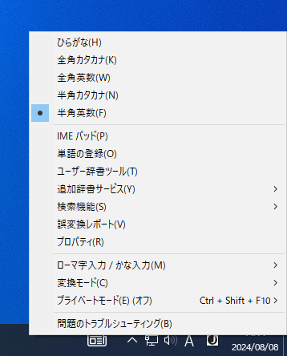
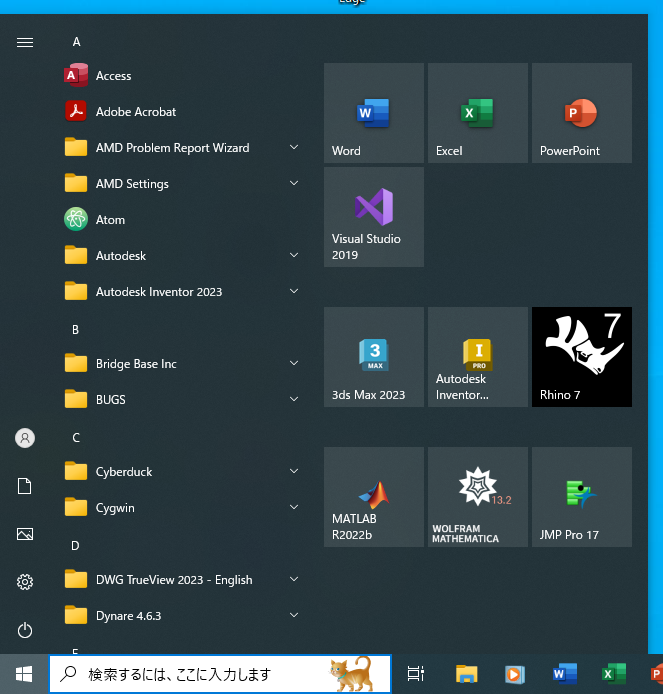
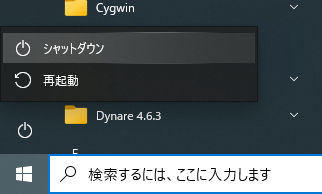

import WwweccEol from "@components/ja/WwweccEol.astro";
import ECCS2021Eol from "@components/ja/ECCS2021Eol.mdx";

<ECCS2021Eol />
<WwweccEol systemName="ECCS端末"/>

このページでは，ECCS端末のWindows環境の基本的な利用方法を説明します．

## ログイン

ECCS利用権の申請を行ったあとに，Windows環境にログインする方法を説明します．まだECCS利用権の申請を行っていない場合は，「[ECCS利用権を申請する](../right-application/)」を参照してください．

1. 端末本体の電源ボタンを押して電源を入れてください．電源ボタンの位置は「[ECCS端末の仕様](../spec/)」を参照してください．
2. OSの選択画面が表示されたら，キーボードの矢印キーを用いてWindows環境を選択し，Enterキーを押してください．
   {:.medium}
3. Windows環境が起動し，時刻と日付が画面左下に表示されます．画面をクリックするか，Enterキーを押して，以下の情報を入力してください．
   - 「User name」欄：共通ID（UTokyo Accountの先頭10桁の数字のみの部分）
   - 「Password」欄：UTokyo Accountのパスワード
   {:.medium}

4. 入力が完了したらEnterキーを押すか，「Password」欄の右に表示される矢印マークをクリックしてください．
5. 正しいログイン情報を入力した場合，通常30秒程度でWindows環境のデスクトップ画面が表示されます．
   - 初回ログイン時は，ユーザープロファイルの作成のため時間がかかることがあります．
   - 誤ったログイン情報を入力した場合，以下の画面になります．「OK」をクリックして，再度試してください．
     {:.medium}

## 利用に際して

### 表示言語の切り替え

初期状態では，表示言語は日本語に設定されていますが，英語に切り替えることができます．ここでは，表示言語を日本語から英語に切り替える方法を説明します．英語から日本語に切り替える場合は「Change to English.vbs」を「日本語化.vbs」に読み替えてください．

1. デスクトップ上にある「Change to English.vbs」アイコンをクリックしてください．
   
2. 表示言語の設定が変更されます．ダイアログが表示されたら「OK」をクリックしてください．
   
3. 画面左下のWindowsマークをクリックし，「再起動」もしくは「シャットダウン」をクリックしてください．
4. 次にWindows環境にログインしたときから，表示言語が切り替わります．

### 日本語・英語の入力切り替え

入力する言語の切り替えは，キーボードのスペースキーの左右にある「英数」「かな」キーで行えます．現在の入力言語は，画面右下のマークで確認してください．

入力言語の詳細な設定は，画面右下のマークを右クリックすることで行えます．

### ファイルの保存場所について

Windows環境で利用者がファイルの保存場所として利用できるのは，Zドライブ上にあるホームディレクトリのみです．

Cドライブに配置したファイルは，再起動時に削除されます．また，Cドライブは端末別のドライブであり，他の端末からは利用できません．

## 電源の切断

利用を終了する際や長時間離席する際は，以下の手順に従って端末の電源を切ってください．ログアウト操作はできないため，次の利用者がいる場合でも電源を切る必要があります．短時間離席する場合は，画面をロックしてください．詳細は「[端末を画面ロックする](/eccs/misc/lock/)」を参照してください．

1. 画面左下ののWindowsマークをクリックして「スタートメニュー」を開いてください．
   
2. 電源マークをクリックして「シャットダウン」をクリックしてください．
   

アプリケーションが固まるなどして，上記の手順で電源を切れない場合は，端末本体の電源ボタンを5秒ほど押して強制的に電源を切っても構いません．ただし，次に電源をいれるまで5秒ほど待機してください．

なお，本郷の情報基盤センター，駒場情報教育棟の演習室や一部の分散端末配置室では，閉室時刻にあわせて自動で電源が切れるよう設定されています．また，情報基盤センターは，利用者が長時間離れているECCS端末を発見した場合，強制的に電源を切る場合があります．