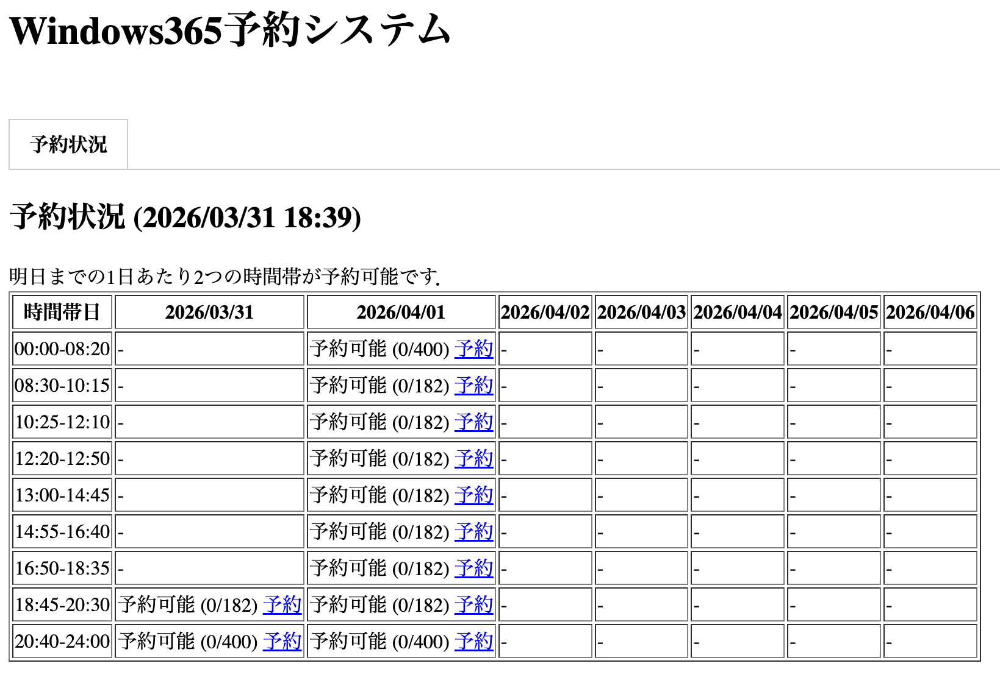
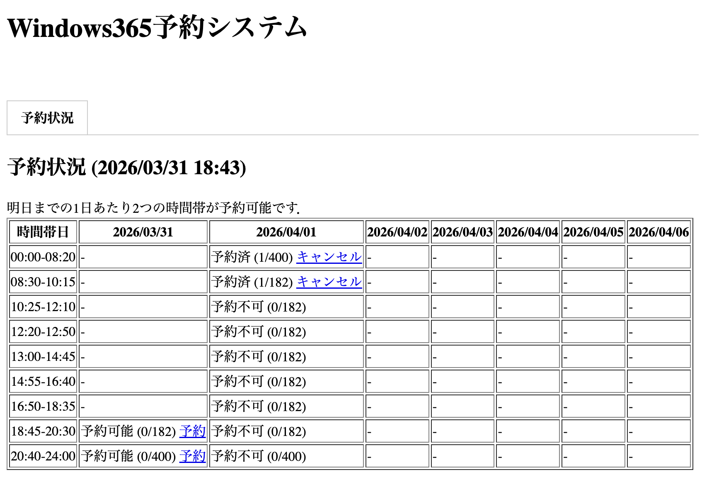
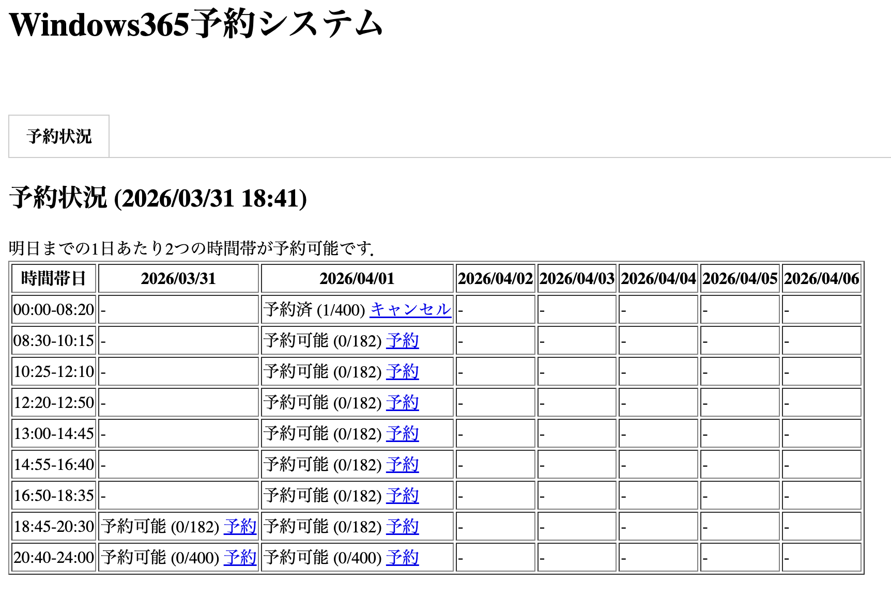
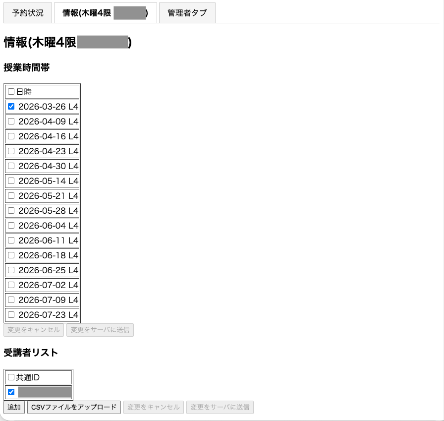
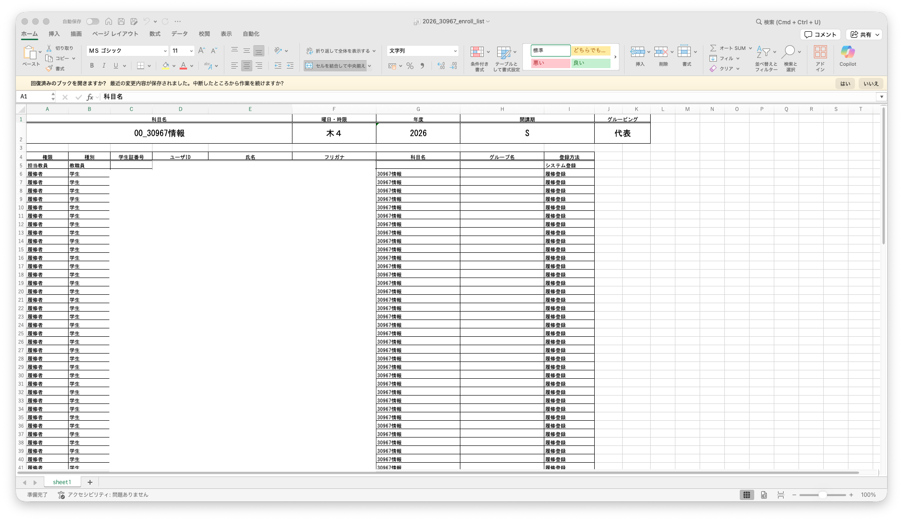
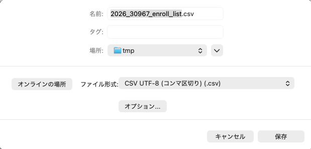
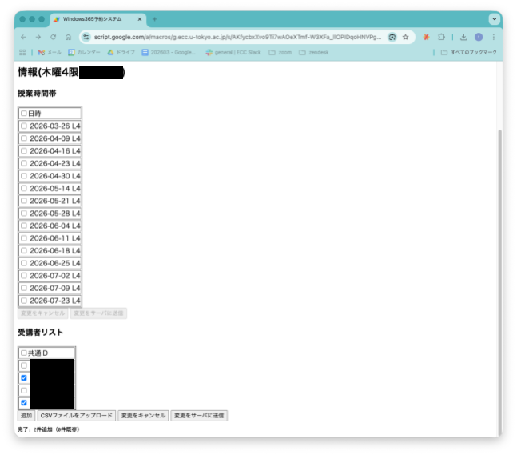
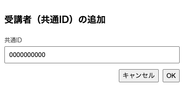

## 概要
{:#overview}

Windowsリモート環境には[利用枠](../#quota-and-reservation)に限りがあり，特定の時間に利用したい予定がある場合は，事前に予約ができます．予約には「[個人予約](#individual)」と「[クラスオーナーによる予約](#class-owner)」の2種類の方法があります．

- **[個人予約](#individual)**：個人が利用したい時間帯を個別に予約できます．
- **[クラスオーナーによる予約](#class-owner)**：授業の担当教員（クラスオーナー）が予め申請することで，授業時間帯に必要な枠数をまとめて予約できます．

## 個人予約
{:#individual}

### 注意

- 今日と明日の時間帯ごとの予約ができます．
- 1日あたりの予約可能枠は2枠までです．ただし，終了時刻を過ぎた時間帯については，予約可能枠数のカウントに入りません．
- 予約時間帯の移動はできません．すでに1日に2つの時間帯を予約済みの人が，予約時間帯を変更したい場合は，現在予約済みの時間帯をキャンセルしてから，変更したい時間帯を予約する必要があります．
- 現時刻を含む時間帯を予約した場合は，使えるようになるまで最大10分程度かかります．

### 予約方法

1. ECCSクラウドメールのアカウントを用いて[Windows365予約システム](https://script.google.com/a/macros/g.ecc.u-tokyo.ac.jp/s/AKfycbxXvo9Ti7wAOeXTmf-W3XFa_llOPIDqoHNVPga7gWe_YYGZyNjyLh9sxvnPybQ1XaSfhA/exec)にアクセスしてください．
1. （ログインしていない場合は）ECCSクラウドメールのアカウントでログインしてください．
1. ログイン後の「予約状況」のタブから，予約したい時間帯の「予約」ボタンを選択し，しばらく操作をせずに待ってください（画面に反映されるまで時間がかかることがあります）．
  {:.medium.border}
      
    

      
予約しようとした時間帯が「予約不可」と表示されている場合

      予約可能枠数（1日2枠まで）を超過していると考えられます．

      {:.medium.border}
    

1. 予約した時間帯が「予約済」となっていることを確認してください．

### キャンセル方法

1. [Windows365予約システム](https://script.google.com/a/macros/g.ecc.u-tokyo.ac.jp/s/AKfycbxXvo9Ti7wAOeXTmf-W3XFa_llOPIDqoHNVPga7gWe_YYGZyNjyLh9sxvnPybQ1XaSfhA/exec)にアクセスしてください．
1. （ログインしていない場合は）[ECCSクラウドメール](/google/)（東京大学のGoogleアカウント）でログインしてください．
1. ログイン後の「予約状況」のタブから，予約している時間帯の「キャンセル」ボタンを押してください．
  {:.medium.border}

## クラスオーナーによる予約
{:#class-owner}

授業の担当教員（クラスオーナー）が予め申請することで，授業時間帯に必要な分の利用枠をまとめて予約できるようになります．

- あらかじめ予約しておくことで，同時に182名まで接続することができます．
- 予約には事前の授業登録申請が必要です．また，授業の受講者が利用できるようにするには，利用枠の予約に加え，受講者リストの登録が必要になります．
  - 受講者の登録人数に制限はありませんが，182名以上の受講者を登録したとしても，同時に利用できるのは182名までです．182名以上の人数が同時に利用しようとした場合，枠が足りなくなった後に接続を試行しても接続できません．
- 予約は，利用日の前々日までにしてください．それ以降の予約の場合，個人予約が可能になるため，利用枠の数が制限される可能性があります．

### 予約のための授業登録申請
{:#course-registration}

[Windows365予約システム授業登録申請](https://forms.gle/ujDDcnXHL5akZKia6)フォームから，授業登録を申請してください．申請を確認後，フォームに入力したメールアドレスに，受理した旨が通知されます．

- UTOLのIDと表示名，管理者（複数可）の共通ID，想定同時利用人数，時間割（開講時期，曜限など）を入力してください．申請に基づいて登録します．
- 想定同時利用人数が多い場合などは，メールで問い合わせさせていただくことがあります．

### 予約方法
{:#class-owner-reservation}

1. [Windows365予約システム](https://script.google.com/a/macros/g.ecc.u-tokyo.ac.jp/s/AKfycbxXvo9Ti7wAOeXTmf-W3XFa_llOPIDqoHNVPga7gWe_YYGZyNjyLh9sxvnPybQ1XaSfhA/exec)にアクセスしてください．
1. （ログインしていない場合は）[ECCSクラウドメール](/google/)（東京大学のGoogleアカウント）でログインしてください．
1. 予約したい授業のタブを選択してください．
1. 授業スケジュールが表示されるので，予約が必要な日をチェックボックスで選択してください．
  {:.medium.border}
1. 「変更をサーバに送信」を押してください．

### 受講者リストを設定する
{:#participants}

受講者が，授業用に予約された利用枠を使えるようにするには，あらかじめ受講者リストを設定する必要があります．

受講者リストに共通IDが記載されていてかつ，その左側のチェックボックスにチェックが入っているユーザーのみ，授業用の利用枠を使うことができます．

#### 受講者を追加する

予約時間帯に利用できる受講者を追加する必要があります．受講者の追加方法には，[UTOLのコース参加者のデータに基づいて一括で追加する方法](#bulk-add)と，[受講者を共通IDに基づいて個別に追加する方法](#individual-add)があります．

##### UTOLのコース参加者のデータに基づき一括追加する
{:#bulk-add}

1. UTOLで，[コース参加者一覧をExcelファイルでダウンロード](/utol/lecturers/settings/course_participants/#how-to-download)してください．
  - なおUTOLの言語設定を，あらかじめ**日本語**にしておく必要があります．
1. ダウンロードしたファイルをExcel等で開きます（さきほど設定したパスワードが必要になります）．
  {:.medium}
1. 5行目以降で，不要な行を消したり，行を付け加えたりすることができます．
  - ユーザIDのあるD列に10桁の数字がある場合に，その行が受講者リストに追加されます．
1. メニューから「名前を付けて保存」を選び，CSV形式（UTF-8）を指定して保存してください．
  {:.small}
  - 「アクセス制限の解除」や「データ損失の可能性」に関するエラーが出る場合がありますが，そのまま保存して問題ありません．
1. [Windows365予約システム](https://script.google.com/a/macros/g.ecc.u-tokyo.ac.jp/s/AKfycbxXvo9Ti7wAOeXTmf-W3XFa_llOPIDqoHNVPga7gWe_YYGZyNjyLh9sxvnPybQ1XaSfhA/exec)で該当授業のタブを選択した上で，受講者リストのところで「CSVファイルをアップロード」ボタンを押し，作成したCSVファイルを選択してください．
1. 「完了: ◯件追加（◯件既存）」のようなメッセージが出るので，確認の上，**「変更をサーバに送信」ボタンを押して**ください．
  {:.medium}

##### 共通IDで個別に追加する
{:#individual-add}

1. [追加]ボタンを押してください．
1. 以下のダイアログボックスが出るので，追加するユーザの共通IDを入力して，「OK」ボタンを押してください．
  {:.medium.border}
1. 「登録中」の表示が出て，登録が終了するとダイアログボックスが消えます．

#### 受講者を削除する

チェックボックスのチェックを外すことで，そのユーザが授業のために予約されたWindowsリモート環境の利用枠を使えないようにすることができます．なお，一度追加したユーザーを受講者リストの一覧から削除することはできません．
