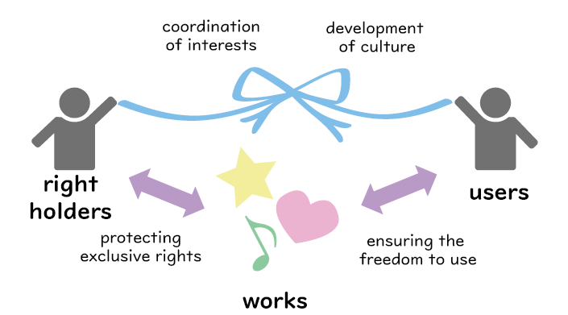

## Outline of This Article

This article describes basic information about copyrights, mainly based on Japanese copyright law.

It provides an overview of Japanese copyright law, from the basics, such as what "works" are and who "the author" is, to more specific details, such as the author's rights.

## Basics of Japanese Copyright Law

### What is Copyright Law?

First, to understand what copyright law is, it is necessary to review why copyright law is necessary and what its purpose is. The purpose of the Copyright Act is stated in Article 1 as follows;

(Article 1) The purpose of this Act is to provide for authors' rights and neighboring rights with respect to works, as well as with respect to performances, phonograms, broadcasts, and cablecasts, and to ensure protection for the rights of authors and other such persons while according attention to the fair exploitation of these cultural products, and thereby to contribute to cultural development.

In other words, the Copyright Act is a law that aims to coordinate the interests of right holders and users and to contribute to the development of culture by providing authors and other creators of works with exclusive rights to use their works, thereby protecting them and ensuring the freedom to use their works.

&lt;Figure 1: Purpose of Copyright Law&gt; (Prepared based on the above text)

This article explains how the Copyright Act defines “works” and “authors” and how the law stipulates authors’ rights.

### What is Copyrighted Work?

"Work" means a creatively produced expression of thoughts or sentiments that falls within the literary, academic, artistic, or musical domain[^1].

[^1]:See Copyright Act, Article 2, Paragraph 1, Item 1.

Since the “work” has to be expressed, abstract ideas are not included.

The “work” has to be creative. The following do not fall within the scope of “work”: a common expression that is the same no matter who conveys it, or an expression that cannot be conveyed in any other way due to its nature.

Copyrighted “works” include[^2]:

[^2]:See Copyright Act, Article 10, Paragraph 1.

1. novels, scripts, articles, lectures, and other literary works
1. musical works
1. works of choreography and pantomime
1. paintings, woodblock prints, sculptures, and other works of fine art
1. works of architecture
1. maps and figures of an academic nature, such as plans, charts, and models
1. cinematographic works
1. photographic works
1. works of computer programming

&lt;Illustrations: Images of examples of works - in order from top left: painting, music, sculpture, cartoon, film, novel&gt; ([Illust-ya](https://www.irasutoya.com/))

On the other hand, examples of non-copyrighted “works” include:

1. Communicating facts, news reports on current events (or historical facts, data, etc.), thoughts, and ideas
1. Imitation of someone else’s expression
1. Common expressions, conventions, brief texts (titles, names, etc.), and works created entirely by machine without any human involvement (e.g., speed photography)

### Who is the “Author”?

"Author" means a person who creates a work[^3]. Those who merely provided ideas, materials, or assistance with input work do not fall within the scope of authors.

[^3]:See Copyright Act, Article 2, Paragraph 1, Item 2.

In principle, the law acknowledges the person who performed the act of creation as the author. However, for example, if a company plans to produce a pamphlet for its own company and has its employees create it as part of their duties, the company, not the creator of the pamphlet (i.e., the employee), becomes the author. Such works are called “Works Made for Hire.”[^4]

[^4]:
    "Works Made for Hire" may also be called corporate work. Not everything created by an employee of a company is"Works Made for Hire." The following requirements must be met;
    <ol type="a">
      <li>The "plan" for the creation of the work is made by a legal entity or other "user" (e.g., the State, a company, etc.; hereinafter referred to as a "legal entity, etc.").</li>
      <li>Creation by a "person engaged in the business" of a corporation, etc.</li>
      <li>Creating as an act "in the course of employment."</li>
      <li>When the work is "published," it must be under the "name of a legal entity, etc."</li>
      <li>No provision in the "contract” or “work rules" that "the employee shall be the author."</li>
    </ol>

    (Agency for Cultural Affairs, "[Copyright Textbook](https://www.bunka.go.jp/seisaku/chosakuken/seidokaisetsu/pdf/93293301_01.pdf)," p. 11)

In the case of “Works Made for Hire,” the author's rights will belong to the employer, such as a corporation, from the beginning. See the next section for more explanation.

For example, the University of Tokyo has internal guidelines regarding “Works Made for Hire,” called "[The University of Tokyo Rules for the Treatment of Works](https://www.ducr.u-tokyo.ac.jp/rules_and_forms/copyright.html)" (in Japanese).

![Principle: For types of works that are considered general, the creator of the work becomes the author. Exception 1 in university rules: For works created by faculty members in the course of their duties, such as exam questions, based on the university's directive, the university becomes the author. Exception 2 in university rules: For works related to duties created by faculty and staff through research conducted using university funds or facilities, the faculty and staff become the authors. (However, notification is required when providing the work to outsiders for a fee; copyright is transferred to the university, which then distributes a portion of the income to the author.) Exception 3 in university rules: Works that do not fall under the above two exceptions are authored by the faculty or staff who created the work.](img/copyright_basic_3.png)

&lt;Figure 2: Ownership of copyrighted works at the University of Tokyo&gt;(Prepared by [Online Education Supporter](/en/about/oes/) with reference to the "[The University of Tokyo Rules for the Treatment of Works](https://www.ducr.u-tokyo.ac.jp/rules_and_forms/copyright.html)" (in Japanese) by the University of Tokyo's Industry-University Collaboration and Creation Promotion Division)

### What Rights Does the Author Have?

The author’s rights are broadly divided into the following two categories.

+ Copyright: concerns the author's proprietary interests
+ Moral rights of an author: Relating to the author's personal interests, such as the author's feelings and commitment to the work

These rights arise at the same time as the creation of the work, without the need for any procedures. (Article 17, paragraph (2))

We will explain copyright and moral rights in more detail below.

#### 1. Author’s rights

Copyright is the right to prohibit unauthorized acts of exploitation of copyrighted works by third parties[^5]. They are enumerated in Articles 21-28, depending on the individual act of copyrighted work use.

[^5]:See Copyright Act, Articles 21~28.

The following copyrights are applicable to the use of copyrighted works in educational institutions.

&lt;Table 1: Contents of copyright&gt; (Prepared with reference to pp. 14-18 of the Agency for Cultural Affairs' "[Copyright Textbook](https://www.bunka.go.jp/seisaku/chosakuken/seidokaisetsu/pdf/93293301_01.pdf)" (in Japanese))

|Type of Right|Explanation|Example|
|:---:|:---|:---||
|The right of reproduction (Article 21)|__The right not to have one’s work be reproduced without permission__ The right concerning “the reproduction of one’s work in a tangible form” utilizing hand-writing, printing, photography, photocopy, sound or visual recording, storage on a hard drive of a personal computer, data on the server, or other methods|Copying or downloading copyrighted material|
|The stage performance rights and musical performance rights (Article 22)|__The right to not have others give a stage performance or musical performance of one’s work without permission__ The right to put on a "stage performance" (in the case of a play) or "musical performance" (in the case of music) of a work to the public.|Performance of copyrighted works, reproduction of CDs, etc.|
|The right of on-screen presentation (Article 22, paragraph (2))|__The right to not have others publicly present one’s work via an on-screen presentation without permission__ The right to show the work to the public utilizing equipment (e.g., projecting movies or music works on a screen or display).|Slide projection of works|
|The right to transmit to the public (Article 23, paragraph (1))|__The right to not have others transmit one’s work without permission__ The right to transmit the work to the public.|Distribution of works, uploading to servers|
|The right to communicate to the public (Article 23, paragraph (2))|__The right to not have others publicly communicate one’s work without permission__ The right to communicate (show or let the public hear) a publicly transmitted work to the public using a receiving device such as a television set.|Television broadcasts projected on a screen|
|The rights of transfer (Article 26, paragraph (2))|__The right to not have others make one’s work available to the public through the transferring of the original work or copy of the work without permission__ The right to transfer the original or a reproduction of a work to the public.|Distribution of printed works|
|The translation rights, adaptation rights, etc. (Article 27)|__The right to not have others create derivative work without permission__ The right to create a "derivative work" by creatively "processing" a work (original work) through translation, arrangement, adaptation, film adaptation, etc.|Translation and summarization of works|

You can transfer the copyright in whole or part (Article 61, paragraph (1)). When you transfer the copyright, the person who created the work (author) and the person who owns the copyright (copyright holder) may be different.

For example, when a journal article is published in a journal, a contract is sometimes concluded that transfers the copyright to the publisher (this seems to be especially the case in the natural science fields in Japan). In this case, the publisher, not the author, is the copyright holder.

However, the moral rights of the author are not transferable because they are rights that are exclusive to the author (Article 59). See the next section.

#### 2. Moral rights of author

Moral rights of the author are rights that protect the moral interests of authors. Since a work is an expression of the author's thoughts and feelings, the author's moral interests may be damaged if, for example, the work is published without permission or if the content is changed without permission. That is why protection is provided. For example, the following rights are available.

&lt;Table 2: Moral rights&gt; (Prepared with reference to p.13 of the Agency for Cultural Affairs' "[Copyright Textbook](https://www.bunka.go.jp/seisaku/chosakuken/seidokaisetsu/pdf/93293301_01.pdf)" (in Japanese), p. 13)

|Type of Right|Explanation|Example|
|:---:|:---|:---|
|Right to Make a Work Public (Article 18)|The author of a work not yet made public has the right to decide whether the work is made available or presented to the public. (The right not to be made public without permission)|Publishing drafts without permission|
|Right of Attribution (Article 19)|The author of a work has the right to decide whether to reveal the author’s name or not and if so,  whether to use the author's true name or pseudonym at the time it is made available or presented to the public.|Not displaying the  name, displaying a name different from the author's intention in the work|
|Right to Integrity (Article 20)|The author of a work has the right to preserve the integrity of that work and its title, and is not to be made to suffer any alteration, cut, or other modification thereto that is contrary to the author's intention.|Making alterations contrary to the author's wishes|
|Right to prestige and popularity (Article 113, paragraph (11))|The right not to have one's work used in a way that is "prejudicial to the honor or reputation" of the author.|Using the work in a way that is detrimental to the honor or reputation of the author|

## Term of Copyright Duration

Most works are created while incorporating the scholarly and artistic achievements of their predecessors. Assuming that copyrights continue to exist indefinitely, authors will permanently restrict others to use their works, which may hinder the "development of culture," which is the purpose of copyright law. On the other hand, if the protection term is too short, it makes it difficult for authors and copyright holders to receive adequate compensation. Therefore, the law stipulates the term of copyright duration to strike a balance between the protection of authors and the free use of users.

&lt;Table 3: The Duration of copyrights in Japan&gt;

<table>
  <tr><td>Terms of Protection for Personal Works (Article 51)</td><td>From creation to 70 years after the author's death</td></tr>
  <tr><td>Terms of Protection for Anonymous or Pseudonymous Works (Article 52)</td><td>For 70 years after the work becomes public</td></tr>
  <tr><td>The Term of Protection for Works Attributed to an Organization (Article 53)</td><td>For 70 years after the work becomes public</td></tr>
  <tr><td>The Term of Protection for Cinematographic Works (Article 54)</td><td>For 70 years after the work becomes public</td></tr>
</table>

Note that there are countries with different conditions for the term of duration, e.g., 100 years in Mexico and 30 years in Iran.

Even after the death of an author, it is prohibited for a person that makes available or presents the author's work to the public to engage in conduct that would be prejudicial to the moral rights of the author if the author were alive (Article 60).

## When Copyright Does Take Effect (When a Work Can Be Used Without a License)

In principle, the permission of the author or copyright holder is required to use copyrighted works.

However, if permission is always required, this could diminish the public interest served by the use of copyrighted works. In addition, the increase in costs associated with the permission process could be detrimental to the rights holders.

Therefore, the Copyright Act stipulates that unauthorized use of a copyrighted work for a specific purpose or manner (means or method of use, etc.) does not constitute copyright infringement. The list of the requirements for such use is under Article 30. Those are called "limitations of copyright."

The copyright restrictions on the use of copyrighted works in educational institutions include quotation (Article 32) and reproduction in schools and other educational institutions (Article 35).

This section outlines Article 32, which has to do with quotations. Article 35 is discussed in more detail in another article, "[When Can Materials Be Freely Used for Class?](../educational-use-examples/)."[^6]

[^6]:In addition, there are various other provisions restricting rights, such as those for private reproduction (Article 30), those for the reproduction of works in libraries (Article 31), and those that allow the use of works without permission when creating training data sets that include works in machine learning (Article 30-4). For details, please refer to the Agency for Cultural Affairs "[Copyright Textbook](https://www.bunka.go.jp/seisaku/chosakuken/seidokaisetsu/pdf/93293301_01.pdf)," pp. 64-94, etc.

### Quotations (Article 32)

Published works may be used by being cited (Article 32, paragraph 1). For example, you may cite other people's literature or research results in your papers, class slides, resumes, and so on. There are four requirements for legal citation[^7].

[^7]:Agency for Cultural Affairs, "[Copyright Textbook](https://www.bunka.go.jp/seisaku/chosakuken/seidokaisetsu/pdf/93293301_01.pdf)," p. 11

+ The work must be a work that has already been published.
+ The use must conform to "fair practice[^8]" (e.g., There must be a "necessity" for the quotation, the quoted part must be clear by quotation marks, the source information must be cited, etc.).
+ The use is "within the scope that justified" for the purpose of the quotation, such as news reporting, criticism, research, etc. (e.g., The relationship between the quoted portion and the main body of the text should be obvious[^9], and the amount of quoted material should be the minimum necessary).
+ The source must be clearly indicated (The source information must specifically include the name of the work, the name of the author, the name of the publisher, the name of the journal in which the work appears, the edition or volume number, the year of publication, the website link and the date of the last visit).

[^8]:The act which is practiced in the society and is recognized as being appropriate in the social sense. (Moriyuki Kado, "Lectures on the Copyright Law in Japanese (Revised Edition)," p. 265)
[^9]:One’s own work is the ‘primary’ and the quoted work is the ‘secondary’.

In addition, public relations materials, research, statistical data, reports, etc., prepared under the name of the national government, local governments, etc., to inform the general public may be reproduced as explanatory material unless there is a notice prohibiting reproduction (Article 32, paragraph 2).

## References (in Japanese)

+ Agency of Cultural Affairs, “Copyright” 
  <https://www.bunka.go.jp/seisaku/chosakuken/>
+ Agency of Cultural Affairs, Copyright Division “Copyright Manual: For Beginners (2020 version)” 
  <https://www.bunka.go.jp/seisaku/chosakuken/seidokaisetsu/pdf/93293301_01.pdf>
+ University of Tokyo, Division of University Corporate Relations, “University of Tokyo Guidelines for the Handling of Copyrighted Work” 
  <https://www.ducr.u-tokyo.ac.jp/rules_and_forms/copyright.html>
+ Moriyuki Kato, Commentary On The Copyright Act (Revised Edition) 
+ Society for the Administration of Remuneration for Public Transmission for School Lessons, “Compensation System for Public Transmission for Educational Purposes” 
  <https://sartras.or.jp/>
+ “Introduction to Copyrights” 
  <http://kids.cric.or.jp/index.html>
+ Guidelines for the Implementation of Article 35 of the Revised Copyright Act 
  <https://sartras.or.jp/wp-content/uploads/unyoshishin_20201221.pdf>

In this article, "Agency for Cultural Affairs 'Copyright Textbook'" refers to "Copyright Textbook: For Those Learning for the First Time (2021)," Copyright Division, Agency for Cultural Affairs.

## Further Reading

+ [Are Schools Exempt from Copyrights? Article 35 of the Revised Copyright Law](../article35-and-educational-institutions/)
+ [The Background and Role of the Compensation System for Public Transmission for Educational Purposes / SARTRAS](../sartras/)
