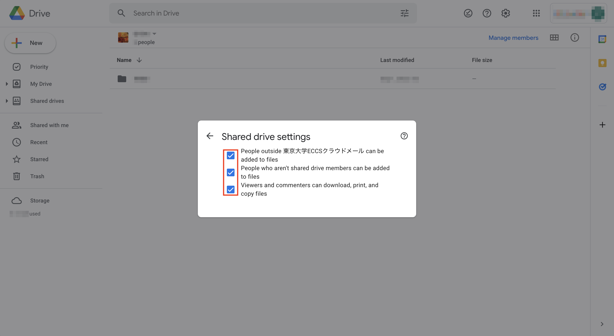
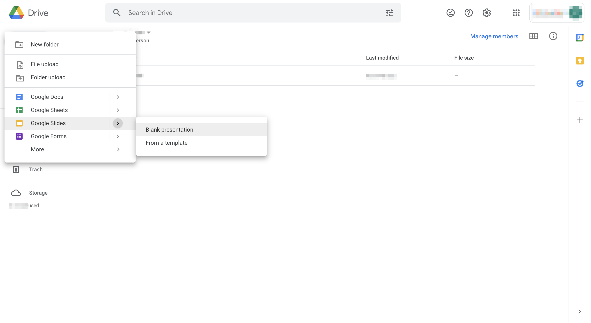

## What is Google Drive?

### Description of the Application

Google Drive is a cloud service provided by Google Inc, which allows you to store photos, videos, files, etc. safely and share them in various ways.

### Google Account of the University of Tokyo (ECCS Cloud Email Account)

Members of the University of Tokyo can use Google Drive with their UTokyo Google account (hereinafter referred to as ECCS Cloud Email Account). ECCS Cloud Email Account is a paid account, and has the following differences from the free account for individuals.

* In contrast to the 15 GB storage capacity limit for each personal free account, you can use up to 100 GB of capacity with your ECCS Cloud Eail account, at no extra cost to you.
* You can restrict file sharing in ’My Drive' and shared drives to ECCS Cloud Email Account holders through settings.
* You can become an administrator of the shared drive with a ECCS Cloud Email Account but not with a free personal account.

If you do not have an ECCS Cloud Email Account, please refer to the following article.    
[ECCS Cloud Email (Google Workspace)](/en/eccs_cloud_email)

The following explanation assumes that you are logged in to Google Drive with an ECCS Cloud Email Account.

### How to Start and Operate

Go to [My Drive - Google Drive](https://drive.google.com/drive/u/0/my-drive) and log in with your ECCS Cloud Email Account.
Then, the following screen will be displayed.

#### My Drive

The account holder can add, edit, move, and delete files, as well as share files and folders.

<figure>

</figure>

* **(1) Candidate List**: This shows shared items and files in shared drives in addition to files in My Drive. Information on when the file was last edited and the editor is shown below the file name.
* **(2) Folders**: A list of folders that you have created will be displayed here. However, even if you are not the creator, files uploaded through other Google applications (e.g. Google Classroom) may be automatically grouped into folders.
* **(3) File**: Here you can see a list of files that you have uploaded. However, even if you do not upload them, files uploaded through other Google applications (e.g. Google Form) will also be displayed here.
* **(4) Display switching**: You can switch between gallery view and list view.
* **(5) Detailed view**: When you click here without selecting any files, you can see the history of editing and moving files in My Drive. If you click on a file while it is selected, its properties and history will be displayed.
* **(6) Google Apps**: Click here to see a list of Google Apps (Google Docs, Google Slides, etc.). It is possible to move to other applications with the same account. You can also move to the account settings screen from here.
* **(7) Add-on acquisition**: It is possible to use other applications on Google Drive, such as synchronization with Google Calendar.
* **(8) Change Account**: Click here to set up your account, add an account, or log out.

For more details about the use of Google Drive, please refer to the official support page.
* [How to use Google Drive - PC - Google Drive Help](https://support.google.com/drive/answer/2424384?hl=en&co=GENIE.Platform=Desktop)

#### Shared Drive
{:#share_drive}
 
With a shared drive, you can manage files in the drive within your organization. The administrator can grant 5 levels of permissions to members, and can set permissions based on the user's affiliation and job description. If you log in with your ECCS Cloud Email Account, you can use the university shared drive. However, if you log in with your personal account, you are restricted from accessing it.

<figure>

</figure>

Shared drives access levels:
	
* **Managerr**: A manager has the highest privilege in the shared drive. You can control the files, members, and settings on the shared drive. (In the case of Google Group, only yourself would be the administrator.)
* **Content Manager**: You can add, edit, move, and delete files. You can add, edit, move, and delete files. However, you cannot manage members and shared drive settings.
* **Contributor**: Can add and edit files. However, it is not possible to move files within the shared drive.
* **Commenter**: You can view and comment on the file. However, you may not be able to download the file depending on the file sharing settings.
* **Viewer**: You can view the file. However, you may not be able to download the file depending on the file sharing settings.

For further details, please refer to the following website. 
* [Overview: What is Shared Drive - Google Workspace Learning Center](https://support.google.com/a/users/answer/9310156?hl=en&ref_topic=9300128)

#### Shared Items

You can see the files and folders that you have shared or that have been shared with you. In a shared drive, the manager has all the rights to files and folders, but in a shared item, the owner (account owner) has all the rights to the files and folders because they are in My Drive of the shared user.

### Differences between My Drive and Shared Drive

#### Features of My Drive

* If the file owner’s account expires, the file will be lost.
* You can share a file by registering the Google account of the person you want to share it with, or simply by sending a link.
* If you want to share a specific file with a specific person, it is recommended to use "My Drive".

#### Features of the Shared Drive

* Files will remain in the shared drive even if the file owner's account expires. The owner must actually delete the file.
* Upon sharing, it is necessary to register Google accounts of all the people with whom the file is shared, because sharing by links is not allowed.
* If you want to share files systematically for a long period of time, it is recommended to use "Shared Drive".

## How to Share Files in My Drive

This section explains how to set the sharing options in My Drive.

1. **Select or create a file to share** 
   1. Log in to [My Drive - Google Drive](https://drive.google.com/drive/u/0/my-drive) using your university Google account (ECCS Cloud Email Account), and open My Drive. 
   2. Select or create the file you want to share. If you are creating a file, click the New button in the upper left corner and create the necessary file. 
   3. When the file you want to share is selected, click the share icon. 
2. **Share the file**: You can share the file by registering the Google account of the person you want to share with, or simply by copying the link and sending it to that person. 
3. **Choose who you want to share the file with and what permissions they have**: After Step 1, click the "Change" button under the "Get Link" column to change the permissions of the person you want to share the file with. 
    1. You can choose who to share the file with from the following. However, we do not recommend the "only those who know the link" restriction, because it is the same as public sharing if even one of those people divulges the link. Also, you can easily manage permissions by creating folders with different sharing ranges depending on the purpose, and creating files under those folders, rather than setting sharing settings for each file.  
       * University of Tokyo ECCS Cloud Email: All users who are logged in with University of Tokyo ECCS Cloud Email and know the link can view it.  
       * Restricted: A setting that allows only specific people to share the link (a setting that allows only individual users or group members to view the link).  
       * Everyone who knows the link: All people who know the link can see it.   
    2. You can choose the permissions of the people you are sharing the link with from the following.  
        * Viewer: Users can view the file, but cannot modify it or share it with other users.  
        * Commenter: Users can make comments and suggestions, but cannot modify the file or share it with other users.  
        * Editors: Users can make changes, accept or reject suggestions, and share the file with other users.   
4. **Stop or change file sharing**: Go back to Step 3 and apply the appropriate restrictions.

## How to Share Files in a Shared Drive

<strong class="box">
  In August 2023, the method for creating shared drives in ECCS Cloud Email was changed. The description in this article refers to the method used before that time. For information on the new creation method, please see the <a href="https://www.ecc.u-tokyo.ac.jp/en/announcement/2023/12/27_3602.html">"ECCS Storage Management System."</a>
</strong>

The following is an explanation of the process of sharing documents in actual classes. Please try it for group work. 

1. **Create a shared drive**: Log in to [My Drive - Google Drive](https://drive.google.com/drive/u/0/my-drive) using your university Google account (ECCS Cloud Email Account), select the shared drive, and create a new shared folder. 
2. **Register members and set their permissions**: Open the shared folder you created and click the Manage Members button at the top right to register the ECCS Cloud Email Accounts of all the members you want to share with. Then set up the members’ permission.   Please note that free individual accounts can also be added as members, but not as administrators.    (For more information on permission, see the [above section](#share_drive)). 
3. **Setting up the shared drive**: Click the setting icon displayed in the upper right corner of the screen when managing members in Step 2 to set up the shared drive.  
4. **How to share documents**: Open the shared folder, click the "New" button on the upper left, and then select the google tool you want to use. 

(Caution) Setup in Step 2 and Step 3 can be changed later, but only the administrator can make these changes.

## Tips

### About Sharing Files

In Google Drive, it is possible to upload files of any format such as documents, presentations, music, photos, and videos.
However, it is recommended to use Google Spreadsheet, Google Docs, or OneDrive because editing Excel or Word files uploaded on the drive may cause problems such as garbled characters.

### Offline Mode

When using Google Drive, certain file formats can be used offline. The following is a summary of the offline mode of various file formats.

#### For Use on a Computer

##### Files of Google Services such as Google Docs, Google Slides, etc.

You need to use Google Chrome browser. 

1. Connect to the Internet and open Google Chrome browser. 
2. Install [Offline Chrome extension for Google Docs](https://chrome.google.com/webstore/detail/google-docs-offline/ghbmnnjooekpmoecnnnilnnbdlolhkhi). 
3. Open [Google Drive](https://drive.google.com/), and click the setting icon on the upper right. 
4. Turn on [Offline]. 
5. This setting allows you to view and edit files even when you are offline. If you are connected to the Internet, your edits will be synchronized.

##### PDF and Photo Files

PDF and photo files cannot be used offline on a PC, so you need to download them to your device beforehand.

#### For Use on a Smartphone

You need to install the google drive application.
Please refer to the following for details.

[Working with google files offline](https://support.google.com/drive/answer/2375012?co=GENIE.Platform%3DAndroid&hl=en)

### How to Set Up a Default Account

When you use Google's services, you may be automatically signed in with your personal Google account instead of your university's ECCS Cloud Email Account. If you want to change the default account, click the account icon, log out from all accounts, and then log in with the account you want to use by default.

### Using Google Groups

If you want to share folders and files on your My Drive or shared drive with other users, you can create a Google Group with your class members. This allows you to share on a group basis, and also makes it easier to manage permission.
For more details, please refer to the following web page.
* [Create a group and select group settings - Google Groups Help](https://support.google.com/groups/answer/2464926?hl=en)

