## Highlights of This Article

This article introduces how to create quizzes and surveys using Google Forms.
* Applicable situations:
  * To conduct quizzes and surveys in an online class
  * To grade quizzes automatically to save time
  * To take attendance and serve as reaction papers (minutes)
  * To maintain fairness in online testing
* Notes on use:
  * Line by line customizing (adjusting width and changing caption fonts) is difficult. 
  * Long, descriptive questions, such as open-ended responses, are not suitable for automated scoring.
  * When a large number of people access the form at the same time, it may become slow or login may not be possible. (It is possible to deal with it by separating the form URLs in a lecture with 100 or more students.)

## About Google Forms

Google Forms is a tool provided by Google that allows you to easily create questionnaires, polls, and quizzes.

- Provider: Google
- Available Environment
    - Device and OS: PC, smartphone, or tablet with a Google account
    - Drive space required for installation: 0 bytes (if you have a Google account, you can use it from a browser without installing an application; if you have an ECCS Cloud Email account, there is no limitation in use.) 
- Operation Cost
    - Cost: Free for ECCS Cloud Email accounts
    - Prior preparation: Simply access the URL provided (Google account login is essential for file upload)

## How to Start

If you are logged in to your Google account (ECCS Cloud Email account), you can use the application from your browser (the following explanation assumes that you are logged in to your ECCS Cloud Email account).

※For information on how to use your ECCS Cloud  Email account, see "[ECCS Cloud Email](/en/google/)" in the "Initial Setup Procedures" section.

On the Google page, click the square with six dots next to your Google account icon in the upper right corner, and then "Forms" to start.

<figure>

</figure>

## Basic Use (Quiz)

In this section, we will show you how to create a quiz.

### Steps to Create a Quiz

#### Open a Google Form

In the "Start a new form" field, click the leftmost "Blank Quiz" button.

<figure>

</figure>

After clicking, you will see a screen like the one below.

<figure>

</figure>

#### Setting up as a Quiz

Click on the Settings (the blue circle in the picture below) and turn on the "Make this a quiz". If you turn on "Make this a quiz", you can use automatic scoring (see [Apply automatic scoring](#apply-automatic-scoring)). You can also set the method of grade disclosure and other options.

<figure>
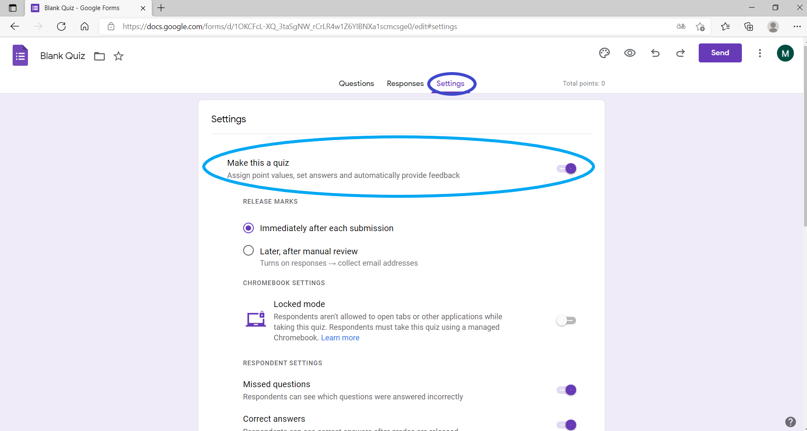
</figure>

#### Create a Question

##### Create Single-choice Questions with “Multiple Choice”

Click on the arrow icon on the right of the question form (the red circle as shown in the image below) and select "Multiple Choice". Enter the question in the green frame and answers in the light blue frame.

<figure>
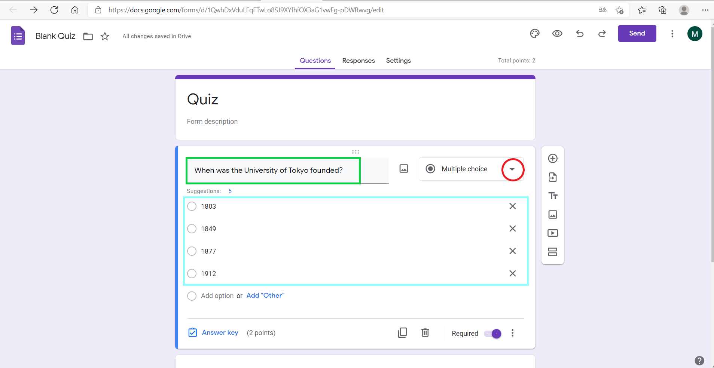
</figure>

Click on the "︙" (a red circle in the lower right corner), and select "Shuffle row order".

<figure>
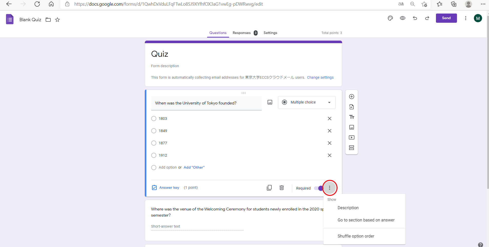
</figure>

※Automatic grading is possible. For details, see [Apply automatic scoring](#apply-automatic-scoring).

##### Create multiple answer questions with "Checkboxes"

Selecting the "Checkboxes" icon (the red circle in the image below) on the right side of the arrow allows you to select multiple choices.

To input questions and answers, follow the same procedure as creating single-choice questions with the “Multiple Choice” function.

Shuffling answer order is possible.

※Automatic grading is available. For details, see [Apply automatic scoring](#apply-automatic-scoring).

##### Create short descriptive questions with "Short answer" 

Select "Short answer" from the down arrow icon on the right (refer to the red circle in the image below). 

Enter a question in the green frame below.

<figure>

</figure>

##### Create long descriptive questions with "Paragraph".

Select "Paragraph" from the arrow icon on the right (the red circle in the image above).

To prevent answers from being deleted mistakenly while inputting, it is recommended to write answers in a separate file on students’ computers before copying and pasting to Google Forms. (For details, see [Prof. Yotsumoto's Good Practice (only in Japanese)](/good-practice/interview/yotsumoto)).

Note that the automatic grading function (explanation in next section) cannot be used for paragraph questions.

##### Apply automatic scoring
{:#apply-automatic-scoring}

In Google Forms, you can enter model answers in advance for automatic scoring. Despite that such function is inapplicable to paragraph questions (e.g. long descriptive questions), it is useful for multiple choice and short answer questions (e.g. calculated formula questions).

Click "Create Answer key" at the bottom left.

<figure>

</figure>

Fill in, select the correct answers and set the score.

<figure>
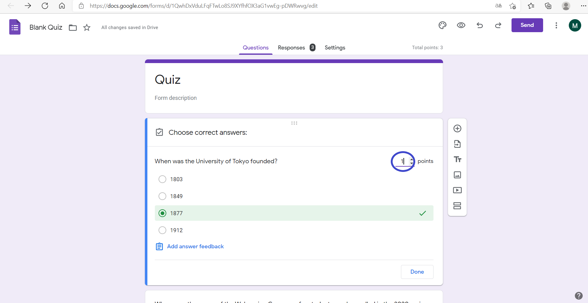
</figure>

Add explanatory text, links, or videos by clicking "Add answer feedback" if deemed necessary.

<figure>
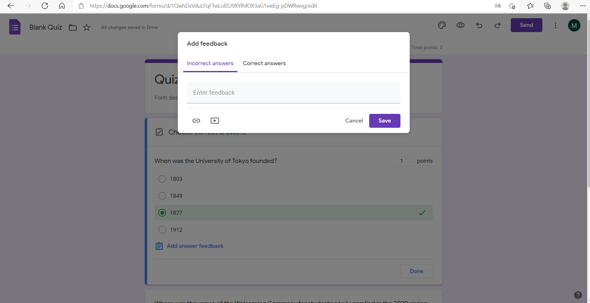
</figure>

Change your preference on  "Release Marks" and "Respondents Settings" from “Settings".

<figure>

</figure>

#### Add a question/section

If you want to add more questions, click on the right cross button icon (the light blue circle in the image below). If you want to add more sections, click on the icon with two squares (the green circle in the image below).

<figure>
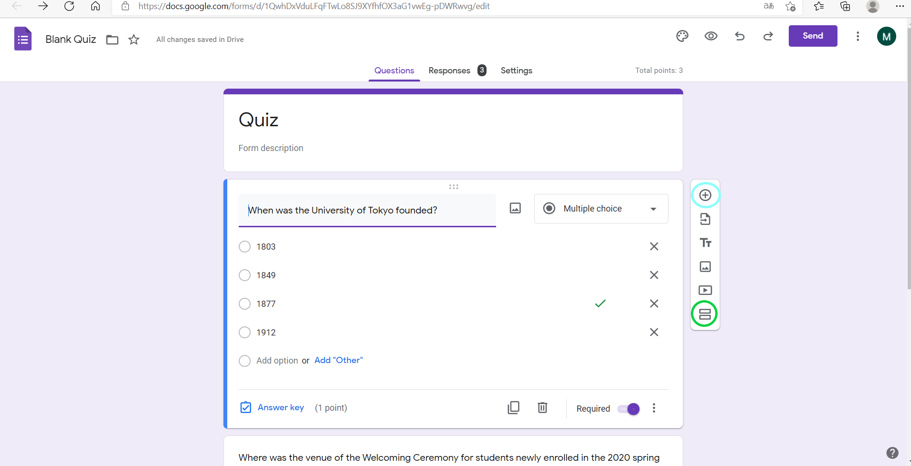
</figure>

You can also shuffle the test questions themselves by clicking “Settings” (the light blue rectangle in the image below) and turning on  the "Shuffle question order" under “Presentation” (shuffling question order is effective in preventing cheating).

<figure>
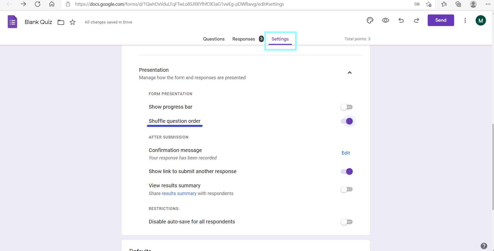
</figure>

#### Public settings

Public setting limits the respondents to UTokyo members only, or allows students to check their answers after submission.
If you do not want to do this, you can skip this section.

##### Restrict respondents to UTokyo members only (ECCS Cloud Email account holders)

1. Click on “Settings” (the red circle in the image below) and open “Responses”.
2. Make sure that the "Restrict to users in 東京大学ECCSクラウドメール and its trusted organisations" is turned on. If you turn on "Collect email addresses", the ECCS email address of respondents will be automatically recorded.

<figure>
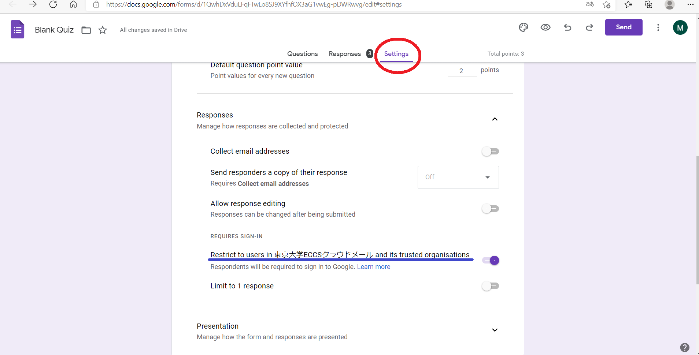
</figure>

##### Allow answer checking after submission

Click on “Settings” (the red circle  below), open “Responses”, turn on “Collect email addresses”, select “Always” for “Send responders a copy of their response”.

<figure>
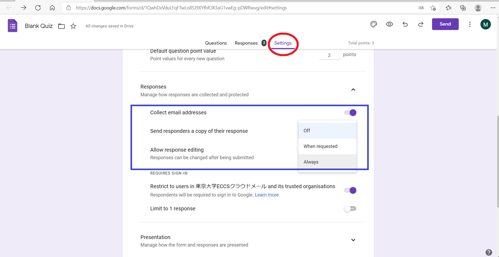
</figure>

### Steps for Implementation

#### Preview your quiz before sharing

Click on the eye symbol icon on the right (the red circle below) to preview  your quiz before sharing.

<figure>

</figure>

#### Share your Google Form

Click "Send" on the right, and then the link symbol (the blue circle in below) to retrieve the link. You can copy and paste it into the chat box of UTOL or Zoom.

In a large class, it is suggested to duplicate the form for access divide to avoid link breakdown due to heavy internet traffic. For more details, see [Prof. Yotsumoto's Good Practice (only in Japanese)](/good-practice/interview/yotsumoto).

<figure>

</figure>

Note: "Add collaborators" option appears when you click on the "︙" button next to “Send”. This allows you to add users who can create questions or check the results. In other words, they share the same management controls with the form creator. Note that this "Get Link" is for form editing but not answering.

#### End the quiz

<figure>

</figure>

When time is up, click "Responses" (the red circle above) to turn off "Accepting responses" (the blue circle above) to end your quiz.

If you end the quiz just on time, some students may receive zero points even though their answers are submitted within the test time due to Internet congestion.
(For details, please refer to [Tips on Actual Implementation](#implementation_tips) below.)

### Check the results

Click on "Responses" (the red circle below) to view respondents’ answers.

(1) Summary: Answers in summary

(2) Question: Detailed answers for each question

(3) Individual: Answers for individual respondents

A downloadable spreadsheet containing all answers can be generated by clicking the spreadsheet icon (the orange circle in the image below).

<figure>
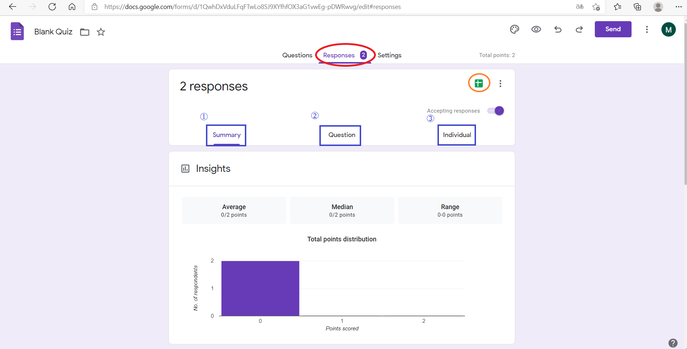
</figure>

## Basic Use (Questionnaire)

To use Google Forms as a questionnaire, turn off "Make this a quiz" in Settings. Matrix questions such as 5-point likert scale questions are useful for qualtrics surveys.

Below are steps to create a matrix questionnaire. 

1. Click the arrow symbol on the right (the red circle in the image below) and select "Multiple-choice grid".
2. Enter questions in “Rows” and choices in “Columns”.

<figure>
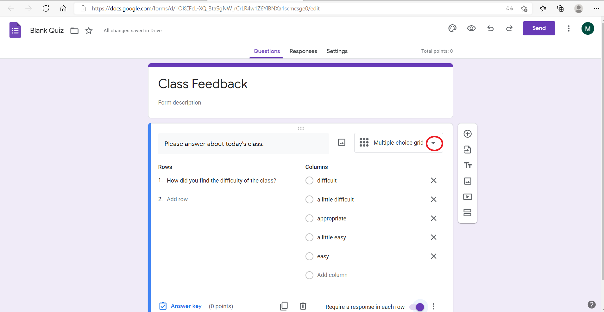
</figure>

## Basic Use (Others)

* Google Forms facilitate class interaction by enabling real time collection and sharing of responses among students.
* It can serve as a means for reaction papers to collect students’ feedback on class.
* It can serve as a means for attendance taking by requesting submission in class.
* It can serve as a means for peer assessment of student presentations and group work (Source: [Online Class Information Exchange Meeting #6 (only in Japanese)](/events/luncheon/2020-05-20/)).

    Check out how to use rubrics for peer assessment here. → [Todai FD (only in Japanese)](https://www.utokyofd.com/en/?mov=kn-40)

## Tips on Actual Implementation
{:#implementation_tips}

[Professor Hisashi Ohtsuki - Adaptive Behavior Theory (only in Japanese)](/good-practice/interview/ohtsuki)  ([Online Class Information Exchange #26 (only in Japanese)](/events/luncheon/2021-01-15/))

There were more than 600 students in Professor Ohtsuki's class and he conducted Google Forms quizzes twice per class. Here are his tips.

### Tip 1: Create multiple test URLs

It has been reported that when hundreds of people access a single form URL at the same time, the form stops working. Therefore, he prepared three URLs with the same set of questions, and asked students to choose one to answer to divide access.

### Tip 2: Conduct prior testing with students

To be prepared for any unforeseen circumstances, he had his students answer a sample Google Form questionnaire before the actual test to double check everything.

### Tip 3: Ensure fairness

Even with the aforementioned measures in place, problems such as students being unable to access the system still occur. Therefore, he set up rules for follow-up tests to ensure assessment fairness.
