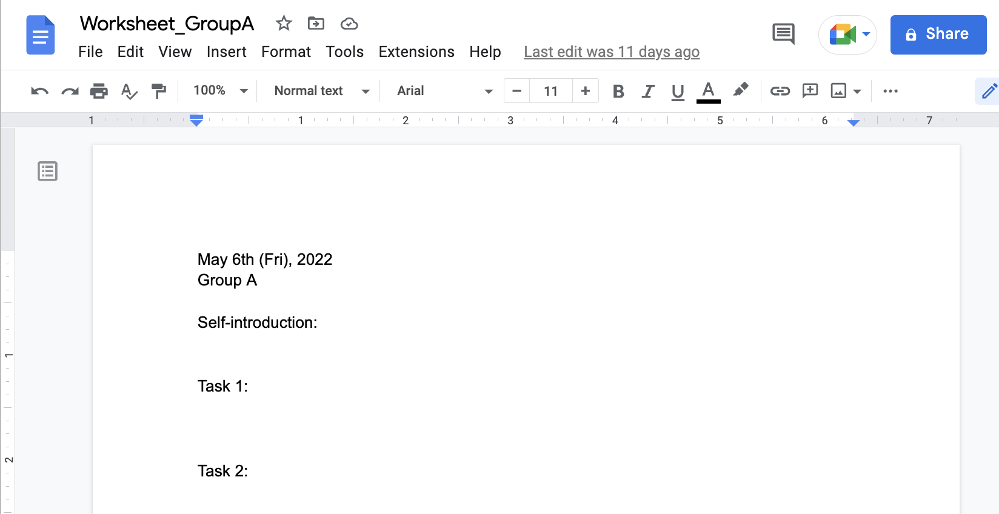
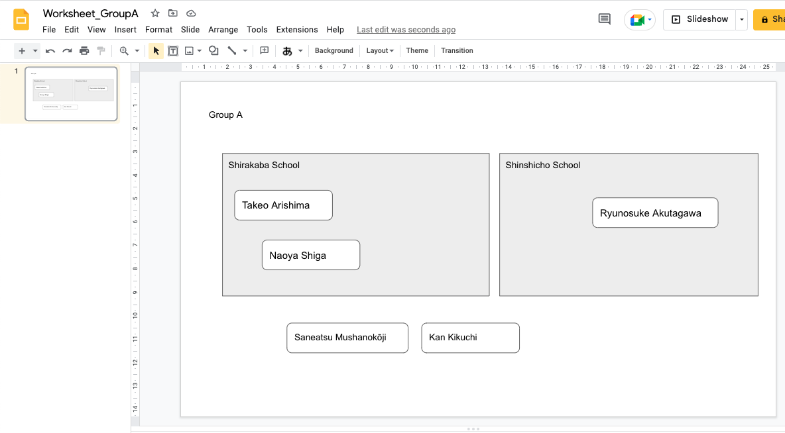
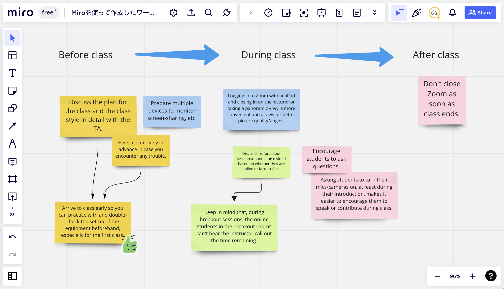

A breakout function is commonly used for group discussions in online classes. In a face-to-face class, the instructor can look around the entire classroom and see the groups. By contrast, each breakout room is a separate room, and there is no way for the instructor to directly see the progress of each group's discussion while in the main room (it is possible to directly participate in each breakout room to see what is going on).  

One way for the instructor to stay in the main room and indirectly see what is going on in each group is by sharing worksheets using cloud tools.  

During the discussion, students can record their discussion notes and results of their work on the worksheets. The instructor can see the progress of each group by viewing the worksheets in real time.  

In addition, worksheets can be saved on to the cloud to serve as a record of activities, which can be useful for sharing, reviewing, and providing feedback.  

☞ Extra tip: Please refer to the following page for detailed instructions and notes on using breakout discussions.  

* Zoom: [Zoom ブレークアウトルーム機能を使う (in Japanese)](/zoom/usage/breakout/)｜utelecon
* [Problems That Tend to Arise in Online Group Discussions and Suggested Solutions](/en/articles/group-discussion/)

## Use the Right Cloud Tools for Your Purpose

To allow multiple people to write simultaneously and have the instructor to view them in real time, we recommend using a cloud tool.  

### Tools Suited for Recording Minutes

In actual online classes, word-processing tools such as Google Docs and Google Slides are often used. These tools are easy to use for many students, as they can be used simply by typing text on a blank document.  

〈Example of a worksheet created in Google Docs〉

〈Example of a worksheet created with Google Slides〉

### Tools That Can Substitute as a Whiteboard

To visualize the process of brainstorming (gathering opinions), it is recommended to use online tools that can reproduce the process of posting sticky notes on a whiteboard and that can be operated by multiple people simultaneously.  

[Padlet](https://padlet.com/dashboard), and [Miro](https://miro.com/ja/) are examples of such tools. Miro is particularly useful because it is easy to use and can handle complicated drawings.  

〈Example of a worksheet created using Miro〉

## Prepare the Worksheets You Will Provide in Advance

Prepare a worksheet template in advance according to the number of groups so that discussions can begin as soon as the URL is distributed.  

### Worksheet Content

For example, the contents of the worksheet could include the following:  

#### Content

* Information such as class title, date, group number, and names of participants
* Outline of the assignment, questions, time required, etc. (useful as a reminder for students)  

#### Style
* Fill-in-the-blank or question-and-answer format
* A description of the issues or points to be discussed
* A mostly blank sheet of paper  

The format should be appropriate for the content of the assignment, its purpose, and the students' level of proficiency.  

〈Example of worksheet content (one sheet per group assigned on Google Slides)〉

### Worksheet Format

When using work-processing tools such as Google Slides or Google Docs, there are two ways to have groups create documents: assigning one file per group, or assigning one page (one sheet) per group within a single file.  

Choose the appropriate method based on the characteristics of each method.  

#### Using One File Per Group

Pros:

* Each group will have its own deliverables.
* If groups do not change throughout the semester, the same files can be used continuously.  

Cons:

* Instructors need to open multiple files (tabs) on the browser at the same time and move back and forth between them when viewing the files during discussion.
* When students want to see what is going on in other groups, they need to open the other files and read them.  

#### Using Separate Pages Per Group Within a Single File

Pros:

* Instructors can open a single file and view all of the groups.
* Students can easily view the contents of other groups in the same file.  

Cons:

* Students can mistakenly edit the pages used by other groups.
* When editing documents instead of slides, students may find their pages shifting suddenly and becoming difficult to read because people in earlier numbered groups are filling in their pages while they are filling in theirs. (You can try to insert a page break, but this does not completely solve the problem).  

☞ Extra tip: If duplicating sheets with the same content over and over again for each group or class session is a hassle, there is a simple programming technique called Google Apps Script (a.k.a. GAS) that can be used to automate the process. Please refer to utelecon "[How to Copy Files and Folders on Google Drive Using GAS (in Japanese)](/articles/gas/copy)”.  

## Intervene if Needed

When browsing through the worksheet, you may notice, for example,  

* Groups that do not seem to be making much progress in their writing, and do not seem to be having very active discussions.
* Groups that seem to be making interesting notes.  

If the teacher finds something of concern, there are several ways to intervene in the group.  

### Participate in the Breakout Yourself

After the breakout room has started, the organizer can move to any group of his/her choice. (Zoom, Webex, and Google Meet all allow this.)  

### Write Comments on the Worksheet

If the worksheet is in Google Docs, the teacher can post on it at the same time as the students. This can be used as an alternative to chatting, as you can text directly to the students, make comments on the fly when you find something of interest, or offer hints or additional instructions.  

〈Example of instructors's comments on worksheets〉

## Utilizing the Worksheet After Discussion

### Using it for General Sharing After Discussion

Since the worksheets provide a summary of the discussion of each group, they can also be used for sharing, consolidation of opinions, and question-and-answer time after the discussion is over.  

Each group can share their screen when they present their discussions and opinions and groups can also add comments to each other's worksheets. (Teachers should take the initiative to add comments first, or provide examples of comments, which can make it easier for students to add their own comments and stimulates discussion.)  

### Using It as a Record

By saving the worksheets to the cloud, students can easily review them after class.  

For students, it can serve as a record of their learning. For teachers, it can be used as reference material for grading and for future classes.  

## Summary

In this article, we described how worksheets can be used to conduct online group discussions.  

The format and use of the worksheet may vary depending on the content of the assignment, the number of students, and the nature of the assignment. It is a good idea to seek the best format while frequently obtaining feedback from students.  

## Related Articles

[Problems That Tend to Arise in Online Group Discussions and Suggested Solutions](/en/articles/group-discussion/)  

[How to Copy Files and Folders on Google Drive Using GAS (in Japanese)](/articles/gas/copy)  

[Search Online Resources by Tool](/en/online/tools)  

[Using the Breakout Room in Zoom (in Japanese)](/zoom/usage/breakout/)  

[Online Class Information Exchange Session 1: Doing Groupwork (1) (in Japanese)](/events/luncheon/2020-04-22/)  

[Online Class Information Exchange Session 11: Useful Tools for Online Classes (1) (in Japanese)](/events/luncheon/2020-06-24/)
