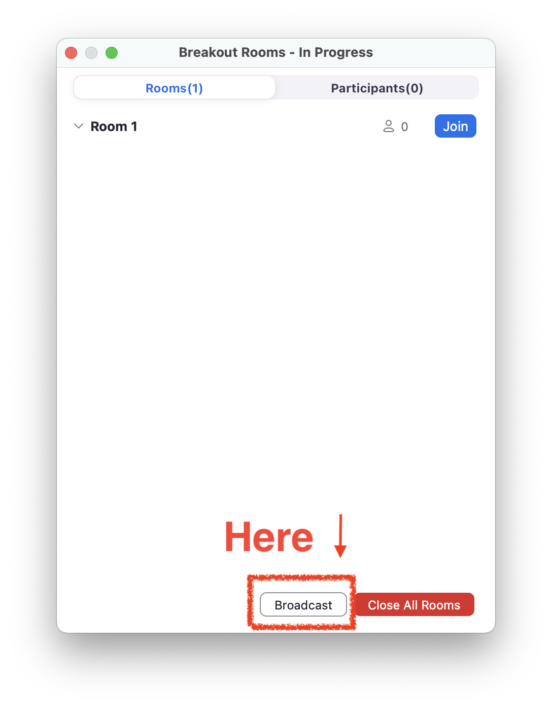

## Breakout Rooms Are Useful for Online Group Discussions

When conducting online classes using a web conferencing system, or group discussions in an online conference, it is convenient to use features that allow you to assign participants to several rooms.  

For example, Zoom's "Breakout Rooms" and Google Meet and Webex's "Breakout Sessions" allow participants to move from the main room to individual rooms for group discussions. (In the following, these features are collectively referred to as “breakouts.”))  

☞For detailed instructions on how to use the Breakout feature, please refer to the following page.  

* Zoom: [Using the Breakout Room Function in Zoom (in Japanese)](/zoom/usage/breakout/)｜utelecon
* Google Meet: [Using Breakout Sessions in Google Meet](https://support.google.com/meet/answer/10099500?hl=ja)
* Webex: [Things You Can Do in Webex Meetings and Webex Webinars (as Host/Participant)](/en/webex/do_webex)｜utelecon

## Unexpected Difficulties with Using Breakout Rooms?

Breakout group discussions are often used in online classes and conferences. However, while it is a useful feature, it has some difficulties that are unique to online discussions and that are not present in face-to-face meetings.  

As part of our activities as [Online Education Supporters](/en/about/oes), we discussed the difficulties we experienced in online classes with other members. During these discussions, members frequently mentioned “having trouble with group discussions."  

For example, the following comments were received.  

### It is Difficult to Start Talking in Online Discussions

When you move to the room to which you are assigned, you will usually find that everyone has muted their cameras and microphones. In such a situation, we tend to feel a lot of pressure and hesitate to initiate a conversation with someone we have never met before.  

“Since you can’t see what the other side is doing, you’re not sure how to proceed and the conversation can’t proceed smoothly.” In some extreme cases, “the time limit passed without any of the group members speaking.”  

### Rooms Are Blocked Off From Each Other and There’s No Interaction Between Them

The advantage of a breakout is that each breakout room is independent and we can have discussions without being distracted by other groups' conversations. At the same time, however, this also means that the participants cannot see what is going on in each other's breakout room.  

Let's imagine a group discussion in a face-to-face class. The instructor has a panoramic view of the entire classroom and can offer hints and advice along the way, or enter a group that is not progressing smoothly and encourage conversation. Students can review the assignment posted on the blackboard or screen during the discussion, or stop the instructor to ask questions. A reluctant group may be inspired by the lively atmosphere of a more active group, and the entire classroom may eventually come alive.  

In breakout sessions, it is not easy to do this. For example, as described in the previous section, a group that is not making progress smoothly in a discussion often remains completely unnoticed and unassisted from the outside.  

## Introducing Possible Solutions

Online Education Supporters have been working mainly online, and almost all of our meetings have been conducted using Zoom. In this section, we will introduce some ideas and practices from our daily activities as potential solutions to the previously mentioned difficulties with breakouts.  

### Make Sure Each Group Has the Appropriate Number of People

Generally, it is good to limit the number of participants in a face-to-face group discussion to five or six to make it more productive. This is because as the number of participants increases, each person has less time to speak and so can contribute less, and it is more difficult to achieve consensus among a large number of people.  

In many cases, especially in online sessions, participants often start the session without knowing each other's faces or how to get along with each other, and It may facilitate the progression among participants to keep the number of participants to three or four.  

However, if the number of participants is reduced too much, there is a risk that, when some people lose their Zoom connection or do not speak, the number of remaining participants will be extremely small.  

You should determine the appropriate number of students by consulting feedback from students as the course progresses, taking into consideration the level of proficiency of the students and the objectives of the class.  

### Tips That Can be Implemented Before the Breakout Begins: Give All Necessary Instructions

The organizer should do their best to provide clear instructions and detailed explanations  before starting the breakout. This will make it easier for participants to start the discussion smoothly.  

The following are examples of information that should be explained in advance.  

#### Present the Ground Rules

Before starting a discussion, it is important to share the ground rules, such as policies that participants should keep in mind to make the discussion go smoothly. This allows participants to understand what kind of attitude is expected of them in the discussion. (This advice is not limited to online classes.)   

Examples of such rules are as follows:  

* Listen carefully to the other party's opinion.
* Try to keep your comments constructive.
* Turn on video if possible.

#### Indicate the Time Required

Participants are encouraged to make the most efficient use of their time, by being aware of the time allotted for discussion and the ending time. (Zoom has a timer function (e.g., "[How Timers Work in Zoom (in Japanese)](/zoom/usage/breakout/#オプションの設定)") that allows you to specify a time limit for the breakout.)  

#### Let Participants Know the Type of Output You Are Looking for

If participants are expected to share the results of their discussion afterwards (e.g., after the discussion ends, the participants must give a presentation to the whole group or complete a  specific task), letting them know the type of output in advance will make it easier for them to participate in the discussion with a clear sense of purpose.  

If the meeting is conducted without sufficient explanation, participants may be upset later, saying, "I just talked aimlessly because I did not expect to share it with the whole group," or “I did not take any notes.”  

For example, if the organizer announces in advance, “We will have a one-minute presentation of what the group has discussed, followed by a critique and Q&A session among the groups,” participants can summarize their main points of view and decide who will present them within the allotted time.  

#### There Are Some Cases Where It Is Good to Give Specific Instructions on How to Proceed

It is easier for participants to start talking without hesitation if you specify not only the topic or issue to be discussed, but also the general flow of discussion.  

For example, the following methods are often used in online classes and workshops:  

* If this is the first time the members are working together, ask them to spend the first few minutes introducing themselves and chatting to get to know each other.
* To make the discussion go smoothly, assign roles such as a facilitator and a minute-taker.

#### Present an Overview of the Discussion in Visual and Auditory Form

Some participants may have difficulty understanding and remembering verbal instructions or visual information instantly, and the online environment may exacerbate these characteristics.  

It would be helpful if the general guidelines and instructions of the discussion are displayed on a single slide or other image and shared on the screen. The same information should also be read aloud.  

Example of a slide summarizing instructions for the group discussion:  

#### Ask Each Person to Save a Summary of the Discussion

Since participants often forget what to do after they get to the breakout room, you may want to encourage them to take screenshots or notes of the instructions for themselves.  

Alternatively, if the instructor can transcribe the same content into the chat, it is convenient for participants since they can copy the text data and keep it for themselves. (Please note that you will not be able to see the chat in the main room once you move to the breakout room.)  

☞ Extra tip:

With Zoom, you can share your screen with the breakout room.

Zoom now allows screen sharing from the main room to each breakout room (a new feature added in June 2021).

You can use screen sharing to show the aforementioned guidelines and instructions page, as well as pages with additional instructions.

Share your screen with breakout rooms by opening this window:

However, note that if you enable screen sharing from the main room while someone is sharing their screen in the breakout room, the screen sharing in the breakout room will be disabled. Also, if you enable screen sharing in the main room, participants in the breakout room will not be able to share screens. (Remember to stop screen sharing from the main room when it is no longer necessary to do so.) 

### Tips for During Breakouts: Use of Worksheets

One good way for organizers in the main meeting room to keep track of the progress of breakout discussions is to share an online worksheet. As participants discuss, they can enter the proceedings and results of their tasks on the worksheet using a cloud tool. The organizer can indirectly track the progress of each group by viewing the worksheets as they are being filled out in real time.  

☞ You can also refer to "[Using Worksheets in Online Group Discussions](/en/articles/group-discussion-worksheet)," which provides detailed examples of how to create and use worksheets.   

Let’s say that the organizer is browsing through the worksheets during the discussions and notices the following:  

* A group does not seem to be very active in the discussion, as there is not a lot of writing going on.
* A group is making interesting posts.

If the organizer spots such irregularities, it may be a good idea for him/her to intervene with the group.  

### Tips for During Breakouts: Intervention by the Organizers

When necessary, the organizer may intervene in the breakout using the following methods.  

#### The Organizer Takes Part in the Breakout

After the breakout has started, the organizer can also move to any group of his/her own choosing. (This is possible whether you are using Zoom, Webex, and Google Meet.)  

#### The Organizer Writes Comments on the Worksheet

The worksheet in the cloud tool allows the organizer to fill out the worksheet at the same time as students. This can be used as an alternative to chat, as it allows for direct text communication, such as commenting on a statement of interest on the spot or offering hints or additional instructions.  

#### Points to Keep in Mind When Intervening

In some cases, students said, "I was so nervous that I could not express my opinions as I intended because a professor or a senior graduate student suddenly entered the breakout session.  

If an instructor (e.g., a member who is more senior than the participant) is scheduled to provide assistance, it may be helpful to give notice in advance.  

☞ Extra tip:

Zoom lets you send messages to breakout rooms!

During a breakout, it is not possible to chat with participants in the main room or other breakout rooms. However, if you are the meeting host, you can use the "Send Message to All" feature to send a text message to all participants, including those in the breakout room.

After starting the breakout, click the "Breakout Rooms" button, and then click the "Broadcast a message to alll" button in the breakout operation window that pops up to send a message.

Messages can only be sent in one direction from the host to participants. Messages cannot be sent from a participant to the host, nor from one participant to another. Messages are displayed as a notification at the top of the participant's window, not in the chat area.

For example, it is useful for announcing "You have XX minutes left” or for giving additional hints.

## Summary

In this article, we have described some of the difficulties in conducting group discussions online, the problems that can occur, and some relatively easy solutions.  

There is not necessarily a single right answer, as the appropriate method depends on the format of the meeting or class, the topic of discussion, the difficulty of the assignment, and the number and nature of the students. For example, in the case of a class, it is best to seek a format that is comfortable for both faculty and students, while frequently obtaining feedback from students throughout the semester.  

## Related Articles

[Using Worksheets in Online Group Discussions](/en/articles/group-discussion-worksheet/)  

[How to Duplicate Files and Folders in Google Drive Using GAS (in Japanese)](/articles/gas/copy)  

[Using the Zoom Breakout Room Feature (in Japanese)](/zoom/usage/breakout/)   

[Online Class Information Exchange Meeting No. 1: Doing Group Work (1) (in Japanese)](/events/luncheon/2020-04-22/)  

[Online Class Information Exchange Meeting No. 11: Tools for Online Classes (1) (in Japanese)](/events/luncheon/2020-06-24/)
