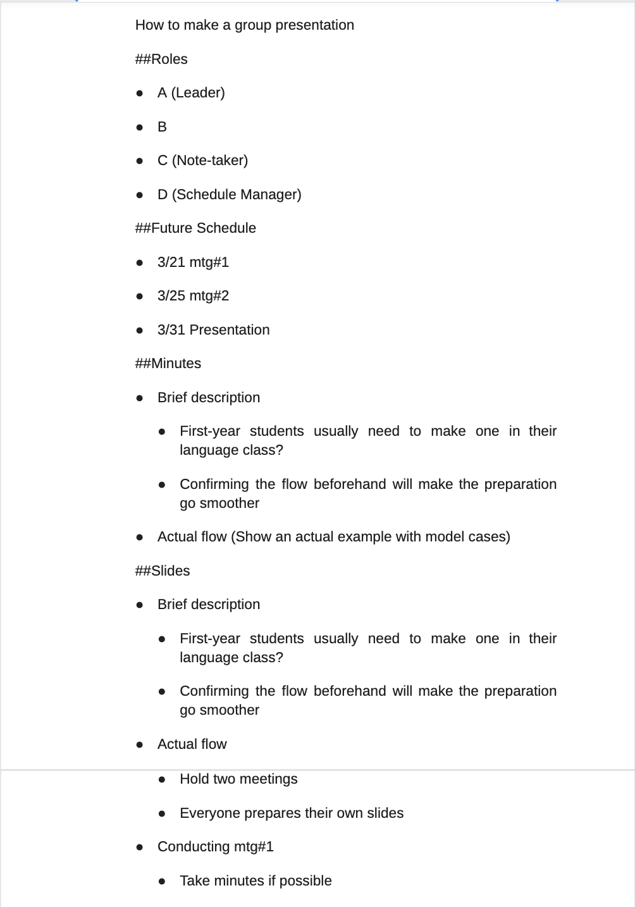
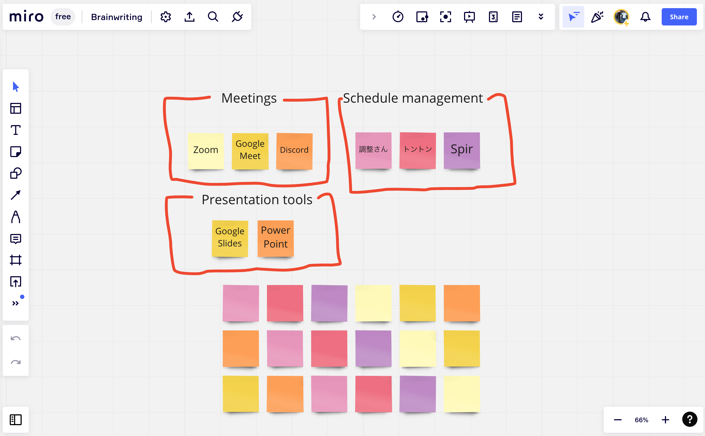

## Highlights of This Article

In college classes, students often have the opportunity to give group presentations. It is now common to prepare for such presentations online, but this requires a variety of skills and techniques that differ from those required for face-to-face presentations. In this article, we will introduce a method for efficiently preparing online group presentations, based on the scenario of a group of students giving a presentation in class.  

Many students, especially at the University of Tokyo, may be experiencing group presentations for the first time in the Junior Division of the College of Arts and Sciences, such as in language classes. Please use this article as a reference to get an idea of what to expect before the presentation, and to prepare for the actual presentation.  

This article uses a slide presentation as a model case. You may refer to this article for other types of presentations, such as those using handouts, and apply the information in sections that you find helpful.  

## Sample Workflow

This article describes how to prepare and present an actual presentation using a slide presentation as a model case, following the flow below.  

1. Preparation
2. 1st meeting: Deciding the slide content
3. Preparing slides and other materials on your own
4. 2nd meeting: Preparing the presentation
5. Making the actual presentation

### 1. Preparation

#### Assigning roles

To ensure efficient preparation of the presentation, it is advisable to assign roles such as a leader, schedule manager, or record-keeper.  

#### Tools used to prepare a presentation

The following tools may be useful in preparing and presenting your presentation. Please note that all group members need to have access to the same tools.  

* Document sharing tools
* Presentation tools
* Meeting tools

Google Drive is the main tool for sharing materials. Google Drive is especially convenient for UTokyo members because it can be used with a Google account granted by the university. When sharing materials in a group, you can create a shared folder and save your presentation drafts and meeting minutes there to efficiently share and edit materials.  

It is also convenient if all members of the group can edit the materials together. For details, please refer to the following article. (Reference: [How to use Google Drive](/en/articles/google-drive/))  

PowerPoint and Google Slides are useful tools for creating presentation slides. Both tools have collaborative editing functions that allow multiple people, not just the file owner, to discuss and edit together. For example, Google Slides can be used for sharing drafts, while PowerPoint can be used for the final details. Using the collaborative editing function when creating slides allows you to "talk" and "create" at the same time, making slide creation more efficient.  

Zoom is the primary meeting tool for online meetings. It is a good idea to take minutes and record the meeting to keep a record of what was discussed and decided on during the meeting. When taking minutes, it is a good idea to use a tool with collaborative editing capabilities, such as Google Docs (see below for more information on taking minutes).  

There are many other tools available for online group work, so it is important to choose the one that best suits your needs. Please refer to [this article](/articles/student-communication/) for a summary of the features of various tools.  

#### Schedule adjustment

First, check how much time you have to prepare until the day of your presentation.  

In preparation for that presentation, it is a good idea to hold multiple meetings (this article assumes that two meetings will be held).  

The tools described in this article should be useful for managing the schedule.  

#### Ensuring means of communication
Make sure you have established a means of communication between the group beforehand.  

Depending on the size of the group and the type of class, it may be a good idea to utilize different tools such as LINE or Slack.  

### 2. Conducting the first meeting 

Once the dates have been arranged, the next step is to hold the meeting. Here is an example of how a meeting should proceed.  

This is just an example, so please adjust the content and order as necessary.  

#### Preparing minutes

A lively meeting is of little use if ideas and decisions are forgotten after the meeting is over.  

To prevent this, it is recommended to record the minutes of the discussion.  

An efficient way is to use Google Docs (or other tools that can be edited jointly by all group members) and share the screen while writing in real-time.  

Zoom's recording function can save the shared screen in video format, so it is also a good idea to use it in combination with Google Docs.

* Reference
    * [Basic Use of Google Docs](/en/articles/google-document/)
    * Examples  of  minutes format
	  

#### Flow of the first meeting

##### ①Confirming the requirements of the presentation

Check the time limit for your presentation, the number of slides specified, and the requirements for the theme in advance.  

##### ②A rough determination of the presentation theme

It is not necessary to finalize the theme at this stage, but it is helpful to decide on a certain direction first so that the subsequent discussions can proceed smoothly.  

##### ③Discussing opinions

Here members should share their ideas based on the presentation theme or discussion topic set by the group.  

When doing so, it is helpful to first write down the ideas individually and then share them with group members to facilitate the exchange of opinions.  

Repeating this process of exchanging opinions while revising the meeting topic through the leader's facilitation makes it easier to build a common base of mutual understanding.  

If the discussion gets stuck and no opinions emerge, a technique called brainstorming can be effective. When brainstorming online, online whiteboard tools such as Miro can be used to efficiently generate and consolidate group opinions.  

* Reference
	* [About Miro (External link)](https://miro.com/whiteboard/)
	* Miro usage example
	  

##### ④Discussions to summarize opinions

Organize and integrate the opinions that emerged in ③. It is advisable to gradually start thinking about the contents of the presentation while summarizing the opinions.  

Since the process from ②-④ is important in forming the basis for deciding the content of the presentation, it is recommended to take your time by, for example, dividing the discussion into two sessions if you feel that the discussion is not sufficient enough.  

##### ⑤Preparing the presentation materials

Based on the ideas gathered through ②-④, the topic of the presentation as a whole is decided, which will then be used to determine the content and order of each slide.  

After that, the assignment of roles, such as the creator of each slide, should be decided. If you decide on the actual presenters of the slides at the same time, this will make later preparations more efficient.  

##### ⑥Scheduling the next meeting, etc.

After a quick review (wrap-up) of what was discussed, the schedule for the next meeting should be determined. It is also a good idea to keep in mind what each person needs to do before the next meeting.  

### 3. Preparing slides and other materials on your own 

Based on the role assignments decided at the meeting, each participant should prepare their own slides. It is a good idea to use the collaborative editing function to edit slides and other materials using the same file.  

Here, it is important to share the progress of all members by using communication tools such as LINE, etc., so that work can proceed systematically.  

Questions that arise during the preparation of the file should also be shared with the entire group, ensuring that the next meeting can be held efficiently. If necessary, prepare a script for your presentation.

### 4. Conducting the second meeting

The following procedure is shown as an example.  

* Discussion

	* First, the participants will deal with the issues left over from the first meeting and clear up any questions that may have arisen in the preparation of their own materials. Based on this, the slides and other materials should be revised.

* Practicing the presentation

	* Decide the person in charge of the slides, etc., and practice the presentation

	* It is recommended that only one person should be responsible for transitioning the slides in order to ensure that the actual presentation progresses smoothly. If there are any animations or visual effects on the slides, carefully check the timing of those effects.

### 5. Giving the presentation

Make your presentation based on what you have prepared. In the case of online presentations, it is advisable to prepare the necessary equipment well in advance of the presentation, since problems specific to online presentations may occur.  

The above is an example of how to conduct a group presentation. Please modify the details according to your own requirements to create a presentation that is better suited to your needs.

---
Author: S.A., Online Education Supporter
