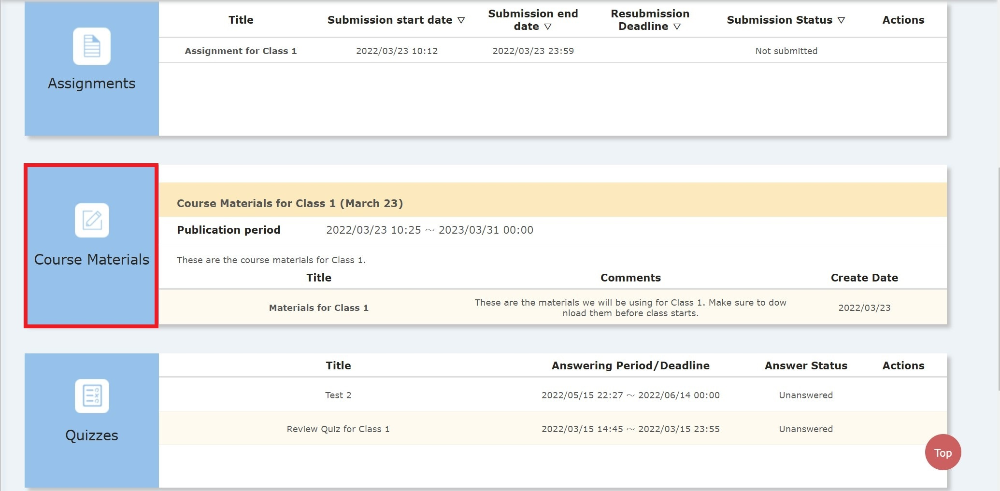
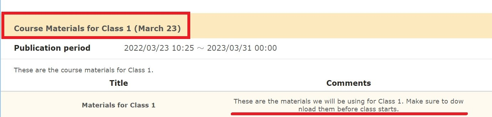
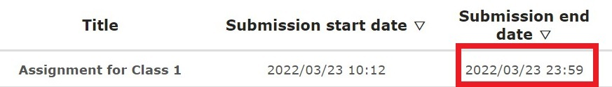

  The University of Tokyo has introduced a Learning Management System [UTOL](/en/utol/) which has almost the same features as ITC-LMS. Please read this article with "ITC-LMS" replaced by "UTOL" where appropriate.

## Highlights of This Article

This article introduces what kind of system Learning Management System (LMS) is. We will also illustrate some potential uses of Learning Management Systems by taking up "ITC-LMS", a Learning Management System mainly used in the University of Tokyo, as a case study.

## Recommended for the Following People

This article is recommended for those who want to know what a Learning Management System (LMS) is, and what benefits it provides to faculty members and students. It is also recommended for faculty members who are looking for better ways to use the Learning Management System "ITC-LMS".

## Overview of LMS

### What Is LMS?

A Learning Management System (LMS) is an online system equipped with functions necessary for educational activities in schools and companies. Especially in university courses, LMSs can be used in a variety of situations, such as to find out the URL of an online class, download handouts and class materials, work on tests and assignments, communicate between instructors and students, and hold online discussions among students. Moodle and Google Classroom are well known as open-source LMSs that anyone can use, but some universities also provide their own LMSs. At the University of Tokyo, ITC-LMS is provided as an original learning management system, and it is widely used by students.

### Significance and Benefits of Using LMS

The greatest advantage of using an LMS is that it can manage many of the workflows necessary for a class to be successful, all in one place. For example, ITC-LMS can manage many functions such as quizzes, assignment submissions, and attendance. Both the faculty and students benefit from this, as it eliminates the need to use multiple sites and tools at the same time.

For example, by using LMS to manage tests and assignments, you can easily set submission deadlines and inform students of them, and can provide them to students in an easy-to-read format. Other advantages include the ability to significantly reduce administrative work by eliminating the need to distribute materials to students who have lost their handouts or were absent, the ease of managing reaction papers in large classes, and the ability to assign online discussions to students for learning outside of class.

### What Is ITC-LMS?

ITC-LMS (Information Technology Center-Learning Management System) is a learning management system used in many classes at the University of Tokyo. Through ITC-LMS, instructors can post assignments, give tests and display attendance forms, as well as contact students individually. The University of Tokyo as a whole recommends the use of ITC-LMS for announcements related to class. ([The tools usage guideline for online class since S semester 2021](/en/docs/guideline))

## Things to Keep In Mind When Using ITC-LMS

If you are not using a learning management system or are not using ITC-LMS properly in your classes, the following problems may occur while running your class.

- If you do not have practice actually operating the ITC-LMS to administer tests, you may waste a lot of time setting up the system.
- Asking students to write their names on the Zoom chat screen to record attendance can be very difficult to manage properly as it leads to oversights, can be time-consuming, and so on.
- When class materials are distributed via Google Drive, it can be difficult to locate the file directories (locations), making it hard for students to find the materials they need for each class.
- The deadlines for assignments may not be set in an easy-to-understand manner, which can cause students to misunderstand the deadlines.

In the following, we propose ways to effectively utilize the ITC-LMS according to the problems above.

### Check Students' Understanding and Learning Progress Using the Test Function

The ITC-LMS has a test function that allows users to create quizzes and final exams to assess their daily learning. You can set the format of the tests to be in essay form or multiple choice questions, or allow retaking the exam, etc. For detailed instructions on how to create tests, please refer to [this page](/en/lms_lecturers/prepare_quizzes).

For tests of high importance, it is important to set clear deadlines for answers and time limits, and enter them in the "Answer period/deadline" field. Students will often look at this field to check when they need to work on the assignment, so it is a good idea to make sure that students can confirm the deadlines via the system, in addition to announcing them verbally during class.

### Take Attendance

The ITC-LMS has an attendance management function, which can be used to take attendance during classes. Attendance management can be edited from the Course Content tab on the editing screen for faculty members on ITC-LMS. Please refer to [this page](/en/lms_lecturers/view_attendances) for detailed information on how to manage attendance.

In order to have attendance confirmations sent in, it is necessary to set a password for attendance confirmation and a time limit (from when to how long) when attendance can be sent.

When actually requesting attendance confirmations, the password must be presented to the students, which can be done in a variety of ways. The password can be provided on the class slides or in the chat box of an online conferencing tool (such as Zoom) during class. In the former case, if the password is on a slide distributed to students, it should be noted that there is a possibility that some students will only register their attendance and not attend the class. In the latter case, it is necessary to present the password multiple times during the class for students who come in late. Regardless of the method used, it is recommended that the deadline for registering attendance is set to approximately one hour from the start of class, considering that students may be late for class and that the password has to be presented several times.

### Distribute Class Materials in an Easy-To-Understand Manner

In ITC-LMS, you can place class materials such as slides in the "Teaching Materials" section. Please refer to [this page](/en/lms_lecturers/course_material) for details on how to place teaching materials.

The most important thing to keep in mind here is how to title the material. In addition to the date, it is also helpful to indicate which session the material is from and to include keywords used in the class to make it easier for students to find the material. Also, if you want students to download the material before class, you can make a note in the comments so that the class can run more smoothly.

### Set Easy-To-Read Deadlines for Assignments

The ITC-LMS allows teachers to place assignments in the "Assignment" section. Please refer to [this page](/en/lms_lecturers/assignments) for details on how to create and place assignments.

The key point to be considered when setting an assignment is the date and time of the deadline. For example, if you set the deadline at 0:00 on March 24, students may misunderstand that they only need to submit the assignment by March 24 (even though it is actually due by March 23). In fact, we have heard many students say that they find the assignment submission deadlines confusing. To avoid this, it is recommended that the deadline is set at a time such as 23:59 or 16:00, so that students clearly know the date by which they must submit their work.

### Other Application

In addition to the methods described in this article, ITC-LMS has a variety of other functions, such as a bulletin board function and a "Message to Teacher" function. It is important to find and use the function that best suits your purpose.

In addition, when there are students who could not attend a class, you can record the class and post it on ITC-LMS later. For example, in Professor Ryosuke Higuchi's class at the Graduate Schools for Law and Politics, ITC-LMS was used to distribute class recordings as well as to share materials. For details, please refer to [this page](/good-practice/interview/higuchi#%E5%AD%A6%E7%94%9F%E3%81%AE%E3%82%B3%E3%83%A1%E3%83%B3%E3%83%88-%E3%81%93%E3%81%AE%E6%8E%88%E6%A5%AD%E3%81%8C%E8%89%AF%E3%81%8B%E3%81%A3%E3%81%9F%E7%90%86%E7%94%B1).
