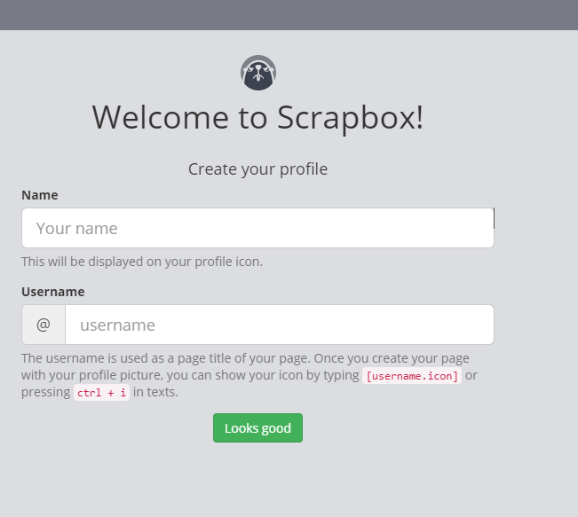
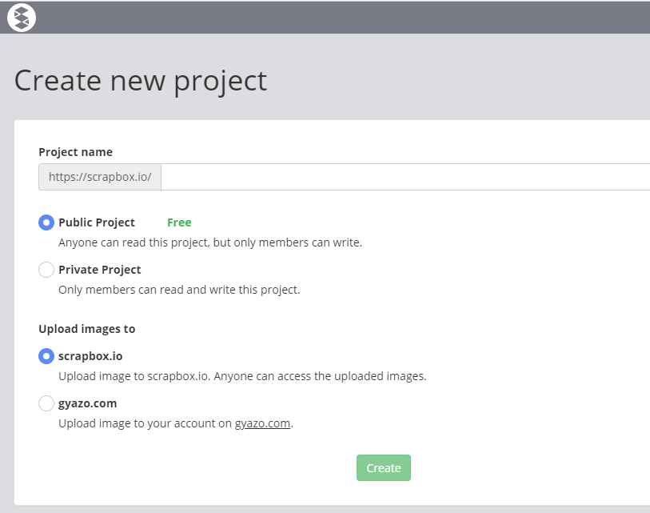
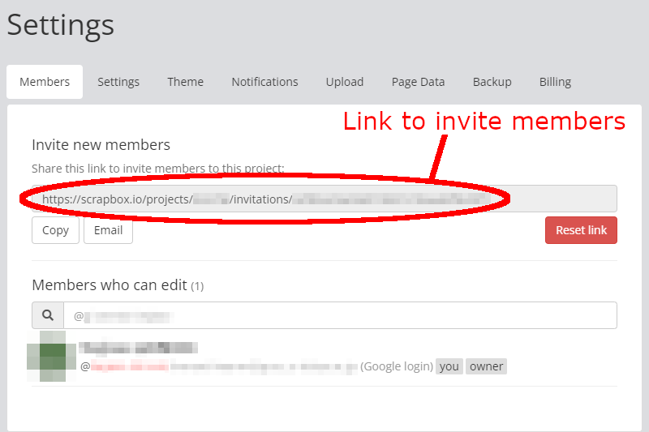
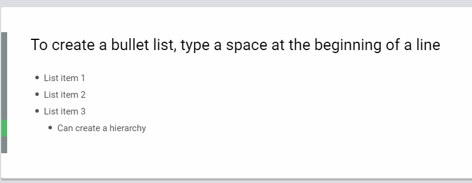
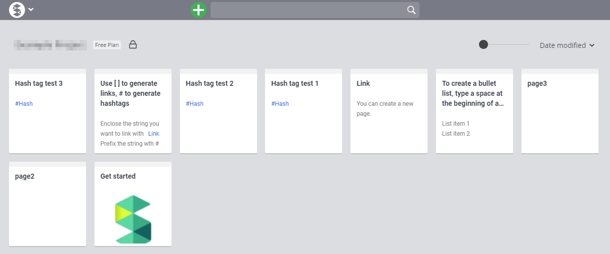
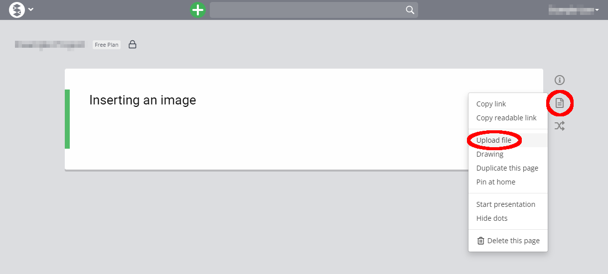
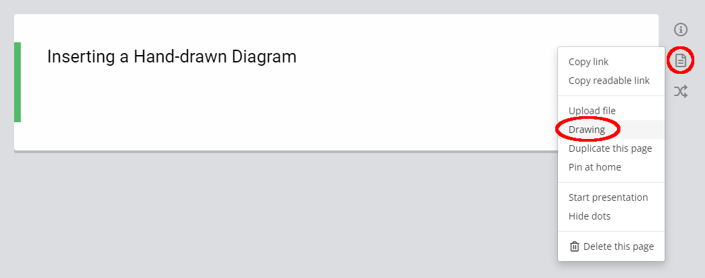
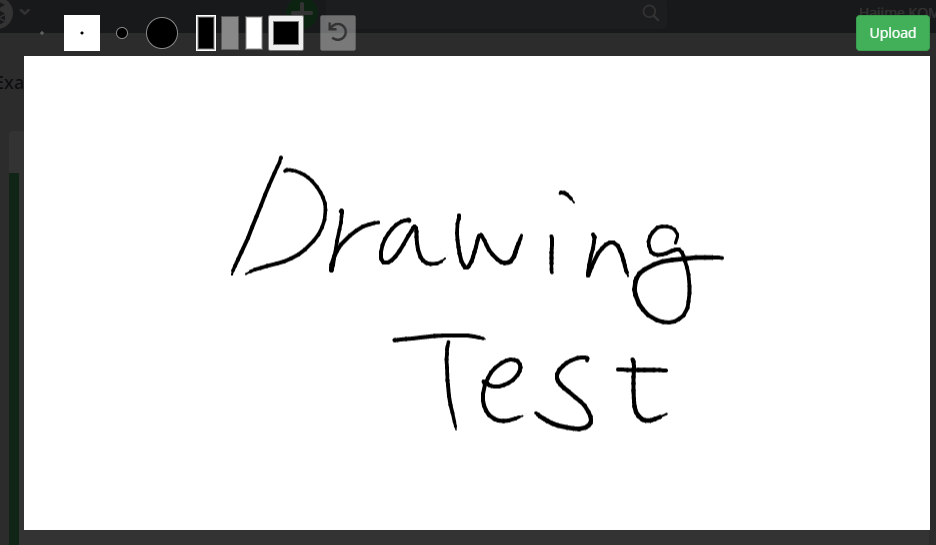
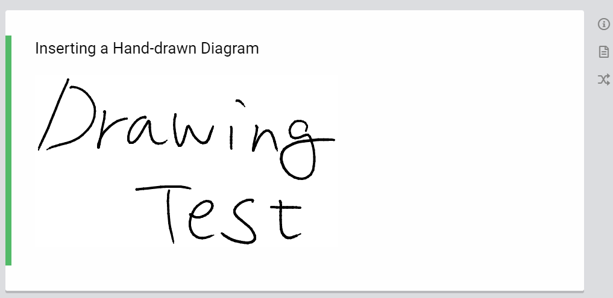
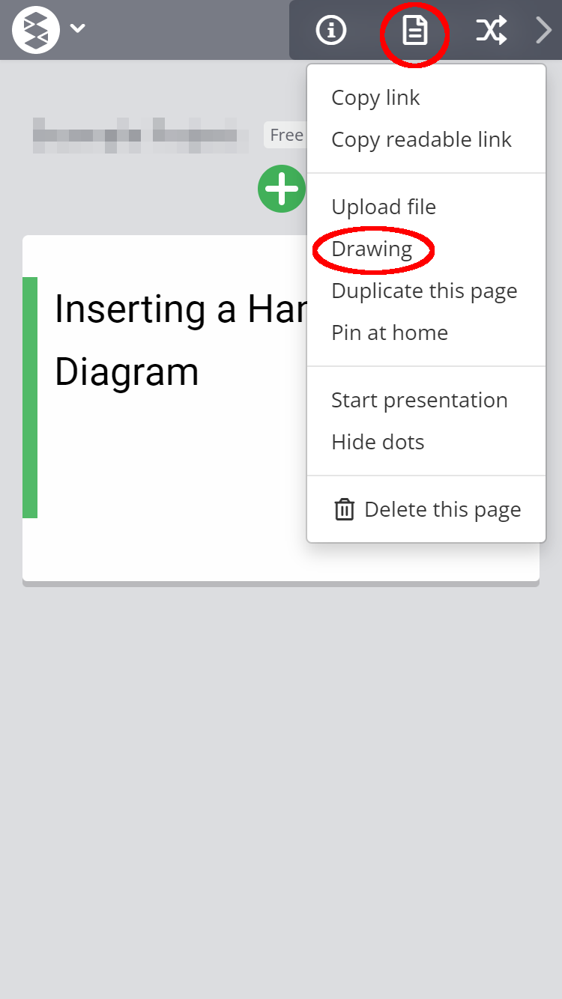

## Highlights of This Article
In this article, we will explain the basic use of Scrapbox.

### Suitable Situations to Use Scrapbox

* To prepare a page that summarizes class contents for easy learning.
* To summarize class materials with multiple users writing on them.
* To share the created materials easily and instantly.
* To create a place for interactive communication, where students can write questions and answers.
* To help learners easily find the materials they want.

### Things You Cannot Do

* It is not possible to give independent editing and viewing privileges to learners.
* You can only share information by project, not by individual pages.
* By default, pages are not organized in any particular way, but are listed in the order in which they were created, and the material cannot be structured automatically.

## What is Scrapbox?

Scrapbox is a tool provided by Nota Inc. for storing and organizing a large number of notes and memos online. It can be edited by multiple people at the same time or shared using URLs. It is characterized by its ability to easily connect many pages using "links" and "tags" and its portal function for online classes.

By using Scrapbox, you can easily create a document like the one below.

<figure>

</figure>

### Rate Plans
(As of October 2021) 
For public projects that can be viewed by anyone, all functions can be used free of charge, regardless of the use or number of pages. For private projects that can be viewed by a limited number of people, all functions can be used free of charge for personal and educational use.

Note that a Google account is required to use the free version.

It may cost for business use. For details, please check the Scrapbox "[Pricing Plans](https://scrapbox.io/pricing)" page.

## Creating an Account
In this section, you will learn how to create an account with Google Account.

Access the website of Scrapbox  ([https://scrapbox.io/product](https://scrapbox.io/product)) from your browser and click the "TRY IT FOR FREE" button.

<figure>

<figcaption>Click on the area circled in red (or the "SIGN UP" string in the upper right corner). </figcaption>
</figure>

Enter the email address or phone number associated with the Google account you use for Scrapbox, and then enter the password.

<figure class="gallery">

</figure>

In some cases, you will be presented with multiple account suggestions (see the figure on the right). Select the account you want to use with Scrapbox.

Once your Google account is connected, you will be taken to the Scrapbox account setting page. Please enter "Name" and "Username" respectively.

<figure>

</figure>

* Your Google account name will by default be your “Name” in Scrapbox. You might re-enter to change it.
* "Username" is used as the page title of your personal page and must be entered in half-width alphanumeric characters. It is best to use your own name for clarity.

Select "Looks Good" to complete the account creation. When the following screen appears, click on the green "Create new project" button to create a project.

<figure>

</figure>

For details on how to create a project, see "[Create a project](#create_project)".

## Creating a Project
{:#create_project}

A project in Scrapbox is a unit of space used to organize information. Users can search for information in each project. It is also a unit for information sharing, and sharing settings can be configured for each project.

Below we will explain how to create a project.

1. Press the "S" button at the top left of the screen, and then select "Create new project". The "Create new project" button may appear on the screen immediately after you create an account.
2. Type any alphanumeric characters in the "Project name" field. It will be the sharing URL for students to view the articles in the project.
3. Set the detailed items of the project.
   * **Project Publication Settings**: You can choose between "Public Project" and "Private Project". Each project has the following features.
     * Public Project
       * This setting allows anyone who knows the public URL to view the project without authentication.
       * By sharing an "invite link", which is different from the public URL, you can also grant writing access to the page.
       * It is also displayed in search results of Google and other search engines.
     * Private project
       * Even if you know the project URL, users have no access rights cannot view the private  project.
       * To access private projects, you need an invitation link distributed by the administrator.
   * **"Upload image to"**: Select where you want to upload the image. Normally, you can select "scrapbox.io". The uploaded image will be saved on Scrapbox.
4. When you are done, click the green "Create" button.

<figure>

</figure>
<!--  -->

## Sharing a Project

Once you have created a project, you will need to share it with others so that they can access it.

Click on the "S" button in the upper left corner of the screen, then select "Project settings" to open the settings screen.

For public projects, you can share the "Project url" that appears when you select "Settings" at the top of the settings screen, so that anyone who knows this URL can view the project.

If you want to give someone editing privileges in a public project or viewing/editing privileges in a private project, check the "Invite new members" link that appears when you select "Members" at the top of the settings screen. If you want to invite new members, go to "Invite new members" at the top of the setting screen. By accessing this link, you will be granted the permission.

Once the permissions are granted, you can access them with "Project url".

## Opening the Project

When you access the project from "Project url", the following screen will be displayed.

Pages (articles) that are displayed like a card are those that exist in the project.

If you have permission to edit the project, you can perform the following operations.

* **① Create Page**: Click the "+" button at the top center of the screen to create a new page in the project. In the page, you can type text and it will be saved automatically.

* **② Menu Button**: Press the "S" button at the top left of the screen to display the menu for project settings and others.

  * **Create new project**: Allows you to create a new project.
  * **Project settings**: Allows you to configure various settings for the project.
    * **Members**: Allows you to add people to your project by sharing the link shown here.
    * **Settings**: Allows you to change the project link, public and private settings, and other project details.
    * **Theme**: Allows you to change the background color and others
    * **Notifications**: Allows you to connect Scrapbox to other apps (chat apps like Slack, Discord, etc.)
    * **Upload**: Allows you to upload project pages and images
    * **Page Data**: Allows you to set up bookmarks and export/import pages
    * **Backup**: Allows you to create a backup of the page content when it is edited.
    * **Billing**: Allows you to change the purpose of the project, whether it is for free personal use or for paid business use. 

## Creating and Editing a Page

A page in Scrapbox is a unit of information that is stored in a project. When using Scrapbox in a class, it is recommended to create a page for each class.

The page has the following features.

* The entered characters are immediately reflected in the display screen and search results. (No need to update the page.)
* Entries are automatically saved and backed up in chronological order. (It is possible to restore to previous version.)
* You can embed not only text, but also images and videos.
* You can create links within a page or to other pages in the project.

To create a page, go to the screen of the project you want to create a page for, and then click the {:.logo} button at the top of the screen to create a page.

The following explains how to format and edit a page.

### Entering Text

The first line is the title, and the second and subsequent lines are the body. The title line can be left blank. However, as  it will become the heading in the page list screen, it is recommended that you write something in it for easy location.

<figure>

</figure>

By typing a space at the beginning of a line, you can create a bullet list; pressing Enter will automatically move to the next bullet list. If you want to stop bulleting, press the Enter key twice.

<figure>

</figure>

You can create a hierarchy by typing a space at the beginning of each line. The depth of the hierarchy can be freely adjusted by the number of single-byte spaces.

<!-- <figure>

</figure> -->

<figure>

</figure>

You can also add decorations such as bold, italic, strikethrough and others. by selecting the text.

For example, if you select a string of text and choose "strong" from the window that comes up, you can make the text bold.
<figure>

</figure>

<figure>

</figure>

### Jumping From One Page to Another

If you want to structure pages (relate pages to each other), you can use the link function or the hashtag function.
You can automatically generate links by enclosing the string you want to link with `[ ]`, and hashtags by prefixing the string with `#`.

Links and hashtags are displayed in blue and pink respectively.
<figure>

</figure>

Clicking on a link or a hashtag string will take you to a page titled with the respective string.  
If you click on the "Link" string in the previous image, you will be taken to a new page with the title "Link". From here, you can create a new page by typing the text.

<figure>

</figure>

Pages with the same hashtag will be displayed together at the bottom of the screen. You can use the same hashtag for all related pages to make the connection easier to understand.

<figure>

</figure>

Clicking on the project name in the upper left corner will take you to the page list screen (the top page of the project).

<figure>

</figure>

<figure>

</figure>

### Inserting an Image
#### When Operating on a PC

To insert an image saved on your PC, drag and drop or copy and paste it into the page.

<figure>

</figure>

<!-- <figure>

<figcaption>画像がページに挿入されます．</figcaption>
</figure> -->

On the right side of the screen, You can also select "Upload file" from the {:.logo} icon (red circle in the image below) and select the file you want to insert.

<figure>

</figure>

#### When Operating on a Mobile Phone

In the mobile version, click the {:.logo}icon in the upper right corner, select "Upload file" (red circle in the image) to insert an image saved on your cell phone.

<figure>

</figure>

### Inserting a Hand-drawn Diagram
#### When Operating on a PC

You can insert a hand-drawn drawing into the page using the drawing function of Scrapbox.

Click the {:.logo} icon on the right side of the screen and select "Drawing" (red circle) to display the drawing screen.

On the drawing screen, you can use the mouse or a pen-tab to draw freely.

<figure>

</figure>

Once you have created an image to insert, click the green "Upload" button in the upper right corner.

<figure>

</figure>

The created image will be inserted into the page.

<figure>

<figcaption></figcaption>
</figure>

#### When Operating on a Mobile Phone

If you are using the mobile version, click on the {:.logo} icon in the upper right corner, select "drawing" (red circle in the image) to perform the same operation.

<figure>

</figure>

## Tips: Notifying Updates to Chat Tools such as Slack
By linking with Slack, you can check the updates of Scrapbox on Slack.
For the basic use of Slack, please refer to "[How to communicate with students in Slack](/en/articles/slack-communication/)".

1. Click the "S" button in the upper left corner of the screen to open the Notifications tab of the Project settings screen.
2. Open the "Slack Notifications" link in the settings screen and create an "Incoming Webhook" in Slack Integration. (See [Using Incoming Webhook in Slack](https://slack.com/help/articles/115005265063-Incoming-webhooks-for-Slack)).
3. Paste the URL of the "Incoming Webhook" (`https://hooks.slack.com~~`) and click Add.
* Notification timing
  * 90 seconds after the last writing to Scrapbox, you will be notified.
  * Notifications will not be sent while writing continuously.
* Notification to other chat tools
  * Notifications can also be sent to URLs other than Slack.
  * The data format is the same as Slack.

## (+α) Good Practices and Applications

* [Dr. Tadashi Shiraishi, Law I](/good-practice/interview/shiraishi.html)
  * A class using Scrapbox is introduced here.
  * The Scrapbox page  actually used in the class can be accessed via [https://scrapbox.io/jcomp/](https://scrapbox.io/jcomp/).
* [Tokyo Metropolitan University Online Class Support Page (for teachers) (scrapbox.io)](https://scrapbox.io/tmu-online-tips/)
