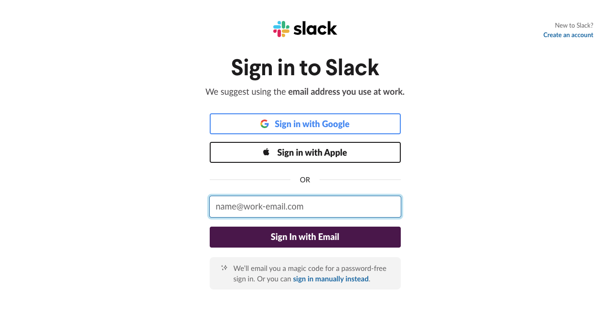
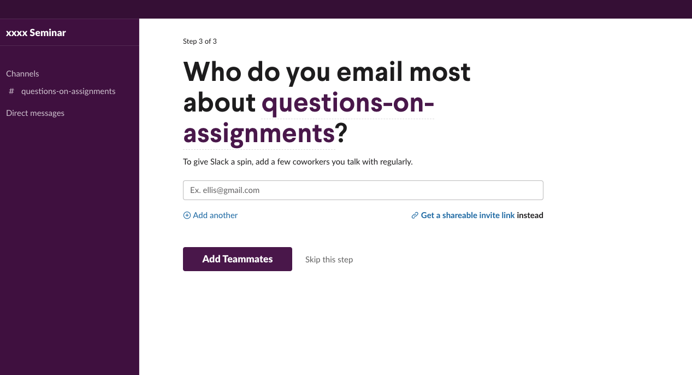
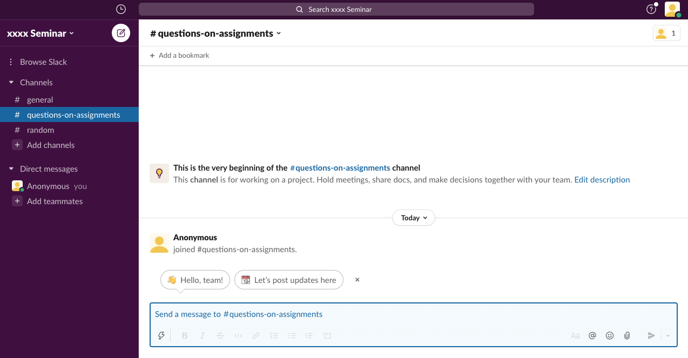
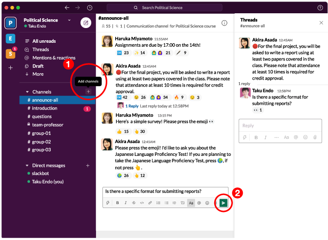
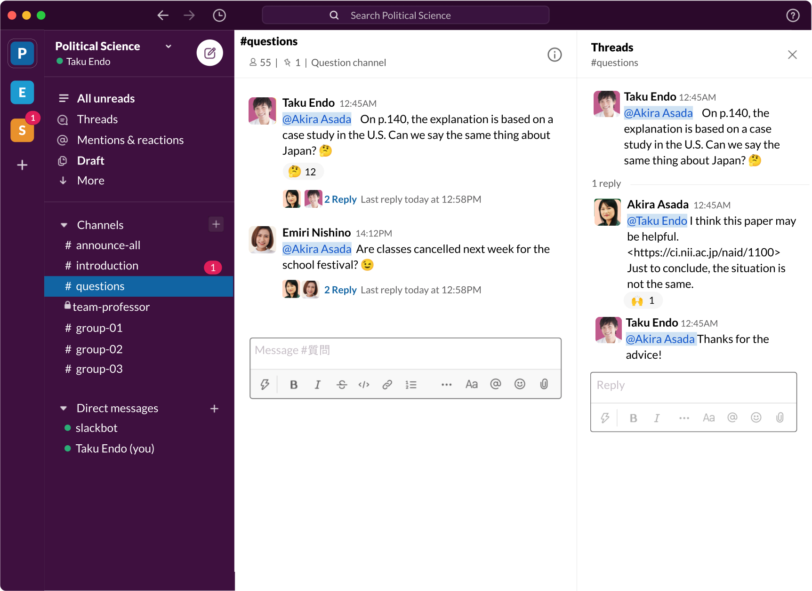

import SlackNotice from "@components/en/articles/SlackNotice/index.astro";

<SlackNotice />

## Highlights of This Article

This article introduces how to use Slack to communicate with students and more.

### Applicable Situations

- (Faculty member) Prompt students to ask questions in on-demand or live classes
- (Faculty member) Give class instructions to students
- (Faculty member) Increase student-teacher interaction
- (Faculty member) Facilitate student communication outside class for better group work
- (Student) Communicate with other students and seminar members

### Limitations of Slack

- There is no automatic way to know who has already read your chat or how many people have read it. (As an alternative solution, you can ask people to react/reply with emoji when they read your chat.)
- In the free version, you can only read/search the last 10,000 messages, send up to 5GB of files to one workspace, and link up to 10 apps.

## What is Slack?

### App Description

Slack is a messaging platform that allows you to communicate in real time. In the platform called **"workspace"**, you can exchange and manage messages in separate **"channels"** for different topics and people.

#### (1) Sharing Information via Channels

You can create a "channel" for each theme or content to communicate. (For details, see the ["How to create a channel" section](#in_class).)
Separate channels allow you to share information within your team by topic, and organize information as well as interactions. (For details, see the ["How to Use Channels in the Classroom (for teachers)" section](#for_teachers).)

There are two types of channels: **public channels** and **private channels**. If you set a channel to private, you can create a closed space where only authorized users can search and join the same workspace. (For details, see the ["Have Private Conversations Between Faculty Members and Teaching Assistants" section](#private_channel).)

#### (2) Using DM and Mention Functions to Send Messages

You can also use **Direct messages (DM)** to send private messages. (For details, see the ["Contact Students Individually" section](#dm).)

If you want to respond to a specific person in the channel, or if you want to notify them, you can use the **mentions** function to make it easier for them to see your message. (For details, see the ["Receive Questions" section](#question_teachers).)

#### (3) Using Emoji for Casual Communication

**Emoji** can be added to react to a message. You can ask students to react when they read an announcement, which can be used to prevent communication from going unanswered or to conduct surveys in class. (For details, see the ["Class Communication and Casual Surveys" section](#announce).)

#### Specifications

- Provider: Slack Technologies Inc.
- Available Environment
  - Devices/OS: Available on PCs, tablets and smartphones.
  - For more information about OS and browser versions access the [System requirements for using Slack (Slack help center)](https://slack.com/help/articles/115002037526-System-requirements-for-using-Slack)
  - Required drive space for installation: 0MB for web browser and 158.1MB for app download.
  - Required or optional accessories: None
- Operational Costs
  - Cost: Free (paid plans also available)
  - Preparations for students taking the class:
    - Create a Slack account with your email address
    - Accept invitations from faculty members
    - Install the app if needed

## How to Install Slack and Create a Workspace

## Installing the Slack App

- To use the web browser version, register and sign in from the [Slack homepage](https://slack.com/get-started#/create).
- To use the app version, install it from the Slack download page. ([Windows version](https://slack.com/downloads/windows)) ([Mac version](https://slack.com/downloads/mac))

Below, we will show how to use the app version. (The procedure is mostly the same for the web version.)

### How to Create a Workspace in Slack (Creating a Workspace for Your Class)

1. Click "Sign in to Slack". 
2. You will see the following screen in your browser. Press "Continue with Google" and sign in with your ECCS Cloud Email account (or your personal email address). 
3. Press "Create another workspace" at the bottom of the page. 
4. Set up the workspace (e.g. class name). The "company or team name" will be the name of the workspace. It is recommended that you use a workspace name that makes its purpose easily recognizable (e.g. which class the workspace is for). In this example, the workspace is named "xxxx Seminar". 
5. "What the team is working on now" is the name of the "channel" in the workspace. If using in a class, it is useful to set up channels such as "Basic Information" (For details, see the ["How to Use Channels in the Classroom (for teachers)" section](#for_teachers). Here we created a "questions-on-assignments" channel. 
6. Next, you will see a screen that asks you who the users of the new channel are, "Who do you email most about?”. This is where you enter the email addresses of the people you want to invite to your workspace. Steps on sending invitations will be introduced in the next section. 
   7.The class workspace setup is now complete. 

### How to Invite New Members (Inviting Students to Your Workspace)

<figure>
  
</figure>

- If you have collected the email addresses of the students you want to invite, send invitations to their email addresses. Press **"Add teammates"**, which is below "Direct messages", and enter the email addresses of the students you want to invite.
- If you wish to share by link, share the invitation link to your class through ITC-LMS or other means (See "[Share an invitation link (Slack help center)](https://slack.com/help/articles/201330256-Invite-new-members-to-your-workspace#share-an-invitation-link)".
- Ensure there are no invitation link leakages and remind students to be careful.
- Remember to set your students' email addresses invisible. (See "[Manage email display (Slack help center)](https://slack.com/help/articles/228020667-Manage-email-display)".)
- Students would join the workspace via the link in the invitation email.
- For instructions on how to accept the invitation, see "[Accept a Slack Connect channel invitation (Slack help center)](https://slack.com/help/articles/360049769934-Accept-an-invitation-to-join-another-companys-channel)".

## How to Use Slack in Class

{:#in_class}
Here we introduce how to use Slack effectively in class. As an example, we will use a fictitious course called "Political Science".

<figure>
  
</figure>

- How to create a channel  
  Channels can also be created from the + icon ((1) in the above figure). In this class (workspace), the below channels are created.

  - \# announce-all
  - \# introduction
  - \# questions
  - \# team-professor
  - \# group-01 / # group-02 / # group-03

- How to send a message  
  To send a message, use the aeroplane symbol ((2) in the above figure) on each channel.
  You can also use bold or italic text to emphasize your message, or attach a file
  (select the file from the clip symbol) if necessary.

### How to Use Channels in the Classroom (for teachers)

{:#for_teachers}

#### Class Communication and Casual Surveys (#announce-all)

{:#announce}

<figure>
  
</figure>

- This is a channel for communicating class assignments.
- You can also use this channel to conduct surveys.
  - Make use of emoji reactions to conduct quick surveys.
  - You can also see the results of questionnaires and communicate with other students after class in this channel.
- Change the name of the #general channel to "#announce-all".
  - To change the channel name of an existing channel, open the relevant channel, click the channel name in the channel header, go to the "Channel name" section and click "Edit". (Note that you need to be the workspace owner or admin to rename the #general channel. For details, see ["Rename a channel (Slack help center)"](https://slack.com/help/articles/201654073-Rename-a-channel).)

#### Compile and Organize Course Information (#introduction)

{:#info_list}

- This is a channel for posting all information necessary for your course.
- You can repost the course information that you posted on the ITC-LMS.
- You can also compile links to class materials.

#### Receive Questions (#questions)

{:#question_teachers}

<figure>
  
</figure>

- This is a channel for students to ask questions about the class or assignments.
- This channel can be used for answering questions of both real-time and on-demand classes.
- The benefit of setting up a questions channel is that you can aggregate questions and search the question log after the class is over.
- You can attach reference materials for students to learn more after class.
- You can also mention(notify) students who have asked questions by prefixing their registered name in Slack with @.

**Tips: We encourage you to receive questions in channels**.  
If you discuss questions about the class on a "channel", the questions will be visible to other students. This helps reduce the number of similar questions and hence the burden of responding to many questions. It may also lead to new discussions and promote interactive learning. (DM is recommended for communication of students' personal matters such as grades and assignment submission.)

<figure>
  
</figure>

#### Have Private Conversations Between Faculty Members and Teaching Assistants (🔒 team-professor).

{:#private_channel}

- If you want to share information only with faculty members and TAs, you can set up a private channel (See [Convert a channel to private (Slack help center)](https://slack.com/help/articles/213185467-Convert-a-channel-to-private)).
- In a private channel, only people of the same workspace who are invited to the channel can freely join or search the message content.
- You can create a private channel by turning on the "Make private channel" option when you create a channel.
- Once a channel is set as a private channel, it cannot be changed back to a public channel.

#### Share Materials Within Groups (#group-01, 02, 03, ...)

{:#public_channel}

- You can share texts and documents within groups by setting up channels for each group.
- By setting up the channels as public channels, teachers and students of other groups can view the progress of each group (even if they are have not joined the channel).
- Private channels for teachers and group members only can also be created.

#### Contact Students Individually (Direct Message)

{:#dm}
If you need to contact a student individually, such as when an assignment has not been submitted, you can do so via DM.

#### (Advanced) Link with Zoom

{:#zoom}
You can find out how to link in ([Zoom for Slack (Slack help center)](https://slack.com/help/articles/115004062463-Zoom-for-Slack)). By linking, you can start Zoom smoothly from Slack.

### How to Use Channels in the Classroom (for students)

{:#for_students}

#### Ask a Question to the Teacher (#question)

{:#question_students}

<figure>
  
</figure>

To make sure you get a response, it is a good idea to mention the teacher. You can do this by putting @ in front of the teacher's Slack name as shown in the red circle.

#### Chat With Other Students (#chat)

{:#chat}
You can also create channels for casual chat among students. It is suggested that you avoid talking about topics unrelated to the class on other channels.

### Tips: Creating Class Rules

When using a Slack workspace in class, it is a good idea to set class rules for using the workspace, and to share the rules with students in advance. In particular, please be careful of handling personal information such as email addresses (See [Manage email display (Slack help center)](https://slack.com/help/articles/228020667-Manage-email-display).).

### Good Practices and Examples of Applications

- [Prof. Saito, Computational Mathematics I (in Japanese)](/good-practice/interview/saito)
  - Slack was used in an Prof. Saito's on-demand style class. He called for questions regarding class content and answered them on Slack. Students seemed to be more active in asking questions online than face-to-face. He believes that Slack reduces the psychological burden to ask questions because users can edit or delete their messages.
- [Prof. Shiraishi, Law I (in Japanese)](/good-practice/interview/shiraishi.html)
  - Since use of Slack was optional, only about 10% of the students actually joined Slack. However, many questions and consultations were received via DM. Prof. Shiraishi believes that being able to communicate privately was a factor for students to ask questions easily.
  - Materials were uploaded to Slack and ITC-LMS five days before the class, and students were asked to post questions on Slack by noon of the day before the class. As a result, the professor was able to answer questions in the class and give explanations based on the questions, which helped the professor structure the class.

### Useful Links

- [Slack help center](https://slack.com/help)
- [Introduction to Slack - Improving work efficiency! (in Japanese)](https://ascii.jp/serialarticles/3000637/)

**We would like to thank Slack Japan K.K. for providing us with images and other support in creating this article. Thank you for your kind cooperation.**
