<div class="box">
  In Microsoft Teams meetings, unlike Zoom or Webex, participants previously could not change their own display name when joining a meeting. However, with a feature enhancement released in January 2025, the ability to change display names was introduced. For meetings hosted with a UTokyo Microsoft License account, this feature has been enabled since February 2026.
  Please note, however, that to actually change a display name, the meeting organizer (or others with appropriate permissions) must also allow it in advance.
</div>

In Microsoft Teams meetings hosted by a [UTokyo Microsoft License](/en/microsoft/) account, attendees can change their display name during a meeting if the organizer or co-organizer (host or co-host) has enabled this setting beforehand. This is possible because this feature has been [enabled within the overall management settings of the UTokyo Microsoft License](#admin-setting).

However, if a display name is changed, an indication will appear next to the name in the meeting showing that it has been edited. Also, **in some features (such as attendance reports and transcriptions), the original default display name may still be used**. In addition, for meetings hosted by other institutions, whether display name changes are allowed depends on the settings of the organizer organization, regardless of whether you join with a UTokyo Microsoft License account.

This page explains how to change display names in Teams meetings in two parts: [how organizers configure permission in advance](#host-setting), and [how participants change their display name](#participant-change). For participants, it also provides a [workaround](#work-around) for meetings where display name changes are not allowed, or for places where the display name change feature does not apply.

## For Organizers: Configure the setting to allow display name changes before the meeting
{:#host-setting}

To allow participants to change their display name during a meeting, the organizer or co-organizer must enable permission before the meeting starts. This setting must be configured for each meeting (though recurring events can be configured in bulk).

Follow the steps below:

1. Open the Teams schedule (Calendar).
2. Access meeting options using one of the following methods:
   - **If configuring while creating a meeting**
     1. Drag across the desired time slot, or click "New" (or "∨" next to "New" > "Channel meeting") to create an event/meeting.
        - If creating it as a new event, turn on the "Teams meeting" toggle if it is off.
     2. Select "Options" or "More options".
        <figure class="gallery">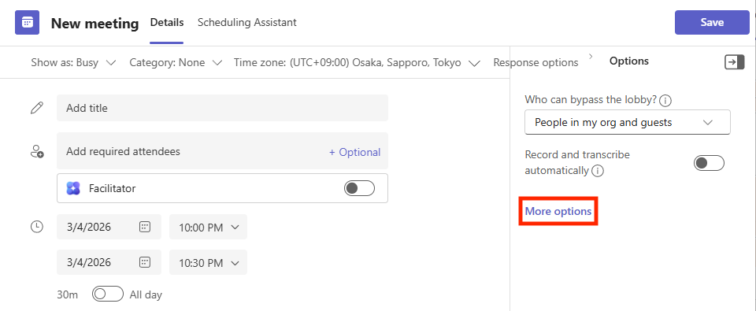{:.small .border} 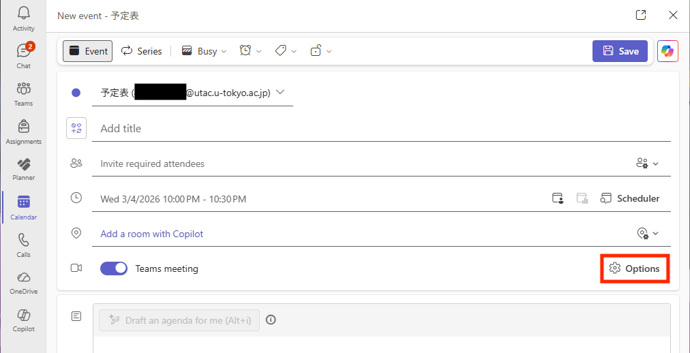{:.small .border}</figure>
   - **If configuring an already created meeting**
     1. Open the Teams Calendar.
     2. Double-click the event, or click the {:.icon} icon or "Edit".
        - If options such as "This event," "This and all following events," or "All events in this series" appear, choose the scope you want to configure.
     3. Select "Options" or "Meeting options".
        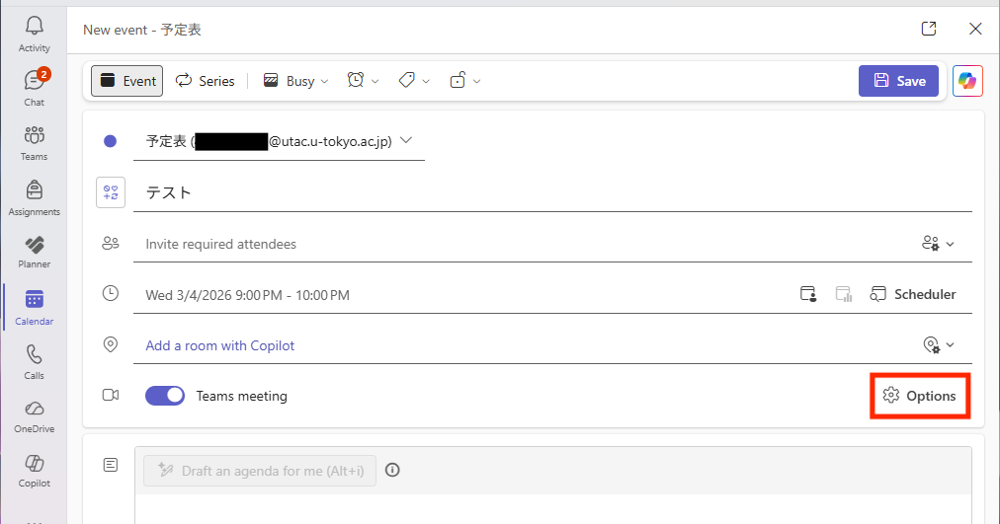{:.small .border}
3. Under "Participation", turn on the "Let people change their display name" toggle.
   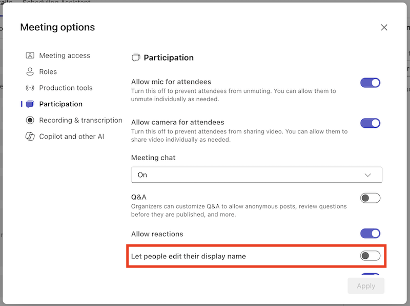{:.medium .border}
4. Click "Save" or "Apply".

For details about meeting options, see "[Meeting options in Microsoft Teams](https://support.microsoft.com/en-us/office/microsoft-teams%E3%81%AE%E4%BC%9A%E8%AD%B0%E3%82%AA%E3%83%97%E3%82%B7%E3%83%A7%E3%83%B3-53261366-dbd5-45f9-aae9-a70e6354f88e)."

## For Participants: How to change your display name
{:#participant-change}

Display name changes can be made after the meeting starts. Once changed, the updated display name will be shown for the duration of that meeting.

Follow the steps below:

1. Open the "People" panel.
   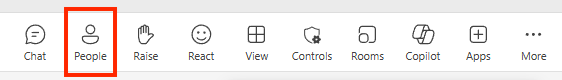{:.medium .border}
2. Click the "…" button next to your name.
3. Select "Edit display name".
   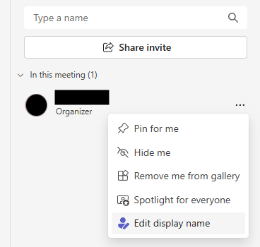{:.small .border}
4. Enter the name you want to display in the text field.
   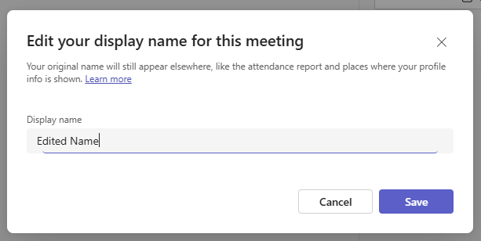{:.medium .border}
5. Click "Save". After that, your name will appear like the example below as "New display name (Edited)."
   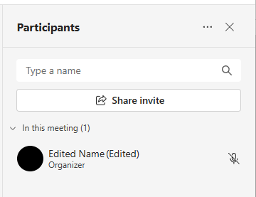{:.small .border}

### Workaround
{:#work-around}

If display name changes are not allowed in a meeting, or if you want to change your name in places not affected by the above method, you can join without signing in via a private browsing mode (/a browser not signed in with your UTokyo Account), and set your display name there.

1. Open the meeting participation URL in a private browser (or a browser not signed in with your UTokyo Account).
   - If a popup like the one below appears, select "Cancel".
     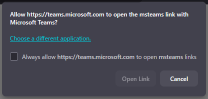{:.small}
2. Select "Continue on this browser".
   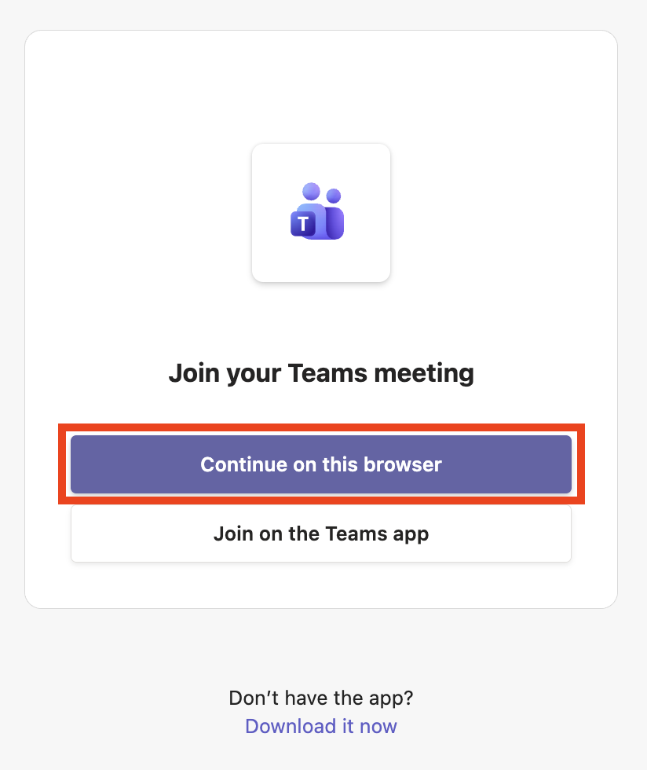{:.small .border}
   - If a popup asks for camera/microphone permissions, allow as needed.
3. Enter the display name you want to use in the "Type your name" field, and click "Join now".
   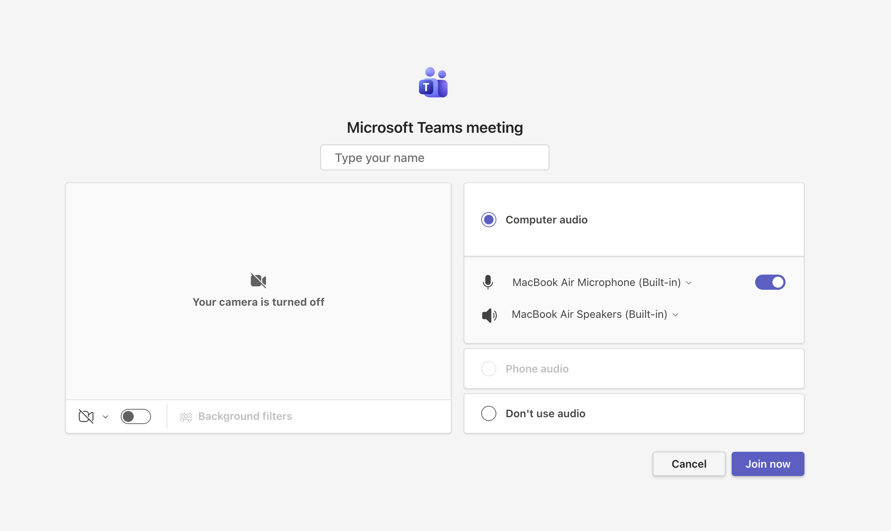{:.medium .border}

## (Appendix) How Microsoft Teams administrators can enable display name changes
{:#admin-setting}

For UTokyo Microsoft License accounts (the university-wide tenant at the University of Tokyo), the feature that allows users to change their display name during meetings is enabled tenant-wide. Therefore, if the organizer allows it, participants can change their display name without using the workaround.

However, for Teams meetings hosted by accounts from other institutions (tenants), display name changes may not be possible depending on that institution's admin settings.

If you are an administrator at another institution and want to enable the same feature in your organization, you can run the following PowerShell command. (As of March 2026, this cannot be configured in the Teams Admin Center GUI.)

```
Set-CsTeamsMeetingPolicy -Identity Global -ParticipantNameChange Enabled
```

- Reference: [Microsoft Teams > New-CsTeamsMeetingPolicy](https://learn.microsoft.com/en-us/powershell/module/microsoftteams/new-csteamsmeetingpolicy?view=teams-ps#-participantnamechange)

## (Appendix) About the default display name
{:#default-displayname}

In situations not covered on this page (such as chat, or meetings where display name editing is not allowed), only the default display name can be used.

In Teams for faculty/staff under UTokyo Microsoft License, users cannot change their own default display name. This is because default display names are managed by a mechanism that automatically syncs names used in HR procedures.

If your default display name is incorrect, please contact the HR office in your department.

## Reference Information

- [Microsoft 365 Insider Blog: Edit your display name in Teams meetings](https://techcommunity.microsoft.com/blog/microsoft365insiderblog/edit-your-display-name-in-teams-meetings/4389359)
- [Join a meeting in Microsoft Teams > Edit your display name](https://support.microsoft.com/en-us/office/join-a-meeting-in-microsoft-teams-1613bb53-f3fa-431e-85a9-d6a91e3468c9#bkmk_edit_display_name)
