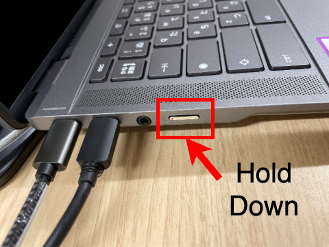
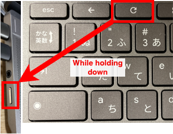

When starting up an ECCS Chromebook, issues may occur, such as the dock not being detected and the external display failing to show an image.

Please note that if this issue does not occur at the initial startup, then subsequent actions like logging out will have no effect. It occurs only on Chromebooks and has not been observed on Chromeboxes.

## Issue Description

The dock may occasionally fail to be detected after the Chromebook has been shut down or restarted.

As a result, the external display at the desk will remain blank. In addition, accessories connected via the dock (keyboards, mice, webcams, etc.) will also stop responding.

## How to Fix

1. Disconnect the USB Type-C cable extending from the dock (highlighted with a blue frame in the image) from the Chromebook. (Please be careful not to disconnect the cable that is fixed to the device by mistake.)
    {:.small}
1. Perform a forced shutdown by pressing and holding the power button located on the left side of the device.
    
1. **While holding down the Refresh key (🔄) on the top row of the keyboard,** press the power button to start up. You may release them once the Chromebook logo (the "Chromebook Plus" text) appears on the screen.
    
1. Plug the cable that was disconnected in Step 1 back in.
