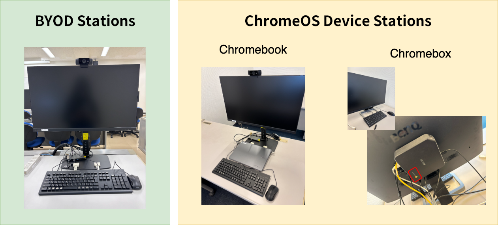

## What is ECCS?
{:#overview}

The Educational Campus-Wide Computing System (ECCS) is a set of resources, including computers, that students and staff of the University of Tokyo can use for research and education.

The ECCS undergoes major upgrades every few years, and the current system, "ECCS2026," has been in operation since March 2026.

ECCS2026 consists of [ChromeOS devices installed across the campuses](./chromeos/), [facilities for BYOD (bring your own device)](./byod/), and [the Remote Windows Environment](./vdi-windows/).

Please refer to the “ECCS Cloud Email (Google Workspace)” page for general information about the “ECCS Cloud Email” (a Google account with an email address ending in `g.ecc.u-tokyo.ac.jp`). (For information specifically related to the use of ECCS ChromeOS devices, please see the ["ChromeOS Devices Station"](./chromeos/) page (this page is currently under construction)).

## Usage Overview
{:#environments}

ECCS2026 provides two kinds of facilities at specific locations on campus: ["BYOD Stations"](./byod/) and ["ChromeOS Device Stations"](./chromeos/). The "BYOD Stations" are seating areas where users can connect their own laptops and other devices to external displays, keyboards, etc. via USB Type-C cables. "ChromeOS Device Stations" refer to seating areas equipped with ChromeOS devices, displays, etc. for use. At these ChromeOS Device Stations, users may also choose to connect their own devices via USB Type-C cable (HDMI at seats equipped with a Chromebox) instead of using the provided ChromeOS devices.

Altogether, these facilities include more than 1,000 seats across the Komaba, Hongo, and Kashiwa Campuses.
For information on their locations, please refer to the ["Information on Facility Locations"](#location_and_business_hours) section below.
In addition, these facilities are equipped with UTokyo Wi-Fi access points, allowing users to connect to the internet using their own devices.

In addition to the physical facilities described above, the ECCS2026 also includes a software-based service called the ["Remote Windows Environment"](./vdi-windows/). This is a Windows Virtual Desktop environment (Virtual Desktop Infrastructure, VDI), which can be accessed using devices on and off campus via the internet. Although it is not suitable for highly complex tasks due to its performance limitations and restrictions on the number of concurrent users, it is intended for use in courses that require applications available only on Windows.

For more details on the specifications and the use of these facilities, please refer to the following pages.

- [BYOD Stations](./byod/)
- [ChromeOS Device Stations](./chromeos/)
- [Remote Windows Environment](./vdi-windows/)

{/* ### 利用上の注意
{:#precautions}

- 「[東京大学情報基盤センター教育用計算機システム利用規則](https://www.u-tokyo.ac.jp/gen01/reiki_int/reiki_honbun/au07405031.html)」を遵守してください． */}

### Information on Facility Locations
{:#location_and_business_hours}

The days and hours during which the ChromeOS Device Stations and BYOD Stations are available are generally determined by the opening days and hours of each facility.
For facilities managed by the Information Technology Center, temporary changes to opening hours will be announced on the utelecon website. For other facilities, please refer to the information provided by each individual facility.

{/* 配置場所・台数・開閉館情報などがまとまったスプレッドシートをここに置く */}

#### PC Classrooms and Self-Study Rooms
{:#seminar_rooms}

##### Information Education Building (Komaba 1 Campus, Komaba area)
{:#ieb}

ECCS facilities are most concentrated in the Information Education Building on the Komaba 1 Campus.
There are BYOD stations and ChromeOS device stations available in the Large, Medium, and Small PC classrooms (which are used mainly for classes), and in the self-study rooms.

In addition, a ScanSnap scanner is currently installed experimentally in the self-study room (E11) on the first floor of the Information Education Building. It can be used to scan paper documents and import the data onto the users' own devices, such as laptops and smartphones.

These facilities are managed by the College of Arts and Sciences and the Graduate School of Arts and Sciences, not by the Information Technology Center. For detailed information on how to use them, please refer to [the Information Education Building website](https://sites.google.com/site/iebtokyouniv/). If you would like to use PC classrooms for courses, please contact the Academic Affairs Division of the College of Arts and Sciences.

##### Information Technology Center (Asano Campus, Hongo Area)
{:#itc}

BYOD stations and ChromeOS device stations are installed in two Large PC rooms and one self-study room on the first floor of the Information Technology Center on the Asano Campus.

The PC classrooms can be used for classes regardless of faculty or department, and are open only during reserved time slots. If you wish to use the PC classrooms, please refer to the ["How to Make a Reservation for PC Classrooms/Reservation Status for PC Classrooms at the Information Technology Center (Asano Campus, Hongo)"](./asano-reservation/) page.

  There are plans to relocate the large PC classrooms on the Asano Campus. During this temporary relocation period, the self-study room will not be available for use (its availability after the permanent relocation has not yet been decided). For more details, please refer to ["Use of Large PC Classrooms on the Asano Campus from the 2026 academic year (Follow-up Report)"](/notice/2026/0116-asanoyoyaku/) (currently available only in Japanese).

##### Fukutake Hall (Hongo Campus, Hongo Area)
{:#fukutake}

BYOD stations and ChromeOS device stations are available for self-study use in the "Common Space 7 ITC ECCS Room" on basement level 1 of Fukutake Hall on the Hongo Campus.

Please note that this room has no windows, and the entrance is kept open at all times for ventilation. For this reason, it is not available for class use.

  This study room at Fukutake Hall is currently open only three days a week: Monday, Tuesday, and Thursday. For more details, please refer to ["【ECCS】Opening Days of the ECCS HelpDesk and Study Room at Fukutake Hall"](https://www.itc.u-tokyo.ac.jp/education/2025/06/20/post-5223-2/) (currently available only in Japanese).

## Issues and Inquiries

### If you encounter any issues

For information on known issues, please refer to the ["Information on ECCS-Related Issues, etc."](./defects/) page.

Alternatively, if you are unable to resolve an issue on your own or encounter an unknown issue, please contact the support desk listed on the ["Support for ECCS usage"](./support/) page.

### If you have lost an item

As a general rule, please contact the office responsible for managing the facility where you lost the item, rather than the utelecon Support Staff. In addition, please refer to the following information on lost and found services at each campus and facility.

- Hongo Area: [遺失物・拾得物の取扱い](https://www.u-tokyo.ac.jp/ja/students/campus-life/h13_06_02.html) (currently available only in Japanese)
    - General Library: [Inquiry](https://www.lib.u-tokyo.ac.jp/ja/library/general/inquiry) (refer to 本館の遺失物 - currently available only in Japanese)
- Komaba Area: [駒場キャンパス内で忘れ物 落し物をしたとき、拾ったとき](https://www.c.u-tokyo.ac.jp/campuslife/procedures/lost-found/index.html) (currently available only in Japanese)
    - Information Education Building: [Lost and Found](https://sites.google.com/site/iebtokyouniv/home/ieb/lost_and_found?authuser=0)
    - Komaba Library: [FAQ](https://www.lib.u-tokyo.ac.jp/en/library/komaba/faq) (refer to "What should I do if I lost something in the library?")
- Kashiwa Area
    - Kashiwa Library: [Access / Contact](https://www.lib.u-tokyo.ac.jp/en/library/kashiwa/contact) (refer to "Others" > "Lost Items")

In rooms where utelecon Support Staff are present, they may occasionally receive lost and found items from users and keep them temporarily. However, they usually hand the items over to the building's administration office or place them in the area's lost and found box at the end of their shift.
