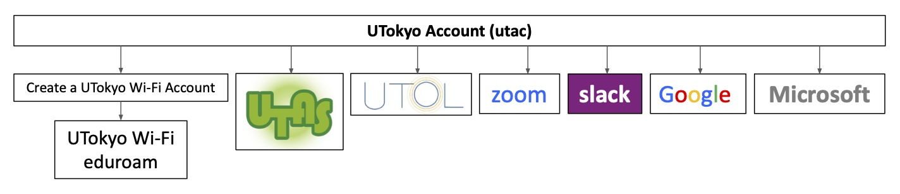
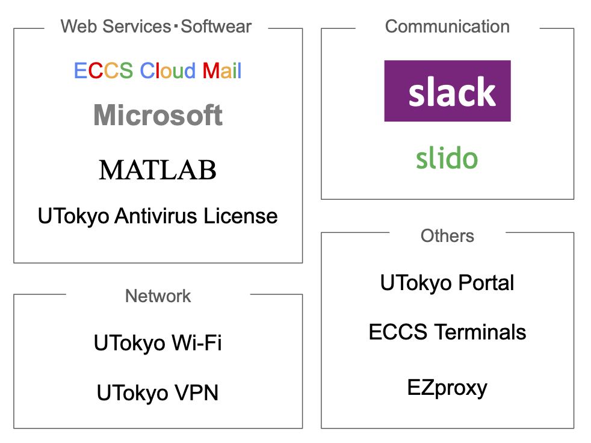

import Courses from '@components/en/Courses.mdx'
import UTokyoAccountChangePassword from '@components/en/systems/utokyo_account/ChangePassword.mdx'
import UTokyoAccountMFA from '@components/en/systems/utokyo_account/MFA.mdx'
import ZoomSigninBrowser from '@components/en/systems/zoom/SigninBrowser.mdx'
import InformationSecurity from '@components/en/InformationSecurity.mdx'
import UtolLogin from '@components/en/systems/utol/Login.mdx'

<b class="box">
{/*An information session titled “<a href="/en/events/2025-03-12/">Information Session on ICT Systems and Tools for UTokyo Members (Conducted in Japanese)</a>” will be held on March 12, 2025 at 3:00 PM. Please refer to this page as well.*/}
An information session titled “<a href="/en/events/2025-03-12/">Information Session on ICT Systems and Tools for UTokyo Members (Conducted in Japanese)</a>” was held on March 12, 2025. Materials and recordings of the session are provided on the linked page. Please refer to this page as well.
</b>

## Basic Information

When conducting classes at UTokyo, various information systems will be used regardless of whether the class format is face-to-face or online. This page explains the initial setup of the necessary accounts and the main systems used in classes.

If you are a staff member, please see the “[Getting Ready for ICT Systems at the UTokyo（for Staff Members）](/en/staff_members/)” page.

In the initial setup of your account, you need to do three things.

1. Change your password from the initial password
1. Set up multi-factor authentication
1. Attend the Information Security Education, and pass the confirmation test

For more information, see the instructions below.

### Types of Classes and Their Handling

#### Types of Classes

<Courses variant="faculty_members" />

#### Institutional Handling of Classes

Institutionally, classes are categorized into **“face-to-face”** and **“remote” classes.** Undergraduate students are only allowed to include up to 60 credits of “remote classes” for graduation requirements. Therefore, the category of a course is a critical matter for students.

Please note that online courses for the 2020 and 2021 academic years will not be included in the 60 credits due to special circumstances.

- Classes institutionally categorized into **“face-to-face classes”** are classes that “provide the opportunity to attend class in person for at least half of the total class hours for all students (enrolled in the relevant course)”.
    - Of the class types mentioned earlier, “face-to-face (complete face-to-face)” and also “face-to-face with synchronous online delivery (hybrid)” are usually institutionally categorized into “face-to-face classes”.
- Classes institutionally categorized into **“remote classes”** are classes that do not fall under “face-to-face classes”.
    - Of the class types mentioned earlier, “online (synchronous online type)” and “on-demand (asynchronous online type)” are institutionally categorized into “remote classes”.
- If classes are held “face-to-face” (including “face-to-face with synchronous online delivery”) and “online” within a single course (“face-to-face/online hybrid type”), the class category (“face-to-face classes” or “remote classes”) will be determined depending on the total class hours of each class type.

For details on the institutional handling of each class type, please refer to “[対面とオンラインを併用した授業実施形態にかかる取扱いの判断基準等について (Criteria for the Handling of Class Types with Face-to-Face and Online Combined, etc.) (for faculty members only; in Japanese)](https://univtokyo.sharepoint.com/sites/utokyoportal/wiki/SiteAssets/d/UTAS/%E5%AF%BE%E9%9D%A2%E3%81%A8%E3%82%AA%E3%83%B3%E3%83%A9%E3%82%A4%E3%83%B3%E3%82%92%E4%BD%B5%E7%94%A8%E3%81%97%E3%81%9F%E6%8E%88%E6%A5%AD%E5%AE%9F%E6%96%BD%E5%BD%A2%E6%85%8B%E3%81%AB%E3%81%8B%E3%81%8B%E3%82%8B%E5%8F%96%E6%89%B1%E3%81%84%E3%81%AE%E5%88%A4%E6%96%AD%E5%9F%BA%E6%BA%96%E7%AD%89%E3%81%AB%E3%81%A4%E3%81%84%E3%81%A6_20220214%E4%BD%9C%E6%88%90.pdf)”.

“[The Tools Usage Guideline for Online Class Since S Semester 2021](/en/docs/guideline/)” is the established guideline for online classes. Please also check your department’s policy on conducting online classes because each department may have its own policy.

### Troubleshooting: Technical Support Desk

If you have any problems or need advice on using information systems, please consult the **[Technical Support Desk](/en/support/)**. The Technical Support Desk provides consultation services through three tools: chat, online call, and email form. The Technical Support Desk will respond quickly through the collaboration of student staff “Common Supporters” and faculty members.

## Overall view of the UTokyo system

UTokyo provides various information systems such as Microsoft, Google, and so on. In order to use these various systems, you need to sign in using a university-wide account called UTokyo Account. The following figure shows an overview of the UTokyo information systems.

At the beginning of each semester, UTokyo holds a briefing session for faculty and staff on the overview of each of the UTokyo systems. The information systems provided by UTokyo are diverse and difficult to grasp, but the explanations of each system and its relationship are provided at the briefing sessions to make them easier to understand. Please refer to “[Information Session on ICT Systems and Tools for UTokyo Members(only in Japanese)](/events/2025-03-12/)” for the briefing for 2025 S Semester.

In the following, the systems of UTokyo and how to use them are explained individually.

## Getting Started: Initial Setup of “UTokyo Account”, etc

“UTokyo Account” is a university-wide account used for logging in to UTokyo’s IT systems, such as Zoom and UTOL (which are explained later). 

UTokyo Account is represented by a 10-digit number (Common ID) followed by `@utac.u-tokyo.ac.jp`, which indicates that you are a member of UTokyo, such as `0123456789@utac.u-tokyo.ac.jp`.

The following is an explanation of the UTokyo Account’s initial setup procedure. Please read this section carefully, as it is an important procedure necessary for using UTokyo’s systems.

### Changing the Initial Password for your UTokyo Account

<UTokyoAccountChangePassword variant="faculty_members" />

### Setting up “Multi-Factor Authentication for your UTokyo Account”

<UTokyoAccountMFA />

{/*
To improve the security of UTokyo’s IT systems, the “multi-factor authentication” (MFA) is available for UTokyo Accounts. MFA is a security process in which users prove their identity with at least two pieces of evidence. In addition to passwords, users are asked to verify their identity via SMS, authentication applications, and other methods when signing in to their accounts. Through the use of MFA, the risk of unauthorized sign-ins can be decreased, even if your password is compromised under certain situations, which enhances security.

For the overall improvement of university security, UTokyo strongly encourages the activation of multi-factor authentication for UTokyo Accounts. In particular for faculty and staff, everyone is expected to use multi-factor authentication. Please follow the setup procedures in the “**[Using Multi-Factor Authentication for UTokyo Accounts](/en/utokyo_account/mfa/)**” page.
*/}

### Attending the Information Security Education
{:#information-security-education}

<InformationSecurity variant="faculty_members" />

## Using the Academic Affairs System “UTAS”

[UTAS](https://utas.adm.u-tokyo.ac.jp/campusweb/campusportal.do?locale=en_US) is UTokyo's academic affairs system, which is used to input syllabi and grades. For information on how to use UTAS, please check the academic affairs office of your faculty/graduate school, or log in to UTAS, then click “Other” in the menu at the top of the screen and download the manual from the “Download Center”.

## Using the Learning Management System “UTOL”

UTOL (UTokyo LMS) is the learning management system of UTokyo. Features of UTOL include distribution of lecture materials, submission of assignments, online examinations, and notification from instructors to students. UTOL is also used for announcing online class URLs to students. The following explains how to use UTOL.

### Logging in to UTOL

<UtolLogin />

### Opening the Course Page

When you log in to UTOL, the “Timetable” screen will be displayed. The courses you will teach should already be displayed. By clicking on each course, you will be taken to the individual course page, where you can perform the following operations.

Troubleshooting guide: When your courses are not displayed

<ul>
    <li>Course information is registered in UTOL approximately one month before the start of the course. It will not be displayed before that time.</li>    
    <li>Courses are automatically registered through the Academic Affairs System (UTAS) link, and by default, only courses in UTAS where you are registered as the instructor will be displayed. In addition to the automatic registration through the linkage, faculty members who are already registered as instructors can manually add other instructors using the procedures by [adding a course participant](/en/utol/lecturers/settings/course_participants/).</li>
</ul>

### Using UTOL’s Functions

UTOL's functions are listed below. For more details on how to use each function, please see the [UTOL](/en/utol/) page and manual, which can be downloaded from the “Manual” button in the upper right corner after logging in.

- **Information notices**: This feature allows instructors to contact students. Depending on the student's settings, the message will be sent by email, LINE, or [UTokyo Slack](/en/slack/).
- **Messages**: This feature allows course participants to contact each other. By default, messages from other participants are sent to the email address registered in the staff directory, but this can be changed from “Settings” in the upper right corner.
- **Course Materials**: This feature allows you to distribute class materials. For more details on how to use this feature, please see the “[Using the Course Materials function in UTOL](/en/utol/lecturers/materials/)” page.
- **Assignments**: This feature allows you to upload reports and other assignments online. For more details on how to use this feature, please see the “[Using the Assignment function in UTOL](/en/utol/lecturers/assignments/)” page.
- **Quizzes**: This feature allows you to conduct online tests. It enables you to set a time limit for answering questions or to automatically grade multiple-choice questions. For more details on how to use this feature, please see the “[Using the Quiz function in UTOL](/en/utol/lecturers/quizzes/)” page.
- **Surveys**: This feature allows you to take surveys from students.
- **Manage Attendance**: This feature allows you to manage attendance by sending a “one-time password” to attendees via Zoom or other means and asking them to enter it. For more details on how to use this feature, please see the “[Using the Attendance function in UTOL](/en/utol/lecturers/attendances/)” page.
- **Forums**: This is a “bulletin board” feature that allows students and instructors to exchange opinions and ideas.

UTOL's functions are similar to other ICT class support tools, but what is noteworthy is that the system is linked to UTokyo Account and UTAS for course registration, making it quite easy to pass information to “only students of UTokyo” or to “only students enrolled in the course”. Furthermore, because UTOL is popular among students, it is highly recommended that it be used for distributing lecture materials and collecting/returning assignments.

### Announcing Online Class URLs

The basic rule for announcing online class URLs to students is to use the “Online course information” section at the top of the course page of UTOL. The editing screen will open when you click the edit button (pencil icon) on the right of the “Online course information” section. On this page, you can enter all the information.

- Please note that only entering the URL will not create a link. Click the {:.inline} icon on the editing screen to complete the link creation process.
- It is helpful to input the meeting ID and passcode along with the online class URL so that students can also easily join from their tablets.

After you have finished entering information, click the “Proceed to Confirmation Screen” button at the bottom, then click “Register” to submit your information.

For further details on announcing the online class URLs, please see the “[How to Announce Online Class URL (for Faculty Members)](/en/faculty_members/url/)” page.

## Using Zoom

Zoom is a simultaneous interactive web conferencing system and is one of the most frequently used tools in online classes. There are other conferencing systems that perform similar functions, but if there are no particular reasons, we recommend you use Zoom as it is a familiar tool for students.

### Signing in to Zoom

UTokyo has a license agreement with Zoom, and allowing you to hold meetings with a maximum capacity of 300 participants and for a 30-hour duration by signing in with your account.

<ZoomSigninBrowser big inlineHelp support />

The app has a different sign-in procedure than that of the browser. Please refer to the [Zoom sign-in procedure page](/en/zoom/signin/) for more information.

### Creating a Meeting Room

Steps below are for setting up a Zoom meeting room.

1. Sign in to Zoom and click “Schedule” in the top right corner.
2. The meeting setup page will appear.
    - Enter a name (title) for the meeting room in the “Topic” field.
    - Enter the date, time, and duration of the meeting. If you check the “Recurring meeting” checkbox, you can hold classes multiple times in one meeting room (without changing the URL).
    - Please be careful when enabling “Require authentication to join” to restrict access to a meeting room especially at the beginning of the new semester. Some students may not have set up their UTokyo Account. For more details, please see “[Restricting Access to Zoom Meeting Rooms for Online Classes](/en/faculty_members/zoom_access_control/)”.
3. Click “Save”. You will be directed to a page where you can confirm the details of the meeting room you have set up. The meeting room URL will be displayed in the “Invite Link” section. Participants can enter the room using this URL.

You can also create a meeting room using the app. Please check “[Scheduling a Zoom Meeting (Zoom App)](/en/zoom/misc/app/)” for more details.

## Using UTokyo’s IT Systems

In addition to the systems described above, UTokyo subscribes to and operates various information systems that can be used for classes, education, and research.

This section describes some of the most common ones. The following diagram briefly summarises the services described here.

{:.medium}

### UTokyo Wi-Fi

This is a campus-wide Wi-Fi service. It provides access to databases and e-journals that are only available on campus. Please note that you cannot use this service unless you prepare in advance.

For further details on how to use this feature, please see the **[UTokyo Wi-Fi](/en/utokyo_wifi/)** page.

### ECCS Cloud Email (Google Workspace)

This is an account for using Google’s services (Google Workspace) as a UTokyo member.

With this account, you can use various services including Gmail, which allows you to use your UTokyo email address (`xxxx@g.ecc.u-tokyo.ac.jp`) Google Drive (an online storage service), Google Docs (a document creation service), Google Sheets (a spreadsheet service), Google Forms (a form creation service), YouTube, (a video streaming service), and Google Meet (a web conferencing service). It also allows you to restrict the sharing to UTokyo members only (limited access), which is a feature not available to regular Google accounts.

For further details on how to use this feature, please see the **[ECCS Cloud Email (Google Workspace)](/en/google/)** page.

### UTokyo Microsoft License

UTokyo provides access to Microsoft’s services through a university account and offers downloads of Microsoft Office applications such as Word and Excel. Other available services include the Web version of Office, OneDrive (an online storage service), and Microsoft Forms (a form creation service).

For further details on how to use this feature, please see the **[UTokyo Microsoft License](/en/microsoft/)** page.

### UTokyo Slack

This is a type of service called a business chat tool, designed for exchanging text messages and facilitating communication. A key feature is the ability to create multiple “channels” where users can post text messages, allowing for parallel conversations on different topics. In UTokyo Slack, “workspaces”, which serve as units where people communicate, are created upon request from faculty and staff.

For further details on how to use this feature, please see the **[UTokyo Slack](/en/slack/)** page.

### Slido

Slido is an interaction app that provides features such as Q&A, live polling, and questionnaires that are useful for interactive communication with participants in classes, conferences, and lectures.

For further details on how to use this feature, please see the **[Slido](/en/slido/)** page.

### MATLAB

MATLAB is a programming language developed for scientific and technical calculations, and numerical calculation and mathematical equation processing software based on it. UTokyo offers MATLAB licenses to students and faculty members to improve their educational effectiveness and research efficiency. In addition, UTokyo provides a support desk for MATLAB users in cooperation with MathWorks, the developer of the software, and is developing a campus community to share information about the software's use in classes.

Please refer to the **[UTokyo MATLAB Campus-Wide License](/en/matlab/)** page for details on usage and technical support.

### UTokyo Portal

[UTokyo Portal](https://login.adm.u-tokyo.ac.jp/utokyoportal) is an internal portal site for faculty and staff. 
In addition to allowing you to check necessary procedures and documents, UTokyo Portal provides manuals for various 'things you want to do' as a handy guide at the bottom of the top page. Various notifications will also be posted on this page, so please check them regularly.

### Other Systems

- **[ECCS Terminals](/en/eccs/)**
  - A programming environment and software for various purposes, such as statistics and 3DCG, are already installed and can be used without going through the installation procedure. Prior approval is required to use the system.
- **[EZproxy](https://www.lib.u-tokyo.ac.jp/en/library/literacy/user-guide/campus/offcampus/ezproxy)**
  - UTokyo has contracted this service to provide off-campus access to UTokyo members-only e-journals (available to students as well as faculty and staff).
- **[UTokyo VPN](/en/utokyo_vpn/)**
  - Some IT systems at UTokyo (for example, the Personnel Information MyWeb) can only be accessed through the university’s internal network. The “UTokyo VPN” is a service that allows users to access these systems from off-campus.
- **[a Comprehensive Antivirus Software License (UTokyo Antivirus License)](/en/antivirus/)**
  - UTokyo provides [a Comprehensive Antivirus Software License (UTokyo Antivirus License)](/en/antivirus/) for faculty members and students. UTokyo requires you to “install appropriate antivirus software on all the computers you administrate” in the “[Guidelines for Information Ethics and Computer Use](https://www.u-tokyo.ac.jp/adm/cie/ja/index.html)”. Please use them if necessary.
  - The version for academic year 2025 will be available from April 1, 2025 (tentative).

## Tips for Online Classes

When conducting online classes, you may have opportunities to share class recordings and to keep track of attendance. Using functions provided by various tools, you can perform these tasks without excessive burden on both the lecturer and student. The following sections describe some of the most common methods.

### Sharing Recordings

This section explains how to record and share a class (Recording a class is not only for students who could not attend the class because of equipment/connection issues or illness. It is useful for all students because they can watch it for review or pause it to learn at their own pace).

* Zoom has a recording function called “Record”. Notably, the “Cloud Recording” feature enables you to save videos to the Zoom Cloud for sharing with others later. When sharing a video, you can also restrict access to UTokyo members.
  * For details, please see “[(Zoom for Faculty Members) Cloud Recording](/en/zoom/how/faculty_members/recording_cloud/)”.
* Uploading recordings of Zoom videos to Google Drive or YouTube after editing them, such as deleting part of them, is a common method of sharing them. In such cases, you can also restrict access to UTokyo members.
  * For further details of these procedures, please see “[Google Drive](/faculty_members/how/google/share_video/)” (in Japanese) or “[Restricting YouTube Content to University Members Only](https://www.sodan.ecc.u-tokyo.ac.jp/en/hack/youtube-utokyo-only-en/)”.
  * For more information on video editing, please see “[Creating and Sharing Videos](/en/articles/create_share_movie/)”.
* By posting video URLs in the “Course Materials” section of UTOL, you can share these videos with students.

### Taking Attendance

In this section, we will explain how to record student attendance in online classes.

- UTOL’s attendance management function: This is a feature that allows you to manage attendance by sending a “one-time password” to attendees via Zoom or other means and asking them to enter it.
    - For more information on how to use the feature, please see “[Using the Attendance Function in UTOL](/en/utol/lecturers/attendances/)”.
    - Note that the system requires students to log in to register their attendance, but the system cannot prevent absent students from registering attendance using the “one-time password” obtained from other students.
- Zoom’s reporting feature: This is a feature that allows you to view and download the list of Zoom meeting participants.
    - For more information on how to use this feature, please see “[(Zoom for Faculty members) Managing Attendance](/en/zoom/how/faculty_members/attendance/)”.
    - For participants who were signed in with their UTokyo Zoom account, we can assume that they attended the class.

Additionally, because of the nature of online classes, students may not always be listening to the class even if they are connected to the Zoom meeting room, so in addition to taking attendance, it may be a good idea to check the students' understanding of the class content through reaction papers, quizzes, and other means. (You can use the survey feature of UTOL, Google Forms, Microsoft Forms, and others). Because online classes tend to have more assignments, it is suggested to take students’ workload into consideration and have these reaction papers and quizzes completed during the class time.

## How to Use Online Resources

This website, “**The Portal Site of Information Systems @ UTokyo**,” also known as “**utelecon**”, provides a variety of useful information on how to use information systems and useful information for online classes.

In particular, the “**[Improving Online Classes](/en/online/)**” page covers the use of various information systems in the classroom, practical examples of online classes, and other resources that will help you take the next step toward online classes.

We also run the **[Technical Support Desk](/en/support/)**. If you have any problems with the above procedures, please contact us.

Also, we provide updates and announcements via [the official X account](https://x.com/utelecon_pr_en). Please follow that and get the latest information.