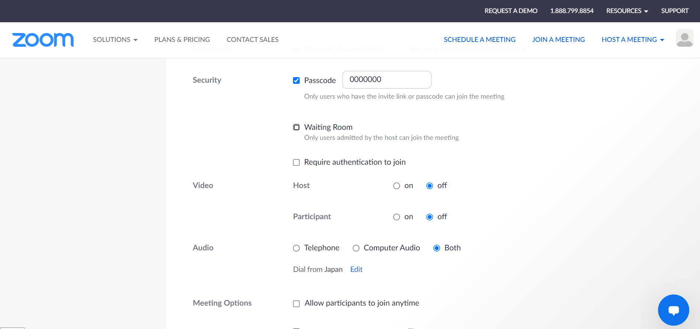
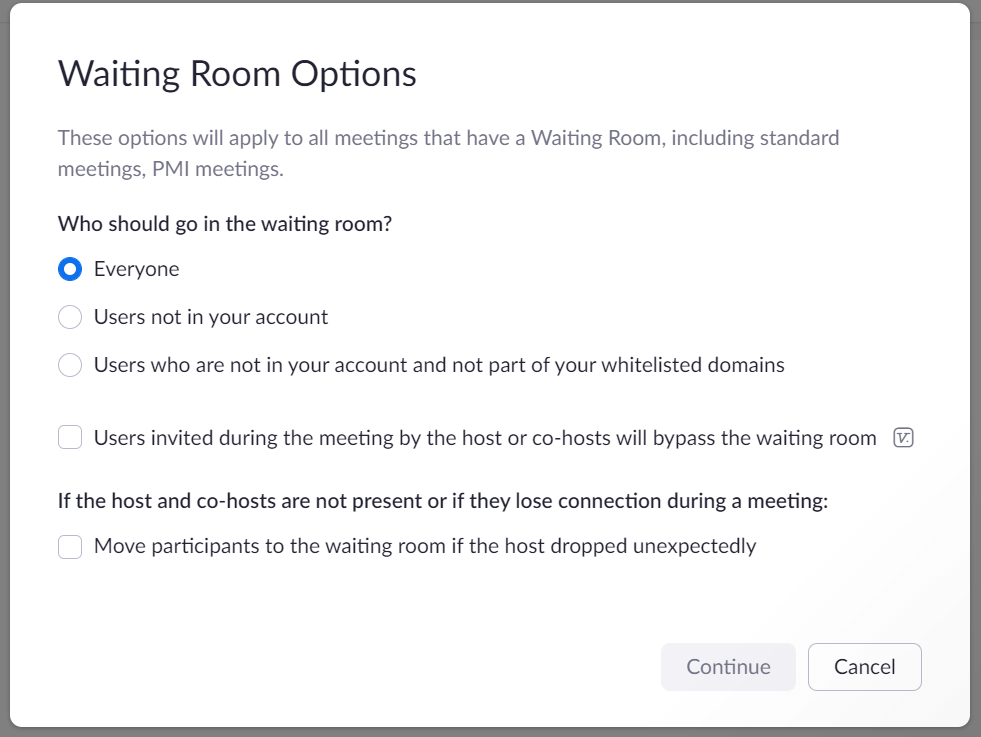

This page introduces methods to prevent unintended participants (so-called "trolls" or Zoom Bombing) from joining Zoom meeting rooms used for online classes.

## Methods of Restricting Access to Zoom Meetings
Below are common methods of restricting user access to Zoom meeting rooms. We recommend using either method A or B for online classes at UTokyo. C and D are also commonly used, but we do not recommend them for online classes at our university for the reasons mentioned below.

* Method A: Place no restriction on Zoom meeting room entrance (i.e. allow anyone to directly enter the meeting room), but restrict access to the meeting room URL by posting the URL on places that are visible to only UTokyo members (e.g., UTOL).
* Method B: Allow participants signed in with a university account (i.e. account set up as a UTokyo member, including UTokyo Account) to directly enter the meeting room, and place participants not signed in with a university account in the Waiting Room.

* Method C (**Not recommended**): Place all participants in the Waiting Room first. Then give each participant the host’s permission to enter the meeting room. This method is useful when the host knows the participants in advance, but not suitable for online classes where the host (instructor) may not know all the students.
* Method D (**Not recommended**): Do not allow any participants who are not signed in with a university account into the meeting room. Instructors need to be cautious about using this method, since often there are students who are yet to set up their university account, especially at the beginning of the semester.

### Choosing your Access Restriction Method
Take into consideration the following when selecting an access restriction method for your online class. Pros and cons of the aforementioned methods will also be discussed respectively.

#### Points of Consideration
* **Blocking unauthorized participants**: It is necessary to make sure that unauthorized participants cannot enter the meeting room.
* **Avoiding entrance accidents of UTokyo students**: However, at the same time, we must ensure that UTokyo students are not wrongly blocked out of meeting rooms, including students joining in the middle of the class.
* **Enabling entrance of students who have not set up their university account**: Another case of students wrongly getting blocked out of meeting rooms is when meeting room access is restricted to university accounts. Especially at the beginning of the semester, there are new students who have not set up their university accounts in time for the start of class. It is necessary to make sure such users do not get blocked.
* **Managing the Waiting Room**: If a Waiting Room is set up, it is necessary to manage the participant flow so that no participant is accidentally left behind in the Waiting Room.

#### Pros and Cons of the Access Restriction Methods
* Method A:  In this method, there is no risk of wrongly blocking students, including those who have not managed to set up their university accounts. However, there is a risk of unauthorized participants obtaining the meeting room URL and entering the meeting room if the URL is leaked.
* Method B: In this method, there is a lower risk of unauthorized participant entrance owing to the fact that unauthorized participants will be placed in the Waiting Room even if the URL is leaked. However, if a large number of UTokyo students who have no university account are placed in the Waiting Room, there is a higher risk of student flow mishandling, such as forgetting to move late students out of the Waiting Room and into the meeting room during class.

Please choose the most appropriate method based on the nature of your class and student population. Kindly also check whether your department has its own policy on access restriction.

## Implementing Access Restriction in Zoom
### Fields to Edit
You can restrict access to a Zoom meeting room by editing the following fields (1) to (3).

* (1) ”Waiting Room” & (2) ”Require authentication to join”: These fields can be found under the “Security” section in the “Schedule a Meeting” page. Please also refer to the “[Scheduling a Zoom Meeting (Web Portal)](/en/zoom/create_room)” page for procedures to schedule a meeting.
{:.medium}
* (3) ”Who should go in the waiting room?”: This field can be found in the Zoom Settings page.
    1. In your web browser, access [Zoom Setting page](https://u-tokyo-ac-jp.zoom.us/profile/setting).
    2. Click “Edit Options” under “Waiting Room Options”.
    {:.medium}
    {:.medium}

### Setup for each Access Restriction Method
* Method A: Place no restriction in Zoom and let everyone enter the meeting room.
    * (1) Waiting Room: Off
    * (2) Require authentication to join: Off

* Method B: Place participants entering without a university account in the Waiting Room
    * (1) Waiting Room: On
    * (2) Require authentication to join: Off
    * (3) Who should go in the waiting room?: Select “Users who are not in your account and not part of your whitelisted domains” and input ‘*.u-tokyo.ac.jp’ in the field appears.

* Method C (**Not recommended**): Place all participants first in the Waiting Room
    * (1) Waiting Room: On
    * (2) Require authentication to join: Off
    * (3) Who should go in the waiting room?: “Everyone”

* Method D (**Not recommended**): Only admit participants signed in with university accounts into the meeting room
    * (2) Require authentication to join: Turn on this option and select ”大学アカウントでサインイン”(Sign in with university account) , and confirm that the domain showing up below is ‘*.u-tokyo.ac.jp’.（[Details](/en/zoom/auth.html)）
