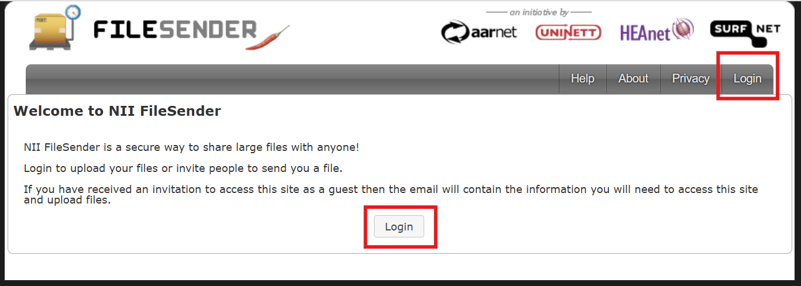
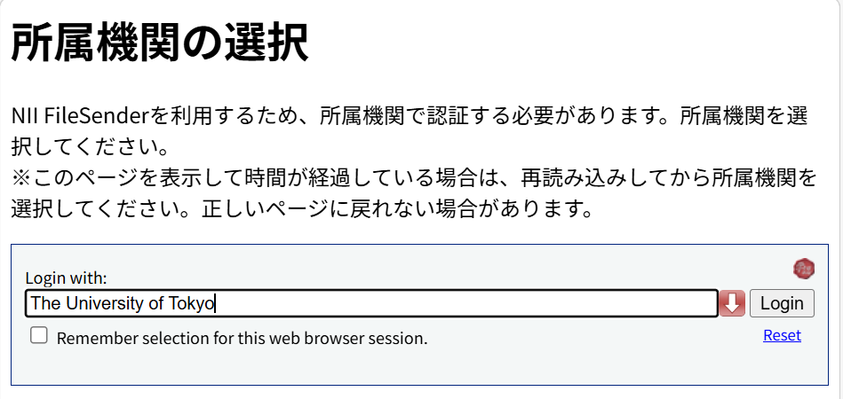

## What is NII FIleSender

NII FileSender is a file transfer service provided by the National Institute of Informatics (NII). Members of the University of Tokyo can use this service with their UTokyo Account. It also allows you to send files to and receive files from users who do not have a UTokyo Account.

NII FileSender is available to many universities and research institutions in Japan, including UTokyo, through “[GakuNin]”(https://www.gakunin.jp/en), the Academic Access Management Federation in Japan, using accounts issued by each institution. To use the service, it is sufficient for either the sender or the recipient to have an account from a participating institution.

### Usage Limits

- The maximum size per transfer is 10 GB, and the maximum number of files is 30.
- Uploaded files remain available for up to 20 days.

### Cases where Use is Not Recommended

NII FileSender is designed for temporary file exchanges[^1]．Therefore, the following cases of use are not recommended:

- **Long-term file sharing and accessibility**: Files are automatically deleted after a maximum of 20 days．
- **Collaborative file editing**: The service does not have features for collaborative or simultaneous editing．
- **Sharing with a large number of people**: A maximum of 100 recipient email addresses can be specified simultaneously. (While there is an option to send a link that allows anyone to download without specifying email addresses, this method is less secure than the method of specifying email addresses.)
- **Sharing with unspecified members within the university**: It is not possible to restrict access to a specific group, such as “only members of the University of Tokyo”. (Although it is possible to configure the service to require the recipient to log in to NII FileSender, the service allows login with accounts from many universities and institutions other than UTokyo.)

For the above purposes, **it is recommended that you consider using [Google Drive](../google/drive/) or [OneDrive](../microsoft/onedrive/)**. For information on these file sharing using cloud storage services, please refer to the page: “[Proposal for a New File Sharing Method using Cloud Storage](../../articles/share-policy/)” (in Japanese).

## How to Use

For details about the service and its usage, please refer to the following NII pages:

- [About NII FileSender](https://nii-auth.atlassian.net/wiki/x/QoGjAg)(in Japanese)
- [NII FileSender “Help”](https://filesender.nii.ac.jp/?s=help)

### Login Procedure

1. Access [the NII FileSender upload page](https://filesender.nii.ac.jp/?s=upload).
2. Click the “Login” button at the top right or center of the screen.
    {:.border.medium}
3. You will be directed to the affiliated organization selection screen. Enter and select “The University of Tokyo” in the text box, or click the red down arrow button to select it.
    {:.border .small}
     - If you check “Remember selection for this web browser session” on this screen, your selected affiliated organization and sign-in with your UTokyo Account will be performed automatically upon subsequent login while the browser is running.
4. Click the “Login” button to the right of the text box.
5. Unless you are already signed in to your UTokyo Account, the UTokyo Account sign-in page will appear. Please sign in.

## The University of Tokyo Specific Settings

In NII FileSender, the email address used as the sender, etc. is determined based on the following:

- (For students <small>including accounts that are both students and faculty and staff members</small>) "E-MAIL 1" field on the "Register Address Update, etc." page in the "Student Info" section of [UTAS](https://utas.adm.u-tokyo.ac.jp/campusweb/campusportal.do). (Note: The “E-MAIL 2” address cannot be used as the NII FileSender email address.)
- (For faculty and staff members <small>excluding accounts that are both students and faculty and staff members</small>) "学内メールアドレス" (Campus Email Address) in the "パーソナルメニュー" (Personal Menu) of the [Personnel Information Myweb](https://univtokyo.sharepoint.com/sites/utokyoportal/wiki/d/Personal_information_and_ID_card_EN.aspx)
    - The email address for this purpose must end with `u-tokyo.ac.jp`.

Please note that if this contact email address is changed, it will become available for use in NII FileSender on the day following the change.

[^1]: [NII FileSender “About”](https://filesender.nii.ac.jp/?s=about)
