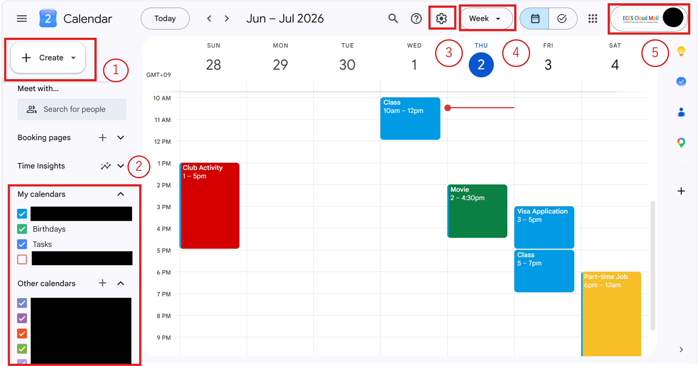
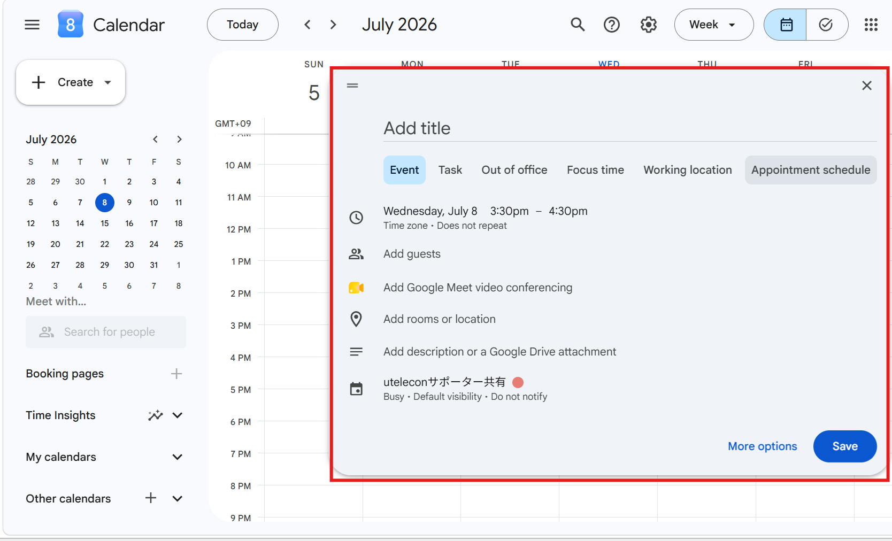
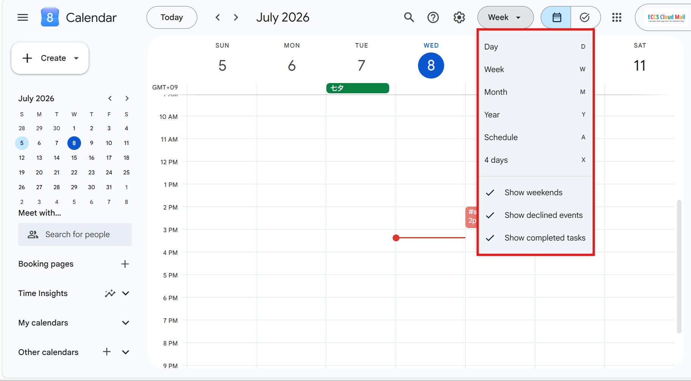
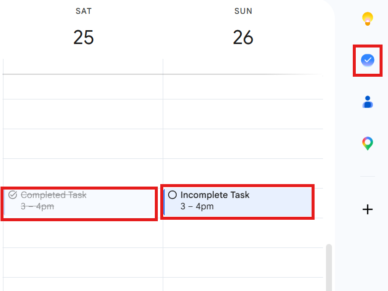
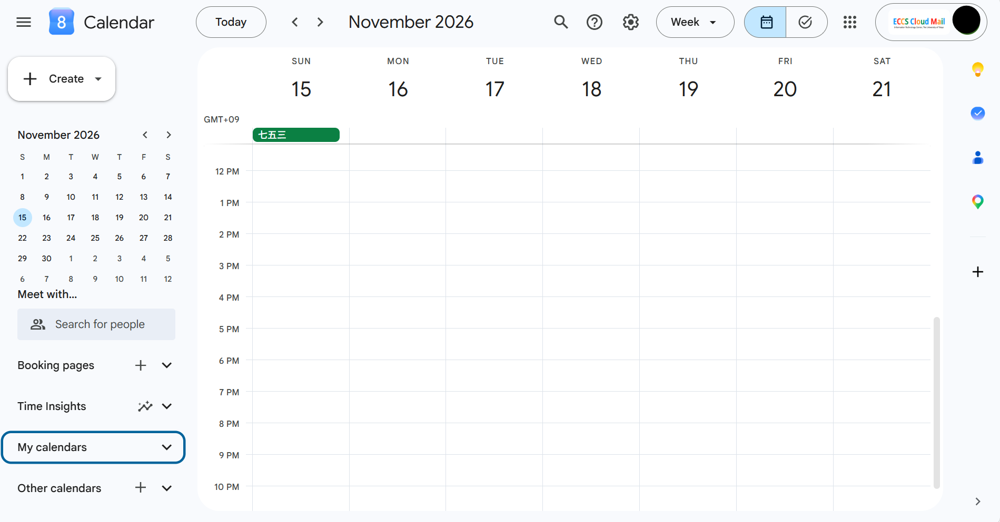
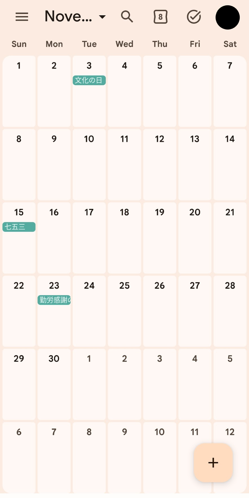
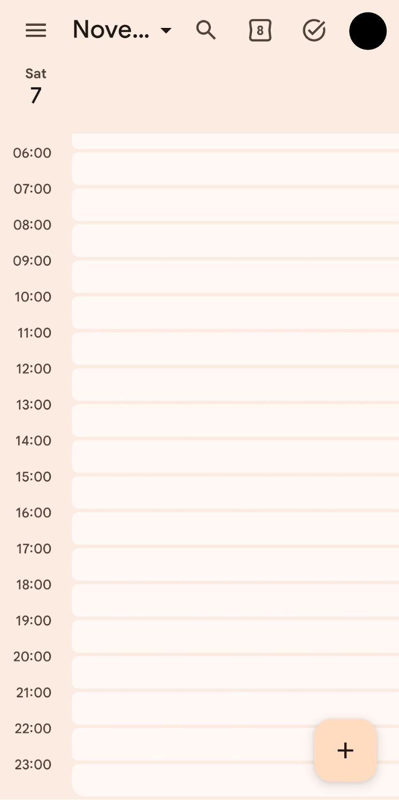

## Introduction
{:#introduction}

Google Calendar is a schedule management tool provided by Google. You can create and share events, set reminders, and manage tasks online.

Google Calendar can be used by signing in to your Google account. Note that if you sign in with your ECCS Cloud Email (The University of Tokyo's Google account), you can use more features than with a standard Google account (such as "[Out of office](#set-out-of-office)", "[Working location](#set-working-location)", and "[Focus time](#set-focus-time)", which will be explained later). Therefore, the following explanation assumes the use of an ECCS Cloud Email account.

Since Google Calendar is a cloud service, the same account can be used on multiple devices. That is, schedules and other information are automatically synchronized between different devices; by signing in to the same account on your PC or smartphone, you can access the same calendar from any device. On a PC, it can be accessed via a browser, and on mobile devices such as smartphones, it can be accessed via an app or a browser. This article specifically explains the browser version for PC. The differences from the mobile version are explained in "[Differences between PC and mobile versions, specifications/synchronization for multiple devices](#differences-by-device)".

Furthermore, With Google Calendar, you can share your calendar with others and invite them to events like meetings. When using an ECCS Cloud Email account, you can limit calendar sharing to only users who also have an ECCS Cloud Email account. On the other hand, just like with a standard Google account, you can also make it public without any restrictions.  For more details, please refer to "[Using Google Calendar in collaboration with others](#colab)".

## “Calendar” in Google Calendar
{:#what-calender-is}

In Google Calendar, the container like entity used to create and manage events is called a "calendar."

A Google account using Google Calendar for the first time has one calendar. You can also manage multiple calendars under the same account by creating additional calendars. By using multiple calendars separately like a lecture calendar, a club activity calendar, and a part-time job calendar, You can manage different types of events separately. Furthermore, you can individually configure settings such as the sharing settings for each calendar.

## Basic Usage
{:#basic-usage}

 When you open Google Calendar in a PC browser, it will appear as shown in the image below.

Events are displayed in the grid section in the center of the screen. You can create an event at ①. A calendar list is located at ②. Furthermore, at ③, ④, and ⑤, you can change the calendar settings, the calendar display mode, and the account you are using, respectively.

{:.border}

Specific details for each feature are explained below.

### Create an event (①)
{:#create-event}

In this section, we explain how to add events as one of the most basic features. For more advanced configuration settings, please refer to "[Creating detailed events](#event-creation-detail)" below.

The procedure is as follows.

1. Click on the time slot where you want to add an event, or click "Create" in the upper left corner. A screen will appear, such as the area outlined in red in the image below.
  {:.border}
2. Enter the name of the event in "Add title" at the top.
3. Set the start and end times at the clock icon below.
4. Click "Save" in the lower right corner.

### Manage My calendars and Other calendars (②)
{:#manage-calendars}

"My calendars" displays calendars for which you have administrative privileges. On the other hand, "Other calendars" displays calendars for which others have administrative privileges and that have been shared with you. As you create calendars yourself or have them shared by others, the new calendars will be added to each section.
You can toggle the visibility of each calendar by clicking its checkbox. For information on sharing calendars, please refer to "[Using Google Calendar in collaboration with others](#colab)" below.

### Change settings (③)
{:#change-setting}

You can configure detailed calendar settings to suit your personal preferences. For example, you can change "Notification settings" and "View settings" to make them easier for you to use. You can also check deleted events in the "Trash." For more information, please refer to "[Detailed settings](#detailed-setting)" below.

### Change the view (④)
{:#change-display-density}

You can choose the calendar view from "Day," "Week," "Month," "Year," "Schedule," or "4 days (or the number of days customized in [Settings](#change-setting))" (this can also be changed from "Settings"). Selecting "Day," "Week," "Year," or "4 days" displays each period on a single screen. Note that while "Week" starts on Sunday, "4 days" can start on any day of the week. Selecting "Schedule" displays your events in a list format.

{:.border}

### Switch accounts (⑤)
{:#switsch-account}

If you have multiple Google accounts, you can switch accounts by clicking here. Switching accounts will change the view to that account's calendar.

## Creating detailed events
{:#event-creation-detail}

In this section, we provide a detailed explanation of features related to event creation. For all of these features, you can open the input field by clicking the time slot where you want to add an event and selecting the appropriate tab, or by clicking the item you want to configure from "Create" in the upper left corner. Once you have finished entering the information, click "Save" in the lower right corner.

### Creating an event
{:#create-event-detail}

This section provides a more detailed explanation than the "[Create an event (①)](#create-event)" section above.

You can configure the following items for each event:
- Title
  - Enter the name of the event in "Add title."
- Time zone
  - You can set the start and end times, as well as the recurrence settings.
    - By configuring the recurrence settings, you can add the same event at a specific frequency. Select a frequency, such as weekly or monthly, from the dropdown menu (default is "Does not repeat"). Clicking "Custom" allows you to set frequencies such as every other week or specify an end date.
- Guests
  - Entering the email addresses of the people you wish to invite will send an invitation email to them.
- Video conferencing
  - You can create a Google Meet room for meetings at the same time you create the event.
- Add rooms or location
  - You can set the venue. For example, you can enter a conference room for a meeting, or the name of a facility or an address for a business trip.
- Description or attachments
  - You can add a description or attach files related to the event.
- Change My calendars, Color
  - You can color-code events according to their type.

### Creating a task
{:#create-task}

You can register things you need to do (tasks) in Google Calendar. By registering tasks, you can more easily coordinate the time to perform them with other events, or use them as reminders. You can also create tasks by clicking the checkmark icon in the upper right corner of the screen (Switch to [Tasks]). In the calendar, tasks are displayed as shown in the red box in the image below.

{:.border.small}

You can configure the following items for each task:

- Title
  - Enter the name of the task in "Add title."
- Time zone
  - You can set the start and end times, as well as the recurrence settings.
- Description
  - Optionally, enter a description of the task.

- Mark an existing task as completed
  - When you open the input field of an existing task, there is a "Mark completed" button in the lower left corner. Clicking this button marks the task as completed, and it will no longer appear in the task display. Note that if you complete a recurring task, it will be marked as completed for that instance, but it will reappear when the next scheduled date and time approach.

### Setting Up Out of Office
{:#set-out-of-office}

By setting your "Out of office" hours in advance, you can notify others through your shared calendar or automatically decline meeting invitations during that time.

Items you can configure for "Out of office" include:
- Title:
  - Enter a name of your choice in "Add title" at the top. You can register the reason for your absence if necessary. The default is "Out of office."
- Time zone:
  - You can set the start and end times.
- Automatically decline meetings:
  - You can choose to decline only new meeting invitations or both existing and new ones.
  - You can also leave a message when declining.
- Set whether to make the "Out of office" event public or not.

### Focus time
{:#set-focus-time}

Google Calendar sends notifications as an event approaches, but during the time set for "Focus time," these notifications will be silenced. This allows you to create time to concentrate on tasks without being disturbed.

Items you can configure for "Focus time" include:
- Time zone:
  - You can set the start and end times, as well as recurrence settings.
- Focus time:
  - You can mute chat notifications.
- Automatically decline meetings:
  - You can automatically decline meeting invitations received during "Focus time."
- Description or attachments:
  - You can add a description or attach files related to the event.
- Change My calendars, Color:
  - You can color-code events according to their type.

### Setting Your Working Location
{:#set-working-location}

You can register your location for a specific time slot. This is useful for letting people who share your calendar know where you are.

Items you can configure for "Working location" include:

- Time zone:
  - You can set the start and end times, as well as recurrence settings.
- Location selection:
  - You can choose from "Home," "Office," or "Other location." 
    - Under "Other location," you can further select "Another office" or "Somewhere else."
- Change My calendars, Color:
  - You can color-code events according to their type.

### Setting up an Appointment schedules
{:#set-appointment-slots}

This feature is used when you want to share your availability with many people. Once an "Appointment schedule" is set, others can book a meeting by entering an available slot. For example, a faculty member can set available times for meetings with students, and students can select a convenient slot to request a meeting.

## Using Google Calendar in collaboration with others
{:#colab}

This section introduces how to use Google Calendar in collaboration with others. There are two main ways: sharing your calendar and inviting guests to an event. For both sharing and inviting, please refer to "[Collaborations using Google Calendar](./collab/)."

### Sharing your calendar
{:#share}

You can share your own calendar with others. For example, a faculty member can share their calendar with students, and students can refer to it to request a meeting. By setting the sharing permissions, you can limit access to specific people or make it public on a website for anyone to view. These features facilitate smooth schedule management and coordination among stakeholders. To view a shared calendar, enter the Google account name or email address of the user you want to find in "Search for people" on the left side of the screen. If the person's calendar is shared, it will be added to "Other calendars" for you to view.

### Inviting guests to an event
{:#invite}

You can invite others to events such as meetings. Invited guests will receive an email notification, and if they use Google Calendar, the event will be added to their calendar. For example, if one person invites all participants when creating a meeting, each participant does not need to create the event themselves. To invite someone, enter their Google account or email address in "Add guests" when creating the event. If the invitee uses Google Calendar, they can choose to accept or decline the invitation.

## Detailed settings
{:#detailed-setting}

This section provides an excerpt of items that can be changed from [the settings](#change-setting). For items not covered in this article, please refer to "[Change Google Calendar settings](https://support.google.com/calendar/answer/6084644?hl=en&co=genie.platform=desktop)" (Official Help).

- Event settings:
  - You can choose the default duration for creating events. This is useful, for example, if your meetings are always set to one hour. Selecting "Speedy meetings" will set the events to end a few minutes early.
- Guest permissions:
  - ゲストの権限を「予定を変更する」「他のユーザーを招待する」「ゲストリストを表示する」の中から選ぶことができます．
  - You can choose guest permissions from "Modify event," "Invite others," and "See guest list."
- Notification settings:
  - You can choose the notification type from "Desktop notifications," "Alerts," or "Off." You can also choose when to show snoozed notifications (from 0 to 5 minutes before the event). Additionally, you can choose whether to play notification sounds and whether to receive notifications for declined events.
- View settings:
  - If you uncheck "Show weekends," Saturdays and Sundays will be hidden.
  - If you check "Show declined events," events you have declined will remain visible.
  - If you check "Show completed tasks," tasks you have finished will remain visible.
- Events from Gmail:
  - When selected, events such as flights, hotels, and restaurant reservations will be automatically created and displayed from Gmail.
- Working hours & location:
  - You can set your working hours and location and make them visible to those with whom you share your calendar.

## Differences between PC and Mobile versions / Synchronization
{:#differences-by-device}

This section explains the differences in usage and appearance between PC and mobile devices. While there are apps for mobile devices, PC users access the service via a browser (there is no dedicated PC app). The UI of the mobile app follows the design of the PC browser version. Calendars for the same account are automatically synchronized across different devices. Therefore, as long as you are logged in with the same account, you can view and manage events entered on a PC from a mobile device (and vice versa).

**PC Browser version**

{:.border}

**Mobile App version**
<figure class="gallery">{:.small}{:.small}</figure>
