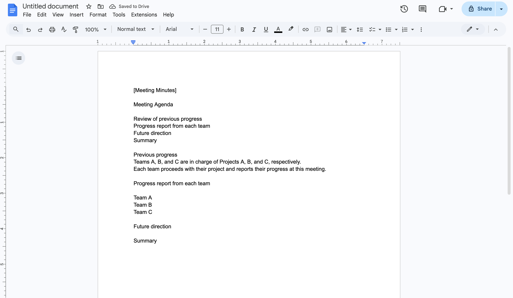
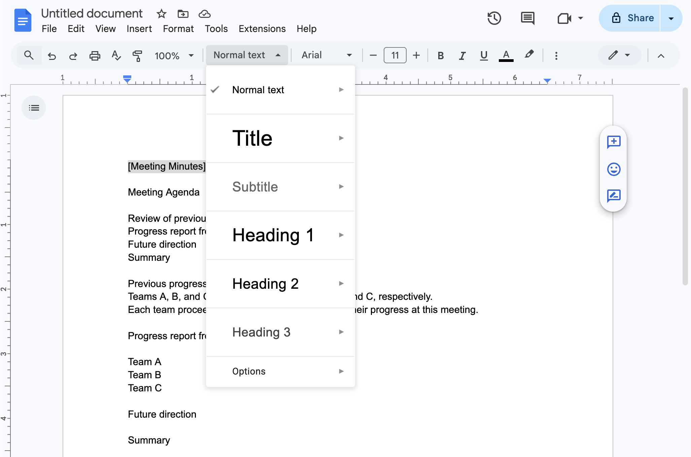
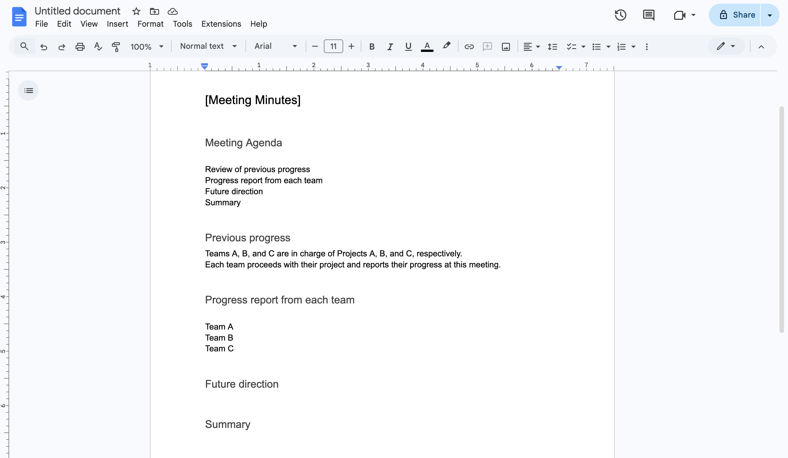
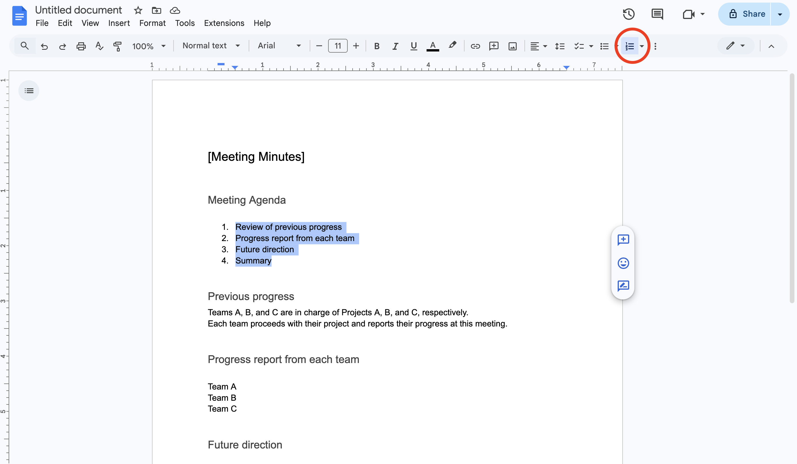
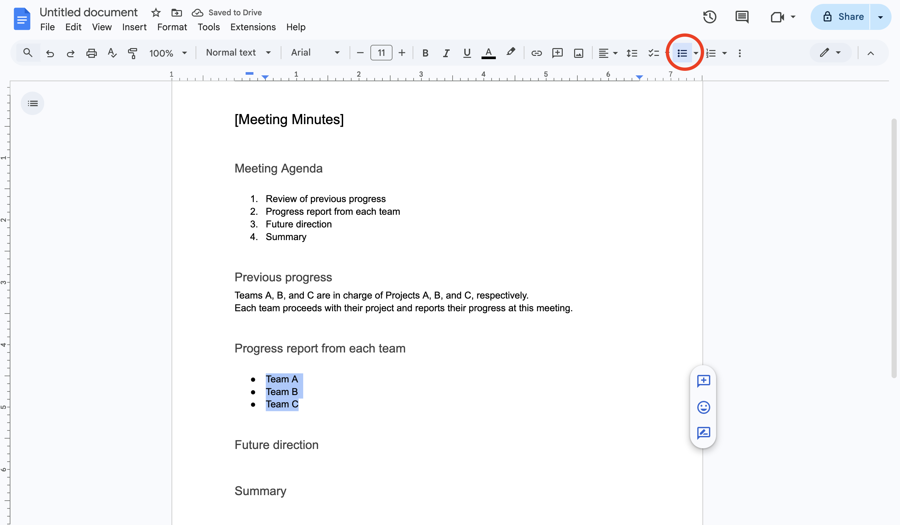
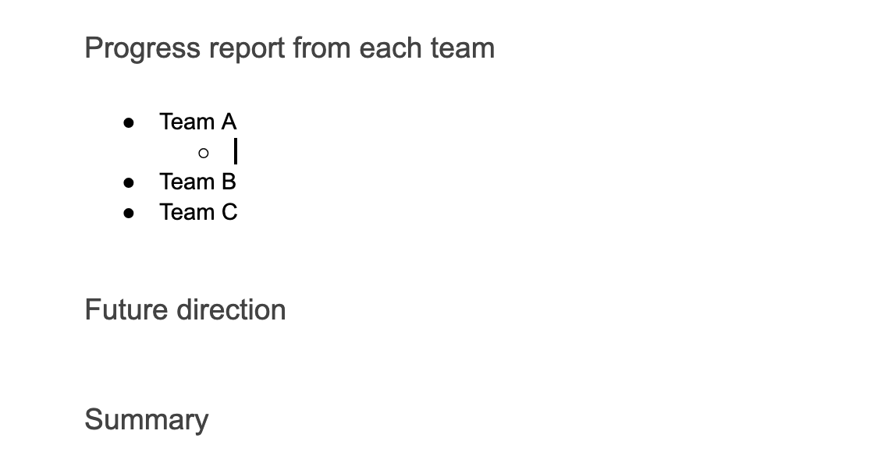
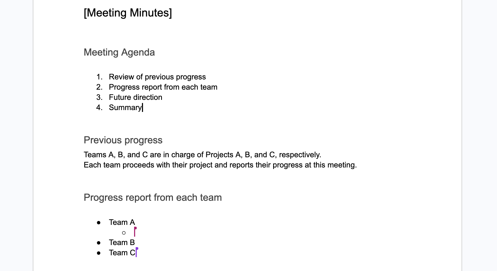

## Introduction
This page introduces the basic use of Google Docs.

## What is Google Docs?
Google Docs is a service that allows you to create and edit documents online. Since documents are saved online on Google Drive, they can be edited collaboratively by all users with access to the file. For more details on Google Drive, please refer to the “[Google Drive](../drive)” page.

### Using Google Docs with a university account
At the University of Tokyo, Google’s “Google Workspace” service is provided as part of the “[ECCS Cloud Email](../google)”. Since Google Docs is included in this service, members of the university can use Google Docs with their ECCS Cloud Email accounts.

### About file formats
Though Google Docs uses [its own proprietary file format](../drive/#format), Google Docs can be converted into Microsoft Word format, and uploaded Microsoft Office format files can be edited on Google services.

However, please note that compatibility is not perfect. Viewing or editing a Microsoft Word file in Google Docs may result in layout distortions or the loss of information related to unsupported features.

## How to use
This page explains how to use Google Docs on a web browser on a computer.

For information on using Google Docs on smartphones and tablets, please refer to the “[About Google Docs apps for smartphones and tablets](#mobile-app)” section.

### Creating a document
You can create documents using Google Docs on Google Drive. Please access [Google Drive](https://drive.google.com/drive/) and refer to the “[How to create files](../drive/basic/#create-file)” page to create a document.

Please note that if you are not signed in to Google when accessing Google Drive, you will be prompted to sign in. Please refer to the “[Steps to Start Using Your ECCS Cloud Email](../google/#initial-setup)” section on the ECCS Cloud Email page to sign in.

### ドキュメントの編集
ここでは，Googleドキュメントを編集する際に役立つ機能を紹介します．

Googleドキュメントは，Word等の文書作成ソフトウェアと同様のやり方で書き進めます．

#### 見出しの設定
見出しを設定することで，見出しの見た目を統一させ，文書を階層的に構成することができます．

見出しにしたい箇所を選択し，「標準テキスト」となっているところをクリックしてください．

以下のような選択肢が出てくるので，適当な見出しを選び，見出しの設定をしてください．

 

上の例では，「【議事録】」を「見出し2」に，「会議の流れ」「前回までの流れ」「各班進捗報告」「今後の方針」「まとめ」をそれぞれ「見出し3」に設定しました．

また，Windowsでは「Ctrl+Alt+（1〜6）」，Macでは「⌘＋option＋（1〜6）」のショートカットキーを用いて見出しを設定することもできます.

#### 番号付きリスト
番号付けしたい箇所を選択し，ツールバーにある「番号付きリスト」を選択してください．

もしくはWindowsでは「Ctrl+Shift+7」，Macでは「⌘＋Shift＋7」のショートカットキーを用いて「番号付きリスト」を設定することもできます.

#### 箇条書き
箇条書きにしたい箇所を選択し，ツールバーにある「箇条書き」を選択してください．

もしくはWindowsでは「Ctrl+Shift+8」，Macでは「⌘＋Shift＋8」のショートカットキーを用いて「箇条書き」を設定することもできます.

一段深い階層の箇条書きを追加する場合は，Enterキーを押して箇条書きを追加したあと，Tabキーを押してください．

一段浅い階層の箇条書きを追加する場合は，Shift+Tabキーを押してください．

## ドキュメントの共同編集について
Googleドキュメントで作成した文書を共有することで，他のユーザーと共同編集を行うことができます．

共有されたファイルをGoogleドライブ上で直接編集することで，ファイルをダウンロードして編集し再度アップロードする手間を省けるため，資料の共有や編集を生産性高く行うことができます．

また，複数人で1つのファイルを同時に編集することも可能であるため，会議の議事録を複数人で協力してとるような使い方もできます．文章を共有して同時に編集している場合，他の人のカーソルは色がついた状態で表示されるため，誰がどの場所を編集しているかが分かるようになっています． 共有相手の編集権限（編集可能・閲覧のみなど）もそれぞれ選択できます．
{:.border}

### ドキュメントの共有手順
ドキュメントの共有方法には，「個別に相手を指定する」方法と「不特定の人をまとめて指定する」方法の2種類があります．編集画面右上の「共有」ボタンを押すと，[Googleドライブの共有手順](drive/share/#procedure)と同様の設定画面が開くため，「[個別に相手を指定して共有したい場合の設定手順](drive/share/#individual)」または「[不特定の人をまとめて指定したい場合の設定手順](drive/share/#procedure-specified)」の手順に従って共有の設定を行ってください．

## その他
### Googleドキュメントのスマートフォン・タブレット向けアプリについて
{:#mobile-app}

Googleドキュメントには，スマートフォン・タブレット向けアプリがあり，スマートフォン・タブレットでドキュメントの閲覧，作成，編集などを行うことができます（閲覧だけであればブラウザ上でも可能です）．詳細な利用手順については[Googleドキュメントのヘルプ](https://support.google.com/docs/answer/7068618?hl=ja&co=GENIE.Platform%3DAndroid&oco=0)を参照してください．
