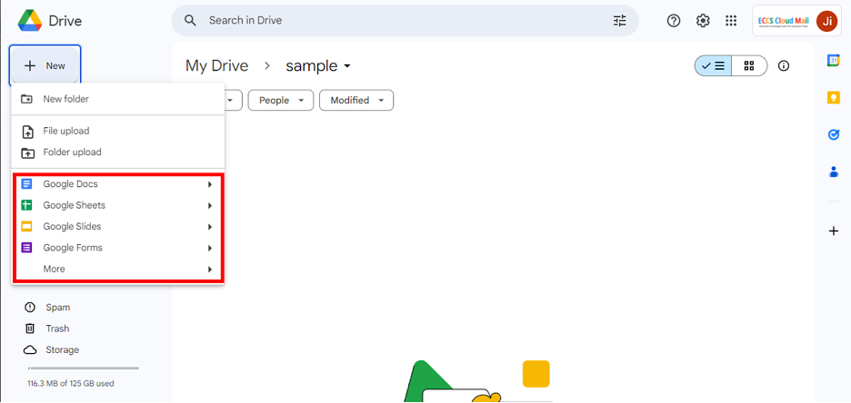

## Introduction

On this page, we will explain the specific operational steps for handling files stored on Google Drive.

Furthermore, general information on how to use Google Drive can be found in “[Google Drive](../../../google/drive)” (an English translation is planned). In addition, an introduction on how to share files can be found in “[Share files with Google Drive](../../../google/drive/share)” (an English translation is planned). Please refer to these documents for more information.

To proceed with the following steps, make sure you are already logged into ECCS Cloud Mail and have Google Drive open in your browser. If you have not completed these two steps, please refer to [“Open Google Drive in the browser” on the Google Drive page](../../../google/drive#access) (an English translation is planned).

## How to create files
{:#create-file}

Here, we will explain how to create files in Google Drive.

The main formats of files that can be created in Google Drive are listed below.

- Google Document: equivalent to Microsoft Word.
- Google Spreadsheet: equivalent to Microsoft Excel
- Google Slide: equivalent to Microsoft PowerPoint

Created files can be edited using the corresponding Google services. For more details regarding the file types, please refer to [“File types in Google Drive” section on the Google Drive page](../../../google/drive#format) (an English translation is planned).

### Procedure

1. In Google Drive, please navigate to the folder where you would like to create the file.
1. Please click the “New” button at the top left of the screen.{:.medium.center}
1. A list of file types is displayed. Please select the type of file you wish to create.{:.medium.center}
1. The file will be created and opened in the Google service corresponding to the file type.
    - You can directly edit the file displayed on the screen of the Google service.

<!-- なお，Web版のOfficeアプリで作成されたファイルは，自動的にOneDrive上に保存されます．このことを利用して，OneDriveからではなく，Web版のOfficeアプリからファイルを作成することもできます． ==相当するものは https://docs.google.com/document/ だけど，どれくらい使われているのかしら== -->

## How to edit files

In this section, we will explain how to edit files in Google Drive.

Files stored in Google Drive, such as Google Docs, can be edited using the corresponding Google service. In addition, you can edit Microsoft Office format files, such as Word or Excel, using the Google services. However, as they are not 100% compatible, there may be some parts that will need your attention (for details, please refer to [“File types in Google Drive” section on the Google Drive page](../../../google/drive#format) (an English translation is planned)).

### Procedure

1. In Google Drive, please navigate to the folder where the file you would like to edit is located.
1. Double-click the name of the file you would like to edit. A screen of the corresponding Google service will be displayed in a new tab so that you can edit the file.

## How to upload files

Here, we will explain how to upload files to Google Drive.

Any type of file, including images, videos, audio, etc., can be uploaded to Google Drive. However, regarding Microsoft Office format files such as Word or Excel, as they are not 100% compatible, there may be some parts that will need your attention (for details, please refer to [“File types in Google Drive” section on the Google Drive page](../../../google/drive.#format) (an English translation is planned)).

### Procedure

1. In Google Drive, please navigate to the folder where you would like to upload your files.
1. Please click the “New” button at the top left of the screen.{:.medium.center}
1. If you wish to upload a single file, please choose “File upload”. If you wish to upload all the files in a specific folder, please choose “Folder upload”.{:.medium.center}
1. After a screen for selecting files/folders opens, please select the file or the folder you wish to upload.
1. The file or folder will be uploaded.

## How to download files

Here, we will explain how to download files from Google Drive.

Files of Google services such as Google Docs can be downloaded after converting them to the corresponding Microsoft Office format (for details, please refer to [“File types in Google Drive” section on the Google Drive page](../../../google/drive.#format) (an English translation is planned)).

### Procedure

1. In Google Drive, please navigate to the folder containing the file you wish to edit.
1. Please right-click the file (or folder) you wish to download and select “Download” in the context menu that appears.{:.medium.center}
1. After a screen for selecting files opens, please choose the download destination folder.
1. The files will be downloaded.
    - Folders will be downloaded in a compressed .zip format.

You can also download multiple files as a file batch. Specifically, on the folder screen, you can select multiple files by holding down the Ctrl key (Windows) or ⌘ key (Mac) and choosing the files. After selecting the files of your choice, click "Download" in the right-click menu that appears. The selected files will be downloaded. 

### Appendix

If you wish others to be able to view or edit a file, instead of sending the downloaded files as email attachments, etc., it is more convenient to use the sharing feature by granting direct access to files on the Google Drive to others. With the sharing feature, changes will be immediately shown to your collaborators, and multiple people can edit files simultaneously. The sharing feature helps reduce the hassle of managing files via email. For information about the sharing feature, please refer to the [“Share files on Google Drive"](../../../google/drive/share) (an English translation is planned) page.

## How to create folders

Here, we will explain how to create folders on Google Drive.

### Procedure

1. Please navigate to the folder where you wish to create the new folder.
1. Please click the “New” button at the top left of the screen and select “New Folder”.{:.medium.center}
1. In the dialogue box titled “New folder” that is displayed, please enter the name of the folder.{:.medium.center}
1. Please click “Create” at the bottom right of the dialogue box. The new folder will be created.

## How to move the files

Here we will explain how to move a file in Google Drive by changing the folder where it is located.

### Procedure

1. Please right-click the file you wish to move and select “Organize” → ”Move” in the context menu that appears.{:.medium.center}
1. After the file selection screen appears, please open the folder to which you want to move the file.
    - You can change what is displayed using the tabs at the top of the screen. For example, if you wish to view the folders hierarchically, please select the "All locations" tab.

    {:.medium.center}
1. Please click “Move” at the bottom of the display. The file will be moved to the selected folder.

You can also move multiple files as a file batch. Specifically, on the folder screen, you can select multiple files by holding down the Ctrl key (Windows) or ⌘ key (Mac). After selecting the files of your choice, click “Organize” → ”Move” in the right-click menu that appears. The selected files will be moved to the desired location.
