import YouTube from "@components/embed/YouTube.astro";

## Introduction

This page explains the specific steps and settings required to share files that are saved on Google Drive with other users. 

For a general explanation of how to use Google Drive, please refer to “[Google Drive](.)”. For information on how to create, edit, upload, and download files, please refer to “[Basic Usage of Google Drive (in Japanese)](../../../google/drive/basic)”.

Additionally, please refer to “[Recommended Method for Sharing Files on Google Drive(in Japanese)](../../../google/drive/recommendation)”, which explains the recommended methods for sharing files according to different cases, and the page “[Proposal for a New File Sharing Policy Using Cloud Storage (in Japanese)](/articles/share-policy/)”, which explains ways to enhance productivity and security when sharing files.

### Introduction Video on How to Use Google Drive
We also explain the method for sharing files on Google Drive described on this page in a video.

<YouTube src="https://www.youtube.com/embed/HkEAV69sv4c?si=vGTrqsXfYm0gBdhv" />

## Sharing Files and Folders

With Google Drive’s share feature, you can grant others access to view, and edit files and folders stored on your Google Drive. 
When sharing, you need to set the range of people who can access each file or folder, as well as the access rights (the range of permitted operations) for those people. By sharing the link to the files or folders with the people you have granted access to, they will be able to view or edit the files or folders via that link.
Below, we will first provide an overview of each aspect, followed by detailed explanations of the specific steps.

### Overview of the Settings

#### How to Specify the People Who Can Access Your Files/Folders
{:#target}

The methods for specifying who can access are categorized into the following two types:

- Specify Individually
    - This method involves specifying the email addresses individually.
    - Generally, Google accounts are specified (for members of the University of Tokyo, this refers to ECCS Cloud Email accounts ending with @g.ecc.u-tokyo.ac.jp).
    - While it is possible to specify email addresses other than Google accounts, such recipients will be treated as “visitors”, and the way they access files or folders will be slightly different.
    - It is also possible to specify the email address of a Google Group, which allows members of that group to access the files or folders.

- Specify Unspecified People Collectively
    - This setting allows anyone with the link to the file or folder to access it.
    - There are two settings available: one allows anyone to be able to access the file or folder, while the other restricts access to users with an ECCS Cloud Email account from the University of Tokyo (this will exclude those without an ECCS Cloud Email account).
    - In the Google Drive interface, this is referred to as “General Access”.

It is also possible to combine the two settings. For example, you can grant editing permissions to members of the same team by specifying them individually, while allowing everyone else to only view the files or folders.

{/*<!-- 別途ユースケースのページもできるが，ここに使い分けを簡単に書いておくとよさそう -->*/}

#### Types of Access Permission
{:#access-level}

The types of access permissions (the range of operations allowed) granted to shared users are as follows:

- **Viewer**
    - They can view the file but cannot edit it.
- **Commenter**
    - In addition to viewing the file, they can add comments. For Google Docs files, they can also suggest edits but cannot directly edit the file.
- **Editor**(referred to as “Contributor” in [Shared Drives](shared_drive))
    - They can view and edit the file.

Note: When using the “Shared Drive” feature, there are additional access permissions such as “**Content Manager**” and “**Manager**”. For details, please refer to the “[“Shared Drives” in Google Drive](shared_drive)” page.

#### Other Settings

Additional settings can be configured as described below. The specific steps for these settings are outlined in the following steps.

- Share Settings to Control Further Sharing by Editors
    - By default, users with “Editor” access can share the file with others. You can modify this setting to prevent users with “Editor” access from sharing the file with others.
- Restrict Actions like Downloading for Viewers and Commenters
    - By default, users with “Viewer” or “Commenter” access can download and copy the file to their own Google Drive as well as print. You can modify the settings to restrict the downloading, printing, and copying for these users.
    - Note that users with “Editor” access are not affected by this setting and can always download, print, and copy the file.
- Set Expiration Dates for Sharing
    - You can specify an expiration date for sharing. When the expiration date is reached, the sharing permissions will be automatically revoked.

### Steps
{:#procedure}

The steps for setting up or changing sharing settings are as follows:

#### Steps to Open the Settings Screen.

1.	In Google Drive, navigate to the folder containing the file or folder you wish to share.
2.	Right-click on the file (or folder) you want to share and select “Share” from the menu that appears.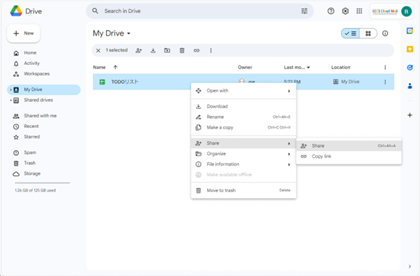{:.medium.center}
3.	The sharing settings screen, labeled “Share [file name]” will open. Confirm that the displayed file name matches the file you want to share before proceeding with the settings.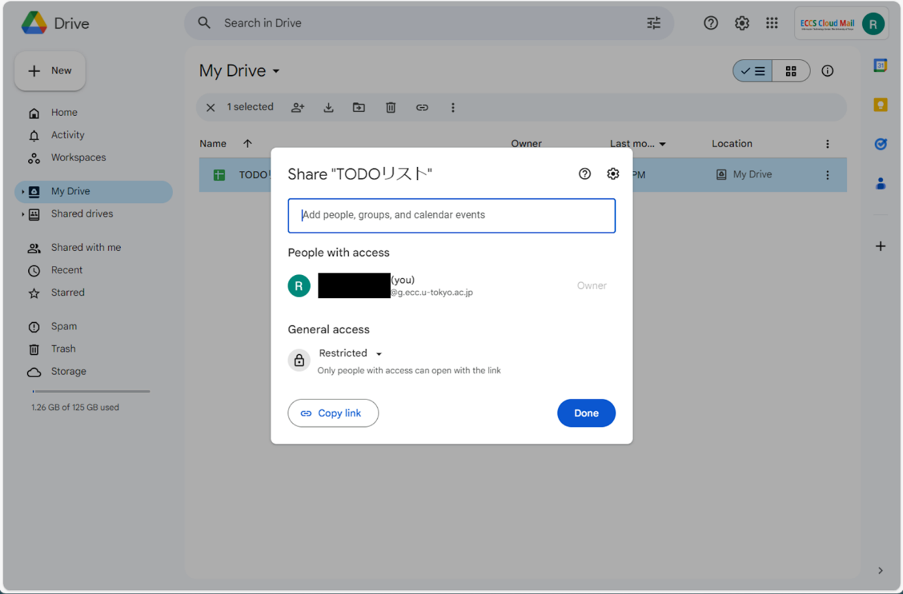{:.medium.center}

#### Procedure for Specifying Individuals to Share With
{:#individual}

Among “[the two methods for specifying the people who can access](#target)”, the procedure for specifying individuals to share with is as follows:

1. After opening the sharing settings screen as described above, enter the email address of the person you wish to share with in the “Add people, groups and calendar events” field.
    - Generally, specify a Google account (for members of the University of Tokyo, this refers to ECCS Cloud Email accounts ending with @g.ecc.u-tokyo.ac.jp).

    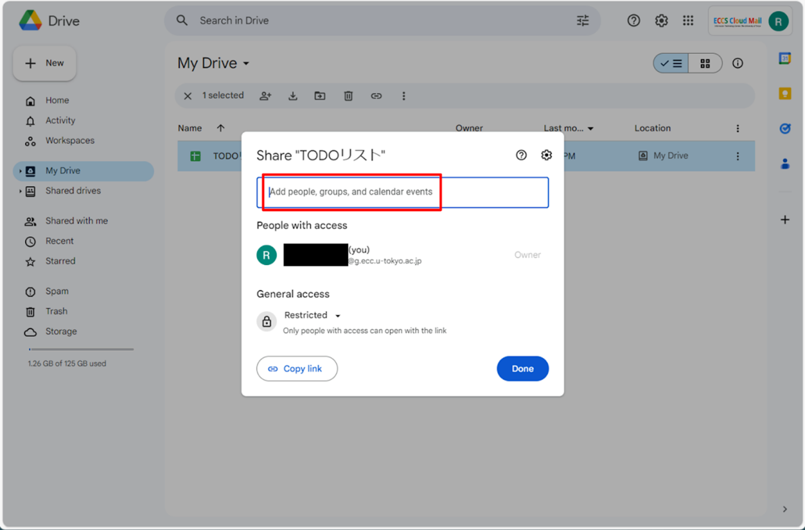{:.medium.center}
1. The screen will switch to the sharing settings for that individual. 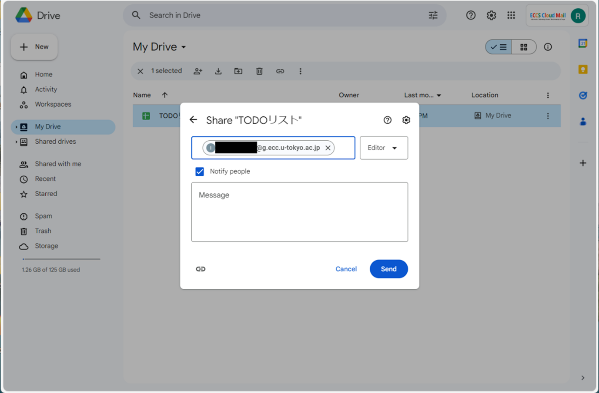{:.medium.center}
1. On the right side, you will see a section labeled “Editor”, which is where you can set the access permissions for the individual. Click this section to set the access permission parameters. For details on the available types of access permissions, refer to “[Access Permissions Details (in Japanese)](#access-level)”.
1. If the “Notify people” checkbox is selected, a notification email containing a link to the file will be automatically sent to the recipient. If you uncheck this box, the email will not be sent automatically, and you will need to manually share the link. Toggle this setting based on your needs.
    - When the “Notify people” is selected, the content entered in the “Message” field below it will be included in the notification email. If you have any information you want to convey to the recipient, please enter it here.
    - If the “Notify people” is unchecked, you can click the link icon at the bottom left to copy the link. It will be most convenient to copy it from this screen.
1. Finally, click the “Send” button.
    - If you have not checked the “Notify people”, make sure not to forget to share the link with the recipient.

The steps for removing the sharing or changing the access permissions granted to a shared person are as follows:

1. After opening the sharing settings screen, a list of people you have previously shared with will be displayed in the “People with access” section. Find the person whose access you wish to remove or whose access permission parameters you wish to change.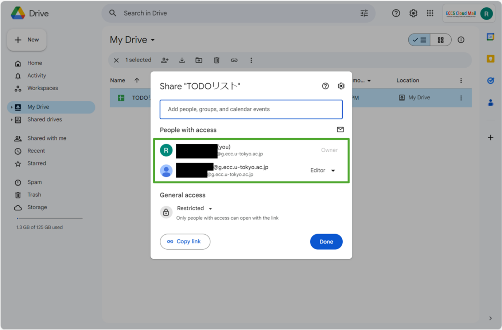{:.medium.center}
1. To the right of the person’s name or email address, you will see a section labeled “Editor”, “Viewer”, etc. indicating the access permissions granted to that person. Click on this section.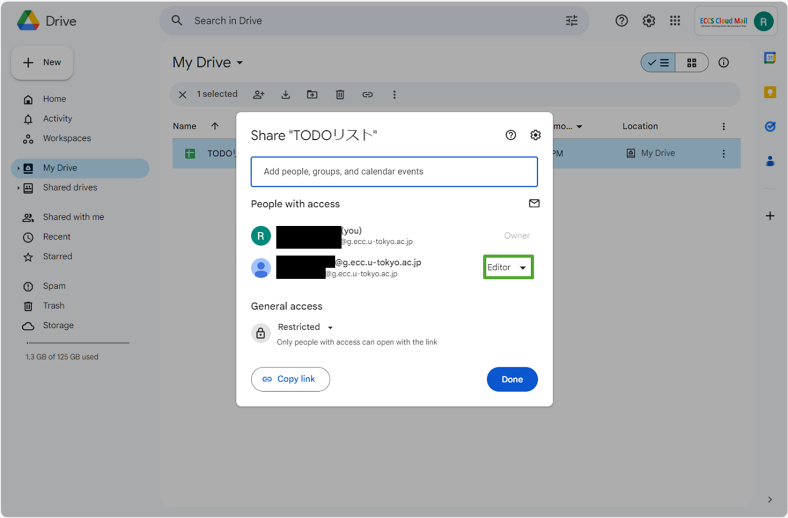{:.medium.center}
1. A menu for selecting the access permission parameters will be displayed. Adjust the permissions as needed. For details on the types of access permissions available, refer to “[Access Permissions Details](#access-level)”.
    - There is also a setting to “Add expiration”. If you add an expiration date, the sharing with that person will be automatically removed when the expiration date is reached.
    - There is also an setting to “Transfer ownership” (for individuals with “Editor” access permissions, outside of [Shared Drives](shared_drive)). Clicking this will transfer the file from your Google Drive to the other person’s Google Drive. Be cautious with this action, as it cannot be undone unless the other person transfers ownership back to you.
    - There is also a setting to “Remove access”. Clicking this will revoke the access of the selected person and terminate the sharing.

    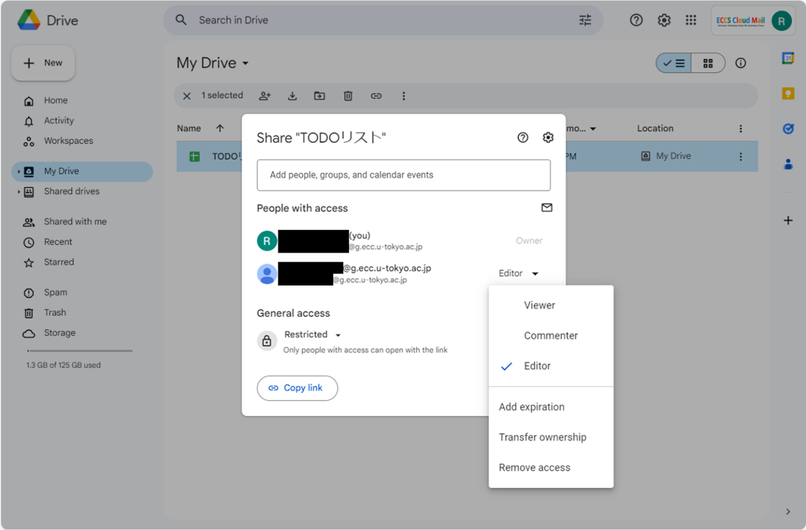{:.medium.center}
1. Finally, click the “Done” button at the bottom right.

#### Procedure for Sharing with a Group of Unspecified People
{:#procedure-unspecified}

Among [the two methods for setting the range of people who can access](#target), the procedure for sharing with a group of unspecified people is as follows:

1. After opening the sharing settings screen, look at the “General access” section. If no settings have been configured, it should display “Restricted”.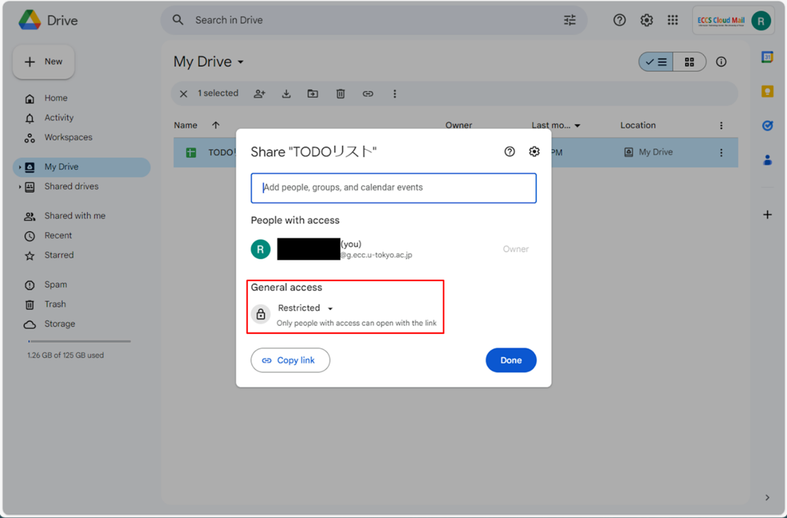{:.medium.center}
1. Clicking the "Restricted" text will display a list of settings, allowing you to change the settings.
    - “University of Tokyo ECCS Cloud Email”: This setting allows anyone with an ECCS Cloud Email account from the University of Tokyo to access it.
    - "Anyone with the link": This setting allows anyone who knows the link to the file or folder to access it.
  
   
    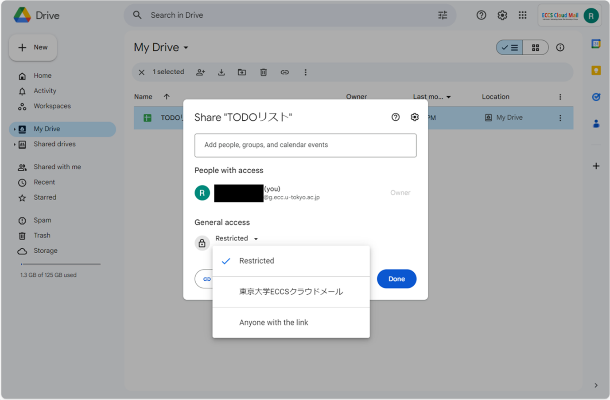{:.medium.center}
1. When you change the settings, a section labeled “Viewer” will appear on the right. Pressing this section allows you to configure the access permission parameters for the unspecified people with whom the file or folder is shared. For details on the available types of access permissions, please refer to “[Details of Access Permissions](#access-level)”.<figure class="gallery">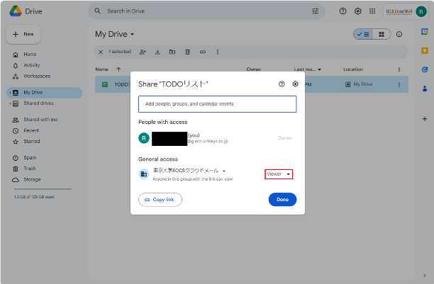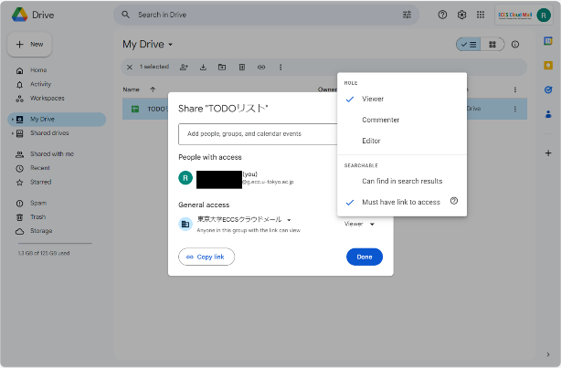</figure>
1. Press “Copy Link” at the bottom left to copy the link.
    - When sharing with unspecified people collectively, unlike sharing with specific individuals, there is no automatic email notification feature. Copy the link and manually share it with those you want to access the file (for sharing with a large number of people, consider posting the link in a notice or on a web page).

    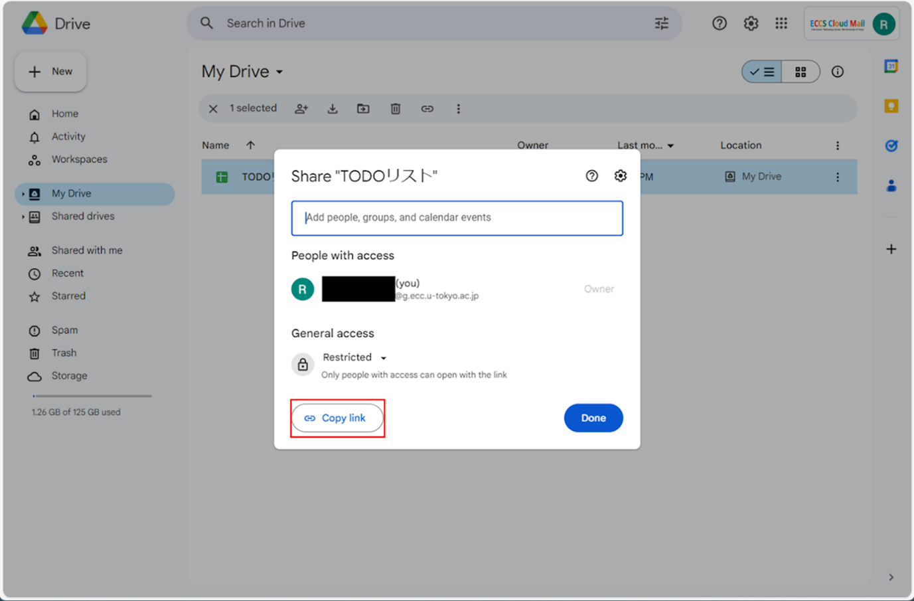{:.medium.center}
1. Finally, press the “Done” button at the bottom right.
    - Please note that settings are automatically applied as soon as you change them. Even if you close the screen without pressing the "Done" button, the sharing will still be active, so please be careful.

To stop sharing, change the setting from “University of Tokyo ECCS Cloud Email” or “Anyone with the link” back to “Restricted.”

#### If You Wish to Copy the Link

After opening the sharing settings screen, press “Copy Link” at the bottom left to copy the link to the file or folder. Use this if you need to resend the link to the person you are sharing with.

{:.medium.center}

Note:In Google Drive, there is only one link per file or folder used for sharing. Unlike OneDrive, where a new “sharing link” is created each time you share, Google Drive does not have such a system. Anyone already set up as a sharing recipient in the sharing settings screen can access the file through this link (access permissions are automatically determined based on the logged-in account).

#### If You Want to Change the Other Settings for Sharing
{:#other-settings}

After opening the sharing settings screen, press the gear icon at the top right. The following settings will be displayed.

<figure class="gallery">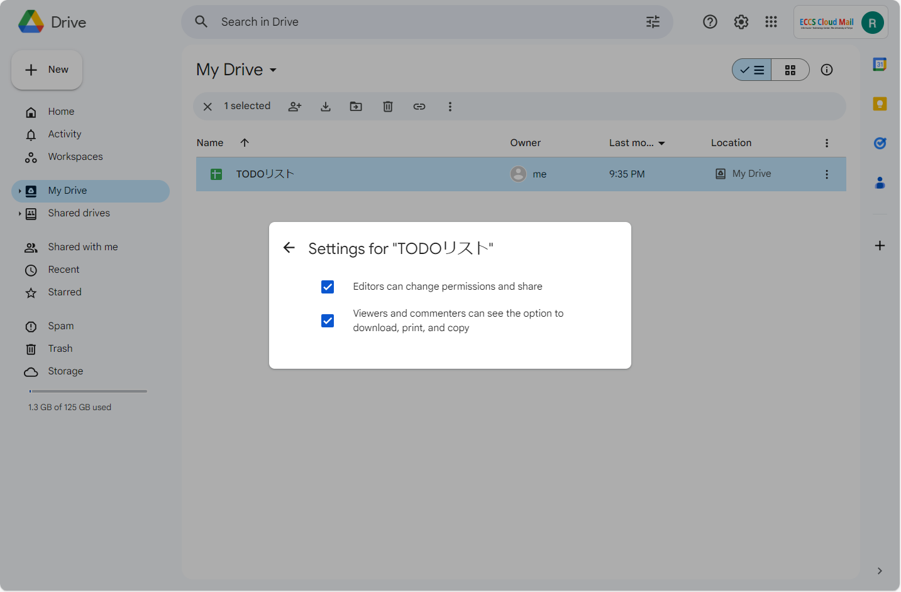</figure>

- “Editors can change permissions and share”
    - When the checkbox is turned on (default), sharing recipients with "Editor" access can share the file with others. If turned off, even those with "Editor" access are prevented from sharing the file with others.
- “Viewers and commenters can see the options to download, print, and copy”
    - When the checkbox is on (default), those with “Viewer” or “Commenter” access can download, print, and copy the file. Turning it off will prohibit these actions.
    - This setting does not affect those with “Editor” access.
    - This setting is only displayed when sharing files, not folders. If you want to prohibit downloading, files must be shared individually.
 
These settings are automatically applied as soon as you change them. To return to the sharing settings screen, press the left-facing arrow at the top left.

Note: If you are using the ["Shared Drive" feature](shared_drive), these settings will be applied to the entire shared drive and cannot be changed for individual files or folders.

Note: For instructions on setting an expiration date for sharing, please refer to the steps outlined in "Settings for sharing with specific individuals" above.
