This page explains how to use Google Forms. It also includes examples of anticipated use case when used at the University of Tokyo.

## What is Google Forms?

Google Forms is a tool that allows you to easily create forms and surveys to collect information. 
It features the following capabilities:

* Create forms easily
* Use form templates as needed
* Organize and analyze collected information clearly
* Collaborate throughout the entire process

This page introduces the basic workflow of creating and responding to forms, as well as the functions and settings available when editing them. Please note that the instructions provided here assume you are operating from a PC. For detailed usage and specific procedures, please refer to the official help.

You can access Google Forms by using your ECCS Cloud Email account (the University of Tokyo's Google account). By using your ECCS Cloud Email account, you can restrict form access to UTokyo members only.

## Use Cases

### Using as a Survey Form

This section introduces how to use Google Forms as a survey form. Please note that [UTOL](/utol/lecturers/surveys/) also offers similar features for conducting surveys within a class.

Possible use cases include class attendance forms, event registration, and feedback surveys. By [collecting email addresses](#collect_email_addresses) you can send event details and other information to the respondents' email addresses.

#### Using as an Attendance Form

When instructors use a survey form as a class attendance form, please note that [UTOL](/utol/lecturers/attendances/) also provides similar capabilities. The respective advantages of Google Forms and UTOL are as follows:

* Advantages of using Google Forms
  * In lectures where external instructors are invited and UTOL may be difficult to use, survey results can be shared more easily.
  * You can conduct anonymous surveys by turning off the email address collection setting.
* Advantages of using UTOL
  * You can configure settings for late registration.
  * You do not need to ask respondents to enter personal information, as individuals can be identified based on the UTokyo Account used to log in to UTOL.

### Using as a Quiz

This section introduces how to use Google Forms for quizzes.

This is intended for instructors to check students' understanding of the lecture. As with the class attendance forms,[UTOL](/utol/lecturers/quizzes/) also offers similar features.

* Advantages of using Google Forms
  * You can allow non-registered participants (such as auditors) to respond without requiring any special configurations.
  * You can allow users to upload files directly within the form.
* Advantages of using UTOL
  * You can set time limits and response deadlines.
  * You can immediately check the response status of registered students.
  * You can immediately download grading data.

If you wish to use grading features, please refer to the [Quiz Settings](#test-settings) section described later in this page.

## Basic Flow for Creating a Form

This section introduces the general flow for creating a form. For more detailed information on usage, please refer to "[How to Use Google Forms](https://support.google.com/docs/answer/6281888?hl=en&co=GENIE.Platform%3DDesktop&sjid=7739918649012816148-NC)"（official help）and the sections below "[Useful Features When Editing a Form](#useful_features_for_form_editing)" on this page.

The overall flow for creating a form is as follows:

* Step 1：[Create a New Form](#create_new_form)
* Step 2：[Create Questions](#create_questions)
* Step 3：[Publish & Share](#publish_and_share)
* Step 4：[Check Responses](#check_answer)

### Step 1: Create a New Form
{:#create_new_form}

1. Go to [https://docs.google.com/forms/](https://docs.google.com/forms/)．
2. From the "Start a new form" section, select a template for the type of form you want to create.

### Step 2: Create Questions
{:#create_questions}

A form consists of any number of questions. The following explains how to create questions. Please also refer to "[Edit your Form](https://support.google.com/docs/answer/2839737?hl=en&ref_topic=6063584&sjid=10457253941811607885-NC#zippy)" (official help) as needed.

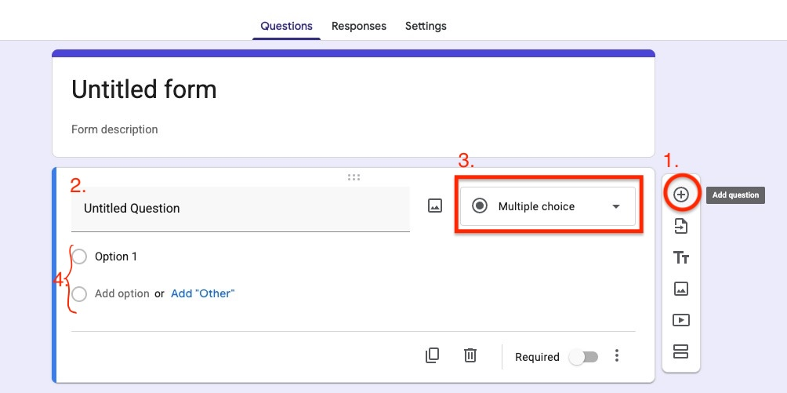{:.medium}
1. Click the "Add question" button to add a question.
2. Enter the content of the question.
3. Set the question format.
   * For more specific instructions, see"[Choose a type of question for your form](https://support.google.com/docs/answer/7322334?hl=en&ref_topic=6063584&sjid=10457253941811607885-NC#zippy)" (official help).
   * Please note that file upload answer options cannot be used in forms stored in shared drives.
4. For multiple-choice answer formats, configure the answer options.

### Step 3: Publish & Share
{:#publish_and_share}

This section explains how to publish a completed form so that others can respond, and how to share it for collaborative editing. Please also refer to "[Publish & share your form with responders](https://support.google.com/docs/answer/2839588?hl=en&ref_topic=6063592&sjid=10457253941811607885-NC)" (official help).

Please note that there are settings you should configure before publishing the form, such as settings for use as a test and for recording responses. Check the "[Form Settings](#form_settings)" section at the bottom of this page and configure as needed.

#### Publishing the Form

You can publish the form to accept responses by clicking the "Publish" button in the upper right of the page.

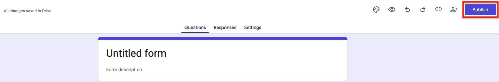{:.medium}

After publishing, you can stop accepting responses using the "Accepting responses" button. Simply publishing the form does not allow anyone to respond.Responses can only be collected after completing the steps described in "[Sharing with Respondents](#sharing_with_respondents)" step below.

#### Sharing the Form

There are two types of people you may be sharing with: [respondents](#sharing_with_respondents) and [editors](#sharing_with_editors)．Accordingly, there are two types of permissions — editing permission and response permission. Respondents should be given response permission, while editors should be given editing permission. Editing permission allows the holder to edit the form and view responses. Be careful not to share a link granting editing permission with someone who is only meant to respond, as doing so would allow them to edit the form and could lead to a data breach of the collected information.

Additionally, when sharing forms that collect sensitive information such as personal data, be aware that using the "[Show a summary of responses](https://support.google.com/docs/answer/2839588?hl=en&sjid=10457253941811607885-NC#zippy=%2C回答の概要を表示する%2Cshow-a-summary-of-responses)"（official help）feature may lead to information leaks.

You can change the scope of users who can respond to the form by clicking the respective buttons for editors and respondents that display permission levels, such as "Restricted" or "The University of Tokyo ECCS Cloud Email."

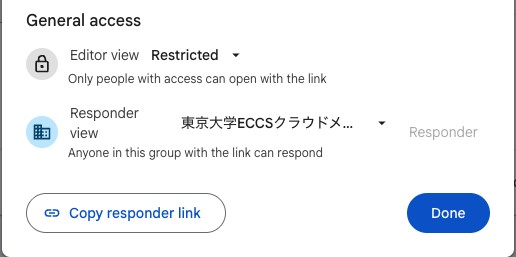{:.medium}

##### Sharing with Respondents
{:#sharing_with_respondents}

To have others respond to your form, share the response link by following these steps:

1. Click the link icon in the upper right ("Copy responder link").
2. Copy the response link.
   * You can also share a shortened link by turning on "Shorten URL."

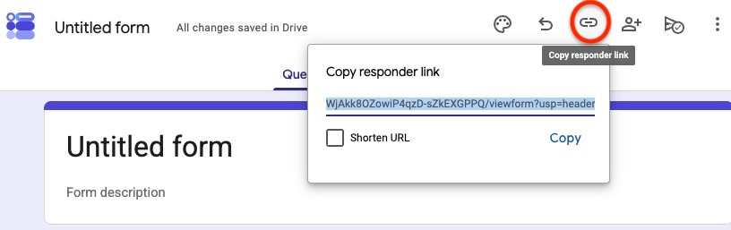

##### Sharing with Editors
{:#sharing_with_editors}

To allow others to edit the form, share editing permission using one of the following methods:

* Directly entering the user: Share by entering the email address of the person you want to share with.
* Copying and sharing the URL from the browser toolbar: You must first allow the editor view for "Anyone with the link" or "The University of Tokyo ECCS Cloud EMail" in the editor selection screen.

#### Managing Visibility

From the "Manage" button under "Respondents," you can limit visibility to "Anyone with the link" or "The University of Tokyo ECCS Cloud Email." Using "The University of Tokyo ECCS Cloud Email" restricts respondents to members within the university. (In this case, people outside the university cannot respond to or view the form's questions, even if they have the link.)

## Step 4: Check Responses
{:#check_answer}

This section introduces how to review the responses you have collected.

Switch from the "Questions" tab (where you edit the form) to the "Responses" tab to view responses by question or by individual respondent. Visualization tools such as graphs are also automatically applied based on the results.

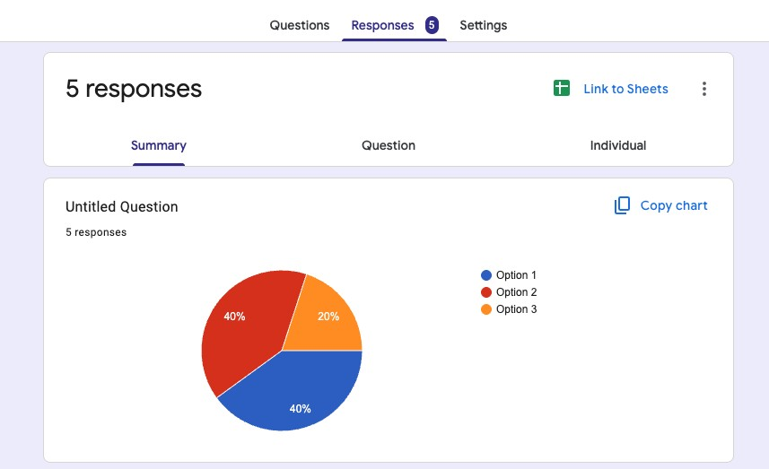{:.medium}

### Exporting to a Spreadsheet
You can configure the results to be automatically exported to a spreadsheet by clicking the "Link to Sheets" button (Responses already collected will also be transferred to the spreadsheet).

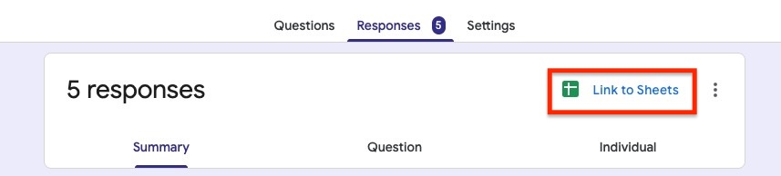{:.medium}

This is useful when you want to manage responses using spreadsheet features. Responses exported to the spreadsheet can be freely edited.

For more details, refer to "[Choose where to save form responses](https://support.google.com/docs/answer/2917686?hl=en-GB&ref_topic=6063592&sjid=2301396309535665051-NC)"（official help）.

#### Deleting Responses

You can delete some or all responses. However, once a response is deleted, it cannot be recovered, so please be careful. Also note that deleting responses does not remove them from any linked spreadsheet.

## Basic Flow for Responding to a Form

This section explains the flow for respondents to answer a Google Form.

You can respond by accessing the "link for respondents" created by the form owner. Select and fill in all required fields, then click the "Submit" button to record your response.

When using a browser signed in to a Google account, responses in progress are automatically saved as a draft for 30 days. Please note that this feature is only available in an online environment and when "the form owner has not disabled auto-save."

### When "You need access" Is Displayed

There are two main possible causes. Please also refer to "[Get permission to open a Google Form](https://support.google.com/docs/answer/160166?sjid=9391686295985041241-NC)"（official help）for more details.

* You do not have permission to open the form.
  * You need to obtain permission.
  * You can optionally enter a message and request access via the "Request access" button, which will notify the form owner.
    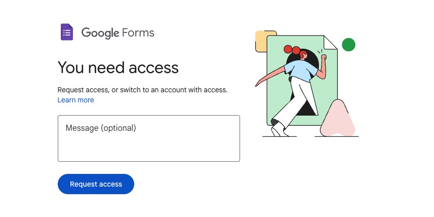{:.small}
* You are signed in to a Google account that does not have access.
  * You need to sign in with a different Google account that has access. 
  * For example, if a form is restricted to "The University of Tokyo ECCS Cloud Email" accounts, signing in with any other account will result in the above error.

## Useful Features When Editing a Form
{:#useful_features_for_form_editing}

This section introduces useful features available when editing a form.

The numbers below correspond to the numbered descriptions. 
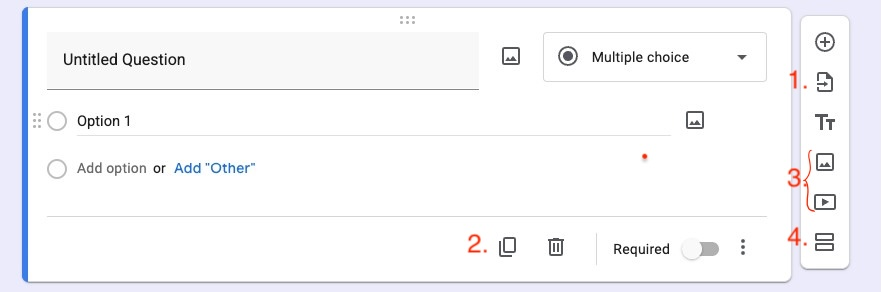

1. Import Questions
   * The "Import questions" button lets you reuse questions from other forms. Click the button, then select the form and the questions you want to import. This saves time when creating a similar form where existing questions can be referenced.
2. Duplicate Question
   * The "Duplicate question" button lets you copy an existing question. This eliminates the need to build a similar question from scratch.
3. Add Images and Videos
   * The "Add image" and "Add video" buttons let you insert photos or videos into the form. This is useful for supplementing question content with visuals. 
   * There is also a similar feature for inserting images to questions or options. The key difference is whether the image directly relates to the content. See "[Useful Features When Editing a Question ](#useful_features_for_question_editing) >  Add Images" below for details.
4. Add Section
   * The "Add section" button lets you divide questions into units called sections, which can be displayed on separate pages or used to show different questions based on previous answers.
   * For details on going to sections based on responses, see "[Useful Features When Editing a Question ](#useful_features_for_question_editing) > Go to Section" below. 
   * You can move or duplicate created sections to reuse them. Additionally, you can delete, merge, or reorder sections. Note that "Delete section" also deletes the questions within it. If you only want to remove the section break, choose "Merge with above" instead.

### Useful Features When Editing a Question
{:#useful_features_for_question_editing}

This section introduces features that are particularly useful when editing individual questions.

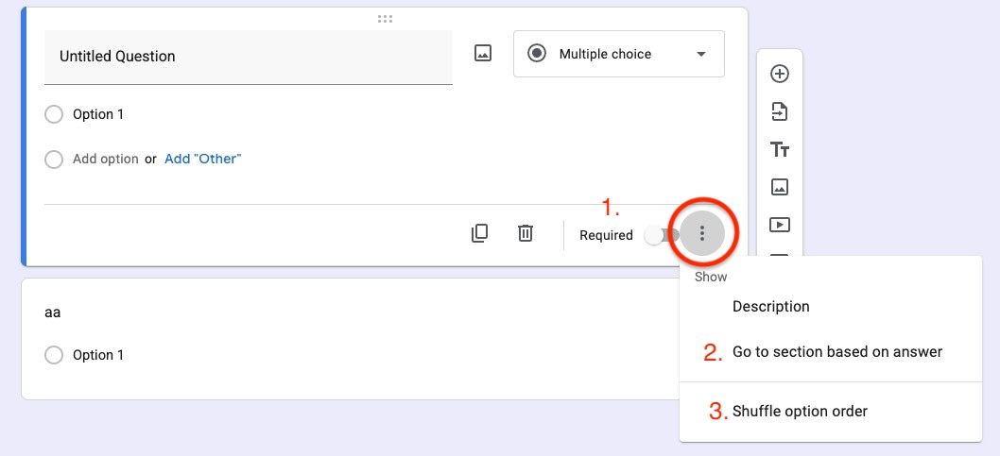

1. Making a Response Required
   * Turning on the "Required" toggle for a question makes it mandatory. Respondents cannot "Submit" or proceed to "Next" without answering required questions, so it is recommended to mark any question you must receive an answer to as required.
2. Go to Section
   * For questions with a selection-based format (Multiple Choice, Drop-down), the "Go to section based on answer" button lets you set which section respondents are directed to depending on their answer. 
   * You can automatically display different questions based on the respondent's answers. Questions to be shown for each answer must be created in separate sections. 
   * For detailed setup instructions, refer to "[Show questions based on answers](https://support.google.com/docs/answer/141062?hl=en-GB&ref_topic=6063584&sjid=2301396309535665051-NC)" (official help). 
3. Shuffle Option Order
   * The "Shuffle option order" button randomizes the order in which answer options are displayed. This can be useful for tests, where you may want different respondents to see options in a different order.
4. Response Validation
   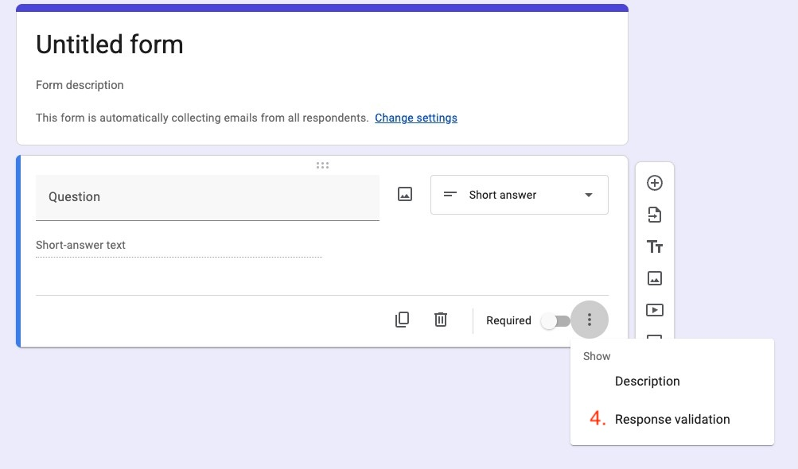
   * For short answer or checkboxes questions, the "Response validation" button lets you set rules for responses (e.g., "Show an error if the value is not an integer").
   * When processing collected responses, having a consistent format often makes data management easier.For example, if you require "half-width numbers" for an age question, respondents will be blocked from entering kanji numerals or full-width numbers, making response management far more efficient.
5. Add Images
   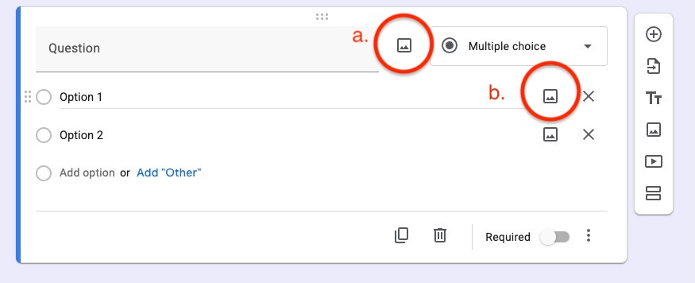
   * To provide additional context for your questions, you can attach images to a question using the button on the right of the question text (a.), or to an answer option using the button on the right of the each option (b.). 
   * When you insert images,he respondent view will look like this: images added next to the question text appear below the question, while images added next to an option appear above that option.
      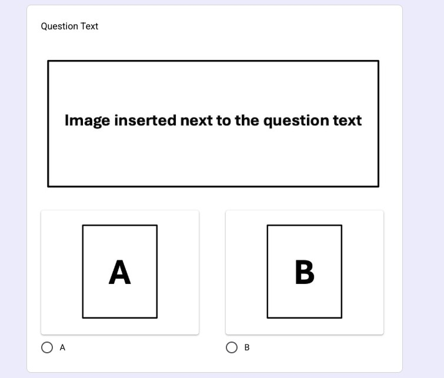

## Form Settings
{:#form_settings}

This section introduces the settings available for your form.

Switching to the "Settings" tab allows you to configure settings related to tests, responses, and question display.

### Test Settings

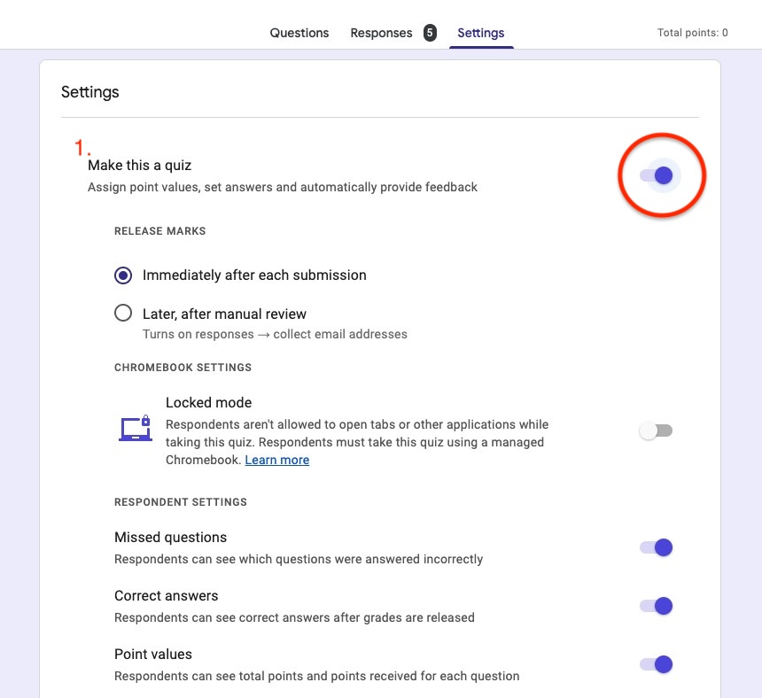

1. Use as a Test
   * If you want to use Google Forms for tests, you can enable this by turning on the "Make this a quiz" option. By using the quiz feature, you can assign point values and correct answers for each question. This allows you to utilize the grading functionality to share scores with respondents based on their answers.
   * Depending on your needs, you can customize the grading options, such as choosing whether to release scores immediately after each submission or at a later time.
   * For more information, please refer to the following resources as needed.
      * [Create & grade quizzes with Google Forms](https://support.google.com/docs/answer/7032287?hl=en&ref_topic=6063584&sjid=18170600648034425782-NC#zippy)（official help）
      * [Conducting Quizzes and Surveys with Google Forms](/en/articles/google-form/)

### Response Settings

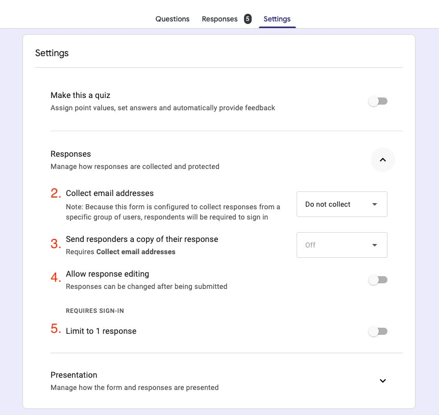

2. Collect Email Addresses
   * Selecting "Collect email addresses" allows you to gather respondents' email addresses. You can choose either "Verified" to collect them automatically, or "Responder input" to have respondents enter them manually. This enables you to obtain their contact information and send them a copy of their responses.
   * When "Verified" is selected, respondents must be signed in to a Google account to submit the form; if not signed in, they will be prompted to do so. When "Respondender input" is selected, no sign-in is required.
3. Send Response Copy
   * If you select "Send responders a copy of their response," a copy of their responses will be sent to the email address they provided. This allows respondents to review their own submitted answers. If you select "Always," a copy will be sent regardless of the respondent's preference.
4. Allow Response Editing
   * Turning on "Allow response editing" lets respondents edit their submitted answers via a link shown on the post-submission screen, even after submitting.Please note that editing is only possible until responses are closed.
5. Limit to 1 Response
   * Turning on "Limit to 1 response" restricts submissions to once per Google account. If someone who has already responded tries to submit again, they will be shown a message indicating they have already responded. Note, however, that the same person can still submit again if they use a different Google account from the one used for their previous response. 
   * Respondents must be signed in to a Google account to submit the form.

### Question Display Settings

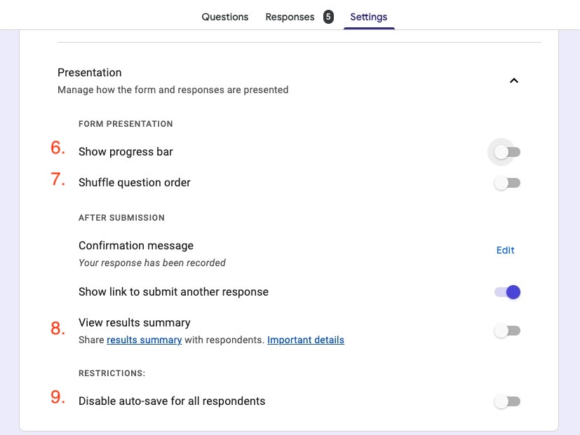

6. Show Progress Bar
   * Turning on "Show progress bar" displays a visual indicator of which section the respondent is currently on.
7. Shuffle Question Order
   * Turning on "Shuffle question order" displays questions in a different order for each respondent, which can be useful for tests. Only questions within the same section are shuffled.
   * When editors review recorded responses, questions appear in their original order.
8. Show Summary of Responses
   * Turning on "Show summary of responses" shares the already-collected results with respondents after they complete the form.
   * While convenient for sharing survey results within an organization, this feature may lead to information leaks when used with forms that collect personal data, so caution is advised.
9. Auto-save Responses
   * By default, response drafts are automatically saved for 30 days when filling out a Google Form.
   * Turning on "Disable auto-save for all respondents" disables this feature.
   *For more details, please refer to[Autosave your response progress on a Google Form](https://support.google.com/docs/answer/10952360?sjid=9391686295985041241-NC)(official help).

