## Overview

When using a Google Group created within ECCS Cloud Mail as a mailing list, you can send emails using that group’s email address as the sender. To do so, you must configure the following settings in advance.

## Procedure

1. Create a group. When doing so, temporarily allow posting permissions to “Anyone on the web”.
    - This setting is necessary because if you do not set the posting permission to “Anyone on the web”, you will not be able to receive the email required in step 6. Once you have completed step 6, you may change the posting permissions as needed.
  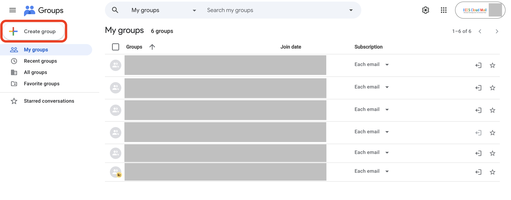{:.border}
  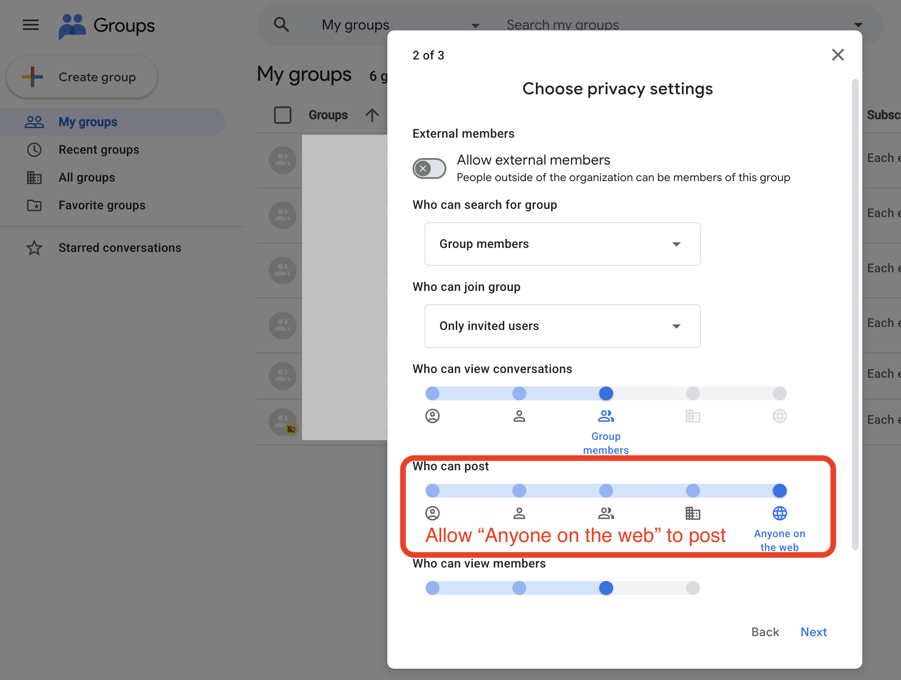{:.border}
2. Open the ECCS Cloud Email settings page.
  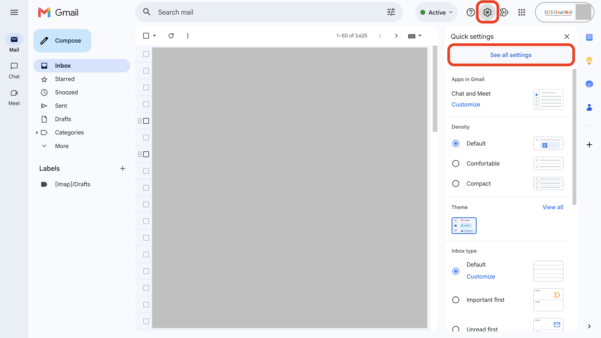{:.border}
3. On the settings screen, open the “Accounts” tab and press the “Add another email address” button.
  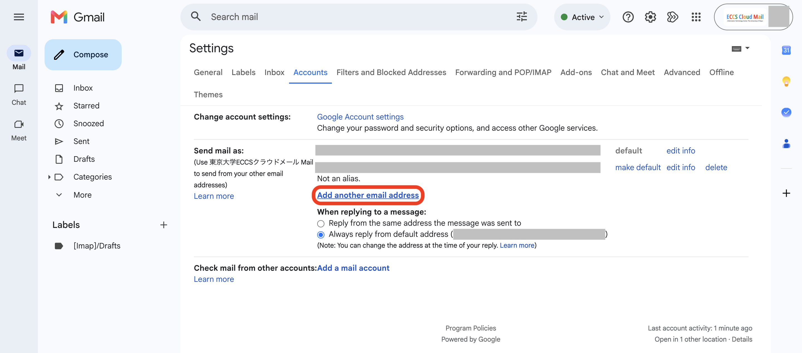{:.border}
4. Enter the name you wish to display when sending emails in the “Name” field, and the mailing list address in the “Email address” field. Then proceed to the next step.
  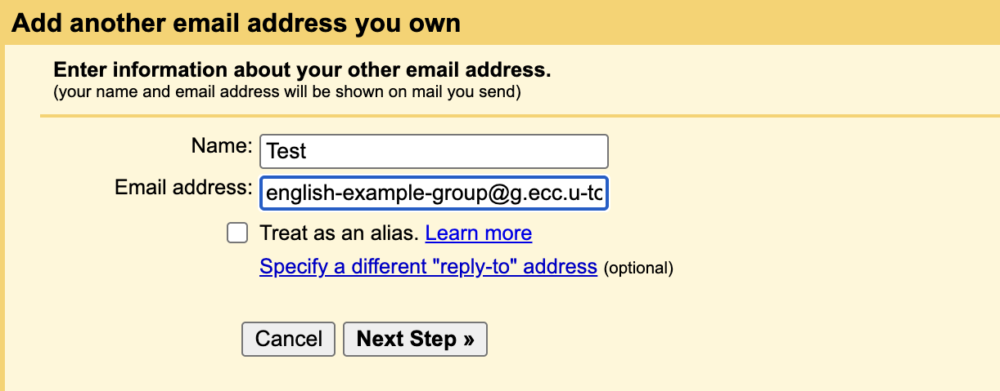{:.border}
5. Press the “Send Verification” button.
  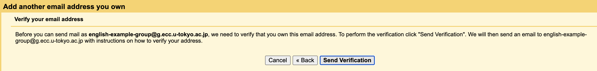{:.border}
6. A verification email will be sent to the mailing list. Press the link in the email body to confirm that you are a member of this mailing list.
  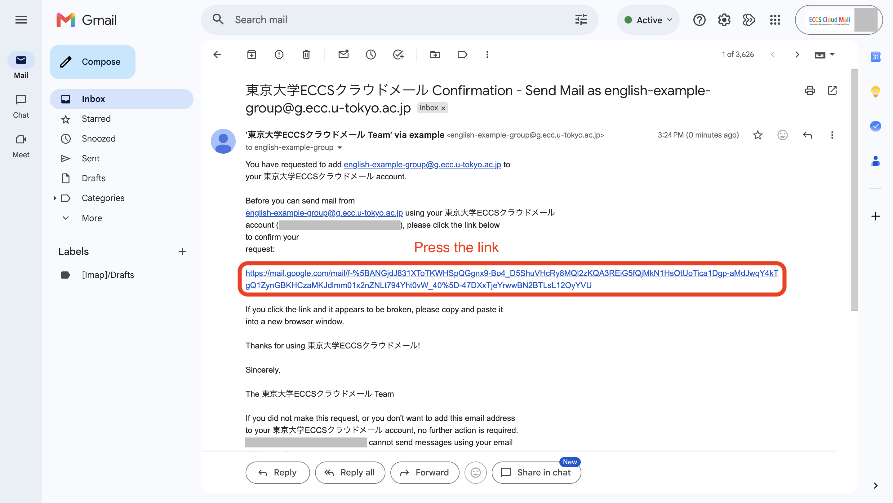{:.border}
    - The following screens will be displayed. Please follow the instructions on them.
    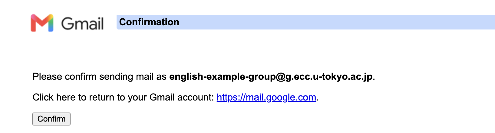{:.border}
    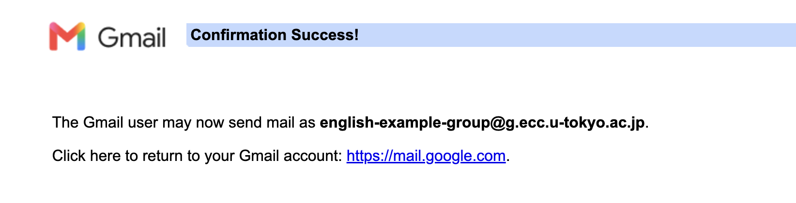{:.border}
7. Return to the ECCS Cloud Mail settings page and confirm that the mailing list address has been added to the “Send mail as” section.
  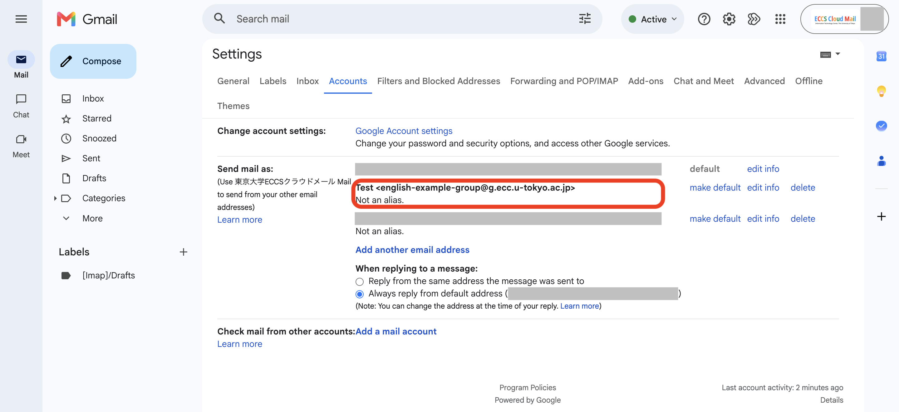{:.border}
8. Open the email compose window in ECCS Cloud Mail. In the “From” field, confirm that you can select the mailing list address as the sender address.
  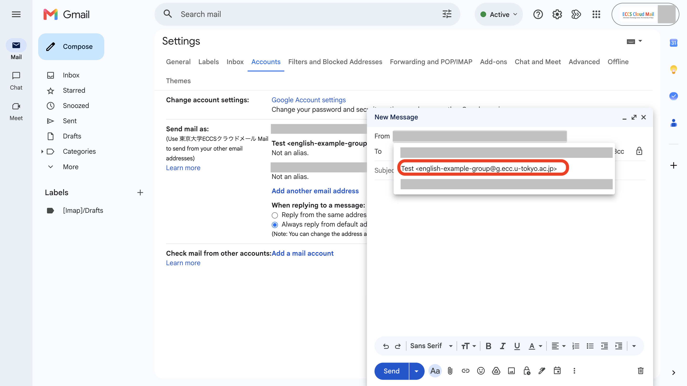{:.border}
9. After completing these steps, you may change the Google Group’s posting permissions from “Anyone on the web” to another setting if necessary.
  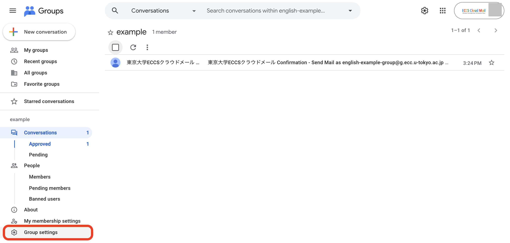{:.border}
  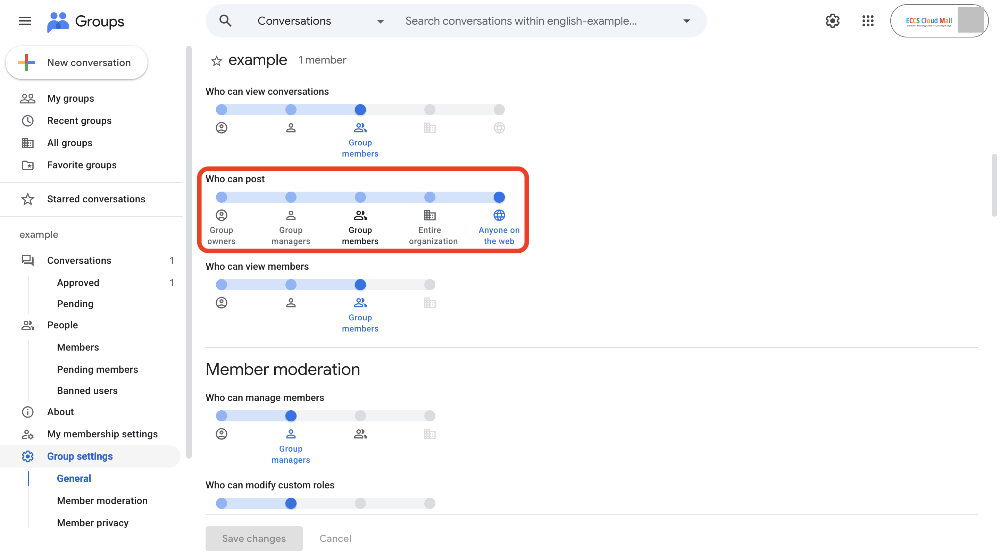{:.border}
